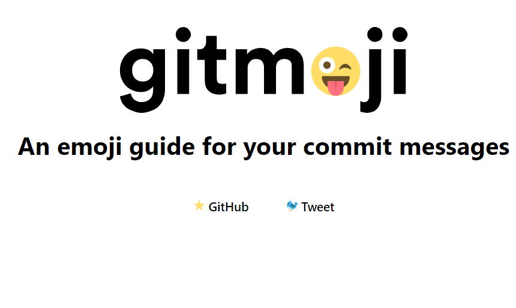
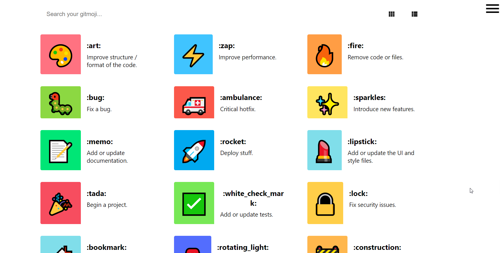

# Gitmoji

!> [Gitmoji](https://gitmoji.dev/)是一个在GitHub上提交信息的上添加emojo（表情）的工具，挺有意思的！




## emoji guide

你提交信息的表情符号指南，是不挺可爱的

[指南地址](https://gitmoji.dev/)：https://gitmoji.dev/



## gitmoji的使用

- [gitmoji项目地址](https://github.com/carloscuesta/gitmoji/)

?> gitmoji 的使用非常简单~  GitHub 也有详细的过程


### Using  gitmoji-cli

从命令行使用gitmoji，只需要用 NPM 安装 即可。gitmoji交互式客户端，用于在提交信息时使用表情符号。

```bash
npm i -g gitmoji-cli
```

在git 提交信息时，直接使用即可

```bash
git commit -m ':memo: 文档说明'
```

## gitmoji代码说明

| emoji | emoji代码                     | 说明                               |
| :---- | :---------------------------- | :--------------------------------- |
| 🎨     | `:art:`                       | 改进代码结构或代码格式             |
| ⚡️     | `:zap:`                       | 提升性能                           |
| 🔥     | `:fire:`                      | 移除代码或文件                     |
| 🐛     | `:bug:`                       | 修复bug                            |
| 🚑     | `:ambulance:`                 | 关键补丁                           |
| ✨     | `:sparkles:`                  | 添加新功能                         |
| 📝     | `:memo:`                      | 写文档                             |
| 🚀     | `:rocket:`                    | 部署功能                           |
| 💄     | `:lipstick:`                  | 修改UI和样式文件                   |
| 🎉     | `:tada:`                      | 初次提交                           |
| ✅     | `:white_check_mark:`          | 添加测试                           |
| 🔒     | `:lock:`                      | 修复安全问题                       |
| 🍎     | `:apple:`                     | 修复macOS下的问题                  |
| 🐧     | `:penguin:`                   | 修复Linux下的问题                  |
| 🏁     | `:checkered_flag:`            | 修复Windows下的问题                |
| 🤖     | `:robot:`                     | 修复安卓下的问题                   |
| 🍏     | `:green_apple:`               | 修复IOS下的问题                    |
| 🔖     | `:bookmark:`                  | 发行或版本标签                     |
| 🚨     | `:rotating_light:`            | 移除linter警告                     |
| 🚧     | `:construction:`              | 工作中                             |
| 💚     | `:green_heart:`               | 修复CI构建                         |
| ⬇️     | `:arrow_down:`                | 降级依赖                           |
| ⬆️     | `:arrow_up:`                  | 升级依赖                           |
| 📌     | `:puahpin:`                   | 将依赖项固定到特定版本             |
| 👷     | `:construction_worker:`       | 添加CI构建系统                     |
| 📈     | `:chart_with_upwards_trend:`  | 添加分析或跟踪代码                 |
| ♻️     | `:recycle:`                   | 重构代码                           |
| 🐳     | `:whale:`                     | 关于Docker的工作                   |
| ➕     | `:heavy_plus_sign:`           | 添加依赖                           |
| ➖     | `:heavy_minus_sign:`          | 移除依赖                           |
| 🔧     | `:wrench:`                    | 更改配置文件                       |
| 🌐     | `:globe_with_meridians:`      | 国际化和本土化                     |
| ✏️     | `:pencil2:`                   | 修改错别字                         |
| 💩     | `:hankey:`                    | 编写需要改进的错误代码             |
| ⏪     | `:rewind:`                    | 还原更改                           |
| 🔀     | `:twisted_rightwards_arrows:` | 合并分支                           |
| 📦     | `:package:`                   | 更新编译的文件或包                 |
| 👽     | `:alien:`                     | 由于外部API更改而更新代码          |
| 🚚     | `:truck:`                     | 移动或重命名文件                   |
| 📄     | `:page_facing_up:`            | 添加或更新许可证                   |
| 💥     | `:boom:`                      | 引入重大变更                       |
| 🍱     | `:bento:`                     | 添加或更新assets                   |
| 👌     | `:ok_hand:`                   | 由于代码审查更改而更新代码         |
| ♿️     | `:wheelchair:`                | 改善可访问性                       |
| 💡     | `:bulb:`                      | 记录源代码                         |
| 🍻     | `:beers:`                     | 喝多了写的代码                     |
| 💬     | `:speech_balloon:`            | 更新文本和文字                     |
| 🗃     | `:card_file_box:`             | 执行与数据库相关的更改             |
| 🔊     | `:loud_sound:`                | 添加日志                           |
| 🔇     | `:mute:`                      | 删除日志                           |
| 👥     | `:busts_in_silhouette:`       | 添加贡献者                         |
| 🚸     | `:children_crossing:`         | 改善用户体验/可用性。              |
| 🏗     | `:building_construction:`     | 进行架构更改。                     |
| 📱     | `:iphone:`                    | 响应式设计                         |
| 🤡     | `:clown_face:`                | Mocking things（嘲笑？？？）       |
| 🥚     | `:egg:`                       | 彩蛋                               |
| 🙈     | `:see_no_evil:`               | 添加或更新.gitignore文件           |
| 📸     | `:camera_flash:`              | 添加或更新快照                     |
| ⚗️     | `:alembic:`                   | 尝试新玩意儿                       |
| 🔍     | `:mag:`                       | 提升SEO                            |
| ☸️     | `:wheel_of_dharma:`           | 关于Kubernetes的工作               |
| 🏷️     | `:label:`                     | 添加或更新类型（Flow，Typescript） |

