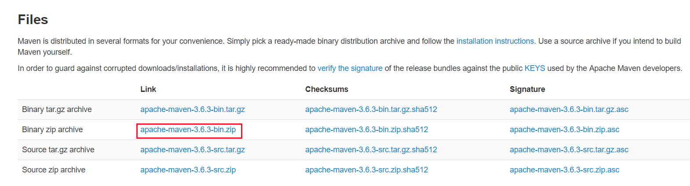
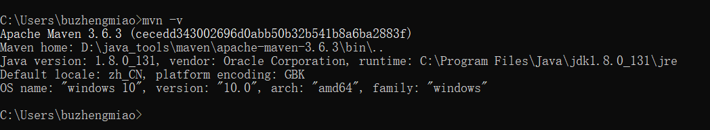

# Maven

[Maven 下载地址](https://maven.apache.org/download.cgi)：https://maven.apache.org/download.cgi



配置环境变量后

```bash
mvn -v
```



> 此时maven环境就配置好了

## 配置Maven

`conf\settings.xml`

### 配置仓库地址

```xml
<localRepository>D:\java_tools\maven\repository</localRepository>
```

### 配置国内阿里镜像源

还是settings.xml，找到mirrors标签，在该标签内添加镜像仓库。

```xml
<mirror>
    <id>alimaven</id>
    <name>aliyun maven</name>
    <url>http://maven.aliyun.com/nexus/content/groups/public/</url>
    <mirrorOf>central</mirrorOf>        
</mirror>
```

