#  SpringCloud笔记

## 1、Spring Cloud简介

>   `分布式微服务架构`的一站式解决方案，是多种微服务架构落地技术的**集合体**，俗称**微服务全家桶**

[Spring Cloud官网](https://spring.io/projects/spring-cloud)


### 1.1、版本选型

[版本对应规则](https://mvnrepository.com/artifact/org.springframework.cloud/spring-cloud-dependencies)

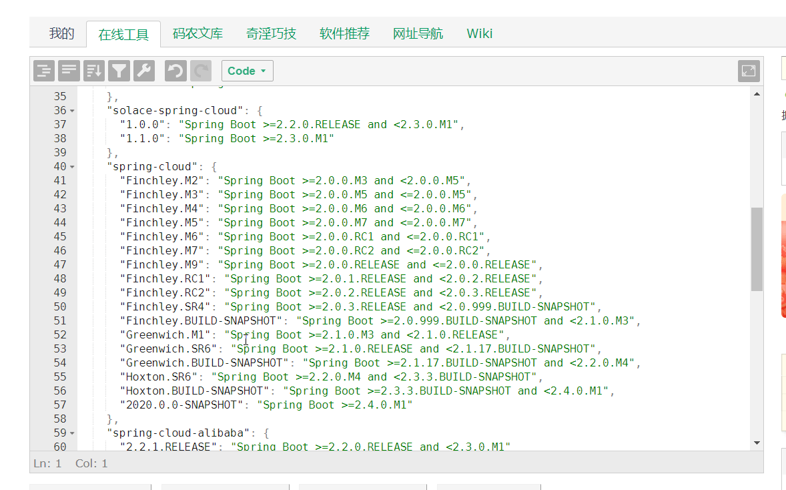

>   使用[json处理工具](https://tool.lu/json/)查看，详细版本对象`json`信息。

详细的版本对应关系，可以查看`Spring Cloud`官网

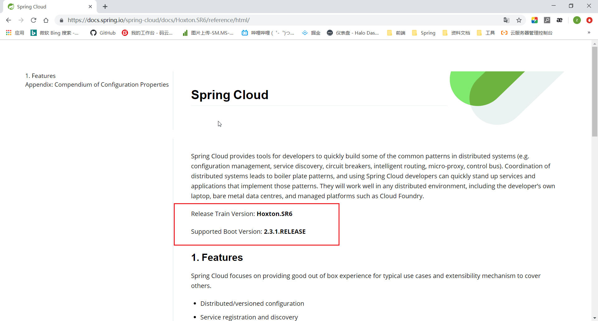

**本次笔记使用版本：**

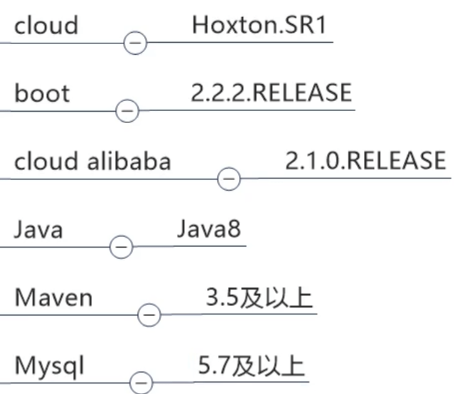

### 1.2、架构组件

[Spring Cloud架构](Spring Cloud架构.xmind)

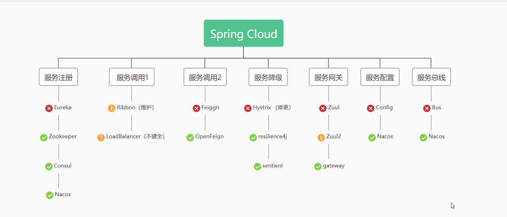

## 2、微服务cloud 基础项目工程搭建

### 2.1、微服务cloud整体聚合父工程Project

[父项目创建](https://www.bilibili.com/video/BV18E411x7eT?p=5)

1、先创建一个父项目`cloud2020`

 

2、删除多余文件，只留`pom`，编写**父pom**，统一版本。

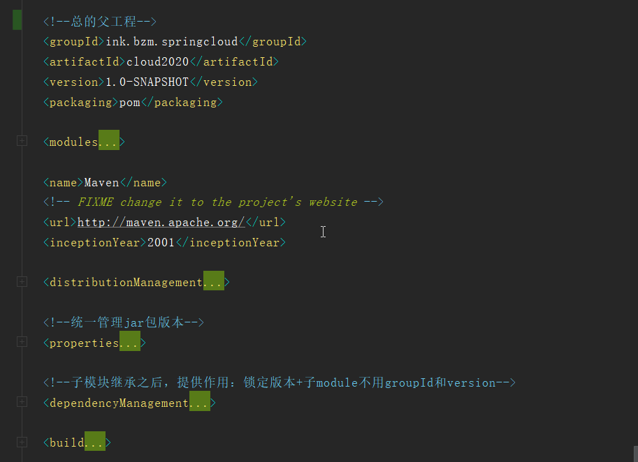

### 2.2、项目业务模块

#### 2.2.1、支付模块

`cloud-provider-payment8001`

###### 1、创建数据库

创建`db2020`数据库，建表`payment`

```sql
DROP TABLE IF EXISTS `payment`;
CREATE TABLE `payment` (
  `id` bigint(20) NOT NULL AUTO_INCREMENT COMMENT 'ID',
  `serial` varchar(200) DEFAULT '',
  `age` int(3) DEFAULT '18',
  PRIMARY KEY (`id`)
) ENGINE=InnoDB AUTO_INCREMENT=10 DEFAULT CHARSET=utf8;

-- ----------------------------
-- Records of payment
-- ----------------------------
INSERT INTO `payment` VALUES ('-1', 'b11', '18');
INSERT INTO `payment` VALUES ('8', 'bzm', '18');
INSERT INTO `payment` VALUES ('9', 'bzm1', '18');
```

###### 2、改pom

```xml
<dependencies>
    <dependency>
        <groupId>org.springframework.boot</groupId>
        <artifactId>spring-boot-starter-web</artifactId>
    </dependency>
    <dependency>
        <groupId>org.springframework.boot</groupId>
        <artifactId>spring-boot-starter-actuator</artifactId>
    </dependency>

    <dependency>
        <groupId>org.mybatis.spring.boot</groupId>
        <artifactId>mybatis-spring-boot-starter</artifactId>
    </dependency>

    <dependency>
        <groupId>com.alibaba</groupId>
        <artifactId>druid-spring-boot-starter</artifactId>
        <version>1.1.10</version>
    </dependency>

    <!--mysql-connector-java-->
    <dependency>
        <groupId>mysql</groupId>
        <artifactId>mysql-connector-java</artifactId>
    </dependency>
    <dependency>
        <groupId>org.springframework.boot</groupId>
        <artifactId>spring-boot-starter-jdbc</artifactId>
    </dependency>

    <!--热部署-->
    <dependency>
        <groupId>org.springframework.boot</groupId>
        <artifactId>spring-boot-devtools</artifactId>
        <scope>runtime</scope>
        <optional>true</optional>
    </dependency>

    <dependency>
        <groupId>org.projectlombok</groupId>
        <artifactId>lombok</artifactId>
        <optional>true</optional>
    </dependency>
    <dependency>
        <groupId>org.springframework.boot</groupId>
        <artifactId>spring-boot-starter-test</artifactId>
        <scope>test</scope>
    </dependency>
</dependencies>
```

###### 3、写yml

```yaml
server:
  port: 8001

spring:
  application:
    name: cloud-provider-service
  datasource:
    type: com.alibaba.druid.pool.DruidDataSource      #当前数据源操作类型
    driver-class-name: org.gjt.mm.mysql.Driver        #mysql驱动包
    url: jdbc:mysql://localhost:3306/db2020?useUnicode=true&characterEncoding-utr-8&useSSL=false
    username: root
    password: Bzm990521

mybatis:
  mapper-locations: classpath:mapper/*.xml
  type-aliases-package: com.atguigu.springcloud.entities       #所有Entity别名类所在包
```


######  4、创建实体类

`Payment`

```java
@Data
@AllArgsConstructor
@NoArgsConstructor
public class Payment implements Serializable {
    private long id;
    private String serial;
}
```

`CommonResult`

```java
@Data
@AllArgsConstructor
@NoArgsConstructor
public class CommonResult<T> {
    private Integer code;
    private String message;
    private T data;

    public CommonResult(Integer code, String message) {
        this(code,message,null);
    }
}
```

>    `Json`封装体`CommentResult`,传给前端，判断编码是否成功，成功才显示

###### 5、dao接口

`PaymentDao`

```java
@Mapper
public interface PaymentDao {
    int create(Payment payment);

    Payment getPaymentById(@Param("id") Long id);
}
```

>   简单编写**增，查方法**

`Mapper`映射文件`PaymentMapper.xml`

```xml
<?xml version="1.0" encoding="utf-8" ?>
<!DOCTYPE mapper PUBLIC "-//mybatis.org//DTD Mapper 3.0//EN" "http://mybatis.org/dtd/mybatis-3-mapper.dtd" >
<mapper namespace="ink.bzm.springcloud.dao.PaymentDao">

    <insert id="create" parameterType="ink.bzm.springcloud.entities.Payment" useGeneratedKeys="true" keyProperty="id">
        insert into payment(serial) values (#{serial})
    </insert>

    <resultMap id="BaseResultMap" type="ink.bzm.springcloud.entities.Payment">
        <id column="id" property="id" jdbcType="BIGINT"/>
        <result column="serial" property="serial" jdbcType="VARCHAR"/>
    </resultMap>
    <select id="getPaymentById" parameterType="Long" resultMap="BaseResultMap">
        select * from payment where id=#{id};
    </select>
</mapper>
```

###### 6、编写`service`接口

`PaymentService`

```java
public interface PaymentService {
    public int create(Payment payment);

    public Payment getPaymentById(@Param("id") Long id);
}
```

`PaymentServiceImpl`

```java
@Service
public class PaymentServiceImpl implements PaymentService {

    @Resource
    private PaymentDao paymentDao;

    public int create(Payment payment){
        return paymentDao.create(payment);
    }
    public Payment getPaymentById(Long id){
        return paymentDao.getPaymentById(id);
    }
}
```

###### 7、controller控制器

```java
@RestController
@Slf4j
public class PaymentController {

    @Resource
    private PaymentService paymentService;

    @Value("${server.port}")
    private String serverPort;

    /**
     * 创建订单
     * @param payment
     * @return
     */
    @PostMapping(value = "/payment/create")
    public CommonResult create(@RequestBody Payment payment) {
        int result = paymentService.create(payment);
        log.info("*****插入结果："+result);

        if (result>0) {
            return new CommonResult(200,"插入数据库成功,serverPort "+serverPort,result);
        } else {
            return new CommonResult(444,"插入数据库失败",null);
        }
    }

    /**
     * 查询订单
     * @param id
     * @return
     */
    @GetMapping(value = "/payment/get/{id}")
    public CommonResult<Payment> getPaymentById(@PathVariable("id") Long id) {
        Payment payment = paymentService.getPaymentById(id);
        log.info("*****插入结果：" + payment);
        if (payment != null) {
            return new CommonResult(200, "查询成功,serverPort "+serverPort, payment);
        } else {
            return new CommonResult(444, "没有对应记录,查询ID：" + id, null);
        }
    }
    
}
```

###### 8、测试

访问：http://localhost:8001/payment/get/8

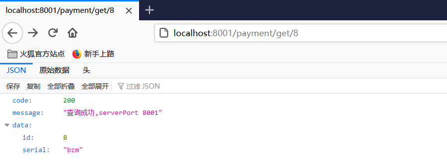

#### 2.2.2、消费者模块

`cloud-consumer-order80`

###### 1、改pom

```xml
<dependencies>
    <dependency>
        <groupId>org.springframework.boot</groupId>
        <artifactId>spring-boot-starter-web</artifactId>
    </dependency>
    <dependency>
        <groupId>org.springframework.boot</groupId>
        <artifactId>spring-boot-starter-actuator</artifactId>
    </dependency>

    <dependency>
        <groupId>org.springframework.boot</groupId>
        <artifactId>spring-boot-devtools</artifactId>
        <scope>runtime</scope>
        <optional>true</optional>
    </dependency>
    <dependency>
        <groupId>org.projectlombok</groupId>
        <artifactId>lombok</artifactId>
        <optional>true</optional>
    </dependency>
    <dependency>
        <groupId>org.springframework.boot</groupId>
        <artifactId>spring-boot-starter-test</artifactId>
        <scope>test</scope>
    </dependency>
</dependencies>
```

###### 2、写yml

```yaml
server:
  port: 80

spring:
  application:
    name: cloud-order-server
```

###### 3、创建实体类

`Payment`

```java
@Data
@AllArgsConstructor
@NoArgsConstructor
public class Payment implements Serializable {
    private long id;
    private String serial;
}
```

`CommonResult`

```java
@Data
@AllArgsConstructor
@NoArgsConstructor
public class CommonResult<T> {
    private Integer code;
    private String message;
    private T data;

    public CommonResult(Integer code, String message) {
        this(code,message,null);
    }
}
```

###### 4、调用支付模块

将`RestTemplate`对象注册到容器中

```
@Configuration
public class ApplicationContextConfig {
    @Bean
    @LoadBalanced   //注解赋予RestTemplate负载均衡的能力
    public RestTemplate getRestTemplate(){
        return new RestTemplate();
    }
}
```

`controller.OrderControlle`

```java
@RestController
@Slf4j
public class OrderController {
    private static final String PAYMENT_URL="http://localhost:8001";
    @Resource
    private RestTemplate restTemplate;
	
	@GetMapping("/consumer/payment/create")
    public CommonResult<Payment> create(Payment payment){
        return restTemplate.postForObject(PAYMENT_URL+"/payment/create",payment,CommonResult.class);
    }

    @GetMapping("/consumer/payment/get/{id}")
    public CommonResult<Payment> getPayment(@PathVariable("id") Long id){
        return restTemplate.getForObject(PAYMENT_URL+"/payment/get/"+id,CommonResult.class);
    }
}
```

###### 5、测试

启动`80、8001服务`，测试

http://localhost/consumer/payment/get/8


>   消费端调用成功

### 2.3、工程重构

-   项目中存在相同的代码（`entities`包下的`Payment.class`和`CommonResult.class`）,造成代码冗余，可以进行重构。
-   通过`Maven`聚合父工程，把相同重复的代码移到公开公用的工程里面，还可以放第三方接口、工具类，统一调配使用。


## 3、服务注册

### 3.1.、Eureka详解

#### 3.1.1、Eureka简介

`Eureka`就是`Netflix`开源的一款提供**服务注册和发现**的产品，也就是服务注册中心。

>   管理各种服务功能包括服务的注册、发现、熔断、负载、降级等

-   `Eureka`作为**服务治理**中心对整个微服务架构起着最核心的整合作用。
-   简单来说`Eureka`就是`Netflix`开源的一款提供**服务注册和发现**的产品，并且提供了相应的Java客户端。

#### 3.1.2、什么是服务治理

[什么是服务治理?](https://www.zhihu.com/question/56125281)

#### 3.1.3、什么是服务注册与发现

`Eureka`架构


`Eureka`采用了`CS`的设计架构,` Eureka Server`作为**服务注册功能的服务器**，它是**服务注册中心**。而系统中的其他微服务,使佣`Eureka`的客户端连接到`Eureka Server`并维持心跳连接。这样系统的维护人员就可以通过`Eureka Server`来监控系统中各个微服务是否正常运行。

#### 3.1.4、Eureka两大组件

-   Eureka Server
-   Eureka Client

**Eureka Server提供服务注册服务**

各个微服务节点通过配置启动后，会在`EurekaServer`中进行注册,这样`EurekaServer`中的服务注册表中将会存储所有可用服务节点的信息，服务节点的信息可以在界面中直观看到。

**Eureka Client通过注册中心进行访问**

是一个`Java`客户端，用于简化`Eureka Server`的交互,客户端同时也具备一 个内置的、使用轮询(`round-robin`)负载算法的负载均衡器在应用启动后，将会向`Eureka Server`发送心跳(默认周期为30秒)。如果`Eureka Server`在多个心跳周期内没有接收到某个节点的心跳，`EurekaServer`将 会从服务注册表中把这个服务节点移除(默认90秒)

#### 3.1.5、单机版Eureka构建

`cloud-eureka-server7001`

###### 1、改pom

```xml
<dependencies>
    <!--eureka server-->
    <dependency>
        <groupId>org.springframework.cloud</groupId>
        <artifactId>spring-cloud-starter-netflix-eureka-server</artifactId>
    </dependency>
    <!--引入自己定义的api通用包，可以使用payment支付Entity-->
    <dependency>
        <groupId>ink.bzm.springcloud</groupId>
        <artifactId>cloud-api-commons</artifactId>
        <version>${project.version}</version>
    </dependency>
    <!--boot web actuator-->
    <dependency>
        <groupId>org.springframework.boot</groupId>
        <artifactId>spring-boot-starter-web</artifactId>
    </dependency>
    <dependency>
        <groupId>org.springframework.boot</groupId>
        <artifactId>spring-boot-starter-actuator</artifactId>
    </dependency>
    <!--一般通用配置-->
    <dependency>
        <groupId>org.springframework.boot</groupId>
        <artifactId>spring-boot-devtools</artifactId>
        <scope>runtime</scope>
        <optional>true</optional>
    </dependency>
    <dependency>
        <groupId>org.projectlombok</groupId>
        <artifactId>lombok</artifactId>
    </dependency>
    <dependency>
        <groupId>org.springframework.boot</groupId>
        <artifactId>spring-boot-starter-test</artifactId>
        <scope>test</scope>
    </dependency>
    <dependency>
        <groupId>junit</groupId>
        <artifactId>junit</artifactId>
    </dependency>
</dependencies>
```

###### 2、写yml

```yaml
server:
  port: 7001

eureka:
  instance:
    hostname: eureka7001.com #eureka服务端的实例名称
  client:
    #false表示不向注册中心注册自己
    register-with-eureka: false
    #false表示自己端就是注册中心，我的职责就是维护服务实例，并不需要去检索服务
    fetch-registry: false
    service-url:
      #设置与Eureka Server交互的地址查询服务和注册服务都需要依赖这个地址
      defaultZone: http://${ eureka.instance.hostname}:${ server.port}/eureka/
```

###### 3、主启动

```java
@SpringBootApplication
@EnableEurekaServer		//标注EurekaServer
public class EurekaMain7001 {
    public static void main(String[] args) {
        SpringApplication.run(EurekaMain7001.class,args);
    }
}
```

###### 4、启动测试

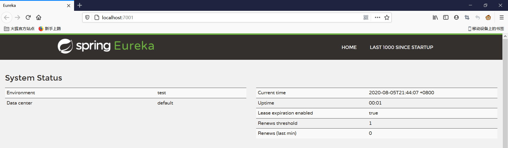


#### 3.1.6、支付模块8001注册

`cloud-provider-payment8001`

###### 1、添加pom依赖

```xml
<!--eureka-client-->
<dependency>
    <groupId>org.springframework.cloud</groupId>
    <artifactId>spring-cloud-starter-netflix-eureka-client</artifactId>
</dependency>
```

###### 2、添加EurekaClient配置yml

```yaml
eureka:
  client:
    #表示是否将自己注册进EurekaServer默认为true
    register-with-eureka: true
    #是否从EurekaServer抓取已有的注册信息，默认为true。单节点无所谓，集群必须设置为true才能配合ribbon使用负载均衡
    fetch-registry: true
    service-url:
      defaultZone: http://localhost:7001/eureka
```

###### 3、主启动添加@EnableEurekaClient

```java
@SpringBootApplication
@EnableEurekaClient		//添加EurekaClient注解配置
public class PaymentMain8001 {
    public static void main(String[] args) {
        SpringApplication.run(PaymentMain8001.class,args);
    }
}
```

###### 4、测试

http://localhost:7001/

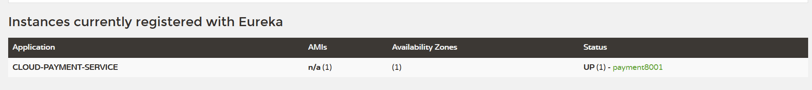

#### 3.1.7、订单模块80注册

###### 1、添加pom依赖

```xml
<!--eureka-client-->
<dependency>
    <groupId>org.springframework.cloud</groupId>
    <artifactId>spring-cloud-starter-netflix-eureka-client</artifactId>
</dependency>
```

###### 2、添加EurekaClient配置yml

```yaml
server:
  port: 80

spring:
  application:
    name: cloud-order-server

eureka:
  client:
    #表示是否将自己注册进EurekaServer默认为true
    register-with-eureka: true
    #是否从EurekaServer抓取已有的注册信息，默认为true。单节点无所谓，集群必须设置为true才能配合ribbon使用负载均衡
    fetch-registry: true
    service-url:
            defaultZone: http://localhost:7001/eureka
```

###### 3、主启动添加@EnableEurekaClient

```java
@SpringBootApplication
@EnableEurekaClient
public class OrderMain80 {
    public static void main(String[] args) {
        SpringApplication.run(OrderMain80.class,args);
    }
}
```

###### 4、测试

http://localhost:7001/

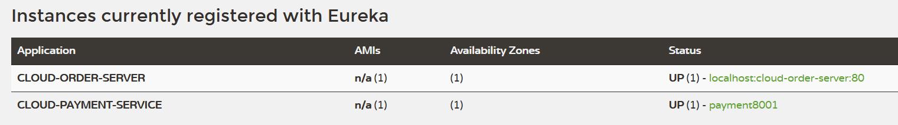


#### 3.1.8、Eureka集群原理

>   互相注册，相互守望


`Eureka Server `集群相互之间通过 `Replicate `来同步数据，相互之间**不区分主节点和从节点**，所有的节点都是平等的。在这种架构中，节点通过彼此互相注册来提高可用性，每个节点需要添加一个或多个有效的 `serviceUrl `指向其他节点。

>   **Eurka 保证 AP（**`CAP`*原则又称*`CAP`定理，指的是在一个分布式系统中，一致性（`Consistency`）、可用性（`Availability`）、分区容错性（`Partition tolerance`）**）**

[Eureka-Server 集群原理](https://blog.csdn.net/yuliang_liu/article/details/101458391)

#### 3.1.9、集群版Eureka构建

-   新建`cloud-eureka-server7002`
-   与`cloud-eureka-server7001`基本相同

###### 1、修改映射配置

-   找到`C:\Windows\System32\drivers\etc`路径下的`hosts`文件

-   修改映射配置添加进`hosts`文件

    ```shell
    127.0.0.1       eureka7001.com
    127.0.0.1       eureka7002.com
    ```

    

###### 2、写yml

`7001`

```yaml
server:
  port: 7001

eureka:
  instance:
    hostname: eureka7001.com #eureka服务端的实例名称
  client:
    #false表示不向注册中心注册自己
    register-with-eureka: false
    #false表示自己端就是注册中心，我的职责就是维护服务实例，并不需要去检索服务
    fetch-registry: false
    service-url:
      #设置与Eureka Server交互的地址查询服务和注册服务都需要依赖这个地址
      defaultZone: http://eureka7002.com:7002/eureka/
```

`7002`

```yaml
server:
  port: 7002

eureka:
  instance:
    hostname: eureka7002.com #eureka服务端的实例名称
  client:
    #false表示不向注册中心注册自己
    register-with-eureka: false
    #false表示自己端就是注册中心，我的职责就是维护服务实例，并不需要去检索服务
    fetch-registry: false
    service-url:
      #设置与Eureka Server交互的地址查询服务和注册服务都需要依赖这个地址
      defaultZone: http://eureka7001.com:7001/eureka/
```

###### 3、测试

http://localhost:7001/，http://eureka7001.com:7001/

http://localhost:7002/，http://eureka7002.com:7002/

#### 3.1.10、支付订单两模块注册进Eureka集群

###### 1、修改yml配置

`8001`

```yaml
eureka:
  client:
    #表示是否将自己注册进EurekaServer默认为true
    register-with-eureka: true
    #是否从EurekaServer抓取已有的注册信息，默认为true。单节点无所谓，集群必须设置为true才能配合ribbon使用负载均衡
    fetch-registry: true
    service-url:
      defaultZone: http://eureka7001.com:7001/eureka,http://eureka7002.com:7002/eureka    #集群版
```

`80`

```yaml
eureka:
  client:
    #表示是否将自己注册进EurekaServer默认为true
    register-with-eureka: true
    #是否从EurekaServer抓取已有的注册信息，默认为true。单节点无所谓，集群必须设置为true才能配合ribbon使用负载均衡
    fetch-registry: true
    service-url:
      defaultZone: http://eureka7001.com:7001/eureka,http://eureka7002.com:7002/eureka    #集群版
```

###### 2、测试

http://eureka7001.com:7001/


http://localhost/consumer/payment/get/8


#### 3.1.11、支付模块集群配置

-   参考`cloud-provider-payment8001`
-   新建`cloud-provider-payment8002`

###### 1、修改yml

```yaml
server:
  port: 8002
eureka:
  client:
    #表示是否将自己注册进EurekaServer默认为true
    register-with-eureka: true
    #是否从EurekaServer抓取已有的注册信息，默认为true。单节点无所谓，集群必须设置为true才能配合ribbon使用负载均衡
    fetch-registry: true
    service-url:
      defaultZone: http://eureka7001.com:7001/eureka,http://eureka7002.com:7002/eureka    #集群版
```

>   其他基本相同

###### 2、修改业务类

详细代码见源码

`cloud-consumer-order80`的`OrderController`

```java
@RestController
@Slf4j
public class OrderController {
//    private static final String PAYMENT_URL="http://localhost:8001";
    private static final String PAYMENT_URL="http://CLOUD-PAYMENT-SERVICE";
```

`ApplicationContextConfig`

```java
@Configuration
public class ApplicationContextConfig {
    @Bean
    @LoadBalanced   //注解赋予RestTemplate负载均衡的能力
    public RestTemplate getRestTemplate(){
        return new RestTemplate();
    }
}
```

>   `Ribbon`和`Eureka`整合后`Consumer`可以直接调用服务而不用再关心地址和端口号，且该服务还有**负载功能**了。

###### 3、测试

http://localhost/consumer/payment/get/8


#### 3.1.12、actuator微服务信息完善

[actuator微服务信息完善](https://blog.csdn.net/qq_41211642/article/details/104802731)

**配置实例id**

```yaml
eureka:
  instance:
    instance-id: payment8001
```

**访问信息有IP信息提示**

```yaml
eureka:
  instance:
    prefer-ip-address: true #访问路径可以显示ip
```

>   在`cloud-provider-payment8001`和`cloud-provider-payment8002`都进行配置

#### 3.1.13、服务发现Discoyery

###### 1、控制器加入DiscoveryClient配置

`PaymentController`

```java
@RestController
@Slf4j
public class PaymentController {
    //注入发现客户端
	@Resource
    private DiscoveryClient discoveryClient;
    
    @GetMapping(value = "/payment/discovery")
    public Object discovery() {
        List<String> services = discoveryClient.getServices();
        for (String element : services) {
            log.info("****element:" +element);
        }

        List<ServiceInstance> instances = discoveryClient.getInstances("CLOUD-PAYMENT-SERVICE");
        for (ServiceInstance instance : instances) {
            log.info(instance.getServiceId()+"\t" + instance.getHost() +
                    "\t" + instance.getPort() +"\t" + instance.getUri());
        }
        return  this.discoveryClient;
    }
    
}
```

#### 3.1.14、Eureka 自我保护机制

`Eureka`服务端会检查最近15分钟内所有`Eureka `实例正常心跳的占比，如果低于85%就会触发**自我保护机制**。触发了保护机制，`Eureka`将暂时把这些失效的服务保护起来，不让其过期，但这些服务也并不是永远不会过期。`Eureka`在启动完成后，每隔60秒会检查一次服务健康状态，如果这些被保护起来失效的服务过一段时间后（默认90秒）还是没有恢复，就会把这些服务剔除。如果在此期间服务恢复了并且实例心跳占比高于85%时，就会自动关闭自我保护机制。

>   综上，自我保护模式是一种应对网络异常的安全保护措施。它的架构哲学是宁可同时保留所有微服务(健康的微服务和不健康的微服务都会保留)也不盲目注销任何健康的微服务。使用自我保护模式，可以让`Eureka`集群更加的健壮、稳定。

###### 1、为什么会有自我保护机制？

`Eureka`服务端为了防止`Eureka`客户端本身是可以正常访问的，但是由于网路通信故障等原因，造成`Eureka`服务端失去于客户端的连接，从而形成的不可用。

###### 2、如何选择关闭还是开启自我保护机制

>   `Eureka`服务端默认情况下是会**开启自我保护机制**的。但我们在不同环境应该选择是否开启保护机制。

**一般情况下，我们会选择在 开发环境下关闭自我保护机制，而在生产环境下启动自我保护机制。**

-   开发环境下，我们我们启动的服务数量较少而且会经常修改重启。如果开启自我保护机制，很容易触发`Eureka`客户端心跳占比低于`85%`的情况。使得`Eureka`不会剔除我们的服务，从而在我们访问的时候，会访问到可能已经失效的服务，导致请求失败，影响我们的开发。

-   在生产环境下，我们启动的服务多且不会反复启动修改。环境也相对稳定，影响服务正常运行的人为情况较少。适合开启自我保护机制，让`Eureka`进行管理。

###### 3、如何关闭自我保护机制

服务端`cloud-eureka-server7001`

```yaml
eureka:
  server:
    #服务端是否开启自我保护机制 （默认true）
    enable-self-preservation: false
    #扫描失效服务的间隔时间（单位毫秒，默认是60*1000）即60秒
    eviction-interval-timer-in-ms: 2000
```

http://localhost:7001/测试

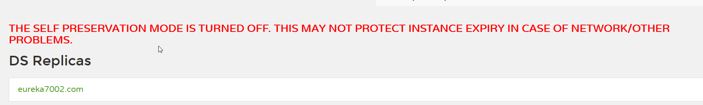

>   自保存模式被关闭。这可能不能保护实例在网络/其他问题的情况下过期。

客户端`cloud-provider-payment8001`

```yaml
eureka:
  instance:
    #Eureka客户端向服务端发送心跳的实际间隔，单位为秒（默认为30秒）
    lease-renewal-interval-in-seconds: 1
    #Eureka服务端收到最后一次心跳后等待时间上线，单位为秒（默认为90秒） 超时将剔除服务
    lease-expiration-duration-in-seconds: 2
```

#### 3.1.14、Eureka停更说明

---


### 3.2、Zookeeper详解

#### 3.2.1、Zookeeper简介

`Zookeeper`是一个分布式协调工具， 可以实现注册中心功能

[漫画：什么是ZooKeeper？](https://juejin.im/post/6844903608685707271)

-   服务节点是临时节点，一段时间接收不到心跳之后，立刻清除。

#### 3.2.2、Zookeeper安装

`docker`

```shell
$ docker run -d -p 2181:2181 --name some-zookeeper --restart always zookeeper:3.4.9
```


#### 3.2.3、支付模块8004注册

`cloud-provider-payment8004`

###### 1、改pom

```xml
<dependencies>
    <dependency><!-- 引用自己定义的api通用包，可以使用Payment支付Entity -->
        <groupId>ink.bzm.springcloud</groupId>
        <artifactId>cloud-api-commons</artifactId>
        <version>${project.version}</version>
    </dependency>
    <dependency>
        <groupId>org.springframework.boot</groupId>
        <artifactId>spring-boot-starter-web</artifactId>
    </dependency>
    <!--监控-->
    <dependency>
        <groupId>org.springframework.boot</groupId>
        <artifactId>spring-boot-starter-actuator</artifactId>
    </dependency>
    <!--SpringBoot整合Zookeeper客户端-->
    <dependency>
        <groupId>org.springframework.cloud</groupId>
        <artifactId>spring-cloud-starter-zookeeper-discovery</artifactId>
        <exclusions>
            <!--先排除自带的zookeeper3.5.3-->
            <exclusion>
                <groupId>org.apache.zookeeper</groupId>
                <artifactId>zookeeper</artifactId>
            </exclusion>
        </exclusions>
    </dependency>
    <!--添加zookeeper3.4.14版本-->
    <dependency>
        <groupId>org.apache.zookeeper</groupId>
        <artifactId>zookeeper</artifactId>
        <version>3.4.14</version>
    </dependency>
    <!--热部署-->
    <dependency>
        <groupId>org.springframework.boot</groupId>
        <artifactId>spring-boot-devtools</artifactId>
        <scope>runtime</scope>
        <optional>true</optional>
    </dependency>
    <dependency>
        <groupId>org.projectlombok</groupId>
        <artifactId>lombok</artifactId>
        <optional>true</optional>
    </dependency>
    <dependency>
        <groupId>org.springframework.boot</groupId>
        <artifactId>spring-boot-starter-test</artifactId>
        <scope>test</scope>
    </dependency>
</dependencies>
```

>   `jar`包更换

###### 2、写yml

```yaml
server:
  port: 8004

#服务别名 --- 注册zookeeper到注册中心名称
spring:
  application:
    name: cloud-provider-payment
  cloud:
    zookeeper:
      connect-string: 192.168.200.40:2181
```

###### 3、主启动

```java
@SpringBootApplication
@EnableDiscoveryClient //该注解用于向使用consul或者zookeeper作为注册中心时注册服务
public class PaymentMain8004 {

    public static void main(String[] args) {
        SpringApplication.run(PaymentMain8004.class,args);
    }
}
```

###### 4、控制器

```java
@RestController
@Slf4j
public class PaymentController {
    @Value("${server.port}")
    private String serverPort;

    @GetMapping(value = "/payment/zk")
    public String paymentzk(){
        return "springcloud with zookeeper："+serverPort+"\t"+ UUID.randomUUID().toString();
    }
}
```

###### 5、测试

启动`cloud-provider-payment8004`


http://localhost:8004/payment/zk


#### 3.2.4、订单模块注册

`cloud-consumerzk-order80`

###### 1、改pom

```xml
<dependencies>
    <dependency><!-- 引用自己定义的api通用包，可以使用Payment支付Entity -->
        <groupId>ink.bzm.springcloud</groupId>
        <artifactId>cloud-api-commons</artifactId>
        <version>${project.version}</version>
    </dependency>
    <dependency>
        <groupId>org.springframework.boot</groupId>
        <artifactId>spring-boot-starter-web</artifactId>
    </dependency>
    <!--监控-->
    <dependency>
        <groupId>org.springframework.boot</groupId>
        <artifactId>spring-boot-starter-actuator</artifactId>
    </dependency>
    <!--SpringBoot整合Zookeeper客户端-->
    <dependency>
        <groupId>org.springframework.cloud</groupId>
        <artifactId>spring-cloud-starter-zookeeper-discovery</artifactId>
        <exclusions>
            <!--先排除自带的zookeeper3.5.3-->
            <exclusion>
                <groupId>org.apache.zookeeper</groupId>
                <artifactId>zookeeper</artifactId>
            </exclusion>
        </exclusions>
    </dependency>
    <!--添加zookeeper3.4.14版本-->
    <dependency>
        <groupId>org.apache.zookeeper</groupId>
        <artifactId>zookeeper</artifactId>
        <version>3.4.14</version>
    </dependency>
    <!--热部署-->
    <dependency>
        <groupId>org.springframework.boot</groupId>
        <artifactId>spring-boot-devtools</artifactId>
        <scope>runtime</scope>
        <optional>true</optional>
    </dependency>
    <dependency>
        <groupId>org.projectlombok</groupId>
        <artifactId>lombok</artifactId>
        <optional>true</optional>
    </dependency>
    <dependency>
        <groupId>org.springframework.boot</groupId>
        <artifactId>spring-boot-starter-test</artifactId>
        <scope>test</scope>
    </dependency>
</dependencies>
```

###### 2、写yml

```yaml
server:
  port: 80


#服务别名 --- 注册zookeeper到注册中心名称
spring:
  application:
    name: cloud-consumer-order
  cloud:
    zookeeper:
      connect-string: 192.168.200.40:2181
```

###### 3、主启动

```java
@SpringBootApplication
@EnableDiscoveryClient
public class OrderZKMain80 {

    public static void main(String[] args) {
        SpringApplication.run(OrderZKMain80.class,args);
    }
}
```

###### 4、业务类

`ApplicationContextConfig`

```java
@Configuration
public class ApplicationContextConfig {

    @Bean
    @LoadBalanced
    public RestTemplate getRestTemplate() {
        return  new RestTemplate();
    }
}
```

`OrderZKController`

```java
@RestController
@Slf4j
public class OrderZKController {

    private static  final String INVOKE_URL = "http://cloud-provider-payment";

    @Resource
    private RestTemplate restTemplate;

    @GetMapping(value = "/consumer/payment/zk")
    public String paymentInfo() {
        String result = restTemplate.getForObject(INVOKE_URL+"/payment/zk",String.class);
        return result;
    }
}
```

###### 5、测试

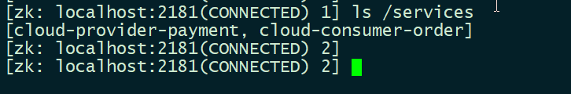

http://localhost/consumer/payment/zk


### 3.3、Consul详解

#### 3.3.1、Consul简介

[Consul官网](https://www.consul.io/)

`Consul`是`HashiCorp`公司推出的开源工具，用于**实现分布式系统的服务发现与配置**。`Consul`是分布式的、高可用的、 可横向扩展的。它具备以下特性:

-   **服务发现**: `Consul`提供了通过`DNS`或者`HTTP`接口的方式来**注册服务**和**发现服务**。一些外部的服务通过`Consul`很容易的找到它所依赖的服务。
-   **健康检测**: `Consul`的`Client`提供了健康检查的机制，可以通过用来避免流量被转发到有故障的服务上。
-   **Key/Value存储**: 应用程序可以根据自己的需要使用`Consul`提供的`Key/Value`存储。 `Consul`提供了简单易用的HTTP接口，结合其他工具可以实现动态配置、功能标记、领袖选举等等功能。
-   **多数据中心**: `Consul`支持开箱即用的多数据中心. 这意味着用户不需要担心需要建立额外的抽象层让业务扩展到多个区域。

#### 3.3.2、Consul安装

`docker`

```shell
$ docker run -d -p 8500:8500 -v /data/consul:/consul/data --name=dev-consul -e CONSUL_BIND_INTERFACE=eth0 consul:1.6.1
```

>   [Docker - 容器部署 Consul 集群](https://www.cnblogs.com/lfzm/p/10633595.html)

#### 3.3.3、支付模块8006注册

`cloud-providerconsul-payment8006`

###### 1、改pom

```xml
<dependencies>
    <dependency><!-- 引用自己定义的api通用包，可以使用Payment支付Entity -->
        <groupId>ink.bzm.springcloud</groupId>
        <artifactId>cloud-api-commons</artifactId>
        <version>${project.version}</version>
    </dependency>
    <dependency>
        <groupId>org.springframework.boot</groupId>
        <artifactId>spring-boot-starter-web</artifactId>
    </dependency>
    <!--监控-->
    <dependency>
        <groupId>org.springframework.boot</groupId>
        <artifactId>spring-boot-starter-actuator</artifactId>
    </dependency>
    <!--SpringCloud consul-server-->
    <dependency>
        <groupId>org.springframework.cloud</groupId>
        <artifactId>spring-cloud-starter-consul-discovery</artifactId>
    </dependency>
    <!--热部署-->
    <dependency>
        <groupId>org.springframework.boot</groupId>
        <artifactId>spring-boot-devtools</artifactId>
        <scope>runtime</scope>
        <optional>true</optional>
    </dependency>
    <dependency>
        <groupId>org.projectlombok</groupId>
        <artifactId>lombok</artifactId>
        <optional>true</optional>
    </dependency>
    <dependency>
        <groupId>org.springframework.boot</groupId>
        <artifactId>spring-boot-starter-test</artifactId>
        <scope>test</scope>
    </dependency>
</dependencies>
```

###### 2、写yml

```yaml
server:
  port: 8006

spring:
  application:
    name: consul-provider-payment
#consul注册中心地址
  cloud:
    consul:
      host: 192.168.200.40
      port: 8500
      discovery:
        service-name: ${spring.application.name}
        hostname: 192.168.107.1    #本机ip
```

>   如果`Consul`部署不在本机，需要添加`hostname`

###### 3、主启动

```java
@SpringBootApplication
@EnableDiscoveryClient
public class PaymentConsulMain8006 {
    public static void main(String[] args) {
        SpringApplication.run(PaymentConsulMain8006.class,args);
    }
}
```

###### 4、业务类

`PaymentController`

```   java
@RestController
@Slf4j
public class PaymentController {

    @Value("${server.port}")
    private String serverPort;

    @RequestMapping(value = "/payment/consul")
    public String paymentConsul() {
        return "springcloud with consul:" + serverPort + "\t"
                + UUID.randomUUID().toString();
    }
}
```

###### 5、测试

http://192.168.200.40:8500

http://localhost:8006/payment/consul


#### 3.3.4、支付模块80注册

`cloud-consumerconsul-order80`

###### 1、改pom

```xml
<dependencies>
    <!-- 引用自己定义的api通用包，可以使用Payment支付Entity -->
    <dependency>
        <groupId>ink.bzm.springcloud</groupId>
        <artifactId>cloud-api-commons</artifactId>
        <version>${project.version}</version>
    </dependency>
    <dependency>
        <groupId>org.springframework.boot</groupId>
        <artifactId>spring-boot-starter-web</artifactId>
    </dependency>
    <!--监控-->
    <dependency>
        <groupId>org.springframework.boot</groupId>
        <artifactId>spring-boot-starter-actuator</artifactId>
    </dependency>

    <!--SpringCloud consul-server-->
    <dependency>
        <groupId>org.springframework.cloud</groupId>
        <artifactId>spring-cloud-starter-consul-discovery</artifactId>
    </dependency>
    <!--热部署-->
    <dependency>
        <groupId>org.springframework.boot</groupId>
        <artifactId>spring-boot-devtools</artifactId>
        <scope>runtime</scope>
        <optional>true</optional>
    </dependency>
    <dependency>
        <groupId>org.projectlombok</groupId>
        <artifactId>lombok</artifactId>
        <optional>true</optional>
    </dependency>
    <dependency>
        <groupId>org.springframework.boot</groupId>
        <artifactId>spring-boot-starter-test</artifactId>
        <scope>test</scope>
    </dependency>
</dependencies>
```

###### 2、写yml

```yaml
server:
  port: 80

spring:
  application:
    name: cloud-consumer-order
  #consul注册中心地址
  cloud:
    consul:
      host: 192.168.200.40
      port: 8500
      discovery:
        service-name: ${spring.application.name}
```

###### 3、主启动类

```java
@SpringBootApplication
@EnableDiscoveryClient
public class OrderConsulMain80 {

    public static void main(String[] args) {
        SpringApplication.run(OrderConsulMain80.class,args);
    }
}
```

###### 4、业务类

`ApplicationContextConfig`

```java
@Configuration
public class ApplicationContextConfig {

    @Bean
    @LoadBalanced
    public RestTemplate getRestTemplate() {
        return  new RestTemplate();
    }
}
```

`OrderConsulController`

```java
@RestController
@Slf4j
public class OrderConsulController {


    private static  final String INVOKE_URL = "http://consul-provider-payment";

    @Resource
    private RestTemplate restTemplate;

    @GetMapping(value = "/consumer/payment/consul")
    public String paymentInfo() {
        String result = restTemplate.getForObject(INVOKE_URL+"/payment/consul",String.class);
        return result;
    }
}
```

###### 5、测试

http://localhost/consumer/payment/consul


---

### 3.4、Eureka、Zookeeper、Consul注册中心异同

[注册中心ZooKeeper、Eureka、Consul 、Nacos对比](https://blog.csdn.net/fly910905/article/details/100023415)

#### 3.4.1、CAP理论

`CAP`理论是分布式架构中重要理论

-   一致性(`Consistency`) (所有节点在同一时间具有相同的数据)
-   可用性(`Availability`) (保证每个请求不管成功或者失败都有响应)
-   分隔容忍(`Partition tolerance`) (系统中任意信息的丢失或失败不会影响系统的继续运作)

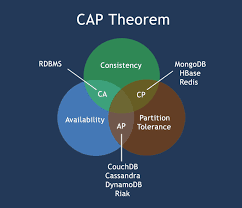


| **Nacos**       | **Eureka**                 | **Consul**  | **CoreDNS**       | **Zookeeper** |            |
| :-------------- | :------------------------- | :---------- | :---------------- | :------------ | ---------- |
| 一致性协议      | CP+AP                      | AP          | CP                | —             | CP         |
| 健康检查        | TCP/HTTP/MYSQL/Client Beat | Client Beat | TCP/HTTP/gRPC/Cmd | —             | Keep Alive |
| 负载均衡策略    | 权重/ metadata/Selector    | Ribbon      | Fabio             | RoundRobin    | —          |
| 雪崩保护        | 有                         | 有          | 无                | 无            | 无         |
| 自动注销实例    | 支持                       | 支持        | 不支持            | 不支持        | 支持       |
| 访问协议        | HTTP/DNS                   | HTTP        | HTTP/DNS          | DNS           | TCP        |
| 监听支持        | 支持                       | 支持        | 支持              | 不支持        | 支持       |
| 多数据中心      | 支持                       | 支持        | 支持              | 不支持        | 不支持     |
| 跨注册中心同步  | 支持                       | 不支持      | 支持              | 不支持        | 不支持     |
| SpringCloud集成 | 支持                       | 支持        | 支持              | 不支持        | 支持       |
| Dubbo集成       | 支持                       | 不支持      | 不支持            | 不支持        | 支持       |
| K8S集成         | 支持                       | 不支持      | 支持              | 支持          | 不支持     |

---

## 4、服务调用

### 4.1、Ribbon详解

#### 4.1.1、Ribbon简介

`Ribbon`是一个基于`HTTP`和`TCP`的**客户端负载均衡工具**，它基于`Netflix Ribbon`实现。通过`Spring Cloud`的封装，可以让我们轻松地将面向服务的`REST`模版请求自动转换成**客户端负载均衡的服务调用**。

>   `Spring Cloud Ribbon`虽然只是一个工具类框架，它不像服务注册中心、配置中心、API网关那样需要独立部署，但是它几乎存在于每一个`Spring Cloud`构建的微服务和基础设施中。因为微服务间的调用，`API`网关的请求转发等内容，实际上都是通过`Ribbon`来实现的，包括后续我们将要介绍的`Feign`，它也是基于`Ribbon`实现的工具。所以，对`Spring Cloud Ribbon`的理解和使用，对于我们使用`Spring Cloud`来构建微服务非常重要。
>
>   **Ribbon目前，也进入了维护模式。**

#### 4.1.2、负载均衡简介

负载均衡是**高可用**架构的一个关键组件，主要用来提高性能和可用性，通过负载均衡将流量分发到多个服务器，同时多服务器能够消除这部分的**单点故障**。

[什么是负载均衡？](https://zhuanlan.zhihu.com/p/32841479)

###### 1、集中式与进程内负载均衡

-   **集中式负载均衡**, 即在`consumer`和`provider`之间使用独立的负载均衡设施(可以是硬件，如`F5`, 也可以是软件，如`nginx`), 由该设施负责把 访问请求 通过某种策略转发至`provider`；
-   **进程内负载均衡**，将负载均衡逻辑集成到`consumer`，`consumer`从服务注册中心获知有哪些地址可用，然后自己再从这些地址中选择出一个合适的`provider`。

>   `Ribbon`就属于后者，它只是一个类库，集成于`consumer`进程，`consumer`通过它来获取到`provider`的地址。

#### 4.1.3、Ribbon的负载均衡和Rest调用

###### 1、引入pom依赖

`eureka-client下已经引入了ribbon`

```xml
<!--eureka-client-->
<dependency>
    <groupId>org.springframework.cloud</groupId>
    <artifactId>spring-cloud-starter-netflix-eureka-client</artifactId>
</dependency>

<!--eureka-client下已经引入了ribbon-->
<dependency>
    <groupId>org.springframework.cloud</groupId>
    <artifactId>spring-cloud-starter-netflix-ribbon</artifactId>
    <version>2.2.1.RELEASE</version>
    <scope>compile</scope>
</dependency>
```

###### 2、RestTemplate的使用

[Spring RestTemplate中几种常见的请求方式](https://blog.csdn.net/u012702547/article/details/77917939)

-   `getForObject`返回对象为响应体中数据转化成的对象，基本上可以理解为`Json`。
-   `getForEntity`返回对象为`ResponseEntity`对象， 包含了响应中的一些重要信息， 比如响应头、响应状态码、响应体等。

```java
    @GetMapping("/consumer/payment/get/{id}")
    public CommonResult<Payment> getPayment(@PathVariable("id") Long id){
        //返回对象为响应体中数据转化成的对象，基本上可以理解为Json
        return restTemplate.getForObject(PAYMENT_URL+"/payment/get/"+id,CommonResult.class);
    }

    @GetMapping("/consumer/payment/getForEntity/{id}")
    public CommonResult< Payment > getPayment2(@PathVariable("id") Long id) {
        //返回对象为ResponseEntity对象，包含了响应中的一些重要信息，比如响应头、响应状态码、响应体等
        ResponseEntity<CommonResult> entity = restTemplate.getForEntity(PAYMENT_URL + "/payment/get/" + id, CommonResult.class);

        if(entity.getStatusCode().is2xxSuccessful()) {
            return entity.getBody();
        } else {
            return new CommonResult<>(444,"操作失败！");
        }
    }
}
```

#### 4.1.4、Ribbon核心组件IRule

`IRule`接口

```java
public interface IRule{
    /*
     * choose one alive server from lb.allServers or
     * lb.upServers according to key
     * 
     * @return choosen Server object. NULL is returned if none
     *  server is available 
     */

    public Server choose(Object key);
    
    public void setLoadBalancer(ILoadBalancer lb);
    
    public ILoadBalancer getLoadBalancer();    
}
```

`Ribbon`中的7中负载均衡算法：

（1）`RoundRobinRule`：轮询；

（2）`RandomRule`：随机；

（3）`AvailabilityFilteringRule`：会先过滤掉由于多次访问故障而处于断路器状态的服务，还有并发的连接数量超过阈值的服务，然后对剩余的服务列表按照轮询策略进行访问；

（4）`WeightedResponseTimeRule`：根据平均响应时间计算所有服务的权重，响应时间越快的服务权重越大被选中的概率越大。刚启动时如果统计信息不足，则使用`RoundRobinRule`（轮询）策略，等统计信息足够，会切换到`WeightedResponseTimeRule`；

（5）`RetryRule`：先按照`RoundRobinRule`（轮询）策略获取服务，如果获取服务失败则在指定时间内进行重试，获取可用的服务；

（6）`BestAvailableRule`：会先过滤掉由于多次访问故障而处于断路器跳闸状态的服务，然后选择一个并发量最小的服务；

（7）`ZoneAvoidanceRule`：复合判断`Server`所在区域的性能和Server的可用性选择服务器；

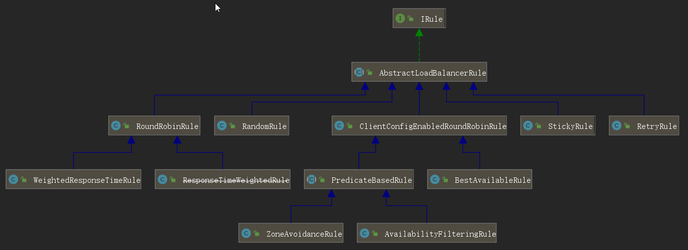

#### 4.1.5、Ribbon负载规则替换

`cloud-consumer-order80`

这个自定义配置类不能放在`@ComponentScan`所扫描的当前包下以及子包下，否则我们自定义的这个配置类就会被所有的`Ribbon`客户端所共享，达不到特殊化定制的目的了。


`MySelfRule`

```java
@Configuration
public class MySelfRule {

    @Bean
    public IRule myRule() {
        return new RandomRule(); // 定义为随机
    }
}
```

`主启动添加@RibbonClient`

```java
@SpringBootApplication
@EnableEurekaClient
@RibbonClient(name = "CLOUD-PAYMENT-SERVICE",configuration = MySelfRule.class)
public class OrderMain80 {
    public static void main(String[] args) {
        SpringApplication.run(OrderMain80.class,args);
    }
}
```

#### 4.1.6、Ribbon负载规则原理

###### 1、轮询

`com.netflix.loadbalancer.RoundRobinRule`

**`rest`接口第几次请求数%服务器集群总数量=实际调用服务器位置下标，每次服务重启动后rest接口计数从 1开始。**

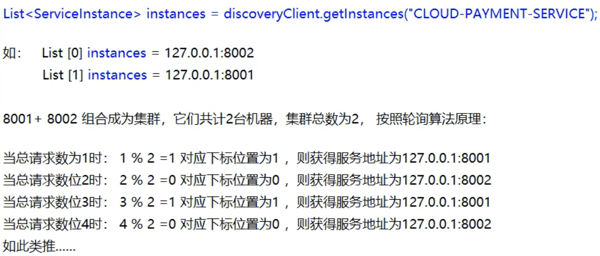

#### 4.1.7、Ribbon负载规则手写

###### 1、轮询

`cloud-consumer-order80`

**取消默认使用规则**

```java
@Configuration
public class ApplicationContextConfig {
    @Bean
//    @LoadBalanced   //注解赋予RestTemplate负载均衡的能力
    public RestTemplate getRestTemplate(){
        return new RestTemplate();
    }
}
```

`cloud-provider-payment8001`

`cloud-provider-payment8002`

`PaymentController`添加

```java
    @GetMapping(value = "/payment/lb")
    public String getPaymentLB() {
        return serverPort;
    }
```

`ink.bzm.springcloud.lb.LoadBalancer`

```java
public interface LoadBalancer {
    ServiceInstance instances(List<ServiceInstance> serviceInstances);
}
```

`ink.bzm.springcloud.lb.MyLB`

```java
@Component
public class MyLB implements LoadBalancer{

    private AtomicInteger atomicInteger = new AtomicInteger(0);

    public final int getAndIncrement() {
        int current;
        int next;
        do {
            current = this.atomicInteger.get();
            next = current >= 2147483647 ? 0 : current + 1;
        } while(!this.atomicInteger.compareAndSet(current,next));
        System.out.println("****第几次访问，次数next: " + next);
        return  next;
    }

    // 负载均衡轮询算法，rest接口第几次请求数 % 服务器集群总数 = 实际调用服务器位置下标
    @Override
    public ServiceInstance instances(List<ServiceInstance> serviceInstances) {
        int index = getAndIncrement() % serviceInstances.size();
        return serviceInstances.get(index);
    }
}
```

`OrderController`添加如下测试

```java
@RestController
@Slf4j
public class OrderController {
    @Resource
    private LoadBalancer loadBalancer;

    @Resource
    private DiscoveryClient discoveryClient;

    @GetMapping("/consumer/payment/lb")
    public String getPaymentLB() {
        // 通过容器中的 discoveryClient和服务名来获取服务集群
        List<ServiceInstance> instances = discoveryClient.getInstances("CLOUD-PAYMENT-SERVICE");
        if(instances == null || instances.size() <= 0) {
            return null;
        }
        // 传入服务集群来计算出获取具体的服务实例
        ServiceInstance serviceInstance = loadBalancer.instances(instances);
        URI uri = serviceInstance.getUri();
        return  restTemplate.getForObject(uri+"/payment/lb",String.class);
    }
}
```

http://localhost/consumer/payment/lb进行测试 

### 4.2、OpenFeign详解

#### 4.2.1、OpenFeign简介

[OpenFeign官网](https://spring.io/projects/spring-cloud-openfeign)

`Feign `是一个声明式的`Web`服务客户端，让编写`Web`服务客户端变得非常容易，只需创建一个接口并在接口上添加**注解**即可。

>   `Feign`旨在使编写`Java Http`客户端变得更容易。

-   前面在使用`Ribbon`+ `RestTemplate`时,利用`RestTemplate`对`http`请求的封装处理,形成了一套模版化的调用方法。

-   但是在实际开发中，由于对服务依赖的调用可能不止一处,往往一个接口会被多处调用， 所以通常都会针对每个微服务自行封装一些客户端类来包装这些依赖服务的调用。
-   所以，`Feign`在此基础上做了进一步封装，由他来帮助我们定义和实现依赖服务接口的定义。在`Feign`的实现下，**我们只需创建一个接口并使用注解的方式来配置它(以前是`Dao`接口上面标注`Mapper`注解，现在是一个微服务接口， 上面标注一个`Feign`注解即可)**，即阿完成对服务提供方的接口绑定，简化了使用`Spring cloud Ribbon`时，自动封装服务调用客户端的开发量。

#### 4.2.2、Feign和OpenFeign的区别

**Feign**

`Feign `是 `spring `cloud 组件中的一个轻量级 `RESTful `的`HTTP `服务客户端 `Reign `内置了 `Ribbon`, 用来做客户端服务在均衡，去调用服务注册中心的服务，`Feign `的使用方式是：使用`Feign `注解自定义接口，调用这个接口，就可以低哦啊用服务注册中心的服务。

**依赖**

```xml
<dependency>
    <groupId>org.springframework.cloud</groupId>
    <artifactId>spring-cloud-starter-feign</artifactId>
</dependency>
```

**OpenFeign**

`openfeign `是 spring `cloud `在 `feign `的基础上支持 `spring mvc` 注解 ，如 `@RequestMapping` 等等，`OpenFeign `的 `@FeignClient `可以解析`Spring MVC `的 `@RequestMapping` 注解下的接口，并通过动态代理的方式生产实现类 ，实现类中做负载均衡并且低哦用其他服务。

**依赖**

```xml
<dependency>
    <groupId>org.springframework.cloud</groupId>
    <artifactId>spring-cloud-starter-openfeign</artifactId>
</dependency>
```

#### 4.2.3、OpenFeign的使用

`cloud-consumer-feign-order80`

###### 1、添加pom依赖

```xml
<dependencies>
    <!-- 引用自己定义的api通用包，可以使用Payment支付Entity -->
    <dependency>
        <groupId>ink.bzm.springcloud</groupId>
        <artifactId>cloud-api-commons</artifactId>
        <version>${project.version}</version>
    </dependency>
    <dependency>
        <groupId>org.springframework.boot</groupId>
        <artifactId>spring-boot-starter-web</artifactId>
    </dependency>
    <!-- openfeign -->
    <dependency>
        <groupId>org.springframework.cloud</groupId>
        <artifactId>spring-cloud-starter-openfeign</artifactId>
    </dependency>
    <!--监控-->
    <dependency>
        <groupId>org.springframework.boot</groupId>
        <artifactId>spring-boot-starter-actuator</artifactId>
    </dependency>
    <!--eureka client-->
    <dependency>
        <groupId>org.springframework.cloud</groupId>
        <artifactId>spring-cloud-starter-netflix-eureka-client</artifactId>
    </dependency>
    <!--热部署-->
    <dependency>
        <groupId>org.springframework.boot</groupId>
        <artifactId>spring-boot-devtools</artifactId>
        <scope>runtime</scope>
        <optional>true</optional>
    </dependency>
    <dependency>
        <groupId>org.projectlombok</groupId>
        <artifactId>lombok</artifactId>
        <optional>true</optional>
    </dependency>
    <dependency>
        <groupId>org.springframework.boot</groupId>
        <artifactId>spring-boot-starter-test</artifactId>
        <scope>test</scope>
    </dependency>
</dependencies>
```

###### 2、写yml

```yaml
server:
  port: 80

#这里只把feign做客户端用，不注册进eureka
eureka:
  client:
    #表示是否将自己注册进EurekaServer默认为true
    register-with-eureka: false
    service-url:
      #defaultZone: http://localhost:7001/eureka
      defaultZone: http://eureka7001.com:7001/eureka/,http://eureka7002.com:7002/eureka/
```

###### 3、主启动

使用注解`@EnableFeignClients`启用`feign`客户端

```java
@SpringBootApplication
@EnableFeignClients
public class OrderFeignMain80 {

    public static void main(String[] args) {
        SpringApplication.run(OrderFeignMain80.class,args);
    }
}
```

###### 4、业务类

`ink.bzm.springcloud.service.PaymentFeignService`

```java
@Component
@FeignClient(value = "CLOUD-PROVIDER-SERVICE")
public interface PaymentFeignService {

    @GetMapping(value="/payment/get/{id}")
    public CommonResult<Payment> getPaymentById(@PathVariable("id") Long id);
    
}
```

`ink.bzm.springcloud.controller.OrderFeignController`

```java
@RestController
@Slf4j
public class OrderFeignController {

    @Resource
    private PaymentFeignService paymentFeignService;

    @GetMapping(value="/consumer/payment/get/{id}")
    public CommonResult<Payment> getPaymentById(@PathVariable("id")  Long id) {
        return  paymentFeignService.getPaymentById(id);
    }
    
}
```

###### 5、测试

http://localhost/consumer/payment/get/8

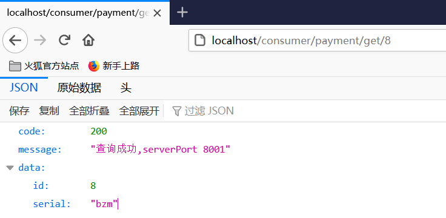

#### 4.2.3、OpenFeign超时控制

###### 1、编写超时程序

`cloud-provider-payment8001`的`PaymentController`

```java
@RestController
@Slf4j
public class PaymentController {
    
    /**
     * 暂停几秒线程
     * @return
     */
    @GetMapping(value = "/payment/feign/timeout")
    public String paymentFeignTimeout() {
        try {
            TimeUnit.SECONDS.sleep(3);
        } catch (Exception e){
            e.printStackTrace();
        } finally {
            return serverPort;
        }
    }
}
```

`cloud-consumer-feign-order80`的`PaymentFeignService`

```java
@Component
@FeignClient(value = "CLOUD-PAYMENT-SERVICE")
public interface PaymentFeignService {

    @GetMapping(value = "/payment/feign/timeout")
    public String paymentFeignTimeout();

}
```

`cloud-consumer-feign-order80`的`OrderFeignController`

```java
@RestController
@Slf4j
public class OrderFeignController {

    @Resource
    private PaymentFeignService paymentFeignService;

    @GetMapping(value = "/consumer/payment/feign/timeout")
    public String paymentFeignTimeout() {
        //openfeign-ribbon 客户端默认等待1S
        return  paymentFeignService.paymentFeignTimeout();
    }
}
```

###### 2、测试超时

http://localhost:8001/payment/feign/timeout服务端三秒后显示


http://localhost/consumer/payment/feign/timeout消费端报错，默认一秒。


###### 3、设置超时配置

```yaml
#设置feign客户端超时时间（OpenFeign默认支持ribbon）
ribbon:
  #指的是建立连接所用的时间，适用于网络状况正常的情况下，两端连接所用的实际
  ReadTimeout: 5000
  #指的是建立连接后从服务器读取到可用资源所用的时间
  ConnectTimeout: 5000
```


#### 4.2.4、OpenFeign日志打印功能

`FeignConfig`

```java
@Configuration
public class FeignConfig {

    @Bean
    Logger.Level feignLoggerLevel() {
        return  Logger.Level.FULL;
    }
}
```

`application.yml`

```yaml
logging:
  level:
    #feign日志以什么级别监控那个接口
    ink.bzm.springcloud.service.PaymentFeignService: debug
```

http://localhost/consumer/payment/get/8访问查看控制台日志信息。


## 5、服务降级

### 5.1、Hystrix详解

#### 5.1.1、Hystrix简介

>   `Hystrix`是一个用于处理分布式系统的延迟和容错的开源库， 在分布式系统里,许多依赖不可避免的会调用失败，比如超时、异常等,`Hystrix`能够保证在一个依赖出问题的情况下， 不会导致整体服务失败，避免级联故障,以提高分布式系统的弹性。
>
>   [Hystrix的GutHub](https://github.com/Netflix/Hystrix)：目前停更进维。

-   `Hystrix `是用于处理延迟和容错的开源库
-   `Hystrix `主要用于避免级联故障，提高系统弹性
-   `Hystrix `解决了由于扇出导致的“雪崩效应”
-   `Hystrix `的核心是“隔离”和“熔断机制”

**主要作用**

-   服务隔离和服务熔断
-   服务降级、限流和快速失败
-   请求合并和请求缓存
-   自带单体和集群监控

#### 5.1.2、Hystrix重要概念

##### 1、服务降级

>    什么是服务降级？当服务器压力剧增的情况下，根据实际业务情况及流量，对一些服务和页面有策略的不处理或换种简单的方式处理，从而释放服务器资源以保证核心交易正常运作或高效运作。

[服务降级](https://my.oschina.net/yu120/blog/1790398)

-   降级是一种无奈的“选择”，俗称“备胎” (*^*)
-   `Command `降级需要实现`fallback`方法
-   `ObservableCommand `降级实现 `resumeWithFallback`方法


##### 2、服务熔断

[什么是服务熔断？](https://juejin.im/post/6844903590834749447)

[CircuitBreaker](https://martinfowler.com/bliki/CircuitBreaker.html)

>   会进行服务的降级，进而熔断该节点微服务的调用，快速返回错误的响应信息。熔断机制是应对雪崩效应的一种微服务链路保护机制。当扇出链路的某个微服务出错不可用或者响应时间太长时。
>
>   **当检测到该节点微服务调用响应正常后，恢复调用链路。**
>
>   

-   熔断器是一种开关，用来控制流量是否执行业务逻辑
-   熔断器核心指标
    -   快照时间窗
    -   请求总数阈值
    -   错误百分比阈值

>   类比保险丝达到最大服务访问后，直接拒绝访问，拉闸限电，然后调用服务降级的方法并返回友好提示

**熔断器状态**

-   熔断器开启： 所有请求都会进入`fallback`方法
-   熔断器半开启： 间歇性让请求触发`run`方法
-   熔断器关闭： 正常处理业务请求
-   默认情况下熔断器开启5秒后进入半开启状态


##### 3、服务限流

服务限流其实是指当系统资源不够，不足以应对大量请求，即系统资源与访问量出现矛盾的时候，我们为了保证有限的资源能够正常服务，因此对系统按照预设的规则进行流量限制或功能限制的一种方法。


#### 5.1.3、Hystrix案例

 新建`cloud-provider-hystrix-payment8001`

##### 5.1.3.1、服务端

 新建`cloud-provider-hystrix-payment8001`

###### 1、改pom

```xml
<dependencies>
    <!-- 引用自己定义的api通用包，可以使用Payment支付Entity -->
    <dependency>
        <groupId>ink.bzm.springcloud</groupId>
        <artifactId>cloud-api-commons</artifactId>
        <version>${project.version}</version>
    </dependency>
    <dependency>
        <groupId>org.springframework.boot</groupId>
        <artifactId>spring-boot-starter-web</artifactId>
    </dependency>
    <!--监控-->
    <dependency>
        <groupId>org.springframework.boot</groupId>
        <artifactId>spring-boot-starter-actuator</artifactId>
    </dependency>
    <!-- hystrix-->
    <dependency>
        <groupId>org.springframework.cloud</groupId>
        <artifactId>spring-cloud-starter-netflix-hystrix</artifactId>
    </dependency>
    <!--eureka client-->
    <dependency>
        <groupId>org.springframework.cloud</groupId>
        <artifactId>spring-cloud-starter-netflix-eureka-client</artifactId>
    </dependency>
    <!--热部署-->
    <dependency>
        <groupId>org.springframework.boot</groupId>
        <artifactId>spring-boot-devtools</artifactId>
        <scope>runtime</scope>
        <optional>true</optional>
    </dependency>
    <dependency>
        <groupId>org.projectlombok</groupId>
        <artifactId>lombok</artifactId>
        <optional>true</optional>
    </dependency>
    <dependency>
        <groupId>org.springframework.boot</groupId>
        <artifactId>spring-boot-starter-test</artifactId>
        <scope>test</scope>
    </dependency>
</dependencies>
```


###### 2、写yml

`application.yml`

```yaml
server:
  port: 8001

spring:
  application:
    name: cloud-provider-hystrix-payment

eureka:
  client:
    register-with-eureka: true
    fetch-registry: true
    service-url:
      defaultZone: http://eureka7001.com:7001/eureka,http://eureka7002.com:7002/eureka    #集群版
```

###### 3、主启动

```java
@SpringBootApplication
@EnableEurekaClient
@EnableCircuitBreaker
public class PaymentHystrixMain8001 {

    public static void main(String[] args) {
        SpringApplication.run(PaymentHystrixMain8001.class,args);
    }
}
```

###### 4、业务类

```java
@Service
public class PaymentService {

    /**
     * 正常访问
     * @param id
     * @return
     */
    public String paymentInfo_OK(Integer id) {
        return "线程池： " + Thread.currentThread().getName()
                + "   paymentInfo_OK,id:" + id + " 正常访问！";
    }

    /**
     * 超时访问，演示降级
     * @param id
     * @return
     */
    public String paymentInfo_Timeout(Integer id) {
        int timeNumber = 3;
        try {
            TimeUnit.SECONDS.sleep(timeNumber);
        } catch (Exception e){
            e.printStackTrace();
        }
        return "线程池： " + Thread.currentThread().getName()
                + "   paymentInfo_OK,id:" + id + " 耗时(秒):" + timeNumber;
    }

}
```

`PaymentController`

```java
@RestController
@Slf4j
public class PaymentController {

    @Resource
    private PaymentService paymentService;

    @Value("${server.port}")
    private String serverPort;

    @GetMapping("/payment/hystrix/ok/{id}")
    public String paymentInfo_OK(@PathVariable("id") Integer id) {
        String result = paymentService.paymentInfo_OK(id);
        log.info("*****result: " + result);
        return result;
    }

    @GetMapping("/payment/hystrix/timeout/{id}")
    public String paymentInfo_Timeout(@PathVariable("id") Integer id) {
        String result = paymentService.paymentInfo_Timeout(id);
        log.info("*****result: " + result);
        return result;
    }
    
}
```


###### 5、测试

http://localhost:8001/payment/hystrix/ok/8

http://localhost:8001/payment/hystrix/timeout/8

>   两个都能正常访问，`timeout`需要耗时3秒


##### 5.1.3.2、消费端

新建`cloud-consumer-feign-hystrix-order80`

###### 1、改pom

```xml
<dependencies>
    <!-- 引用自己定义的api通用包，可以使用Payment支付Entity -->
    <dependency>
        <groupId>ink.bzm.springcloud</groupId>
        <artifactId>cloud-api-commons</artifactId>
        <version>${project.version}</version>
    </dependency>
    <dependency>
        <groupId>org.springframework.boot</groupId>
        <artifactId>spring-boot-starter-web</artifactId>
    </dependency>
    <!-- openfeign -->
    <dependency>
        <groupId>org.springframework.cloud</groupId>
        <artifactId>spring-cloud-starter-openfeign</artifactId>
    </dependency>
    <!--监控-->
    <dependency>
        <groupId>org.springframework.boot</groupId>
        <artifactId>spring-boot-starter-actuator</artifactId>
    </dependency>
    <dependency>
        <groupId>org.springframework.cloud</groupId>
        <artifactId>spring-cloud-starter-netflix-hystrix</artifactId>
    </dependency>
    <!--eureka client-->
    <dependency>
        <groupId>org.springframework.cloud</groupId>
        <artifactId>spring-cloud-starter-netflix-eureka-client</artifactId>
    </dependency>
    <!--热部署-->
    <dependency>
        <groupId>org.springframework.boot</groupId>
        <artifactId>spring-boot-devtools</artifactId>
        <scope>runtime</scope>
        <optional>true</optional>
    </dependency>
    <dependency>
        <groupId>org.projectlombok</groupId>
        <artifactId>lombok</artifactId>
        <optional>true</optional>
    </dependency>
    <dependency>
        <groupId>org.springframework.boot</groupId>
        <artifactId>spring-boot-starter-test</artifactId>
        <scope>test</scope>
    </dependency>
</dependencies>
```

###### 2、写yml

`application.yml`

```yaml
server:
  port: 80

#这里只把feign做客户端用，不注册进eureka
eureka:
  client:
    #表示是否将自己注册进EurekaServer默认为true
    register-with-eureka: false
    service-url:
      defaultZone: http://eureka7001.com:7001/eureka,http://eureka7002.com:7002/eureka    #集群版
```

###### 3、主启动

```java
@SpringBootApplication
@EnableFeignClients
public class OrderHystrixMain80 {

    public static void main(String[] args) {
        SpringApplication.run(OrderHystrixMain80.class,args);
    }
}
```

###### 4、业务类

`PaymentHystrixService`

```java
@Component
@FeignClient(value = "CLOUD-PROVIDER-HYSTRIX-PAYMENT")
public interface PaymentHystrixService {

    @GetMapping("/payment/hystrix/ok/{id}")
    public String paymentInfo_OK(@PathVariable("id") Integer id);

    @GetMapping("/payment/hystrix/timeout/{id}")
    public String paymentInfo_Timeout(@PathVariable("id") Integer id);

}
```

`OrderHystrixController`

```java
@RestController
@Slf4j
public class OrderHystrixController {
    @Resource
    private PaymentHystrixService paymentHystrixService;

    @GetMapping("/consumer/payment/hystrix/timeout/{id}")
    public String paymentInfo_Timeout(@PathVariable("id") Integer id){
        String result = paymentHystrixService.paymentInfo_Timeout(id);
        return  result;
    }


    @GetMapping("/consumer/payment/hystrix/ok/{id}")
    public String paymentInfo_OK(@PathVariable("id") Integer id){
        String result = paymentHystrixService.paymentInfo_OK(id);
        return  result;
    }

}
```

###### 5、测试

http://localhost:80/consumer/payment/hystrix/ok/8

http://localhost:80/consumer/payment/hystrix/timeout/8

>   两个都能正常访问，`timeout`需要耗时3秒

#### 5.1.4、Hystrix降级配置

##### 5.1.4.1、服务端

###### 1、业务类配置`fallback`方法

`PaymentService`

```java
@Service
public class PaymentService {

     /**
     * 超时访问，演示降级
     * @param id
     * @return
     */
    @HystrixCommand(fallbackMethod = "paymentInfo_TimeoutHandler",commandProperties = {
            @HystrixProperty(name = "execution.isolation.thread.timeoutInMilliseconds",value = "5000")      //线程的超时时间
    })
    public String paymentInfo_Timeout(Integer id) {
        int timeNumber = 3;
        try {
            //程序睡3秒
            TimeUnit.SECONDS.sleep(timeNumber);
        } catch (Exception e){
            e.printStackTrace();
        }
        return "线程池： " + Thread.currentThread().getName()
                + "   paymentInfo_OK,id:" + id + " 耗时(秒):" + timeNumber;
    }


    /**
     * paymentInfo_Timeout() 的fallback 方法
     * @param id
     * @return
     */
    public String paymentInfo_TimeoutHandler(Integer id) {
        return "/(ToT)/调用支付接口超时或异常、\t" + "\t当前线程池名字" + Thread.currentThread().getName();
    }
    
}
```

###### 2、主启动激活

```java
@SpringBootApplication
@EnableEurekaClient
@EnableCircuitBreaker       //启用断路器
public class PaymentHystrixMain8001 {

    public static void main(String[] args) {
        SpringApplication.run(PaymentHystrixMain8001.class,args);
    }
}
```

###### 3、测试

http://localhost:8001/payment/hystrix/timeout/8

>   超时或异常会调用`paymentInfo_Timeout() `的`fallback `方法

##### 5.1.4.2、消费端

###### 1、添加hystrix的yml配置

`application.yml`

```
feign:
  hystrix:
    enabled: true
```

###### 2、业务类配置`fallback`方法

`OrderHystrixController`

```java
@RestController
@Slf4j
@DefaultProperties(defaultFallback = "paymentInfo_Global_FallbackMethod")
public class OrderHystrixController {
    @Resource
    private PaymentHystrixService paymentHystrixService;

    @GetMapping("/consumer/payment/hystrix/timeout/{id}")
    @HystrixCommand(fallbackMethod = "paymentInfo_TimeoutFallbackMethod",commandProperties = {
            @HystrixProperty(name = "execution.isolation.thread.timeoutInMilliseconds",value = "1000")
    })
//    @HystrixCommand
    public String paymentInfo_Timeout(@PathVariable("id") Integer id){
        String result = paymentHystrixService.paymentInfo_Timeout(id);
        return  result;
    }

    public String paymentInfo_TimeoutFallbackMethod() {
        return "/(ToT)/我是消费者80，调用8001支付系统繁忙，请10秒钟后重新尝试、\t";
    }
    
}
```

`OrderHystrixMain80`

```java
@SpringBootApplication
@EnableFeignClients
@EnableHystrix
public class OrderHystrixMain80 {

    public static void main(String[] args) {
        SpringApplication.run(OrderHystrixMain80.class,args);
    }
}
```

##### 5.1.4.3、测试

http://localhost/consumer/payment/hystrix/timeout/8


#### 5.1.5、Hystrix全局降级配置

**问题**：每个业务方法对应一个兜底的方法，代码膨胀。

>   **解决：**
>
>   使用`@DefaultProperties`配置`defaultFallback`进行全局配置

`OrderHystrixControllr`添加`@DefaultProperties`

```java
@RestController
@Slf4j
@DefaultProperties(defaultFallback = "paymentInfo_Global_FallbackMethod")
public class OrderHystrixControllr {
    
     @GetMapping("/consumer/payment/hystrix/timeout/{id}")
//    @HystrixCommand(fallbackMethod = "paymentInfo_TimeoutFallbackMethod",commandProperties = {
//            @HystrixProperty(name = "execution.isolation.thread.timeoutInMilliseconds",value = "5000")
//    })
    @HystrixCommand
    public String paymentInfo_Timeout(@PathVariable("id") Integer id){
        String result = paymentHystrixService.paymentInfo_Timeout(id);
        return  result;
    }
    
        // 下面是全局fallback方法
    public String paymentInfo_Global_FallbackMethod() {
        return "Global异常处理信息，请稍后再试， /(ToT)/";
    }
}
```

**测试**

http://localhost/consumer/payment/hystrix/timeout/8

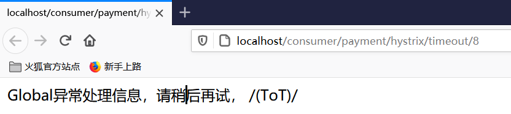

#### 5.1.6、Hystrix之通配服务降级FeignFallback

**问题：**和业务逻辑混─起???混乱

>   **解决：**
>
>   为`Feign`客户端定义的接口添加一个服务降级处理的实现类即可实现解耦

`PaymentHystrixService`的`@FeignClient`添加`fallback`

```java
@Component
@FeignClient(value = "CLOUD-PROVIDER-HYSTRIX-PAYMENT", fallback = PaymentFallbackService.class)		//设置fallback方法
public interface PaymentHystrixService {

    @GetMapping("/payment/hystrix/ok/{id}")
    public String paymentInfo_OK(@PathVariable("id") Integer id);

    @GetMapping("/payment/hystrix/timeout/{id}")
    public String paymentInfo_Timeout(@PathVariable("id") Integer id);

}
```

`PaymentFallbackService`

```java
@Component
public class PaymentFallbackService implements PaymentHystrixService {

    @Override
    public String paymentInfo_OK(Integer id) {
        return "----PaymentFallbackService fall back paymentInfo_OK,o(╥﹏╥)o";
    }

    @Override
    public String paymentInfo_Timeout(Integer id) {
        return "----PaymentFallbackService fall back paymentInfo_Timeout,o(╥﹏╥)o";
    }
}
```

**测试**

`paymentInfo_OK`并没有配置对应的`fallback`方法，模拟8001故障，关闭8001。

http://localhost/consumer/payment/hystrix/ok/8


#### 5.1.7、Hystrix之服务熔断案例

`cloud-provider-hystrix-payment8001`

`PaymentService`添加服务熔断测试方法

```java
@Service
public class PaymentService {
    
    /**
     * 服务熔断
     * @param id
     * @return
     */
    @HystrixCommand(fallbackMethod = "paymentCircuitBreaker_fallback",commandProperties = {
            @HystrixProperty(name = "circuitBreaker.enabled", value = "true"),              //是否开启断路器
            @HystrixProperty(name = "circuitBreaker.requestVolumeThreshold", value = "10"),    //请求数达到后才计算
            @HystrixProperty(name = "circuitBreaker.sleepWindowInMilliseconds", value = "10000"), //休眠时间窗
            @HystrixProperty(name = "circuitBreaker.errorThresholdPercentage", value = "60"),  //错误率达到多少跳闸
    })
    public String paymentCircuitBreaker(@PathVariable("id") Integer id) {
          if(id < 0){
              throw  new RuntimeException("****id 不能为负数");
          }
          String serialNumber = IdUtil.simpleUUID();

          return  Thread.currentThread().getName() + "\t" + "调用成功，流水号：" + serialNumber;
    }
    
    /**
     * paymentCircuitBreaker() 的 fallback 方法
     * @param id
     * @return
     */
    public String paymentCircuitBreaker_fallback(@PathVariable("id") Integer id){
         return "id 不能为负数,请稍后再试， o(╥﹏╥)o id: " + id;
    } 
}
```

>   `HystrixCommandProperties`Properties for instances of {@link HystrixCommand}.

`PaymentController`

```java
@RestController
@Slf4j
public class PaymentController {
    
    @GetMapping("/payment/circuit/{id}")
    public String paymentCircuitBreaker(@PathVariable("id") Integer id) {
        String result = paymentService.paymentCircuitBreaker(id);
        log.info("*****result: " + result);
        return result;
    }
}
```

**测试**

http://localhost:8001/payment/circuit/8

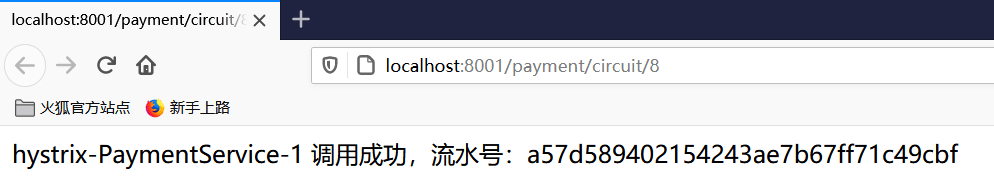

http://localhost:8001/payment/circuit/-1


 http://localhost:8001/payment/circuit/1

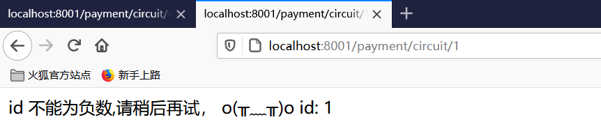

>   当错误到达`60%`时候，会断开链路，正确也不能成功访问，`sleepWindowInMilliseconds`时间过后才能访问。


#### 5.1.8、Hystrix工作原理

[Hystrix工作原理](https://segmentfault.com/a/1190000012439580)

工作流程图


#### 5.1.9、Hystrix图形化Dashboard搭建

[Hystrix图形化Dashboard搭建教程](https://www.bilibili.com/video/BV18E411x7eT?t=23&p=63)


## 6、服务网关

### 6.1、Gateway详解

#### 6.1.1、Gateway简介

`Spring Cloud Gateway`是`Spring Cloud`推出的第二代网关框架，取代`Zuul`网关。网关作为流量的，在微服务系统中有着非常作用，网关常见的功能有**路由转发**、**权限校验**、**限流控制**等作用。

>   `SpringCloud Gateway`使用的`Webflux`中的`reactor-netty`响应式编程组件，底层使用了`Netty`通讯框架。

#### 6.1.2、Gateway核心概念

##### 6.1.2.1、路由（Route）

网关配置的基本组成模块，和`Zuul`的路由配置模块类似。一个**Route模块**由一个 ID，一个目标 URI，一组断言和一组过滤器定义。如果断言为真，则路由匹配，目标URI会被访问。


##### 6.1.2.2、过滤器（Filter）

指的是`Spring`框架中`GatewayFilter`的实例，使用过滤器，可以在请求被路由前或者之后对请求进行修改。


##### 6.1.2.3、断言（Predicate）

这是一个` Java 8 `的 `Predicate`，可以使用它来匹配来自 `HTTP `请求的任何内容，例如 `headers `或参数。**断言的**输入类型是一个 `ServerWebExchange`。


#### 6.1.3、Gateway工作流程

客户端向 ``Spring Cloud Gateway ``发出请求。然后在` Gateway Handler Mapping` 中找到与请求相匹配的路由，将其发送到 `Gateway Web Handler`。`Handler `再通过指定的过滤器链来将请求发送到我们实际的服务执行业务逻辑，然后返回。过滤器之间用虚线分开是因为过滤器可能会在发送代理请求之前（“pre”）或之后（“post”）执行业务逻辑。

 

>   路由转发+执行过滤器链


#### 6.1.4、Gateway入门配置

`cloud-gateway-gateway9527`

##### 6.1.4.1、配置网关（一）

###### 1、添加pom依赖

```xml
<dependencies>
    <!-- 引用自己定义的api通用包，可以使用Payment支付Entity -->
    <dependency>
        <groupId>ink.bzm.springcloud</groupId>
        <artifactId>cloud-api-commons</artifactId>
        <version>${project.version}</version>
    </dependency>
    <!--gateway-->
    <dependency>
        <groupId>org.springframework.cloud</groupId>
        <artifactId>spring-cloud-starter-gateway</artifactId>
    </dependency>
    <!--eureka client-->
    <dependency>
        <groupId>org.springframework.cloud</groupId>
        <artifactId>spring-cloud-starter-netflix-eureka-client</artifactId>
    </dependency>
    <!--热部署-->
    <dependency>
        <groupId>org.springframework.boot</groupId>
        <artifactId>spring-boot-devtools</artifactId>
        <scope>runtime</scope>
        <optional>true</optional>
    </dependency>
    <dependency>
        <groupId>org.projectlombok</groupId>
        <artifactId>lombok</artifactId>
        <optional>true</optional>
    </dependency>
    <dependency>
        <groupId>org.springframework.boot</groupId>
        <artifactId>spring-boot-starter-test</artifactId>
        <scope>test</scope>
    </dependency>
</dependencies>
```

###### 2、写yml

>   `yml`配置`gateway`的`routes`

`application.yml`

```yaml
server:
  port: 9527

spring:
  application:
    name: cloud-gateway
  cloud:
    gateway:
      routes:
        - id: payment_route # 路由的id,没有规定规则但要求唯一,建议配合服务名
          #匹配后提供服务的路由地址
          uri: http://localhost:8001
          predicates:
            - Path=/payment/get/** # 断言，路径相匹配的进行路由

        - id: payment_route2
          uri: http://localhost:8001
          predicates:
            - Path=/payment/lb/** #断言,路径相匹配的进行路由

eureka:
  instance:
    hostname: cloud-gateway-service
  client:
    fetch-registry: true
    register-with-eureka: true
    service-url:
      defaultZone: http://eureka7001.com:7001/eureka,http://eureka7002.com:7002/eureka    #集群版
```

###### 3、测试

http://localhost:9527/payment/get/8

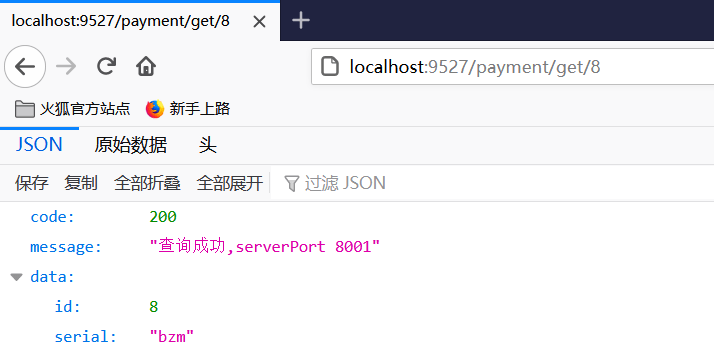

>   不想暴露`8001`端口，在`8001`外面套一层`9527`

##### 6.1.4.2、配置网关（二）

用编码的方式进行配置

`ink.bzm.springcloud.config.GatewayConfig`

```java
@Configuration
public class GatewayConfig {

    /**
     * 配置了一个id为route-name的路由规则
     * 当访问地址 http://localhost:9527/guonei时会自动转发到地址： http://news.baidu.com/guonei
     * @param builder
     * @return
     */
    @Bean
    public RouteLocator customRouteLocator(RouteLocatorBuilder builder) {
        RouteLocatorBuilder.Builder routes = builder.routes();
        routes.route("path_route_bzm",
                r -> r.path("/guonei")
                        .uri("http://news.baidu.com/guonei")).build();
        return routes.build();
    }

    @Bean
    public RouteLocator customRouteLocator2(RouteLocatorBuilder builder) {
        RouteLocatorBuilder.Builder routes = builder.routes();
        routes.route("path_route_bzm2",
                r -> r.path("/guoji")
                        .uri("http://news.baidu.com/guoji")).build();
        return routes.build();
    }
}
```

**测试**

http://localhost:9527/guonei

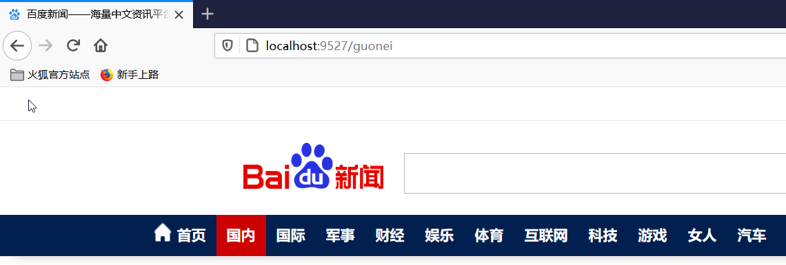


#### 6.1.5、Gateway动态路由

默认情况下`Gateway`会根据注册中心注册的服务列表，以注册中心上微服务名为路径创建动态路由进行转发，从而实现动态路由的功能。

`application.yml`添加

```yaml
server:
  port: 9527

spring:
  application:
    name: cloud-gateway
  cloud:
    gateway:
      discovery:
        locator:
          enabled: true # 开启从注册中心动态创建路由的功能，利用微服务名称进行路由
      routes:
        - id: payment_route # 路由的id,没有规定规则但要求唯一,建议配合服务名
          #匹配后提供服务的路由地址
          uri: lb://cloud-payment-service   #lb 是loadbalance的意思
          predicates:
            - Path=/payment/get/** # 断言，路径相匹配的进行路由

        - id: payment_route2
          uri: lb://cloud-payment-service
          predicates:
            - Path=/payment/lb/** #断言,路径相匹配的进行路由

eureka:
  instance:
    hostname: cloud-gateway-service
  client:
    fetch-registry: true
    register-with-eureka: true
    service-url:
      defaultZone: http://eureka7001.com:7001/eureka,http://eureka7002.com:7002/eureka    #集群版
```

**测试**

http://localhost:9527/payment/lb

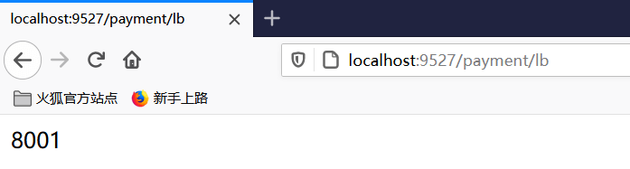

>   `8001`与`8002`切换


#### 6.1.6、Gateway的predicates（断言）

[Spring Cloud Gateway 之Predict篇](https://juejin.im/entry/6844903731486523406)

>   `Loaded RoutePredicateFactory`加载路由断言工厂


断言`predicates`配置

```yaml
server:
  port: 9527

spring:
  application:
    name: cloud-gateway
  cloud:
    gateway:
      discovery:
        locator:
          enabled: true # 开启从注册中心动态创建路由的功能，利用微服务名称进行路由
      routes:
        - id: payment_route2
          #uri: http://localhost:8001
          uri: lb://cloud-payment-service
          predicates:
            - Path=/payment/lb/** #断言,路径相匹配的进行路由
#            - After=2020-08-30T15:50:37.379+08:00[Asia/Shanghai]    #多少时间以后
#            - Cookie=username,bzm   #带Cookie，并且username的值为bzm
#            - Header=X-Request-Id,\d+ #请求头要有 X-Request-Id属性并且值为整数的正则表达式
```


**测试**

`- Cookie=username,bzm`

```shell
$ curl http://localhost:9527/payment/lb --cookie "username=bzm"
8002
```

`- Header=X-Request-Id,\d+`

```shell
$ curl http://localhost:9527/payment/lb -H "X-Request-Id:123"
8001
```


#### 6.1.7、Gateway的Filter（过滤器）

[spring cloud gateway之filter篇](https://juejin.im/post/6844903741867425800)

>   **路由过滤器**可用于修改进入的`HTTP`请求和返回的`HTTP`响应，路由过滤器只能指定路由进行使用。

##### 6.1.7.1、Gateway的Filter的生命周期

客户端的请求先经过“pre”类型的filter，然后将请求转发到具体的业务服务，收到业务服务的响应之后，再经过“post”类型的filter处理，最后返回响应到客户端。

>   业务逻辑前`pre`，业务逻辑后`post`。

##### 6.1.7.2、gateway filter与global filter

官网有详细的案例


##### 6.1.7.3、自定义过滤器工厂

`ink.bzm.springcloud.filter.MyLogGatewayFilter`

```java
@Component
@Slf4j
public class MyLogGatewayFilter implements GlobalFilter, Ordered {


    @Override
    public Mono< Void > filter(ServerWebExchange exchange, GatewayFilterChain chain) {
        log.info("****** come in MyLogGateWayFilter: " + new Date());

        String uname = exchange.getRequest().getQueryParams().getFirst("uname");
        if(uname == null) {
            log.info("*****用户名为null，非法用户，o(╥﹏╥)o");
            exchange.getResponse().setStatusCode(HttpStatus.NOT_ACCEPTABLE);
            return exchange.getResponse().setComplete();
        }
        return chain.filter(exchange);
    }

    /**
     * 加载过滤器的顺序，数字越小，优先级越高
     * @return
     */
    @Override
    public int getOrder() {
        return 0;
    }
}
```

**测试**

http://localhost:9527/payment/lb?uname=bzm


http://localhost:9527/payment/lb


## 7、服务配置

### 7.1、Config 详解

#### 7.1.1、Config 简介

在分布式系统中，由于服务数量巨多，为了方便服务配置文件统一管理，实时更新，所以需要分布式配置中心组件。

-   分布式配置中心组件`spring cloud config` ，它支持配置服务放在配置服务的内存中（即本地），也支持放在远程`Git`仓库中。
-   在`spring cloud config` 组件中，分两个角色，一是`config server`，二是`config client`。
-   运行期间动态调整配置，不再需要在每个服务部署的机器上编写配置文件，服务会向配置中心统一拉取配置自己的配置。
-   配置发生变动时，服务不需要重启即可感知到配置的变化并应用新的配置。
-   将配置信息以`REST`接口的形式暴露。

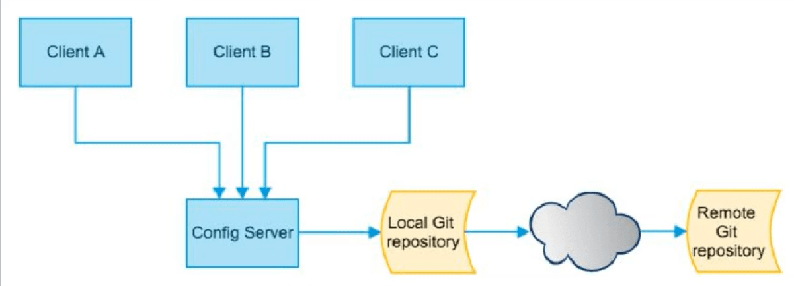

#### 7.1.2、Config配置总控中心搭建

##### 7.1.2.1、springcloud-config远程仓库创建

先在GitHub上创建一个仓库`springcloud-config`， 并拉取到本地。

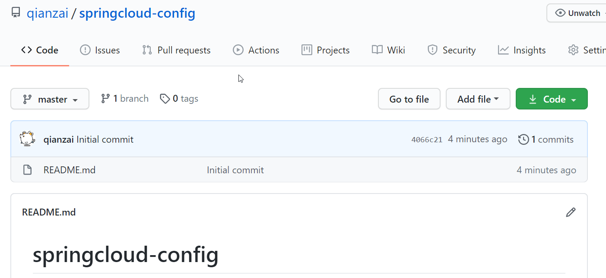


##### 7.1.2.2、新建module，cloud-config-center-3344

`cloud-config-center-3344`

###### 1、改pom

```xml
<dependencies>
    <!--config server-->
    <dependency>
        <groupId>org.springframework.cloud</groupId>
        <artifactId>spring-cloud-config-server</artifactId>
    </dependency>
    <dependency><!-- 引用自己定义的api通用包，可以使用Payment支付Entity -->
        <groupId>ink.bzm.springcloud</groupId>
        <artifactId>cloud-api-commons</artifactId>
        <version>${project.version}</version>
    </dependency>
    <dependency>
        <groupId>org.springframework.boot</groupId>
        <artifactId>spring-boot-starter-web</artifactId>
    </dependency>
    <!--监控-->
    <dependency>
        <groupId>org.springframework.boot</groupId>
        <artifactId>spring-boot-starter-actuator</artifactId>
    </dependency>
    <!--eureka client-->
    <dependency>
        <groupId>org.springframework.cloud</groupId>
        <artifactId>spring-cloud-starter-netflix-eureka-client</artifactId>
    </dependency>
    <!--热部署-->
    <dependency>
        <groupId>org.springframework.boot</groupId>
        <artifactId>spring-boot-devtools</artifactId>
        <scope>runtime</scope>
        <optional>true</optional>
    </dependency>
    <dependency>
        <groupId>org.projectlombok</groupId>
        <artifactId>lombok</artifactId>
        <optional>true</optional>
    </dependency>
    <dependency>
        <groupId>org.springframework.boot</groupId>
        <artifactId>spring-boot-starter-test</artifactId>
        <scope>test</scope>
    </dependency>
</dependencies>
```

###### 2、写yml

`application.yml`

```yaml
server:
  port: 3344

spring:
  application:
    name: cloud-config-center
  cloud:
    config:
      server:
        git:
          #uri: git@github.com/qianzai/springcloud-config.git #Github上的git仓库名字
          uri: https://github.com/qianzai/springcloud-config.git
          ##搜索目录.这个目录指的是github上的目录
          search-paths:
            - springcloud-config
      ##读取分支
      label: master

eureka:
  client:
    service-url:
      defaultZone: http://eureka7001.com:7001/eureka/
```

###### 3、主启动

`ConfigCenterMain3344`

```java
@SpringBootApplication
@EnableConfigServer
public class ConfigCenterMain3344 {

    public static void main(String[] args) {
        SpringApplication.run(ConfigCenterMain3344.class,args);
    }
}
```

###### 4、运行测试

在`GitHub`远程仓库放入文件`config-dev.yml`

```yaml
config:
    info: "master branch,springcloud-config/config-dev.yml version=1"
```

在`GitHub`远程仓库放入文件`config-test.yml`

```yaml
config:
    info: "master branch,springcloud-config/config-test.yml version=1"
```

在`GitHub`远程仓库放入文件`config-prod.yml`

```yaml
config:
    info: "master branch,springcloud-config/config-prod.yml version=1"
```

然后运行项目，访问http://localhost:3344/master/config-dev.yml测试

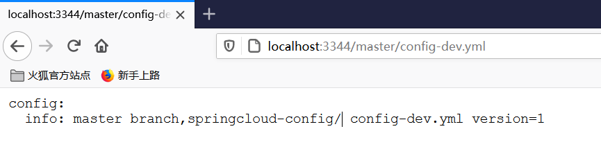

##### 7.1.2.3、微服务从GitHub获取方式

新建一个分支`dev`，并且创建对应的测试`yml`文件


访问master分支的prod：http://localhost:3344/master/config-prod.yml

访问dev分支的prod：http://localhost:3344/dev/config-prod.yml


>   `/{label}-{name}-{profiles}.yml`
>
>   -   label:分支(branch)
>   -   name :服务名
>   -   profiles:环境(dev/test/prod)
>
>   官网一共有五种访问的方式，可以自己去尝试。


访问一个不存在的：http://localhost:3344/master/config-abcd.yml


>   显示为{}

#### 7.1.3、Config客户端配置与测试

##### 7.1.3.1、新建module，cloud-config-client-3355

`cloud-config-client-3355`

###### 1、添加pom依赖

```xml
    <dependencies>
        <dependency>
            <groupId>org.springframework.cloud</groupId>
            <artifactId>spring-cloud-starter-config</artifactId>
        </dependency>
        <!-- 引用自己定义的api通用包，可以使用Payment支付Entity -->
        <dependency>
            <groupId>ink.bzm.springcloud</groupId>
            <artifactId>cloud-api-commons</artifactId>
            <version>${project.version}</version>
        </dependency>
        <dependency>
            <groupId>org.springframework.boot</groupId>
            <artifactId>spring-boot-starter-web</artifactId>
        </dependency>
        <!--eureka client-->
        <dependency>
            <groupId>org.springframework.cloud</groupId>
            <artifactId>spring-cloud-starter-netflix-eureka-client</artifactId>
        </dependency>
        <!--热部署-->
        <dependency>
            <groupId>org.springframework.boot</groupId>
            <artifactId>spring-boot-devtools</artifactId>
            <scope>runtime</scope>
            <optional>true</optional>
        </dependency>
        <dependency>
            <groupId>org.projectlombok</groupId>
            <artifactId>lombok</artifactId>
            <optional>true</optional>
        </dependency>
        <dependency>
            <groupId>org.springframework.boot</groupId>
            <artifactId>spring-boot-starter-test</artifactId>
            <scope>test</scope>
        </dependency>
    </dependencies>
```

###### 2、写yml配置

```yaml
server:
  port: 3355

spring:
  application:
    name: config-client
  cloud:
    #Config客户端配置
    config:
      label: master #分支名称
      name: config #配置文件名称
      profile: prod #读取后缀名称 上诉3个综合就是 master分支上 config-dev.yml
      uri: http://localhost:3344

eureka:
  client:
    service-url:
      defaultZone: http://eureka7001.com:7001/eureka,http://eureka7002.com:7002/eureka    #集群版
```

###### 3、主启动

```java
@SpringBootApplication
@EnableEurekaClient
public class ConfigClientMain3355 {

    public static void main(String[] args) {
        SpringApplication.run(ConfigClientMain3355.class,args);
    }
}
```

###### 4、业务类

>   读取总控中心配置文件

`ConfigClientController`

```java
@RestController
public class ConfigClientController {

    // 因为config仓库以rest形式暴露，所以所有客户端都可以通过config服务端访问到github上对应的文件信息
    @Value("${config.info}")
    private String configInfo;

    @Value("${server.port}")
    private String serverPort;

    @GetMapping("/configInfo")
    public String getConfigInfo() {
        return "serverPort: " + serverPort + "\t\n\n configInfo：" + configInfo;
    }
}
```

###### 5、测试

访问：http://localhost:3355/configInfo


>   成功实现了客户端`3355`访问`SpringCloud Config3344`通过`GitHub`获取配置信息。

#### 7.1.4、Config客户端动态刷新（手动版）

**问题：**

`GitHub`上面的远程仓库配置文件修改后，`ConfigClient`客户端没有任何响应，不能动态的刷新。

###### 1、添加监控actuator依赖

```xml
<!--监控-->
<dependency>
    <groupId>org.springframework.boot</groupId>
    <artifactId>spring-boot-starter-actuator</artifactId>
</dependency>
```

###### 2、添加暴露监控端点yml配置

```yaml
#暴露监控端点
management:
  endpoints:
    web:
      exposure:
        include: "*"
```

###### 3、修改业务类

添加`@RefreshScope`刷新的注解

```java
@RestController
@RefreshScope
public class ConfigClientController {
```

###### 4、测试

1.  启动项目，再访问：http://localhost:3355/configInfo。

2.  成功访问后，修改GitHub的远程仓库测试配置文件。

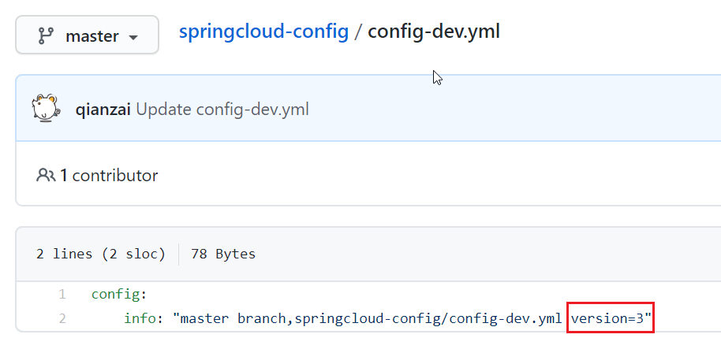

3.  向客户端3355发送post请求刷新3355。

    ```shell
    curl -X POST "http://localhost:3355/actuator/refresh"
    ```

4.  然后查看3355，能不能动态的刷新：http://localhost:3355/configInfo


>   避免了服务重启。


## 8、消息总线

### 8.1、Bus 详解

#### 8.1.1、Bus 简介

`Spring Cloud Bus` 使用轻量级的消息代理来连接微服务架构中的各个服务，可以将其用于广播状态更改（例如配置中心配置更改）或其他管理指令。

>   在微服务架构的系统中，通常会使用轻量级的消息代理来构建一个共用的消息主题，并让系统中所有微服务实例都连接上来。由于该主题中产生的消息会被所有实例监听和消费，所以称它为消息总线。
>
>   `Bus支持两种消息代理:RabbitMQ和Kafka。`

#### 8.1.2、Bus 原理

`ConfigClient`实例都监听MQ中同一个`topic`(默认是`springCloudBus`)。当一个服务刷新数据的时候，它会把这个信息放入到`Topic`中，这样其它监听同一`Topic`的服务就能得到通知，然后去更新自身的配置。

#### 8.1.3、RabbitMQ环境搭建

>   使用Bus需要选择一种消息代理，本次选择的为RabbitMQ，为了方便使用docker部署。

```shell
$ docker run --name rabbitmq -d -p 15672:15672 -p 5672:5672 rabbitmq:3.7.7-management
# 账号密码为：guest guest
```

#### 8.1.4、Bus动态全局刷新

##### 8.1.4.1、新建3366项目

新建`cloud-config-client-3366`项目

###### 1、添加pom依赖

```xml
<dependencies>
    <dependency>
        <groupId>org.springframework.cloud</groupId>
        <artifactId>spring-cloud-starter-config</artifactId>
    </dependency>
    <!-- 引用自己定义的api通用包，可以使用Payment支付Entity -->
    <dependency>
        <groupId>ink.bzm.springcloud</groupId>
        <artifactId>cloud-api-commons</artifactId>
        <version>${project.version}</version>
    </dependency>
    <dependency>
        <groupId>org.springframework.boot</groupId>
        <artifactId>spring-boot-starter-web</artifactId>
    </dependency>
    <!--监控-->
    <dependency>
        <groupId>org.springframework.boot</groupId>
        <artifactId>spring-boot-starter-actuator</artifactId>
    </dependency>
    <!--eureka client-->
    <dependency>
        <groupId>org.springframework.cloud</groupId>
        <artifactId>spring-cloud-starter-netflix-eureka-client</artifactId>
    </dependency>
    <!--热部署-->
    <dependency>
        <groupId>org.springframework.boot</groupId>
        <artifactId>spring-boot-devtools</artifactId>
        <scope>runtime</scope>
        <optional>true</optional>
    </dependency>
    <dependency>
        <groupId>org.projectlombok</groupId>
        <artifactId>lombok</artifactId>
        <optional>true</optional>
    </dependency>
    <dependency>
        <groupId>org.springframework.boot</groupId>
        <artifactId>spring-boot-starter-test</artifactId>
        <scope>test</scope>
    </dependency>
</dependencies>
```

###### 2、添加yml配置

```yaml
server:
  port: 3366

spring:
  application:
    name: config-client
  cloud:
    #Config客户端配置
    config:
      label: master #分支名称
      name: config #配置文件名称
      profile: dev #读取后缀名称 上诉3个综合就是 master分支上 config-dev.yml
      uri: http://localhost:3344

eureka:
  client:
    service-url:
      defaultZone: http://eureka7001.com:7001/eureka,http://eureka7002.com:7002/eureka    #集群版
```

###### 3、主启动

```java
@SpringBootApplication
@EnableEurekaClient
public class ConfigClientMain3366 {

    public static void main(String[] args) {
        SpringApplication.run(ConfigClientMain3366.class,args);
    }
}
```

##### 8.1.4.2、添加对应依赖配置

###### 添加消息总线依赖

分别给`3344`，`3355`，`3366`添加消息总线`RabbitMQ`支持

```xml
<!-- 添加消息总线RabbitMQ支持 -->
<dependency>
    <groupId>org.springframework.cloud</groupId>
    <artifactId>spring-cloud-starter-bus-amqp</artifactId>
</dependency>
```

###### 添加对应的yml配置

`3344`

```yaml
#rabbit相关配置 15672是web管理界面的端口，5672是MQ访问的端口
  rabbitmq:
    host: 192.168.200.40
    port: 5672
    username: guest
    password: guest

#rabbitmq相关设置 ，暴露 bus刷新配置的端点
management:
  endpoints:
    web:
      exposure:
        include: 'bus-refresh'
```

`3355`，`3366`

```yaml
#rabbit相关配置 15672是web管理界面的端口，5672是MQ访问的端口
  rabbitmq:
    host: 192.168.200.40
    port: 5672
    username: guest
    password: guest

#暴露监控端点
management:
  endpoints:
    web:
      exposure:
        include: "*"
```

##### 8.1.4.3、测试

启动项目7001,7002,3344,3355,3366。

>   刷新下maven，然后7001,7002启动，再3344，最后3355和3366。否则可能运行报错。

访问：

-   http://localhost:3344/master/config-dev.yml
-   http://localhost:3355/configInfo
-   http://localhost:3366/configInfo

可以看到他们`version`都为3。

修改GitHub的远程仓库测试配置文件

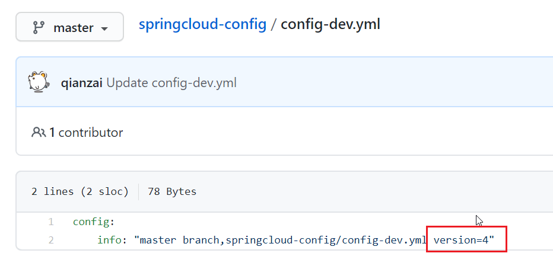

向配置总控中心3344发送post请求刷新。

```shell
$ curl -X POST "http://localhost:3344/actuator/bus-refresh"
```

然后再访问客户端3355,3366。

-   http://localhost:3355/configInfo
-   http://localhost:3366/configInfo

>   —次修改，广播通知，处处生效


#### 8.1.5、Bus动态刷新定点刷新

http://localhost:配置中心的端口号/actuator/bus-refresh/{destination}

只通知3355，不通知3366

```shell
$ curl -X POST "http://localhost:3344/actuator/bus-refresh/config-client:3355"
```

测试

http://localhost:3355/configInfo


http://localhost:3366/configInfo


>   3355刷了配置，3366没有刷新。

## 9、消息驱动

### 9.1、Stream详解

#### 9.1.1、Stream简介

Spring Cloud Stream 是一个构建消息驱动微服务的框架。应用程序通过 **inputs** 或者 **outputs** 来与 Spring Cloud Stream 中**binder** 交互，通过我们配置来 binding ，而 Spring Cloud Stream 的 binder 负责与消息中间件交互。所以只需要搞清楚如何与 Spring Cloud Stream 交互就可以方便使用消息驱动的方式。 通过使用Spring Integration来连接消息代理中间件以实现消息事件驱动。Spring Cloud Stream 为一些供应商的消息中间件产品提供了个性化的自动化配置实现，引用了发布-订阅、消费组、分区的三个核心概念。

>   屏蔽底层消息中间件的差异,降低切换成本，统一消息的编程模型

#### 9.1.2、Stream核心概念

Binder

>   很方便的连接中间件，屏蔽差异

Channel

>   通道，是队列Queue的一种抽象，在消息通讯系统中就是实现存储和转发的媒介，通过Channel对队列进行配置

Source和Sink

>   简单的可理解为参照对象是Spring Cloud Stream自身，从Stream发布消息就是输出，接受消息就是输入。


| 组成            | 说明                                                         |
| --------------- | :----------------------------------------------------------- |
| Middleware      | 中间件，目前只支持RabbitMQ和Kafka                            |
| Binder          | Binder是应用与消息中间件之间的封装，目前实行了Kafka和RabbitMQ的Binder，通过Binder可以很方便的连接中间件，可以动态的改变消息类型(对应于Kafka的topic，RabbitMQ的exchange)，这些都可以通过配置文件来实现 |
| @Input          | 注解标识输入通道，通过该输入通道接收到的消息进入应用程序     |
| @Output         | 注解标识输出通道，发布的消息将通过该通道离开应用程序         |
| @StreamListener | 监听队列，用于消费者的队列的消息接收                         |
| @EnableBinding  | 指信道channel和exchange绑定在一起                            |

#### 9.1.3、消息驱动之生产者

新建`cloud-stream-rabbitmq-provider8801`模块

###### 1、添加pom依赖

```xml
<dependencies>
    <dependency>
        <groupId>org.springframework.boot</groupId>
        <artifactId>spring-boot-starter-web</artifactId>
    </dependency>
    <!--监控-->
    <dependency>
        <groupId>org.springframework.boot</groupId>
        <artifactId>spring-boot-starter-actuator</artifactId>
    </dependency>
    <!--eureka client-->
    <dependency>
        <groupId>org.springframework.cloud</groupId>
        <artifactId>spring-cloud-starter-netflix-eureka-client</artifactId>
    </dependency>
    <!--stream rabbit -->
    <dependency>
        <groupId>org.springframework.cloud</groupId>
        <artifactId>spring-cloud-starter-stream-rabbit</artifactId>
    </dependency>
    <!--热部署-->
    <dependency>
        <groupId>org.springframework.boot</groupId>
        <artifactId>spring-boot-devtools</artifactId>
        <scope>runtime</scope>
        <optional>true</optional>
    </dependency>
    <dependency>
        <groupId>org.projectlombok</groupId>
        <artifactId>lombok</artifactId>
        <optional>true</optional>
    </dependency>
    <dependency>
        <groupId>org.springframework.boot</groupId>
        <artifactId>spring-boot-starter-test</artifactId>
        <scope>test</scope>
    </dependency>
</dependencies>
```

###### 2、写yml配置

`application.yml`

```yaml
server:
  port: 8801

spring:
  application:
    name: cloud-stream-provider
  cloud:
    stream:
      binders: #在此处配置要绑定的rabbitmq的服务信息
        defaultRabbit: #表示定义的名称，用于binding整合
          type: rabbit #消息组件类型
          environment: #设置rabbitmq的相关环境配置
            spring:
              rabbitmq:
                host: 192.168.200.40
                port: 5672
                username: guest
                password: guest
      bindings: #服务的整合处理
        output: #这个名字是一个通道的名称
          destination: studyExchange #表示要使用的Exchange名称定义
          content-type: application/json #设置消息类型，本次为json，本文要设置为“text/plain”
          binder: defaultRabbit #设置要绑定的消息服务的具体设置

eureka:
  client:
    service-url:
      defaultZone: http://eureka7001.com:7001/eureka,http://eureka7002.com:7002/eureka    #集群版

  instance:
    lease-renewal-interval-in-seconds: 2 #设置心跳的时间间隔（默认是30S)
    lease-expiration-duration-in-seconds: 5 #如果超过5S间隔就注销节点 默认是90s
    instance-id: send-8801.com #在信息列表时显示主机名称
    prefer-ip-address: true #访问的路径变为IP地址
```

###### 3、编写主启动

`StreamMQMain8801`

```java
@SpringBootApplication
public class StreamMQMain8801 {

    public static void main(String[] args) {
        SpringApplication.run(StreamMQMain8801.class,args);
    }
}
```

###### 4、业务类

`IMessageProvider`接口

```java
public interface IMessageProvider {
    public String send();
}
```

`MessageProviderImpl`实现类

```java
@EnableBinding(Source.class) //定义消息的推送管道
public class MessageProviderImpl implements IMessageProvider {

    @Resource
    private MessageChannel output; // 消息发送管道

    @Override
    public String send() {
        String serial = UUID.randomUUID().toString();
        output.send(MessageBuilder.withPayload(serial).build());
        System.out.println("*****serial: "  +serial);
        return null;
    }
}
```

`SendMessageController`控制器

```java
@RestController
public class SendMessageController {

    @Resource
    private IMessageProvider messageProvider;

    @GetMapping("/sendMessage")
    public String sendMessage() {
        return messageProvider.send();
    }
}
```

###### 5、测试

登入`rabbitmq`，查看`Exchanges` 中studyExchange是否存在


访问http://localhost:8801/sendMessage，查看后台。

 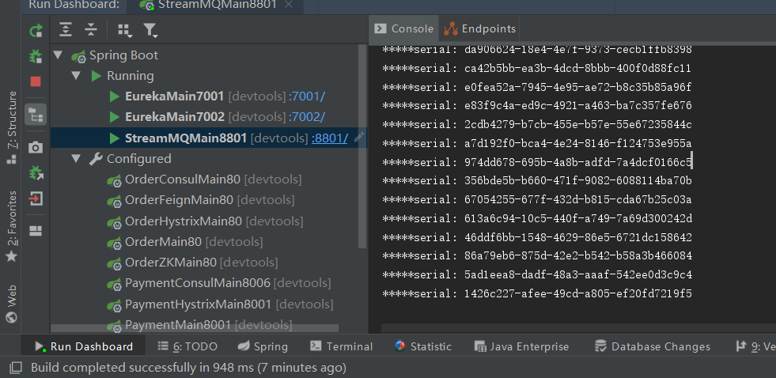

查看最后消息发送率

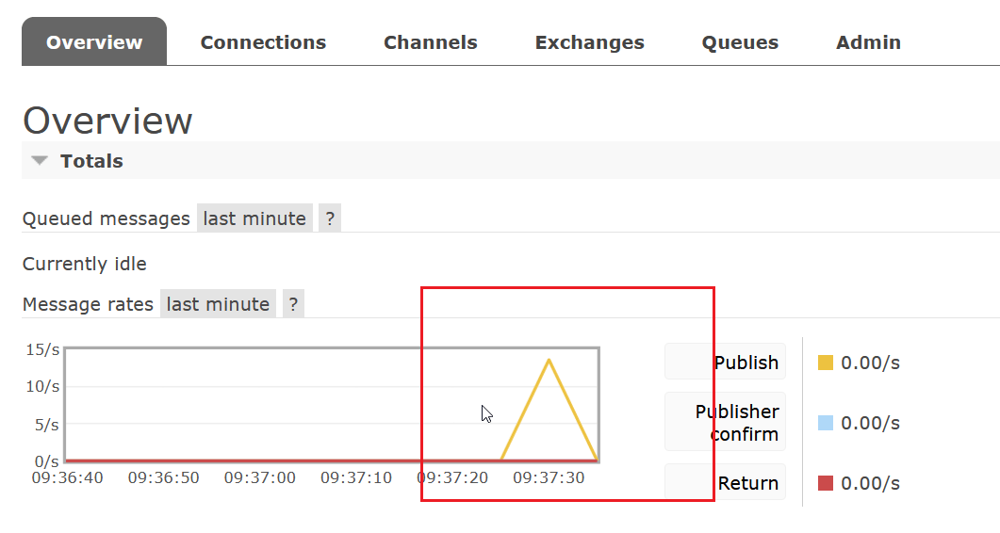

#### 9.1.4、消息驱动之消费者

新建`cloud-stream-rabbitmq-consumer8802`模块

###### 1、添加pom依赖

```xml
<dependencies>
    <dependency>
        <groupId>org.springframework.boot</groupId>
        <artifactId>spring-boot-starter-web</artifactId>
    </dependency>
    <!--监控-->
    <dependency>
        <groupId>org.springframework.boot</groupId>
        <artifactId>spring-boot-starter-actuator</artifactId>
    </dependency>
    <!--eureka client-->
    <dependency>
        <groupId>org.springframework.cloud</groupId>
        <artifactId>spring-cloud-starter-netflix-eureka-client</artifactId>
    </dependency>
    <!--stream rabbit -->
    <dependency>
        <groupId>org.springframework.cloud</groupId>
        <artifactId>spring-cloud-starter-stream-rabbit</artifactId>
    </dependency>
    <!--热部署-->
    <dependency>
        <groupId>org.springframework.boot</groupId>
        <artifactId>spring-boot-devtools</artifactId>
        <scope>runtime</scope>
        <optional>true</optional>
    </dependency>
    <dependency>
        <groupId>org.projectlombok</groupId>
        <artifactId>lombok</artifactId>
        <optional>true</optional>
    </dependency>
    <dependency>
        <groupId>org.springframework.boot</groupId>
        <artifactId>spring-boot-starter-test</artifactId>
        <scope>test</scope>
    </dependency>
</dependencies>
```

###### 2、写yml配置

`application.yml`

```yaml
server:
  port: 8802

spring:
  application:
    name: cloud-stream-consumer
  cloud:
    stream:
      binders: #在此处配置要绑定的rabbitmq的服务信息
        defaultRabbit: #表示定义的名称，用于binding整合
          type: rabbit #消息组件类型
          environment: #设置rabbitmq的相关环境配置
            spring:
              rabbitmq:
                host: 192.168.200.40
                port: 5672
                username: guest
                password: guest
      bindings: #服务的整合处理
        input: #这个名字是一个通道的名称
          destination: studyExchange #表示要使用的Exchange名称定义
          content-type: application/json #设置消息类型，本次为json，本文要设置为“text/plain”
          binder: defaultRabbit #设置要绑定的消息服务的具体设置

eureka:
  client:
    service-url:
      defaultZone: http://eureka7001.com:7001/eureka,http://eureka7002.com:7002/eureka    #集群版

  instance:
    lease-renewal-interval-in-seconds: 2 #设置心跳的时间间隔（默认是30S)
    lease-expiration-duration-in-seconds: 5 #如果超过5S间隔就注销节点 默认是90s
    instance-id: receive-8802.com #在信息列表时显示主机名称
    prefer-ip-address: true #访问的路径变为IP地址
```

###### 3、主启动

`StreamMQMain8802`

```java
@SpringBootApplication
public class StreamMQMain8802 {

    public static void main(String[] args) {
        SpringApplication.run(StreamMQMain8802.class,args);
    }
}
```

###### 4、业务类

`ReceiverMessageListenerController`

```java
@Component
@EnableBinding(Sink.class)
public class ReceiverMessageListenerController {

    @Value("${server.port}")
    private  String serverPort;

    @StreamListener(Sink.INPUT)
    public void input(Message<String> message) {
        System.out.println("消费者1号， -----> 接受到的消息： " + message.getPayload()
                + "\t port: " + serverPort);
    }
}
```

###### 5、测试

启动7001,7002,8801,8802，访问http://localhost:8801/sendMessage，8801发出消息，8802接收消息，控制台打出流水号。


#### 9.1.5、分组消费与持久化

再建立一个消费者8803：clone一个8802

`cloud-stream-rabbitmq-consumer8803`

然后运行，在Eureka查看。


>   然后会发现两个问题：
>
>   -   重复消费
>   -   持久化

##### 8.2.5.1、分组消费

>   重复消费原因：不同的组是可以重复消费的，同一个组内会发生竞争关系，只有其中一个可以消费。

放在同一个组，解决重复消费

8802,8803的yml配置文件添加组配置

```yaml
spring:
  cloud:
    stream:
      bindings: #服务的整合处理
          group: BzmA
```

访问：http://localhost:8801/sendMessage，可以发现同一个组的多个微服务实例，每次只有一个被拿到。

##### 8.2.5.2、持久化

在没有配置组的情况下，在消费端宕机以后，重新启动是哪不到未消费的消息的；配置组之后即可。

## 10、链路追踪

微服务架构是一个分布式架构，它按业务划分服务单元，一个分布式系统往往有很多个服务单元。由于服务单元数量众多，业务的复杂性，如果出现了错误和异常，很难去定位。主要体现在，一个请求可能需要调用很多个服务，而内部服务的调用复杂性，决定了问题难以定位。所以微服务架构中，必须实现分布式链路追踪，去跟进一个请求到底有哪些服务参与，参与的顺序又是怎样的，从而达到每个请求的步骤清晰可见，出了问题，很快定位。

### 10.1、Sleuth详解

#### 10.1.1、Sleuth之zipkin搭建安装

[zipkin下载地址](https://dl.bintray.com/openzipkin/maven/io/zipkin/java/zipkin-server/)

` java -jar zipkin-server-2.12.9-exec.jar`运行

http://127.0.0.1:9411/zipkin/

#### 10.1.2、Sleuth链路监控展示

###### 1、服务端

服务提供者`cloud-provider-payment8001`

添加`sleuth zipkin`的`pom`依赖

```xml
<!-- 包含了sleuth zipkin 数据链路追踪-->
<dependency>
    <groupId>org.springframework.cloud</groupId>
    <artifactId>spring-cloud-starter-zipkin</artifactId>
</dependency>
```

增加`zipkin，sleuth`的`yml`配置

```yaml
spring:
  zipkin:
    base-url: http://localhost:9411
  sleuth:
    sampler:
      #采样取值介于 0到1之间，1则表示全部收集
      probability: 1
```

`PaymentController`增加`paymentZipkin()`方法

```java
@GetMapping(value="/payment/zipkin")
public String paymentZipkin() {
    return "hello,i am paymentZipkin server fallback,O(∩_∩)O哈哈~";
}
```

###### 2、消费端

服务消费者`cloud-consumer-order80`

添加`sleuth zipkin`的`pom`依赖

```xml
<!-- 包含了sleuth zipkin 数据链路追踪-->
<dependency>
    <groupId>org.springframework.cloud</groupId>
    <artifactId>spring-cloud-starter-zipkin</artifactId>
</dependency>
```

增加`zipkin，sleuth`的`yml`配置

```yaml
spring:
  zipkin:
    base-url: http://localhost:9411
  sleuth:
    sampler:
      #采样取值介于 0到1之间，1则表示全部收集
      probability: 1
```

`OrderController`增加`paymentZipkin()`方法

```java
@GetMapping(value="/consumer/payment/zipkin")
public String paymentZipkin() {
    return restTemplate.getForObject( "http://localhost:8001/payment/zipkin/",String.class);
}
```

###### 3、测试

访问：http://localhost/consumer/payment/zipkin

然后在9411查看链路追踪效果。


>   查找到的链路信息


>   调用关系，服务数量，深度，耗时


>   依赖图


## 未完成

-   [3.1.14、Eureka停更说明](#3.1.14、Eureka停更说明)
-   [4.1.6、Ribbon负载规则原理](#4.1.6、Ribbon负载规则原理)
-   [5.1.9、Hystrix图形化Dashboard搭建](#5.1.9、Hystrix图形化Dashboard搭建)
-   [6.1.7.2、gateway filter与global filter](#6.1.7.2、gateway filter与global filter)

 