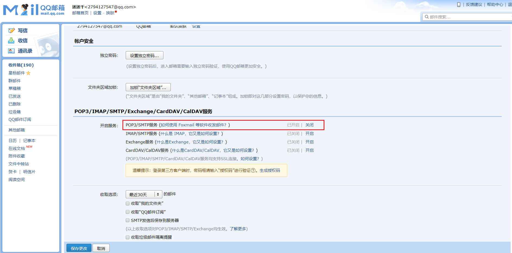
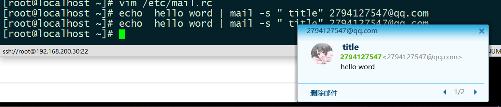

# Linux发送邮件mail

## 配置收件邮箱

开启`POP3/SMTP`服务




## 安装mail

```shell
yum install -y mailx
```

修改`mail.rc`配置文件()在尾部添加

```shell
vim /etc/mail.rc

set from=123456@qq.com
set smtp=smtp.qq.com  
set smtp-auth-user=123456
set smtp-auth-password=(认证信息)
set smtp-auth=login 
```

## 测试

```shell
echo  hello word | mail -s " title" 2794127547@qq.com  
```



> 确保配置无误后，如果仍然还不能发送成功，**关闭本机的sendmail服务或者postfix服务**
>
> ```shell
> systemctl stop sendmail 
> systemctl disable sendmail 
> 
> systemctl stop postfix.service 
> systemctl disable postfix.service 
> ```

[阿里云服务器发送mail](https://yq.aliyun.com/articles/644134)

