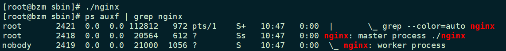
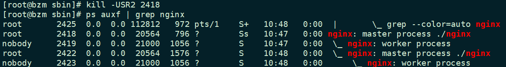
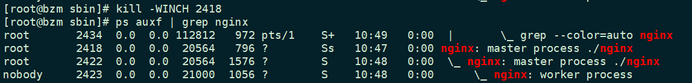
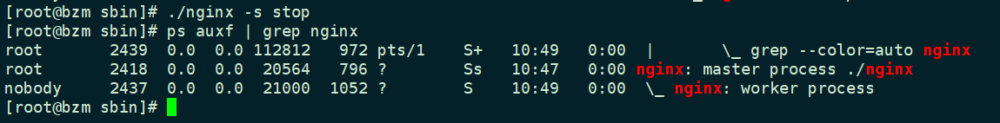

# Nginx信号集

在之前Nginx中，简单介绍了Nginx的常用操作

我们有两种方式来向 master 进程发送信号：

- 通过 `kill `命令手动发送。

- 通过 `nginx -s signal` 来操作

## 通过kill命令

原理是，产生一个新进程，该进程通过 `nginx.pid` 文件得到 master 进程的 pid，然后把对应的信号发送到 master，之后退出，这种进程被称为 signaller。

## 通过 nginx -s signal

了解 `nginx -s signal` 到真实信号的映射

| operation  | signal                       |
| ---------- | ---------------------------- |
| reload     | SIGHUP                       |
| reopen     | SIGUSR1                      |
| stop       | SIGTERM                      |
| quit       | SIGQUIT                      |
| hot update | SIGUSR2 & SIGWINCH & SIGQUIT |

### stop vs quit

stop 发送 SIGTERM 信号，表示要求强制退出，quit 发送 `SIGQUIT`，表示优雅地退出。具体区别在于，worker 进程在收到 `SIGQUIT` 消息（注意不是直接发送信号，所以这里用消息替代）后，会关闭监听的套接字，关闭当前空闲的连接（可以被抢占的连接），然后提前处理所有的定时器事件，最后退出。没有特殊情况，都应该使用 quit 而不是 stop。

### reload

master 进程收到 `SIGHUP` 后，会重新进行配置文件解析、共享内存申请，等一系列其他的工作，然后产生一批新的 worker 进程，最后向旧的 worker 进程发送 `SIGQUIT` 对应的消息，最终无缝实现了重启操作。

### reopen

master 进程收到 `SIGUSR1` 后，会重新打开所有已经打开的文件（比如日志），然后向每个 worker 进程发送 `SIGUSR1` 信息，worker 进程收到信号后，会执行同样的操作。reopen 可用于日志切割。

**NGINX 官方就提供了一个方案**

```bash
$ mv access.log access.log.0
$ kill -USR1 `cat master.nginx.pid` # 重新打开日志文件
$ sleep 1
$ gzip access.log.0    # do something with access.log.0
```

> 这里 `sleep 1` 是必须的，因为在 master 进程向 worker 进程发送 `SIGUSR1` 消息到 worker 进程真正重新打开 `access.log` 之间，有一段时间窗口，此时 worker 进程还是向文件 `access.log.0` 里写入日志的。通过 sleep 1s，保证了 `access.log.0` 日志信息的完整性（如果没有 sleep 而直接进行压缩，很有可能出现日志丢失的情况）。

### hot update

- 首先需要给当前的 master 进程发送 `SIGUSR2`，之后 master 会重命名 `nginx.pid` 到 `nginx.pid.oldbin`，然后 fork 一个新的进程，新进程会通过 `execve` 这个系统调用，使用新的 nginx ELF 文件替换当前的进程映像，成为新的 master 进程。新 master 进程起来之后，就会进行配置文件解析等操作，然后 fork 出新的 worker 进程开始工作。

- 接着我们向旧的 master 发送 `SIGWINCH` 信号，然后旧的 master 进程则会向它的 worker 进程发送 `SIGQUIT` 信息，从而使得 worker 进程退出。向 master 进程发送 `SIGWINCH` 和 `SIGQUIT` 都会使得 worker 进程退出，但是前者不会使得 master 进程也退出。

- 最后，如果我们觉得旧的 master 进程使命完成，就可以向它发送 `SIGQUIT` 信号，让其退出了。


## 问题：

### Nginx热更新

首先启动Nginx

```bash
./nginx
```

```bash
ps auxf | grep nginx
```



> 可以看到 master 和 worker 都已经在运行。

接着我们向 master 发送一个 `SIGUSR2` 信号，当 nginx 核心收到这个信号后，就会触发热更新。

```bash
kill -USR2 2418
```



可以看到新的 master 和该 master fork 出来的 worker 已经在运行了，此时我们接着向旧 master 发送一个 `SIGWINCH` 信号，旧 master 收到这个信号后，会向它的 worker 发送 `SIGQUIT`，于是旧 master 的 worker 进程就会退出：

```bash
kill -WINCH 2418
```



> 此时只剩下旧的 master，新的 master 和新 master 的 worker 在运行

接着使用 stop 命令

```bash
./nginx -s stop
```



> 会发现，新的 master 和它的 worker 都已经退出，而旧的 master 还在运行，并产生了 worker 出来！！！


