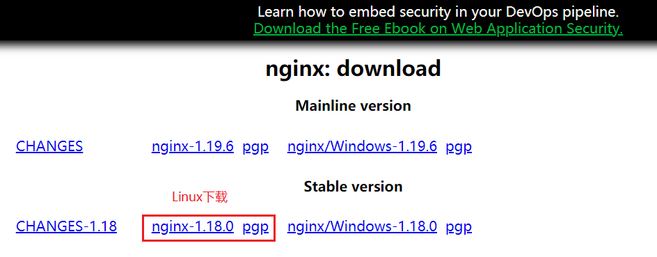
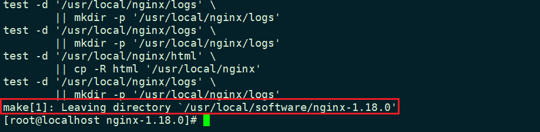
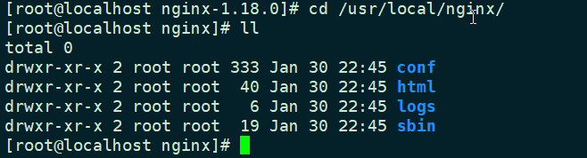
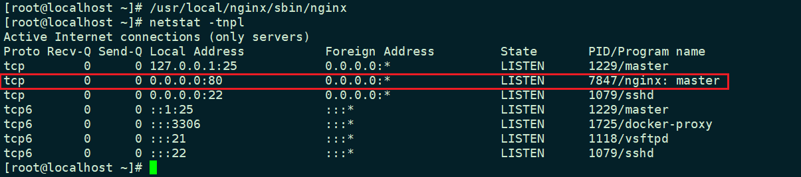
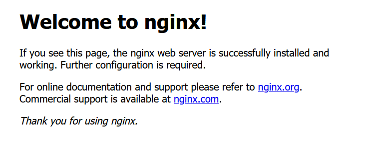
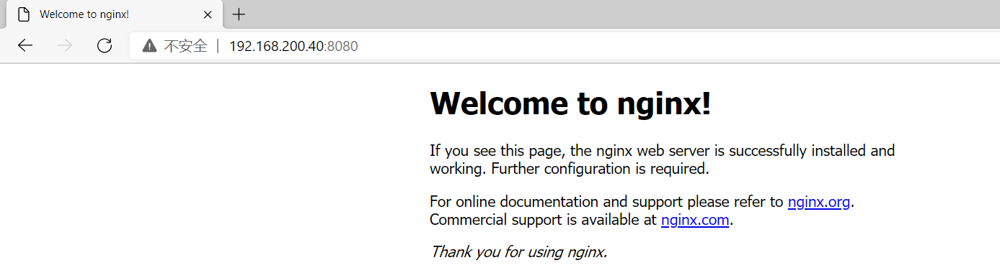
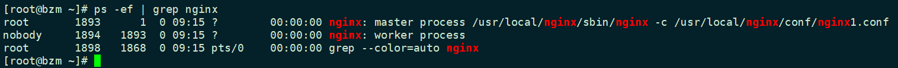

# Nginx入门

## 为什么需要Nginx

刚开始时候，项目并发非常小，直接访问应用服务器（如Tomcat），处理后将信息返回给用户即可。


当项目的并发需要开始增大时候，一个应用服务器，满足不了此时的业务需求，可能就需要增加应用服务器。

> 如横向扩展？？


## Nginx简介

Nginx (engine x) 是一个高性能的HTTP和反向代理web服务器,是一款轻量级的Web 服务器/反向代理服务器及电子邮件（IMAP/POP3）代理服务器.其特点是占有内存少，并发能力强，

## Nginx 部署

Nginx有两个网站，一个是[nginx.com](https://www.nginx.com/)另一个是[nginx.org](https://nginx.org/en/)，org是免费开源的`Nginx`。

> 访问[Nginx下载界面](http://nginx.org/en/download.html)

**安装Nginx 需要的库**

```bash
yum install gcc openssl openssl-devel pcre pcre-devel zlib zlib-devel -y
```

### yum安装

添加Nginx的源

```bash
sudo rpm -Uvh http://nginx.org/packages/centos/7/noarch/RPMS/nginx-release-centos-7-0.el7.ngx.noarch.rpm
```

安装Nginx

```bash
sudo yum install -y nginx
```

### 源码安装

下载Nginx



```bash
wget http://nginx.org/download/nginx-1.18.0.tar.gz
```

解压下载的`nginx`文件

```bash
tar -zxvf nginx-1.18.0.tar.gz -C /usr/local/software
```

切换至`nginx`解压后的目录

```bash
cd /usr/local/software/nginx-1.18.0/
```

在`nginx`解压后的`目录`中执行

```bash
./configure --prefix=/usr/local/nginx
```

> --prefix=/usr/local/nginx指定配置安装路径

使用make进行编译安装

```bash
make
```

```bash
make install
```



查看安装目录中的目录结构



`conf`：`Nginx`的主要配置目录，其中`nginx.conf`文件是`nginx`的默认主要配置文件

`html`: `Nginx`的默认静态目录，里面有两个文件`index.html`和`50x.html`

`logs`: `Nginx`的默认日志目录

`sbin`: `Nginx`程序的二进制启动程序目录

## Nginx 常规操作

### 启动

**直接启动**

```bash
/usr/local/nginx/sbin/nginx
```



> Nginx是默认使用80 端口

浏览器访问：  主机IP



**通过配置文件启动，根据配置文件中的配置启动Nginx**

> 可以拷贝一份Nginx的配置文件，修改他的端口为8080

```bash
/usr/local/nginx/sbin/nginx -c /usr/local/nginx/conf/nginx1.conf
```



可以查看他的进程

```bash
ps -ef | grep nginx
```



> 可以看到`nginx`包含了两个进程，`master`和`worker`进程

- `master`用来加在配置文件和维护`worker`进程

- `worker`进程用来真正处理用户的请求，注意上面的worker进程使用的是nobody用户

### 关闭

优雅的关闭

```bash
kill -QUIT master的PID
```

```bash
./nginx -s quit
```

快速的关闭

```bash
kill -TERM master进程的pid
```

```bash
./nginx -s stop
```

> 慎用 `nginx -s stop`，尽可能使用 `nginx -s quit`

### 重启

重新加载配置文件

```bash
./nginx -s reload
```

重新打开所有已经打开的文件（比如日志）

```bash
./nginx -s reopen
```

## Nginx的配置文件

### nginx.conf

#### 基本配置

```nginx
#user  nobody; # 配置worker进程运行用户，默认使用nobody用户
worker_processes  1; # 配置工作进程数目，根据硬件调整，通常等于CPU数量或者2倍于CPU数量
# 配置全局错误日志及类型，【debug | info | notice | warn |error |crit】
#error_log  logs/error.log;
#error_log  logs/error.log  notice;
#error_log  logs/error.log  info;

#pid        logs/nginx.pid; # 配置进程pid文件
```

#### events配置

```nginx
# 配置工作模式和连接数
events {
    # use epoll; # 优化参数
    # 配置每个worker进程连接数上限
    # nginx支持的总连接数等于 worker_processes * worker_connections
    worker_connections  1024;
}
```

#### http配置

```nginx
# 配置http服务器，利用它的反向代理功能提供负载均衡支持
http {
    # 配置nginx支持哪些多媒体类型，可以在conf/mime.types查看支持哪些多媒体类型
    include       mime.types;
    # 默认文件类型，application/octet-stream基本支持所有的文件
    default_type  application/octet-stream;

    # 配置日志格式
    #log_format  main  '$remote_addr - $remote_user [$time_local] "$request" '
    #                  '$status $body_bytes_sent "$http_referer" '
    #                  '"$http_user_agent" "$http_x_forwarded_for"';

    # 配置access.log日志及存放路径，并使用上面定义的main日志格式
    #access_log  logs/access.log  main;

    sendfile        on; # 开启高效文件传输模式
    #tcp_nopush     on; # 防止网络阻塞

    #keepalive_timeout  0;
    # 长连接超时时间，单位是秒
    keepalive_timeout  65;

    # 开启gzip压缩输出
    #gzip  on;

    # 配置虚拟主机
    server {
        # 配置监听端口
        listen       80;
        # 配置服务名
        server_name  localhost;

        # 配置字符集
        #charset koi8-r;

        # 配置本虚拟主机的访问日志
        #access_log  logs/host.access.log  main;

        # 默认的斜杠/（比如说www.m.com）的请求，当访问路径中有斜杠/，会被该location匹配到并进行处理
        location / {
            # root是配置服务器的默认网站根目录位置，默认为nginx安装目录下的html目录
            root   html;
            # 配置首页文件的名称
            index  index.html index.htm;
        }

        # 配置404页面
        #error_page  404              /404.html;

        # redirect server error pages to the static page /50x.html
        #
        error_page   500 502 503 504  /50x.html; # 配置50x错误页面
        location = /50x.html {
            root   html;
        }

        # PHP脚本请求全部转发到Apache处理
        # proxy the PHP scripts to Apache listening on 127.0.0.1:80
        #
        #location ~ \.php$ {
        #    proxy_pass   http://127.0.0.1;
        #}

        # PHP脚本请求全部转发到FastCGI处理
        # pass the PHP scripts to FastCGI server listening on 127.0.0.1:9000
        #
        #location ~ \.php$ {
        #    root           html;
        #    fastcgi_pass   127.0.0.1:9000;
        #    fastcgi_index  index.php;
        #    fastcgi_param  SCRIPT_FILENAME  /scripts$fastcgi_script_name;
        #    include        fastcgi_params;
        #}

        # 禁止访问 .htaccess 文件
        # deny access to .htaccess files, if Apache's document root
        # concurs with nginx's one
        #
        #location ~ /\.ht {
        #    deny  all;
        #}
    }

    # 配置另一个虚拟主机
    # another virtual host using mix of IP-, name-, and port-based configuration
    #
    #server {
    #    listen       8000;
    #    listen       somename:8080;
    #    server_name  somename  alias  another.alias;

    #    location / {
    #        root   html;
    #        index  index.html index.htm;
    #    }
    #}


    # 配置HTTPS服务
    # HTTPS server
    #
    #server {
    #    listen       443 ssl;
    #    server_name  localhost;

    #    ssl_certificate      cert.pem;
    #    ssl_certificate_key  cert.key;

    #    ssl_session_cache    shared:SSL:1m;
    #    ssl_session_timeout  5m;

    #    ssl_ciphers  HIGH:!aNULL:!MD5;
    #    ssl_prefer_server_ciphers  on;

    #    location / {
    #        root   html;
    #        index  index.html index.htm;
    #    }
    #}

}
```

## Nginx 主要应用

### 负载均衡

首先在Nginx 服务器的两个端口，弄一个简单的Web服务~然后增加Nginx的负载配置

```nginx
...

http {

	,,,
    
    # 负载均衡配置   
    upstream  hello{
		server 127.0.0.1:8081;
		server 127.0.0.1:8082;
	}

    server {
		...
        location / {
			...
			proxy_pass http://hello;
        }

   		...
        }

       ...
       ...
```

- `upstream`模块：一个反向代理组，Nginx会根据配置，将请求按照一定的规则，进行分发
- `upstream`下的`server`：处理请求服务器的IP地址和端口，不配置默认80
- `proxy_pass http://hello`：将该地址（/）的请求，转发到hello组中


> F5 刷新效果

### 动静分离

所有的静态资源使用`nginx`处理，不使用`tomcat`处理


### 虚拟主机

