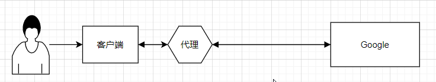
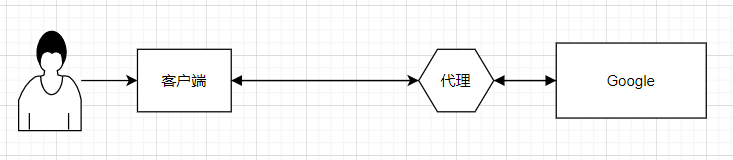

# 正向代理与反向代理

## 正向代理

正向代理类似一个跳板机，代理访问外部资源。比如，国内访问国外的网络速度是十分不理想的，访问google更是不能，这时候我们就需要一个代理，访问那个代理服务器，那个代理访问可以访问我不能访问的网站。

> 我先连上代理服务器,告诉他我需要那个无法访问网站的内容，代理服务器去取回来,然后返回给我。

### 用途：

- 访问原来无法访问的资源，如google
- 可以做缓存，加速访问资源
- 代理可以记录用户访问记录（上网行为管理），对外隐藏用户信息

## 反向代理

反向代理（Reverse Proxy）实际运行方式是指以代理服务器来接受internet上的连接请求，然后将请求转发给内部网络上的服务器，并将从服务器上得到的结果返回给internet上请求连接的客户端，此时代理服务器对外就表现为一个服务器。

### 用途：

- 保证内网的安全，可以使用反向代理提供WAF功能，阻止web攻击

- 负载均衡，通过反向代理服务器来优化网站的负载

  