# Redis

!> [源码地址](https://gitee.com/BuZM/Redis)：https://gitee.com/BuZM/Redis

## 1、 Nosql

### 1.1、为什么要使用Nosql

>   在 90 年代，一个网站的访问量一般都不大，用单个数据库完全可以轻松应付。

后来，随着访问量的上升，几乎大部分使用 `MySQL `架构的网站在数据库上都开始出现了性能问题

1.  数据量的总大小一个机器放不下时。
2.  数据的索引（`B+ Tree`）一个机器的内存放不下时。
3.  访问量(读写混合)一个实例不能承受。

`用户的个人信息,社交网络,地理位置。用户自己产生的数据,用户日志等等爆发式增长!`

[什么是NoSQL，为什么要使用NoSQL？](https://blog.csdn.net/a909301740/article/details/80149552)

### 1.2、什么是NoSQL？

`NoSQL`(NoSQL = Not Only SQL )，意即“不仅仅是`SQL`”，

>   泛指非关系型的数据库。随着互联网`web2.0`网站的兴起，传统的关系数据库在应付`web2.0`网站，特别是超大规模和高并发的`SNS`类型的`web2.0`纯动态网站已经显得力不从心，暴露了很多难以克服的问题，而非关系型的数据库则由于其本身的特点得到了非常迅速的发展。`NoSQL`数据库的产生就是为了解决大规模数据集合多重数据种类带来的挑战，尤其是大数据应用难题，包括超大规模数据的存储。

### 1.3、NoSQL的特点

-   方便扩展(数据之间没有关系,很好扩展! )
-   大数据量高性能( `Redis` 一秒写8万次,读取11万, NoSQL的缓存记录级,是一种细粒度的缓存,性能会比较高! )
-   数据类型是多样型的! (不需要事先设计数据库!随取随用!如果是数据量十分大的表,很多人就无法设计了!

### 1.4、关系型数据库与NoSQL的区别？

`RDBMS`

-   高度组织化结构化数据
-   结构化查询语言（SQL）
-   数据和关系都存储在单独的表中。
-   数据操纵语言，数据定义语言
-   严格的一致性
-   基础事务
-   ACID

`NoSQL`

-   代表着不仅仅是SQL
-   没有声明性查询语言
-   没有预定义的模式
-   键 - 值对存储，列存储，文档存储，图形数据库
-   最终一致性，而非ACID属性
-   非结构化和不可预知的数据
-   CAP定理
-   高性能，高可用性和可伸缩性

## 2、NoSQL的四大分类

### 2.1、四类简介

**K-V键值对**

```markdown
- 新浪：BerkeleyDB+redis
- 美团：redis+tair
- 阿里、百度：memcache+redis
```

**文档型数据库(bson格式比较多)**

```markdown
- CouchDB
- MongoDB
    MongoDB 是一个基于分布式文件存储的数据库。由 C++ 语言编写。旨在为 WEB 应用提供可扩展的高性能数据存储解决方案。
    MongoDB 是一个介于关系数据库和非关系数据库之间的产品，是非关系数据库当中功能最丰富，最像关系数据库的。
```

**列存储数据库**

```markdown
- Cassandra, HBase
- 分布式文件系统
```

**图关系数据库**

```markdown
它不是放图形的，放的是关系比如:朋友圈社交网络、广告推荐系统
社交网络，推荐系统等。专注于构建关系图谱
Neo4J, InfoGrid
```


### 2.2、四者对比


## 3、Redis入门

`Redis`（==Re==mote ==Di==ctionary ==S==erver )，即远程字典服务!

>   是一个开源的使用ANSI [C语言](https://baike.baidu.com/item/C语言)编写、支持网络、可基于内存亦可持久化的日志型、Key-Value[数据库](https://baike.baidu.com/item/数据库/103728)，并提供多种语言的API。是当下最热门的NoSQL技术之一! 也被人们称之为`结构化数据库`!

 `redis`会周期性的把更新的数据写入磁盘或者把修改操作写入追加的记录文件，并且在此基础上实现了`master-slave`(主从)同步。

### 3.1、Redis的特性

-   性能极高，`Redis`能支持超过100K+每秒的读写频率；
-   丰富的数据类型，`Redis`支持二进制案例的`Strings`，`Lists`，`Hashes`，`Sets`及`Ordered Sets`数据类型操作；
-   原子，`Redis`的所有操作都是原子性的，同时`Redis`还支持对几个操作全并后的原子性执行；
-   丰富的特性 – `Redis`还支持` publish/subscribe`, 通知, `key `过期等等特性。

### 3.2、Linux上安装部署

**1、官网下载redis**

[redis](https://redis.io/)

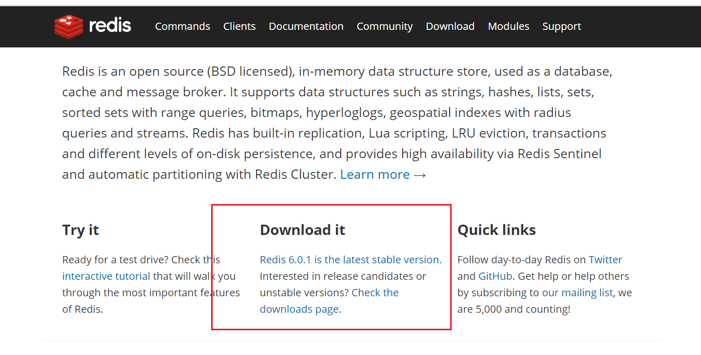


```bash
#使用linux wget命令下载
wget http://download.redis.io/releases/redis-5.0.8.tar.gz

#解压源码
tar -zxvf redis-5.0.8.tar.gz

#进入解压后的目录进行编译
cd redis-5.0.8/
```


```bash
#基本的环境安装
yum install -y gcc-c++

#编译安装
make
make install
```

[Linux下redis安装和部署](https://www.jianshu.com/p/bc84b2b71c1c)

redis默认安装路径`/usr/local/bin`

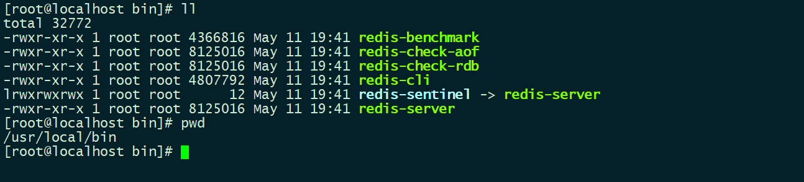

修改`redis.conf`配置文件

```bash
#/usr/local/bin目录下
mkdir myconfig

cp /opt/redis-5.0.8/redis.conf myconfig/
```


```bash
vim redis.conf
```

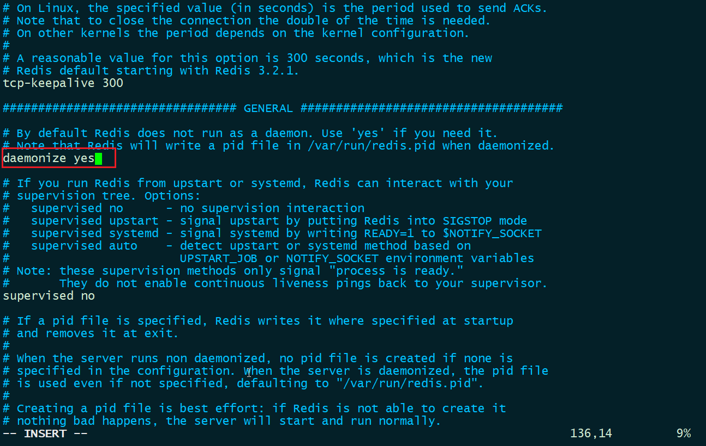

启动`redis`服务

```bash
redis-server /usr/local/bin/myconfig/redis.conf 
```

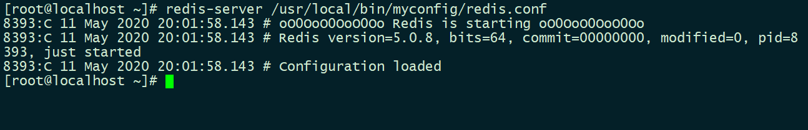

客户端连接

```bash
[root@localhost bin]# redis-cli -p 6379
127.0.0.1:6379> 
127.0.0.1:6379> set name bzm
OK
127.0.0.1:6379> get naem
(nil)
127.0.0.1:6379> get name
"bzm"
127.0.0.1:6379> 

```

退出`redis`

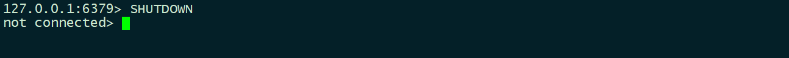

### 3.3、测试性能

`redis-benchmark`是-一个压力测试工具！————**官方自带**

[Redis 性能测试](https://www.runoob.com/redis/redis-benchmarks.html)

| 序号 | 选项      | 描述                                       | 默认值    |
| :--- | :-------- | :----------------------------------------- | :-------- |
| 1    | **-h**    | 指定服务器主机名                           | 127.0.0.1 |
| 2    | **-p**    | 指定服务器端口                             | 6379      |
| 3    | **-s**    | 指定服务器 socket                          |           |
| 4    | **-c**    | 指定并发连接数                             | 50        |
| 5    | **-n**    | 指定请求数                                 | 10000     |
| 6    | **-d**    | 以字节的形式指定 SET/GET 值的数据大小      | 2         |
| 7    | **-k**    | 1=keep alive 0=reconnect                   | 1         |
| 8    | **-r**    | SET/GET/INCR 使用随机 key, SADD 使用随机值 |           |
| 9    | **-P**    | 通过管道传输 <numreq> 请求                 | 1         |
| 10   | **-q**    | 强制退出 redis。仅显示 query/sec 值        |           |
| 11   | **--csv** | 以 CSV 格式输出                            |           |
| 12   | **-l**    | 生成循环，永久执行测试                     |           |
| 13   | **-t**    | 仅运行以逗号分隔的测试命令列表。           |           |
| 14   | **-I**    | Idle 模式。仅打开 N 个 idle 连接并等待。   |           |

==简单测试==

```bash
# 测试： 100个并发连接100000请求
redis-benchmark -h localhost -p 6379 -c 100 -n 100000
```

## 4、基本知识

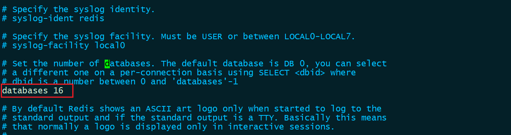

>   默认是16个数据库

### 4.1、常用命令

[Redis 命令参考](http://redisdoc.com/index.html)

```bash
# 0-15
127.0.0.1:6379> SELECT 15	#切换数据库
OK
127.0.0.1:6379[15]> DBSIZE	#查看当前数据库大小
(integer) 0
127.0.0.1:6379[15]> SELECT 0
OK
127.0.0.1:6379> KEYS *		#查看数据库所有的key
1) "counter:__rand_int__"
2) "myset:__rand_int__"
3) "mylist"
4) "name"
5) "key:__rand_int__"
127.0.0.1:6379> FLUSHDB		#清除当前库
OK
127.0.0.1:6379> FLUSHALL	#清除所有库
OK
```

```bash
127.0.0.1:6379> set name bzm
OK
127.0.0.1:6379> set age 18
OK
127.0.0.1:6379> EXISTS name		# 判断一个是否存在
(integer) 1		#返回1存在
127.0.0.1:6379> EXISTS name1
(integer) 0

# MOVE key db
127.0.0.1:6379> MOVE name 1		# 1 移到哪个数据库
(integer) 1
127.0.0.1:6379> KEYS *
1) "age"

```

```bash
127.0.0.1:6379[2]> set name bzm
OK
127.0.0.1:6379[2]> EXPIRE name 10		#设置过期
(integer) 1
127.0.0.1:6379[2]> ttl name		# 存活时间
(integer) 7
127.0.0.1:6379[2]> ttl name
(integer) 1
127.0.0.1:6379[2]> ttl name
(integer) -2
127.0.0.1:6379[2]> KEYS *
(empty list or set)
127.0.0.1:6379[2]> 
```

```bash
127.0.0.1:6379> KEYS *
1) "name"
2) "age"
127.0.0.1:6379> TYPE name	# 查看类型
string
127.0.0.1:6379> TYPE age
string

```


### 4.2、Redis为什么这么快

`Redis`是基于内存操作, `CPU`不是`Redis`性能瓶颈, `Redis`的瓶颈是根据机器的内存和网络带宽。

[Redis的性能瓶颈](https://blog.csdn.net/AAA821/article/details/82930679)

## 5、五大数据类型

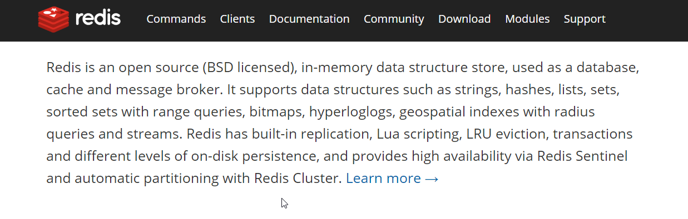

Redis是一-个开源( BSD许可)的,内存中的数据结构存储系统,它可以用作==数据库==、==缓存==和==消息中间件MQ==。它支持多种类型的数据结构,如字符串( strings)，散列( hashes)，列表(lists)，集合(sets)，有序集合( sorted sets )与范围查询,
bitmaps，hyperloglogs和地理空间( geospatial )索引半径查询。Redis 内置了复制( replication) , LUA脚本( Lua
scripting)，LRU驱动事件( LRU eviction) , 务( transactions )和不同级别的磁盘持久化( persistence )， 并通过Redis哨
兵( Sentinel )和自动分区( Cluster )提供高可用性( high availability)。

### 5.1、String

```bash
127.0.0.1:6379> set k1 v1
OK
127.0.0.1:6379> get k1
"v1"
127.0.0.1:6379> APPEND k1 hello		#追加字符串
(integer) 7
127.0.0.1:6379> get k1
"v1hello"
127.0.0.1:6379> APPEND k2 v2		#不存在就，就相当于set
(integer) 2
127.0.0.1:6379> get k2
"v2"
```


```bash
127.0.0.1:6379> set views 0
OK
127.0.0.1:6379> INCR views		#增加1
(integer) 1
127.0.0.1:6379> INCR views
(integer) 2
127.0.0.1:6379> get views
"2"

127.0.0.1:6379> DECR views		# 删除1
(integer) 1
127.0.0.1:6379> DECR views
(integer) 0
127.0.0.1:6379> get views
"0"
```


```bash
127.0.0.1:6379> INCRBY views 10		#指定步长
(integer) 10
127.0.0.1:6379> get views
"10"
127.0.0.1:6379> DECRBY views 9
(integer) 1
127.0.0.1:6379> get views
"1"
```


```bash
127.0.0.1:6379> get k1
"hello"
127.0.0.1:6379> GETRANGE k1 1 3		#截取字符串
"ell"
127.0.0.1:6379> GETRANGE k1 0 -1
"hello"
```


```bash
127.0.0.1:6379> set k2 abcdefg
OK
127.0.0.1:6379> SETRANGE k2 1 xx
(integer) 7
127.0.0.1:6379> get k2
"axxdefg"
```


```bash
127.0.0.1:6379> SETEX k3 30 hello	#设置k3,值为hello，30s过期
OK
127.0.0.1:6379> TTL k3
(integer) 14

127.0.0.1:6379> SETEX mykey redis	#不存在创建成功返回1
(integer) 1
127.0.0.1:6379> get mykey
"redis"
127.0.0.1:6379> SETNX mykey mysql	#不存在没有成功返回0
(integer) 0
127.0.0.1:6379> get mykey
"redis"

```


```bash
127.0.0.1:6379> MSET k1 v1 k2 v2 k3 v3		#同时设置多个值
OK
127.0.0.1:6379> KEYS *
1) "k3"
2) "k2"
3) "k1"
127.0.0.1:6379> mget k1 k2 k3		#同时获取多个值
1) "v1"
2) "v2"
3) "v3"

127.0.0.1:6379> MSETNX k1 v1 k4 v4		# MSETNX，是一个原子操作，要么一起成功，要么一起失败!
(integer) 0
127.0.0.1:6379> KEYS *
1) "k3"
2) "k2"
3) "k1"

```

==对象==

```bash
127.0.0.1:6379> mset user:1:name bzm user:1:age 18
OK
127.0.0.1:6379> mget user:1:name user:1:age
1) "bzm"
2) "18"

```


```bash
127.0.0.1:6379> GETSET db redis		#如果不存在值，返回null
(nil)
127.0.0.1:6379> GET db 
"redis"
127.0.0.1:6379> GETSET db mongodb	#如果存在值，获取原来值，并设置新值
"redis"
127.0.0.1:6379> GET db
"mongodb"

```

### 5.2、List

基本的数据类型,列表。

```bash
127.0.0.1:6379> LPUSH list one		#左插
(integer) 1
127.0.0.1:6379> LPUSH list two
(integer) 2
127.0.0.1:6379> LPUSH list three
(integer) 3
127.0.0.1:6379> LRANGE list 0 -1		#获取list的值
1) "three"
2) "two"
3) "one"
127.0.0.1:6379> LRANGE list 0 1		#获取区间内的值
1) "three"
2) "two"

127.0.0.1:6379> RPUSH list hello
(integer) 4
127.0.0.1:6379> LRANGE list 0 -1		#右插
1) "three"
2) "two"
3) "one"
4) "hello"
127.0.0.1:6379> LPOP list		#左移除一个元素
"three"
127.0.0.1:6379> RPOP list		#右移除一个元素
"hello"
127.0.0.1:6379> 
127.0.0.1:6379> LRANGE list 0 -1
1) "two"
2) "one"
127.0.0.1:6379> LINDEX list 1		#通过下标获取值
"one"
127.0.0.1:6379> LINDEX list 0
"two"

```


```bash
127.0.0.1:6379> LPUSH list v1
(integer) 1
127.0.0.1:6379> LPUSH list v2
(integer) 2
127.0.0.1:6379> LPUSH list v3
(integer) 3
127.0.0.1:6379> LRANGE list 0 -1
1) "v3"
2) "v2"
3) "v1"
127.0.0.1:6379> LLEN list		|#返回列表的长度
(integer) 3
127.0.0.1:6379> LREM list 1 v1		#移除list列表中1个v1
(integer) 1
127.0.0.1:6379> LRANGE list 0 -1
1) "v3"
2) "v2"

```


```bash
127.0.0.1:6379> RPUSH list v1
(integer) 1
127.0.0.1:6379> RPUSH list v2
(integer) 2
127.0.0.1:6379> RPUSH list v3
(integer) 3
127.0.0.1:6379> LTRIM list 1 2
OK
127.0.0.1:6379> LRANGE list 0 -1
1) "v2"
2) "v3"

```


```bash
127.0.0.1:6379> LRANGE list 0 -1
1) "v1"
2) "v2"
3) "v3"
4) "v4"
127.0.0.1:6379> RPOPLPUSH list mylist		#移除列表的最后一个元素，到新的列表中
"v4"
127.0.0.1:6379> LRANGE list 0 -1		
1) "v1"
2) "v2"
3) "v3"
127.0.0.1:6379> KEYS *
1) "mylist"
2) "list"
127.0.0.1:6379> LRANGE mylist 0 -1 		#查看新列表
1) "v4"

```


```bash
127.0.0.1:6379> EXISTS list		#判断list是否存在
(integer) 0
127.0.0.1:6379> RPUSH list v1		
(integer) 1
127.0.0.1:6379> LSET list 0 vv		#设置0索引位置值为vv
OK
127.0.0.1:6379> LRANGE list 0 -1
1) "vv"
127.0.0.1:6379> LSET list 1 v2		#设置不存在的报错
(error) ERR index out of range

```


```bash
127.0.0.1:6379> LRANGE list 0 -1
1) "v1"
2) "v2"
3) "v3"
4) "v4"
127.0.0.1:6379> LINSERT list before v2 oo		#往指定list表位置之前插入
(integer) 5
127.0.0.1:6379> LRANGE list 0 -1
1) "v1"
2) "oo"
3) "v2"
4) "v3"
5) "v4"
127.0.0.1:6379> LINSERT list after v4 aa
(integer) 6
127.0.0.1:6379> LRANGE list 0 -1
1) "v1"
2) "oo"
3) "v2"
4) "v3"
5) "v4"
6) "aa"

```

>   小结
>
>   -   实际上是一个链表,before Node after
>   -   列表中的元素是有序的，可以通过索引下标来获取某个元素或者某个范围内的元素列表
>   -   列表中的元素是可以重复的

### 5.3、Set


```bash
127.0.0.1:6379> SADD list v1		#set集合中添加 
(integer) 1
127.0.0.1:6379> SADD list v2
(integer) 1
127.0.0.1:6379> SADD list v3
(integer) 1
127.0.0.1:6379> SADD list v4
(integer) 1
127.0.0.1:6379> SMEMBERS list		#查看指定set的所有值
1) "v4"
2) "v3"
3) "v2"
4) "v1"
127.0.0.1:6379> SISMEMBER list v2		#判断某一个值是否存在，1存在，0不存在
(integer) 1
127.0.0.1:6379> SISMEMBER list vv
(integer) 0

127.0.0.1:6379> SCARD list		#查看集合中元素的个数
(integer) 4
127.0.0.1:6379> SREM list v2		#移除集合中的元素
(integer) 1
127.0.0.1:6379> SMEMBERS list
1) "v4"
2) "v3"
3) "v1"

```


```bash
127.0.0.1:6379> SRANDMEMBER list 	#随机抽选出一个元素
"v4"
127.0.0.1:6379> 
127.0.0.1:6379> SRANDMEMBER list 
"v1"

```


```bash
127.0.0.1:6379> SPOP list	#随机移除元素
"v3"
127.0.0.1:6379> SMEMBERS list
1) "v4"
2) "v1"

```


```bash
127.0.0.1:6379> SADD list hello1
(integer) 1
127.0.0.1:6379> SADD list hello2
(integer) 1
127.0.0.1:6379> SADD list hello3
(integer) 1
127.0.0.1:6379> SADD list2 2
(integer) 1
127.0.0.1:6379> SMOVE list list2 hello2		#指定一个值，移到另一个集合
(integer) 1
127.0.0.1:6379> SMEMBERS list
1) "hello3"
2) "hello1"
127.0.0.1:6379> SMEMBERS list2
1) "hello2"
2) "2"

```

### 5.4、Hash

### 5.5、Zset

## 6、三种特殊数据类型

### 6.1、geospatial地理位置

### 6.2、Hyperloglog

### 6.3、Bitmaps

## 7、事务

==Redis单条命令式保存原子性的,但是事务不保证原子性!==

`Redis`事务本质: 一组命令的集合!

-   批量操作在发送 `EXEC `命令前被放入队列缓存。
-   收到 `EXEC `命令后进入事务执行，事务中任意命令执行失败，其余的命令依然被执行。
-   在事务执行过程，其他客户端提交的命令请求不会插入到事务执行命令序列中。

### 7.1、基本操作

**一个事务从开始到执行会经历以下三个阶段**：

-   开始事务。（MULTI）
-   命令入队。
-   执行事务。（EXEC）

```bash
127.0.0.1:6379> MULTI 		#开启事务
OK
#命令入队
127.0.0.1:6379> set k1 v1
QUEUED
127.0.0.1:6379> set k2 v2
QUEUED
127.0.0.1:6379> GET k1
QUEUED
127.0.0.1:6379> set k3 v3
QUEUED
127.0.0.1:6379> EXEC		#执行事务
1) OK
2) OK
3) "v1"
4) OK

```

==取消事务==

```bash
127.0.0.1:6379> MULTI 		#开启事务
OK
#命令入队
127.0.0.1:6379> set k1 v1
QUEUED
127.0.0.1:6379> set k2 v2
QUEUED
127.0.0.1:6379> GET k1
QUEUED
127.0.0.1:6379> set k3 v3
QUEUED
127.0.0.1:6379> set k4 v4
QUEUED
127.0.0.1:6379> DISCARD		#放弃事务
OK
127.0.0.1:6379> get k4
(nil)

```

==编译型异常(代码有问题!命令有错! )，事务中所有的命令 都不会被执行!==

```bash 
127.0.0.1:6379> MULTI
OK
127.0.0.1:6379> set k1 v1 
QUEUED
127.0.0.1:6379> set k2 v2
QUEUED
127.0.0.1:6379> setget k1		#错误的命令
(error) ERR unknown command `setget`, with args beginning with: `k1`, 
127.0.0.1:6379> set k3 v3
QUEUED
127.0.0.1:6379> EXEC		#执行事务报错
(error) EXECABORT Transaction discarded because of previous errors.
127.0.0.1:6379> get k3
(nil)

```

==如果事务队列中存在语法性,那么执行命令的时候,其他命令是可以正常执行的,错误命令抛出异常!==

```bash
127.0.0.1:6379> MULTI
OK
127.0.0.1:6379> set k1 v1
QUEUED
127.0.0.1:6379> INCR k1		#执行时候失败
QUEUED
127.0.0.1:6379> set k2 v2
QUEUED
127.0.0.1:6379> set k3 v3
QUEUED
127.0.0.1:6379> get k3 
QUEUED
127.0.0.1:6379> EXEC
1) OK
2) (error) ERR value is not an integer or out of range		#错误命令，但是其他依然执行成功
3) OK
4) OK
5) "v3"

```

### 7.2、监控

**悲观锁**

-   什么情况下都去加锁

**乐观锁**

-   一般不是上锁，只有更新数据的时候去判断一下，此期间数据是否改变
-   获取`version`
-   更新的时候比较`version`

**测试**

```bash
127.0.0.1:6379> set money 100
OK
127.0.0.1:6379> set out 0
OK
127.0.0.1:6379> WATCH money		#监视money对象
OK
127.0.0.1:6379> MULTI
OK
127.0.0.1:6379> DECRBY money 20
QUEUED
127.0.0.1:6379> INCRBY out 20
QUEUED
127.0.0.1:6379> EXEC
1) (integer) 80
2) (integer) 20

```

测试多线程修改值,使用`watch`可以当做`redis`的乐观锁操作!

```bash
127.0.0.1:6379> set m1 100
OK
127.0.0.1:6379> KEYS *
1) "m1"
127.0.0.1:6379> get m1
"100"
127.0.0.1:6379> WATCH m1
OK
127.0.0.1:6379> MULTI
OK
127.0.0.1:6379> DECRBY m1 10
QUEUED
127.0.0.1:6379> INCRBY m1 20
QUEUED
127.0.0.1:6379> EXEC		#执行前开启另外一个线程修改m1的值为200
(nil)
127.0.0.1:6379> GET m1
"200"

```


```bash
127.0.0.1:6379> UNWATCH		#事务执行失败，先解锁
OK
127.0.0.1:6379> WATCH m1	#然后监视，最新的值
OK
127.0.0.1:6379> MULTI
OK
127.0.0.1:6379> DECRBY m1 10
QUEUED
127.0.0.1:6379> INCRBY m1 20
QUEUED
127.0.0.1:6379> EXEC		#对比监视的值，如果没变，一致即可执行成功，反之失败null
1) (integer) 190
2) (integer) 210

```

## 8、Jedis

>   `Java`操作`redis`,是官方推荐的java连接开发工具

### 8.1、Jedis连接测试

1、导入依赖

```xml
<!--导入jedis的包-->
<dependency>
    <groupId>redis.clients</groupId>
    <artifactId>jedis</artifactId>
    <version>3.2.0</version>
</dependency>
<!--fastjson-->
<dependency>
    <groupId>com.alibaba</groupId>
    <artifactId>fastjson</artifactId>
    <version>1.2.62</version>
</dependency>
```

2、编码测试

-    连接数据库
-    操作命令
-    断开连接

[通过Jedis客户端连接不到redis](https://blog.csdn.net/ksdb0468473/article/details/52848608)

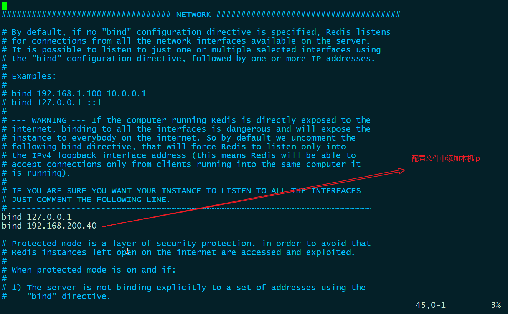


```java
public class TestPing {
    public static void main(String[] args) {
        Jedis jedis = new Jedis("192.168.200.40", 6379);
        System.out.println(jedis.ping());
    }
}
```

>   PONG

### 8.2、常用API

[Jedis常用API整理](https://blog.csdn.net/fanbaodan/article/details/89047909)

### 8.3、Jedis事务

[jedis事务写法](https://my.oschina.net/wwwd/blog/829428)

```java
//创建客户端连接服务端，redis服务端需要被开启
		Jedis jedis = new Jedis("192.168.17.131", 6379);
		//创建1个jsonobject对象，并把它转换成json字符串
		JsonObject jsonObject = new JsonObject();
		jsonObject.addProperty("hello", "world");
		jsonObject.addProperty("name", "java");
		//开启事务
		Transaction multi = jedis.multi();
		String result = jsonObject.toString();
		try{
			//向redis存入一条数据
			multi.set("json".getBytes(), result.getBytes());
			//再存入一条数据
			multi.set("json2".getBytes(), result.getBytes());
			//这里引发了异常，用0作为被除数
			int i = 100/0;
			//如果没有引发异常，执行进入队列的命令
			multi.exec();
		}catch(Exception e){
			e.printStackTrace();
			//如果出现异常，回滚
			multi.discard();
		}finally{
			//最终关闭客户端
			jedis.close();
		}
```

## 9、SpringBoot整合

### 9.1、整合测试

说明:在`SpringBoot2.x`之后,原来使用的`jedis`被替换为了`lettuce`?

==测试连接==

```java
    @Test
    void contextLoads() {
        //获取连接对象
        RedisConnection connection = redisTemplate.getConnectionFactory().getConnection();
        System.out.println(connection.ping());

        redisTemplate.opsForValue().set("name","bzm");
        System.out.println(redisTemplate.opsForValue().get("name"));
    }
```

真实开发，一般使用`json`来传递对象

创建User对象

```java
@Component
@AllArgsConstructor
@NoArgsConstructor
@Data
//在企业中所有的pojo对象都会序列化
public class User implements Serializable {
    private String name;
    private int age;
}
```

测试

```java
@Test
    void test() throws JsonProcessingException {
        //真实开发，一般使用json来传递对象
        User user = new User("Bzm", 18);
        String jsonUser = new ObjectMapper().writeValueAsString(user);
        redisTemplate.opsForValue().set("user",jsonUser);
    }
```

>   {"name":"Bzm","age":18}

```java
@Test
    void test() throws JsonProcessingException {
        //真实开发，一般使用json来传递对象
        User user = new User("Bzm", 18);
//        String jsonUser = new ObjectMapper().writeValueAsString(user);
        redisTemplate.opsForValue().set("user",user);
        System.out.println(redisTemplate.opsForValue().get("user"));
    }
```

>   User(name=Bzm, age=18)

### 9.2、序列化

```java
	@Bean
    @SuppressWarnings("all")
    public RedisTemplate<Object, Object> redisTemplate(RedisConnectionFactory redisConnectionFactory)
            throws UnknownHostException {
        //我们为了自己开发方便，- -般直接使用<String, object>
        RedisTemplate<Object, Object> template = new RedisTemplate<>();
        template.setConnectionFactory(redisConnectionFactory);

        //Json序列化配置
        Jackson2JsonRedisSerializer<Object> jackson2JsonRedisSerializer = new Jackson2JsonRedisSerializer(Object.class);
        ObjectMapper om = new ObjectMapper();
        om.setVisibility(PropertyAccessor.ALL,JsonAutoDetect.Visibility .ANY);
        om.activateDefaultTyping(LaissezFaireSubTypeValidator.instance, ObjectMapper.DefaultTyping.NON_FINAL);
        jackson2JsonRedisSerializer.setObjectMapper(om);

        //String 序列化
        StringRedisSerializer stringRedisSerializer = new StringRedisSerializer();

        //key采用string的序列化方式
        template. setKeySerializer(stringRedisSerializer);
        //hash的key也采用string的序列化方式
        template. setHashKeySerializer( stringRedisSerializer) ;
        //value序列化方式采用jackson .
        template. setValueSerializer(jackson2JsonRedisSerializer);
        //hash的value序列化方式采用jackson
        template. setHashValueSerializer(jackson2JsonRedisSerializer) ;
        template.afterPropertiesSet();

        return template;
    }
```

==测试==

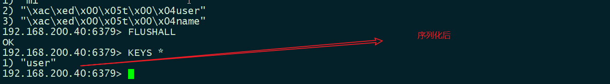

### 9.3、编写工具类

>   企业中一般都有自己封装好的工具类

[Redis工具类](https://www.cnblogs.com/zeng1994/p/03303c805731afc9aa9c60dbbd32a323.html)

## 10、Redis配置文件详解

启动的时候,就通过配置文件来启动!

### 单位

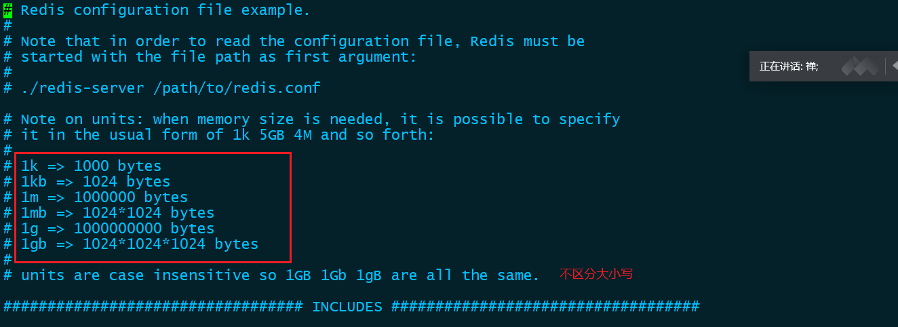

>   unit单位大小不敏感

### 包含

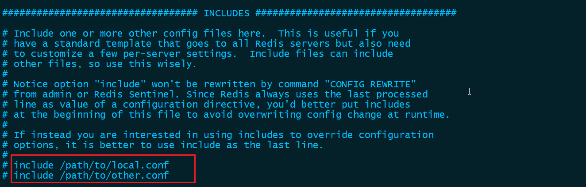

>    引入其他的配置文件

### 网络

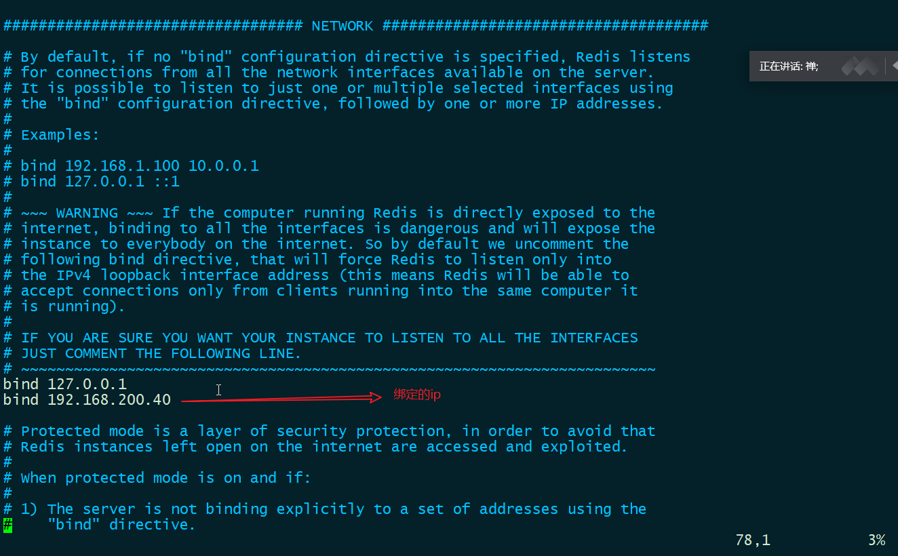

```bash
bind 127.0.0.1		#绑定ip，远程访问可以设置本机ip

protected-mode yes		#保护模式

port 6379		#端口
```

### 通用

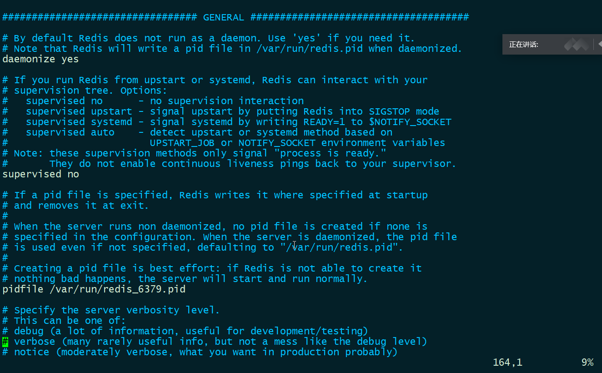

```bash
daemonize yes		# 后台运行,默认是no

pidfile /var/run/redis_6379.pid		#k如果以后台的方式运行，我们就需要指定一个pid 文件!

#日志
# Specify the server verbosity level.
# This can be one of:
# debug (a lot of information, useful for development/testing)
# verbose (many rarely useful info, but not a mess like the debug level)
# notice (moderately verbose, what you want in production probably)
# warning (only very important / critical messages are logged)
loglevel notice		#日志级别

logfile ""		#日志的文件位置名

databases 16		#数据库的数量,默认16

always-show-logo yes		#是否总是显示logo
```

### 快照

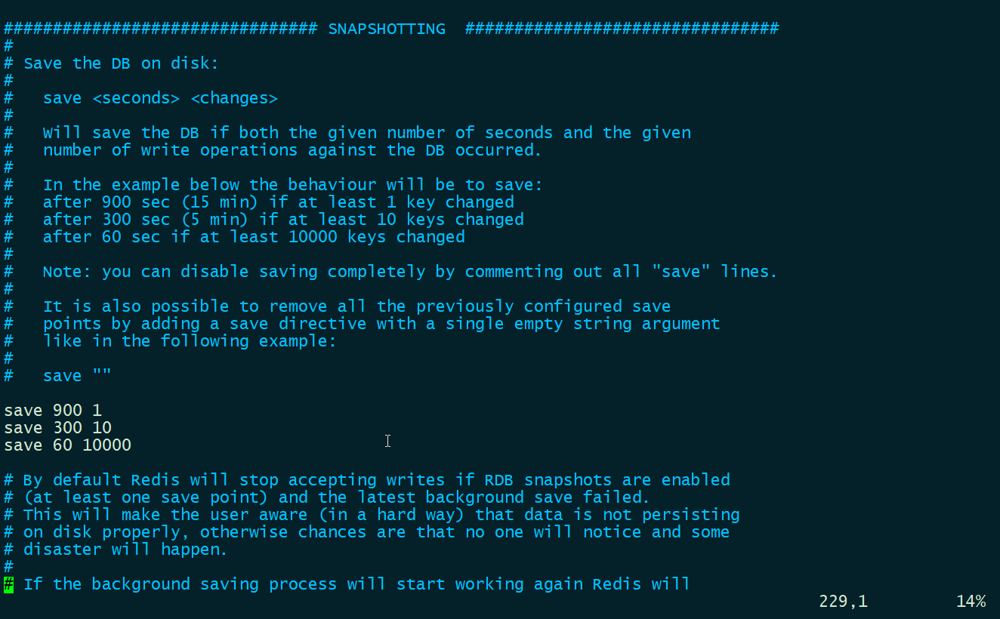

>   持久化，在规定的时间内,执行了多少次操作,则会持久化到文件.rdb. aof

```bash
#如果900s内， 如果至少有一个1 key进行了修改， 我们及进行持久化操作
save 900 1
#如果300s内， 如果至少有一个10 key进行了修改， 我们及进行持久化操作
save 300 10
#如果60s内， 如果至少有一个10000 key进行了修改， 我们及进行持久化操作
save 60 10000
```

`redis`是内存数据库,如果没有持久化,那么数据断电及失!


```bash
stop-writes-on-bgsave-error yes		#持久化出错后，是否需要继续工作

rdbcompression yes		#是否压缩rdb文件，需要消耗一些cpu资源

rdbchecksum yes			#保存rdb文件的时候，进行错误的检查校验!

# Note that you must specify a directory here, not a file name.
dir ./			#rdb文件保存的目录

```

### 主从复制

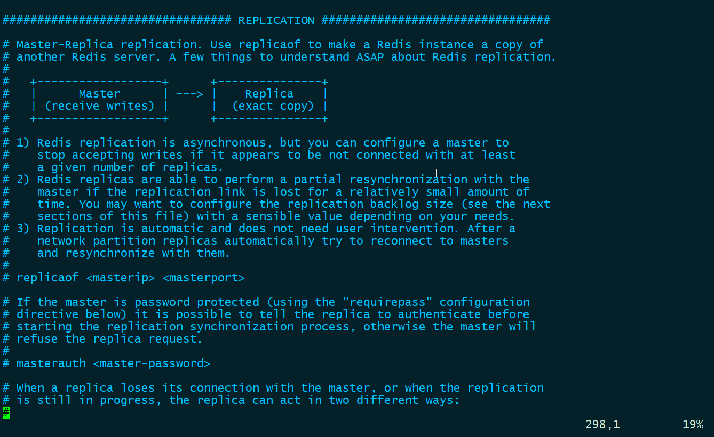

### 安全

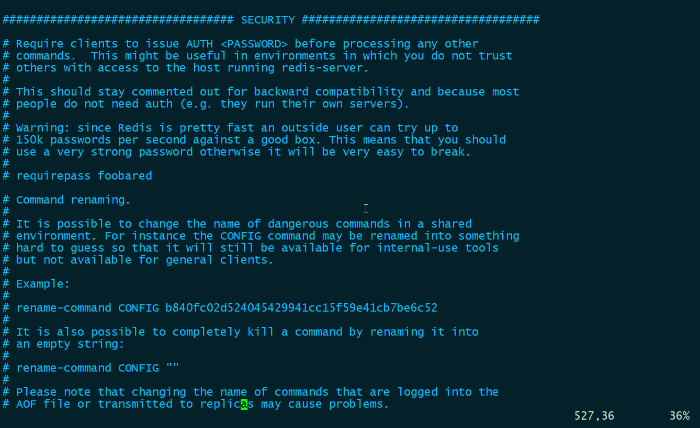

```bash
requirepass  123456 		#设置密码
```

```bash
192.168.200.40:6379> ping
PONG
192.168.200.40:6379> CONFIG GET requirepass		#获取redis的密码
1) "requirepass"
2) ""
192.168.200.40:6379> CONFIG SET requirepass 123456		#设置redis的密码
OK
192.168.200.40:6379> CONFIG GET requirepass		#所有命令都没有权限了
(error) NOAUTH Authentication required.
192.168.200.40:6379> ping
(error) NOAUTH Authentication required.
192.168.200.40:6379> AUTH 123456		#使用密码登录
OK
192.168.200.40:6379> CONFIG GET requirepass
1) "requirepass"
2) "123456"

```

###  客户端

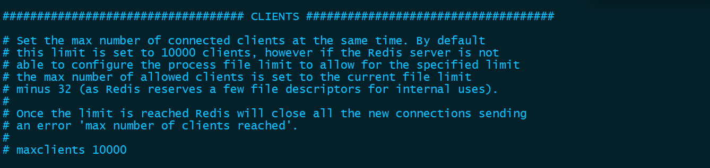

```bash
maxclients 10000		#设置能连接上redis的最大客户端的数量

```

### 内存管理

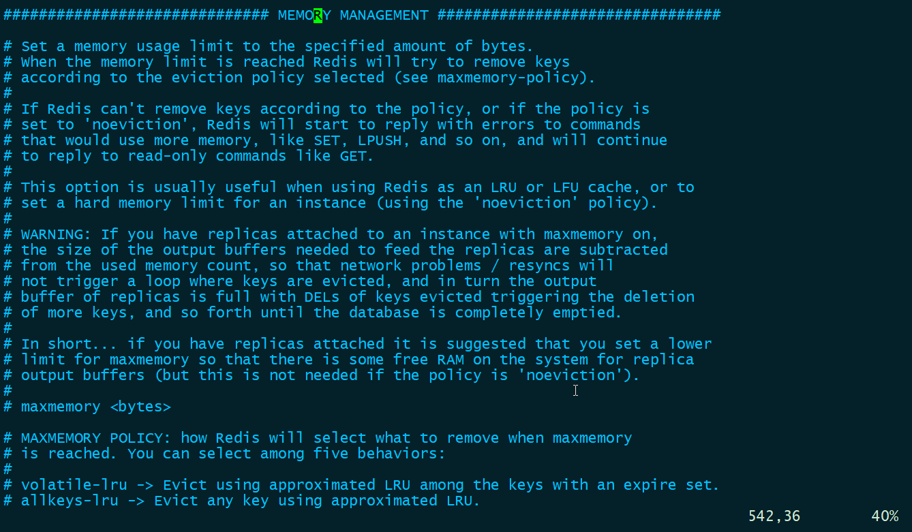

```bash
maxmemory <bytes>		# redis 配置最大的内存容量

maxmemory-policy noeviction			#内存到达上限之后的处理策略
```

`maxmemory-policy` 六种方式

1.  volatile-lru：只对设置了过期时间的key进行LRU（默认值） 
2.  allkeys-lru ： 删除lru算法的key  
3.  volatile-random：随机删除即将过期key  
4.  allkeys-random：随机删除  
5.  volatile-ttl ： 删除即将过期的  
6.  noeviction ： 永不过期，返回错误  

### AOF 模式

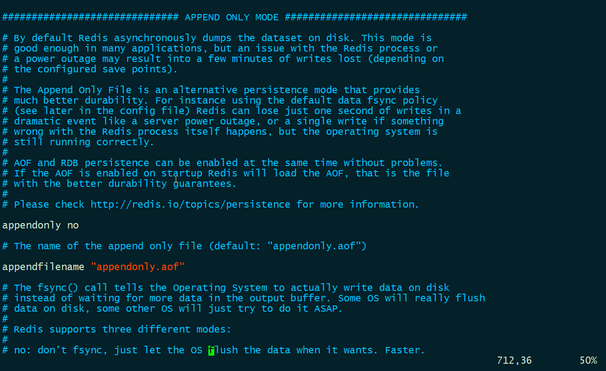

```bash
appendonly no		#默认是不开启aof模式的，默认是使用rdb方式持久化的，在大部分所有的情况下，rdb完全够用!

appendfilename "appendonly.aof"			#持久化的文件的名字


# appendfsync always
appendfsync everysec		#每秒都同步一次
# appendfsync no

```

---


## 11、Redis的持久化

`Redis`是内存数据库,如果不将内存中的数据库状态保存到磁盘,那么一旦 服务器进程退出,服务器中的数据库状态也会消失。所以`Redis`提供了持久化功能!

>   Redis提供了两种持久化方案：**RDB持久化**和**AOF持久化**，一个是快照的方式，一个是类似日志追加的方式

[Redis的持久化机制](https://juejin.im/post/5d09a9ff51882577eb133aa9)

### 11.1、RDB

>   `RDB`是一种快照存储持久化方式，具体就是将`Redis`某一时刻的内存数据保存到硬盘的文件当中，默认保存的文件名为`dump.rdb`，而在`Redis`服务器启动时，会重新加载`dump.rdb`文件的数据到内存当中恢复数据。

`rdb`保存的文件是`dump.rdb`都是在我们的配置文件中快照中进行配置的!


==触发机制==

-   `save`的规则满足的情况下,会自动触发`rdb`规则
-   执行`flushall`命令,也会触发我们的`rdb`规则!
-   退出`redis `,也会产生`rdb`文件!

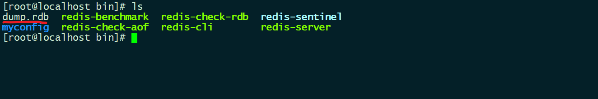

==恢复rdb文件!==

-   只需要将`rdb`文件放在我们redis配置文件的目录就可以, `redis`启动的时候会自动检查`dump.rdb`恢复其中的数据!

-   查看需要存在的位置

    ```bash
    192.168.200.40:6379> config get dir
    1) "dir"
    2) "/usr/local/bin"
    ```

>   修改配置文件，为自己想要的。
>
>   ==缺点==
>
>   1、需要一定的时间间隔进程操作!如果`redis`意外宕机了,这个最后一次修改数据就没有的了!
>   2、`fork`进程的时候 ，会占用一定的内容空间! !


### 11.2 、AOF

>   AOF（Append Only File）,`AOF`持久化方式会记录客户端对服务器的每一次写操作命令，并将这些写操作以`Redis`协议追加保存到以后缀为`aof`文件末尾，在Redis服务器重启时，会加载并运行`aof`文件的命令，以达到恢复数据的目的。

**开启AOF持久化方式**

```bash
# 开启aof机制
appendonly yes

# aof文件名
appendfilename "appendonly.aof"

# 写入策略,always表示每个写操作都保存到aof文件中,也可以是everysec或no
appendfsync always

# 默认不重写aof文件
no-appendfsync-on-rewrite no

# 保存目录
dir ~/redis/
```

 **AOF文件损坏**

在写入`aof`日志文件时，如果`Redis`服务器宕机，则`aof`日志文件文件会出格式错误，在重启`Redis`服务器时，`Redis`服务器会拒绝载入这个`aof`文件。

>   恢复不了的，会删除aof日志文件，数据丢失部分。

**优点**

-   `AOF`只是追加日志文件，因此对服务器性能影响较小，速度比`RDB`要快，消耗的内存较少。

**缺点**

-   `AOF`方式生成的日志文件太大，即使通过`AOF`重写，文件体积仍然很大。
-   恢复数据的速度比`RDB`慢。

### 11.3、选择RDB还是AOF呢？

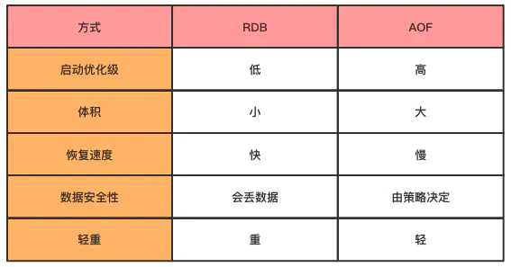

>   当`RDB`与`AOF`两种方式都开启时，`Redis`会优先使用`AOF`日志来恢复数据，因为`AOF`保存的文件比`RDB`文件更完整。

## 12、Redis发布订阅

[订阅与发布](https://redisbook.readthedocs.io/en/latest/feature/pubsub.html)

`Redis`发布订阅(`pub`/`sub`)是一种==消息通信模式==：发送者(`pub`)发送消息,订阅者(sub)接收消息。

>   `Redis` 通过 [PUBLISH](http://redis.readthedocs.org/en/latest/pub_sub/publish.html#publish) 、 [SUBSCRIBE](http://redis.readthedocs.org/en/latest/pub_sub/subscribe.html#subscribe) 等命令实现了订阅与发布模式， 这个功能提供两种信息机制， 分别是订阅/发布到频道和订阅/发布到模式。

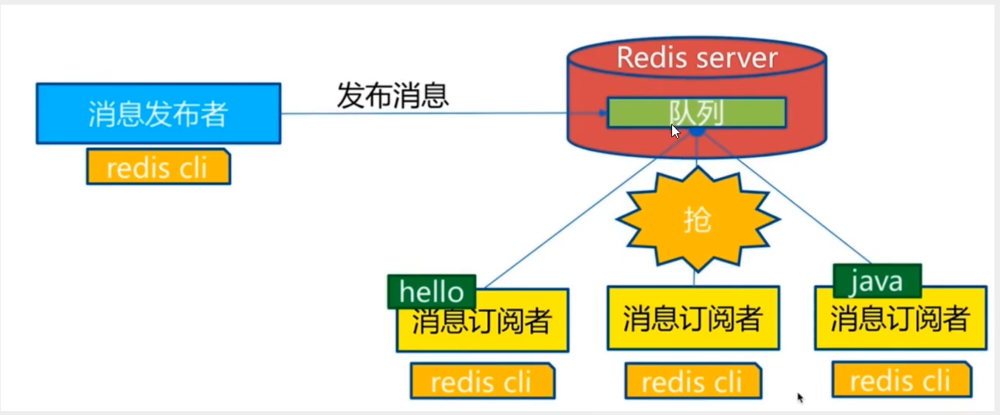

`Redis `的 [SUBSCRIBE](http://redis.readthedocs.org/en/latest/pub_sub/subscribe.html#subscribe) 命令可以让客户端订阅任意数量的频道， 每当有新信息发送到被订阅的频道时， 信息就会被发送给所有订阅指定频道的客户端。

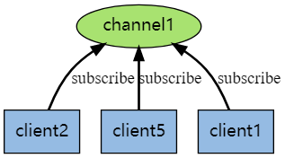

当有新消息通过 [PUBLISH](http://redis.readthedocs.org/en/latest/pub_sub/publish.html#publish) 命令发送给频道 `channel1` 时， 这个消息就会被发送给订阅它的三个客户端：


| 序号 | 命令及描述                                                   |
| :--- | :----------------------------------------------------------- |
| 1    | [PSUBSCRIBE pattern [pattern ...\]](https://www.runoob.com/redis/pub-sub-psubscribe.html)  订阅一个或多个符合给定模式的频道。 |
| 2    | [PUBSUB subcommand [argument [argument ...\]]](https://www.runoob.com/redis/pub-sub-pubsub.html)  查看订阅与发布系统状态。 |
| 3    | [PUBLISH channel message](https://www.runoob.com/redis/pub-sub-publish.html)  将信息发送到指定的频道。 |
| 4    | [PUNSUBSCRIBE [pattern [pattern ...\]]](https://www.runoob.com/redis/pub-sub-punsubscribe.html)  退订所有给定模式的频道。 |
| 5    | [SUBSCRIBE channel [channel ...\]](https://www.runoob.com/redis/pub-sub-subscribe.html)  订阅给定的一个或多个频道的信息。 |
| 6    | [UNSUBSCRIBE [channel [channel ...\]]](https://www.runoob.com/redis/pub-sub-unsubscribe.html)  指退订给定的频道。 |

==订阅端==

```bash
192.168.200.40:6379> SUBSCRIBE Bzm		#订阅一个频道Bzm
Reading messages... (press Ctrl-C to quit)
1) "subscribe"
2) "Bzm"
3) (integer) 1
1) "message"
2) "Bzm"

```

==发送端==

```bash
192.168.200.40:6379> PUBLISH Bzm hello 		#发布一个信息，到Bzm频道
(integer) 1
```

**结果**


[redis 的发布/订阅模式Jedis](https://juejin.im/post/5b35ff8ae51d455886494af6)


## 13、Redis主从复制

[主从复制](https://www.cnblogs.com/kismetv/p/9236731.html)

>   主从复制,读写分离! 80% 的情况下都是在进行读操作!减缓服务器的压力! 架构中经常使用! |

### 13.1、概念

主从复制，是指将一台`Redis`服务器的数据，复制到其他的Redis服务器。前者称为主节点(`master`)，后者称为从节点(`slave`)；数据的复制是单向的，只能由主节点到从节点。

```markdown
- 默认情况下,每台Redis服务器都是主节点;且-个主节点可以有多个从节点(或没有从节点) ,但一个从节点只能有一个主节点。
```

### 13.2、主从复制的作用

1.  数据冗余：主从复制实现了数据的热备份，是持久化之外的一种数据冗余方式。
2.  故障恢复：当主节点出现问题时，可以由从节点提供服务，实现快速的故障恢复；实际上是一种服务的冗余。
3.  负载均衡：在主从复制的基础上，配合读写分离，可以由主节点提供写服务，由从节点提供读服务（即写Redis数据时应用连接主节点，读Redis数据时应用连接从节点），分担服务器负载；尤其是在写少读多的场景下，通过多个从节点分担读负载，可以大大提高Redis服务器的并发量。
4.  高可用基石：除了上述作用以外，主从复制还是哨兵和集群能够实施的基础，因此说主从复制是Redis高可用的基础。

>   一般来说 ,要将`Redis`运用于工程项目中，只使用一台`Redis`是万万不能的(宕机) 。

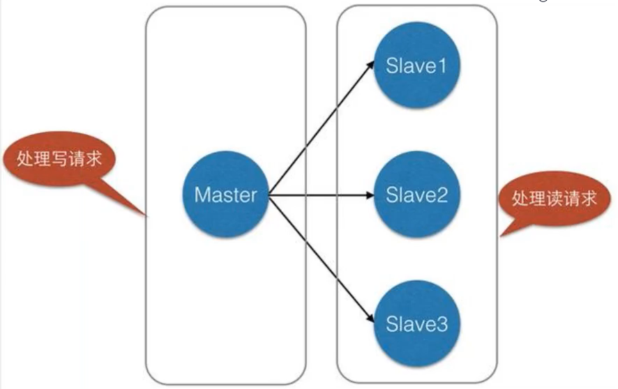

### 13.3、主从复制的操作

**配置**——只配置从库,不用配置主库!

---


查看`Redis`主从复制信息

```bash
192.168.200.40:6379> INFO replication
# Replication
role:master		#角色
connected_slaves:0		#从机数
master_replid:d4957089f7f69cf42f77d5de4fd7d8b4270165c3
master_replid2:0000000000000000000000000000000000000000
master_repl_offset:0
second_repl_offset:-1
repl_backlog_active:0
repl_backlog_size:1048576
repl_backlog_first_byte_offset:0
repl_backlog_histlen:0

```

>   方便起见，实验所使用的主从节点是在一台机器上的不同`Redis`实例，其中主节点监听`6379`端口，从节点监听`6380`和`6381`端口；

创建三个配置文件

```markdown
- redis79.conf  
- redis80.conf  
- redis81.conf 
```

修改配置文件（三个配置文件分别修改成对应的）

1、端口
2、pid 名字
3、log文件名字
4、dump.rdb 名字

```bash
# redis81.conf 

port 6381

pidfile /var/run/redis_6381.pid

logfile "6381.log"

dbfilename dump6381.rdb
```

启动连接`Redis`


==一主( 79)二从(80, 81 )==

```bash
# 从节点配置
192.168.200.40:6380> SLAVEOF 192.168.200.40 6379
OK
```

>   真实的从主配置应该在配置文件中配置, 这样的话是永久的,我们这里使用的是命令,暂时!

配置文件配置，启动即生效。

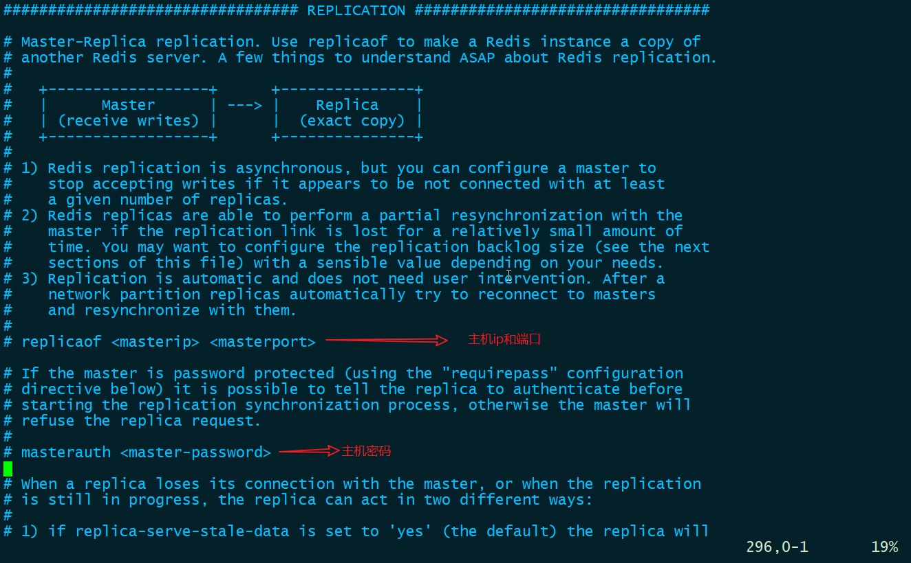

测试

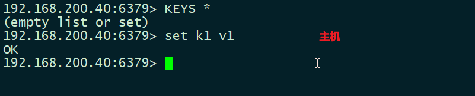

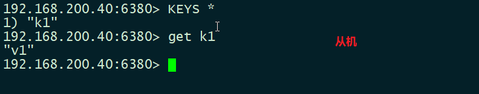

==主机写，从机只能读==

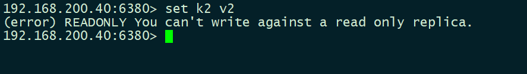


 复制原理

-   Slave启动成功连接到master后会发送一个sync同步命令，Master接到命令,启动后台的存盘进程,同时收集所有接收到的用于修改数据集命令,在后台进程执行完毕之后, master将传送整个数据文件到slave ,并完成一次完全同步。
-   全量复制:而slave服务在接收到数据库文件数据后, 将其存盘并加载到内存中。
-   增量复制: Master继续将新的所有收集到的修改命令依次传给slave ,完成同步
-   但是只要是重新连接master , 一次完全同步(全量复制)将被自动执行!我们的数据-定可以在从机中看到! |

##  14、哨兵模式

### 14.1、概述

**主从切换技术的方法是：当主服务器宕机后，需要手动把一台从服务器切换为主服务器，这就需要人工干预，费事费力，还会造成一段时间内服务不可用。**这不是一种推荐的方式，更多时候，我们优先考虑**哨兵模式**。

>   `Redis 2.8` 以后提供了 `Redis Sentinel` **哨兵机制** 来解决这个问题。

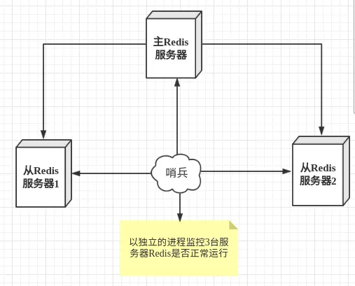

哨兵模式是一种特殊的模式，首先`Redis`提供了哨兵的命令，哨兵是一个独立的进程，作为进程，它会独立运行。其原理是**哨兵通过发送命令，等待`Redis`服务器响应，从而监控运行的多个`Redis`实例。**


-   通过发送命令，让`Redis`服务器返回监控其运行状态，包括主服务器和从服务器。

-   当哨兵监测到`master`宕机，会自动将`slave`切换成`master`，然后通过**发布订阅模式**通知其他的从服务器，修改配置文件，让它们切换主机。

    

>   然而一个哨兵进程对`Redis`服务器进行监控，可能会出现问题，为此，我们可以使用多个哨兵进行监控。各个哨兵之间还会进行监控，这样就形成了多哨兵模式。

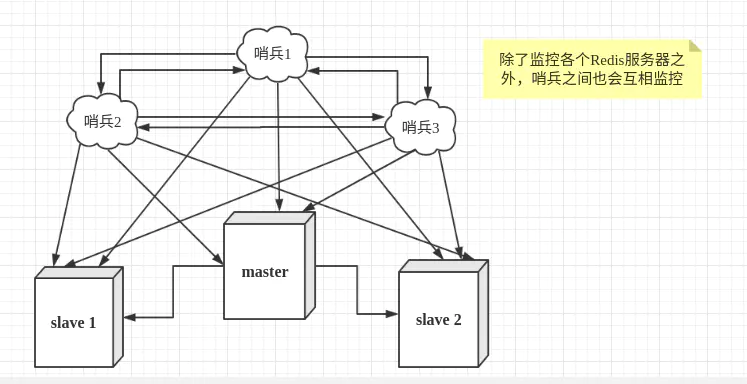

```markdown
# 故障切换（failover）的过程。
- 假设主服务器宕机，哨兵1先检测到这个结果，系统并不会马上进行failover过程，仅仅是哨兵1主观的认为主服务器不可用，这个现象成为主观下线。
- 当后面的哨兵也检测到主服务器不可用，并且数量达到一定值时，那么哨兵之间就会进行一次投票，投票的结果由一个哨兵发起，进行failover操作。
- 切换成功后，就会通过发布订阅模式，让各个哨兵把自己监控的从服务器实现切换主机，这个过程称为客观下线。这样对于客户端而言，一切都是透明的。
```

### 14.2、搭建配置

在`Redis`安装目录下有一个`sentinel.conf`文件，copy一份进行修改

```bash
# 禁止保护模式
protected-mode no
# 配置监听的主服务器，这里sentinel monitor代表监控，mymaster代表服务器的名称，可以自定义，192.168.11.128代表监控的主服务器，6379代表端口，2代表只有两个或两个以上的哨兵认为主服务器不可用的时候，才会进行failover操作。
sentinel monitor mymaster 192.168.11.128 6379 2
# sentinel author-pass定义服务的密码，mymaster是服务名称，123456是Redis服务器密码
# sentinel auth-pass <master-name> <password>
sentinel auth-pass mymaster 123456
```

进入`Redis`的安装目录的`src`目录,`redis-sentinel `启动哨兵

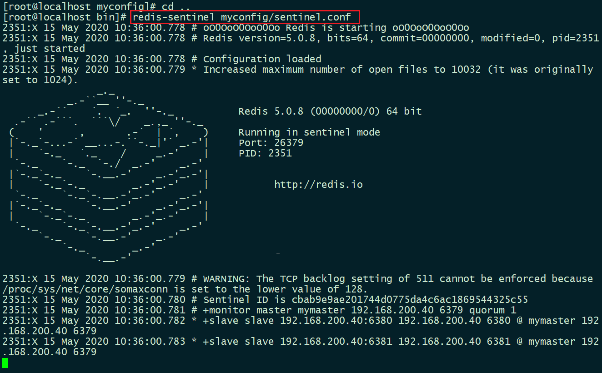

>   如果`Master`节点断开了,这个时候就会从从机中随机选择一个服务器 ! ( 这里面有一一个`投票算法`! )

 **故障转移**

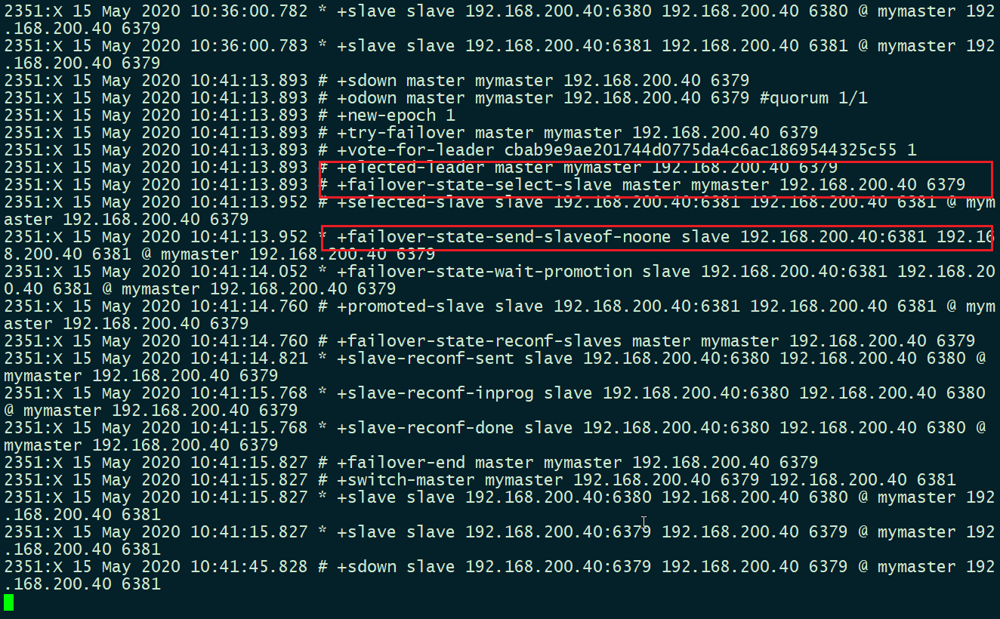

==6379恢复后==，依然只能是从机

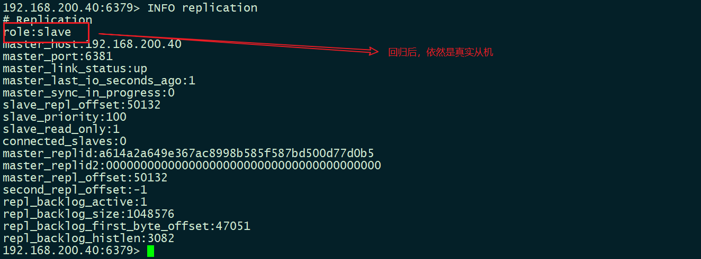


### 14.3、Redis Sentinel的配置文件

```bash
# 哨兵sentinel实例运行的端口，默认26379  
port 26379
# 哨兵sentinel的工作目录
dir ./

# 哨兵sentinel监控的redis主节点的 
## ip：主机ip地址
## port：哨兵端口号
## master-name：可以自己命名的主节点名字（只能由字母A-z、数字0-9 、这三个字符".-_"组成。）
## quorum：当这些quorum个数sentinel哨兵认为master主节点失联 那么这时 客观上认为主节点失联了  
# sentinel monitor <master-name> <ip> <redis-port> <quorum>  
sentinel monitor mymaster 127.0.0.1 6379 2

# 当在Redis实例中开启了requirepass <foobared>，所有连接Redis实例的客户端都要提供密码。
# sentinel auth-pass <master-name> <password>  
sentinel auth-pass mymaster 123456  

# 指定主节点应答哨兵sentinel的最大时间间隔，超过这个时间，哨兵主观上认为主节点下线，默认30秒  
# sentinel down-after-milliseconds <master-name> <milliseconds>
sentinel down-after-milliseconds mymaster 30000  

# 指定了在发生failover主备切换时，最多可以有多少个slave同时对新的master进行同步。这个数字越小，完成failover所需的时间就越长；反之，但是如果这个数字越大，就意味着越多的slave因为replication而不可用。可以通过将这个值设为1，来保证每次只有一个slave，处于不能处理命令请求的状态。
# sentinel parallel-syncs <master-name> <numslaves>
sentinel parallel-syncs mymaster 1  

# 故障转移的超时时间failover-timeout，默认三分钟，可以用在以下这些方面：
## 1. 同一个sentinel对同一个master两次failover之间的间隔时间。  
## 2. 当一个slave从一个错误的master那里同步数据时开始，直到slave被纠正为从正确的master那里同步数据时结束。  
## 3. 当想要取消一个正在进行的failover时所需要的时间。
## 4.当进行failover时，配置所有slaves指向新的master所需的最大时间。不过，即使过了这个超时，slaves依然会被正确配置为指向master，但是就不按parallel-syncs所配置的规则来同步数据了
# sentinel failover-timeout <master-name> <milliseconds>  
sentinel failover-timeout mymaster 180000

# 当sentinel有任何警告级别的事件发生时（比如说redis实例的主观失效和客观失效等等），将会去调用这个脚本。一个脚本的最大执行时间为60s，如果超过这个时间，脚本将会被一个SIGKILL信号终止，之后重新执行。
# 对于脚本的运行结果有以下规则：  
## 1. 若脚本执行后返回1，那么该脚本稍后将会被再次执行，重复次数目前默认为10。
## 2. 若脚本执行后返回2，或者比2更高的一个返回值，脚本将不会重复执行。  
## 3. 如果脚本在执行过程中由于收到系统中断信号被终止了，则同返回值为1时的行为相同。
# sentinel notification-script <master-name> <script-path>  
sentinel notification-script mymaster /var/redis/notify.sh

# 这个脚本应该是通用的，能被多次调用，不是针对性的。
# sentinel client-reconfig-script <master-name> <script-path>
sentinel client-reconfig-script mymaster /var/redis/reconfig.sh

```

### 14.4、优缺点

**优点**:
1、哨兵集群,基于主从复制模式,所有的主从配置优点,它全有
2、主从可以切换,故障可以转移,系统的可用性就会更好
3、哨兵模式就是主从模式的升级,手动到自动,更加健壮!
**缺点**:
1、Redis不好啊在线扩容的,集群容量一旦到达上限,在线扩容就+分麻烦!
2、实现哨兵模式的配置其实是很麻烦的,里面有很多选择!

## 15、Redis缓存穿透和雪崩

