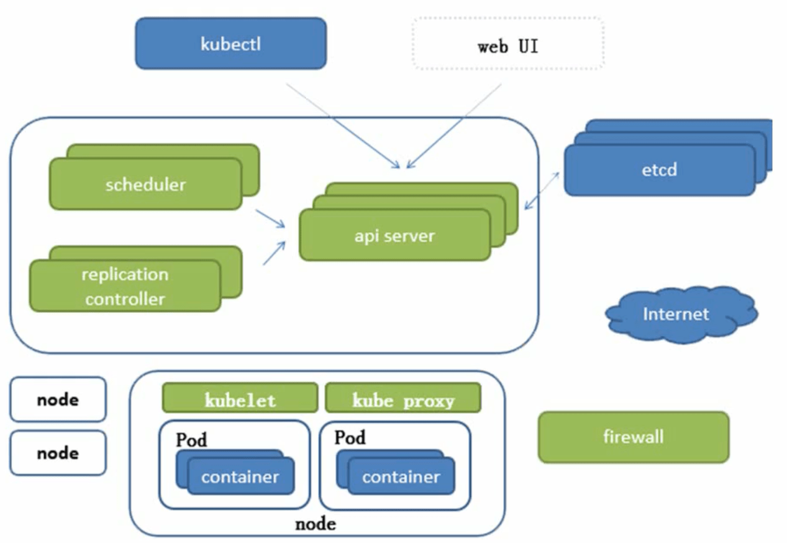
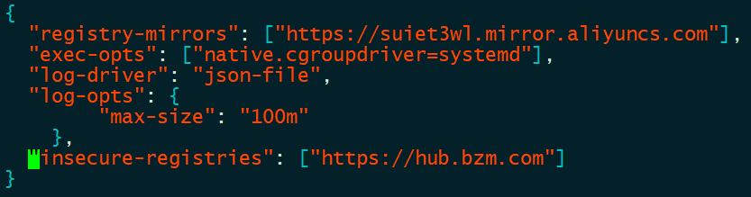
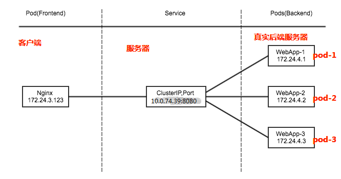
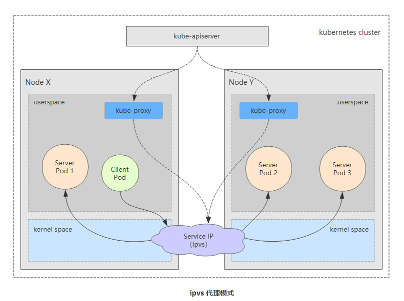
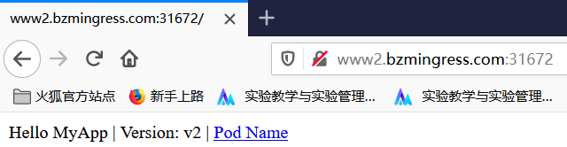
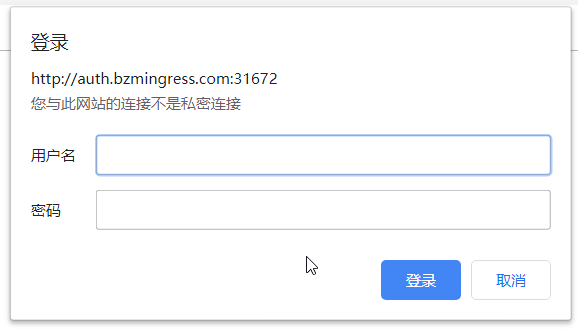
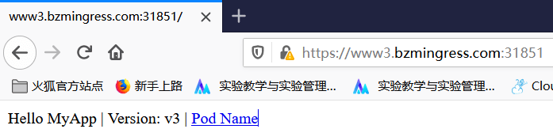
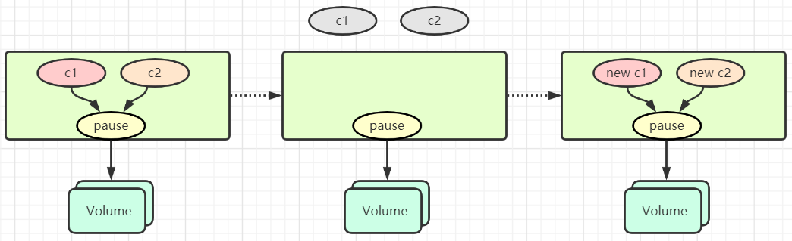
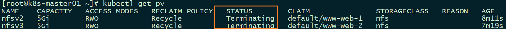
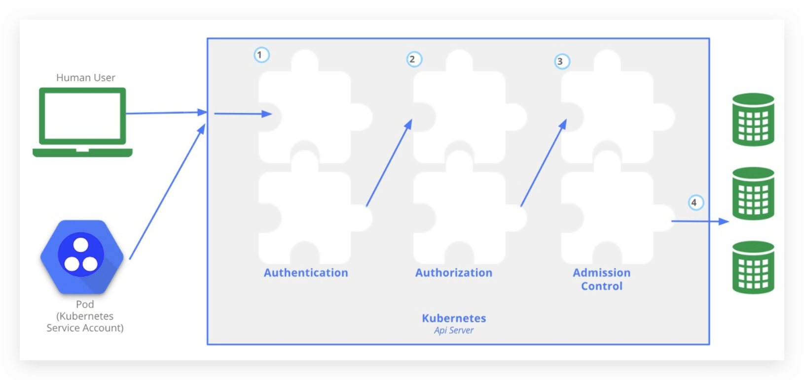

# Kubernetes

## 1. Kubernetes 简介

### 1.1. Kubernetes 是什么？

`Kubernetes	`是谷歌开源的容器集群管理系统，Kubernetes 是一个可移植的、可扩展的开源平台，用于管理容器化的工作负载和服务，可促进声明式配置和自动化。Kubernetes 拥有一个庞大且快速增长的生态系统。Kubernetes 的服务、支持和工具广泛可用。

>   是  Google	多年大规模容器管理技术 Borg的开源版本，由Go语言翻写。


### 1.2. Kubernetes 能做什么？

1.  基于容器的应用部署、维护和滚动升级 
2.  负载均衡和服务发现 
3.  跨机器和跨地区的集群调度 
4.  自动伸缩 
5.  无状态服务和有状态服务 
6.  广泛的*Volume*支持 
7.  插件机制保证扩展性

真实的生产环境应用会包含多个容器，而这些容器还很可能会跨越多个服务器主机部署。

-   Kubernetes 提供了为那些工作负载大规模部署容器的编排与管理能力。
-   Kubernetes 编排让你能够构建多容器的应用服务，在集群上调度或伸缩这些容器，以及管理它们随时间变化的健康状态。

>   Kubernetes 也需要与网络、存储、安全、监控等其它服务集成才能提供综合性的容器基础设施。


## 2. Kubernetes 架构

>   Kubernetes是基于Borg翻写的，先来简单看下Borg架构。

**Borg架构图**


**Kubernetes 架构图**

高可用的集群的副本至少是大于3 的奇数



>   C/S结构：Server服务器，node节点。

-   `apiserver`：	提供了资源操作的唯一入口，并提供认证、授权、访问控制、API	注册和 发现等机制； 
-   `controller	manager`：	负责维护集群的状态，比如故障检测、自动扩展、滚动更新 等； 
-   `scheduler`：	负责资源的调度，按照预定的调度策略将	Pod	调度到相应的机器上； 

-   `etcd`： 一个可信赖的分布式键值存储服务，保存了整个集群的状态（持久化）； 
-   `kubelet`：	直接跟容器引擎交互，负责维护容器的生命周期，同时也负责	Volume（CVI）和网络（CNI）的管 理；
-   `kube-proxy`：	负责为Service提供cluster内部的服务发现，通信和负载均衡 ；


## 3. Kubernetes	基本概念

### 3.1. Pod

#### 3.1.1. Pod概念

`Pod`是一组紧密关联的容器集合，它们共享PID、IPC、Network和UTS	namespace， 是Kubernetes调度的基本单位。Pod	内的多个容器共享网络和文件系统，可以通过进程间通信和文件共享这种简单高效的方式组合完成服务。

```markdown
- 每个Pod都有一个特殊的被称为"根容器"的Pause容器
- 每个Pod中有一个Pause容器保存所有的容器状态，通过管理Pause容器，达到管理Pod中所有容器的效果
- 在同一个Pod里面，即共享网络，又共享存储
```


#### 3.1.2. Pod类型

-   自主式的Pod（不被控制器管理）
-   控制器管理的Pod

#### 3.1.3. Pod 控制器类型

##### 3.1.3.1. ReplicationContro1ler & ReplicaSet & Deployment

-   `ReplicationController`用来确保容器应用的副本数始终保持在用户定义的副本数，即如果有容器异常退出，会自动创建新的`Pod`来替代;而如果异常多出来的容器也会自动回收。

-   `ReplicaSet`跟`ReplicationController`没有本质的不同，只是名字不一样，并且`ReplicaSet`支持集合式的selector

    >   建议使用`ReplicaSet`来取代`ReplicationContro11e`

-   `Deployment `为 `Pod `和 `ReplicaSet `提供了一个声明式定义 (`declarative`) 方法，用来替代以前的`ReplicationController `来方便的管理应用。这样就无需担心跟其他机制的不兼容问题（比如`rolling update`但 `Deployment`支持）

    ​	①定义 Deployment 来创建 Pod 和 ReplicaSet

    ​	②滚动升级和回滚应用【Deployment自身具备的特点】

    ​	③扩容和缩容【RS就已经实现，Deployment通过RS管理Pod因此也支持】

    ​	④暂停和继续 Deployment【Deployment自身具备的特点】

    >   [Deployment更新](#Deployment更新策略)

##### 3.1.3.2. HPA （HorizontalPodAutoScale)

`Horizontal Pod Autoscaling `仅适用于`Deployment`和`ReplicaSet `，在v1版本中仅支持根据Pod的CPU 利用率扩所容，在vlalpha版本中，支持根据内存和用户自定义的metric扩缩容


>   可以自定义扩缩规则：Cpu > 80，Max 10，Min 2

`Pod `水平自动扩缩特性由 `Kubernetes API` 资源和控制器实现。资源决定了控制器的行为。 控制器会周期性的调整副本控制器或 `Deployment `中的副本数量，以使得 `Pod `的平均 `CPU `利用率与用户所设定的目标值匹配。

##### 3.1.3.3. DaemonSet

*DaemonSet* 确保全部（或者某些）节点上运行一个 Pod 的副本。 当有节点加入集群时， 也会为他们新增一个 Pod 。 当有节点从集群移除时，这些 Pod 也会被回收。删除 DaemonSet 将会删除它创建的所有 Pod。

DaemonSet 的一些典型用法：

-   在每个节点上运行集群存守护进程
-   在每个节点上运行日志收集守护进程
-   在每个节点上运行监控守护进程

##### 3.1.3.4. Job，Cronjob

*`Job `*负责批处理任务，即仅执行一次的任务，它保证批处理任务的一个或多个Pod成功结束

*`Cron Job`* 创建基于时间调度的 Jobs。

> 典型的用法如下所示：
>
> - 在给定的时间点调度 Job 运行
> - 创建周期性运行的 Job，例如：数据库备份、发送邮件 

##### 3.1.3.5. StatefullSet

`StatefulSet `作为 `Controller `为 `Pod `提供唯一的标识。它可以保证部署和 `scale `的顺序
 `StatefulSet`是为了解决有状态服务的问题（对应`Deployments`和`ReplicaSets`是为无状态服务而设计）

-   稳定的、唯一的网络标识符。
-   稳定的、持久的存储。
-   有序的、优雅的部署和缩放。
-   有序的、自动的滚动更新。

>   但是对于mysql这些有状态服务，还是不建议放入k8s中

---


### 3.2. 服务发现


### 3.3. 网络通讯模式

`Kubernetes `的网络模型假定了所有Pod 都在一个可以直接连通的扁平的网络空间中。

-   同一个Pod 内的多个容器之间：lo
-   各Pod 之间的通讯：Overlay Network
-   Pod 与Service 之间的通讯：各节点的Iptables 规则


#### 3.3.1. 不同情况下网络通信方式

<u>同一个Pod 内部通讯：</u>

-   同一个*Pod* 共享同一个网络命名空间，共享同一个*Linux* 协议栈

<u>Pod1 至Pod2：</u>

-   *Pod1* 与*Pod2* 不在同一台主机，*Pod*的地址是与*docker0*在同一个网段的，但*docker0*网段与宿主机网卡是两个完全不同的IP网段，并且不同Node之间的通信只能通过宿主机的物理网卡进行。将Pod的IP和所在Node的IP关联起来，通过这个关联让Pod可以互相访问
-   *Pod1* 与*Pod2* 在同一台机器，由*Docker0* 网桥直接转发请求至*Pod2*，不需要经过*Flannel*  

<u>Pod 至 Service的网络：</u>

-   目前基于性能考虑，全部为iptables 维护和转发（目前已经为lvs）

<u>Pod 到外网：</u>

-   Pod 向外网发送请求，查找路由表, 转发数据包到宿主机的网卡，宿主网卡完成路由选择后，iptables执行Masquerade，把源IP 更改为宿主网卡的IP，然后向外网服务器发送请求

<u>外网访问Pod：</u>

-   Service


#### 3.3.2. 网络解决方案

##### 3.3.2.1. Kubernetes + Flannel


-   Flannel首先创建了一个名为flannel0的网桥，然后这个网桥的一端连接docker0的网桥，另一端连接一个名为flanneld的服务进程。
-   Flanneld进程并不简单，它首先上连etcd，利用etcd来管理可分配的IP地址段资源，同时监控etcd中每个Pod的实际地址，并在内存中建立了一个Pod节点路由表；然后下连docker0和物理网络，使用内存中的Pod节点路由表，将docker0发给它的数据包包装起来，利用物理网络的连接将数据包投递到目标flanneld上，从而完成pod到pod之间的直接的地址通信。

>   这里消耗的资源还是比较高得~首先要进行二次封装，然后到目标主机后再进行解封装

**ETCD之Flannel提供说明：**

-   存储管理Flannel 可分配的IP 地址段资源  
-   监控ETCD 中每个 Pod 的实际地址，并在内存中建立维护 Pod 节点路由表


## 4. Kubernetes	集群安装

### 4.1. 集群规划

| 节点         | 处理器 | 内存 |
| ------------ | ------ | ---- |
| k8s-master01 | 1/2    | 2G   |
| k8s-node1    | 2/2    | 4G   |
| k8s-node2    | 2/2    | 4G   |


### 4.2. 搭建过程

#### 4.2.1. Kuberbetes 环境准备

>   `k8s-master01`，`k8s-node01`，`k8s-node02`所有节点安装

1、设置系统主机名以及 Host 文件的相互解析

```shell
vim /etc/hosts

192.168.200.61 k8s-master01 m1
192.168.200.71 k8s-node01 n1
192.168.200.72 k8s-node02 n2
```

2、关闭防火墙，SELinux

```shell
systemctl stop firewalld   
systemctl disable firewalld     

setenforce 0   
sed -i 's/\(SELINUX=\).*/\1disabled/' /etc/selinux/config
```

3、调整系统的时区

```shell
#设置系统时区为中国/上海
timedatectl set-timezone Asia/Shanghai
#将当前的UTC时间写入硬件时钟
timedatectl set-local-rtc 0
#重启依赖于系统时间的服务
systemctl restart rsyslog
systemctl restart crond
```

4、关闭系统不需要服务

```shell
systemctl stop postfix && systemctl disable postfix
```

5、关闭虚拟内存空间

```
swapoff -a && sed -i '/ swap / s/^\(.*\)$/#\1/g' /etc/fstab
```

>   因为开启虚拟内存空间，k8s就可能运行在虚拟内存空间中，大大影响k8s效率，建议关闭

6、配置yum源，可以用阿里云

[CentOS 7- 配置阿里镜像源](https://developer.aliyun.com/article/704987)

7、升级系统内核为 4.44

```shell
rpm -Uvh http://www.elrepo.org/elrepo-release-7.0-3.el7.elrepo.noarch.rpm

yum --enablerepo=elrepo-kernel install -y kernel-lt
grub2-set-default 'CentOS Linux (4.4.240-1.el7.elrepo.x86_64) 7 (Core)'
grub2-editenv list
cat /boot/grub2/grub.cfg |grep menuentry
```

>   不升级为4.4，并不会造成k8s安装失败，但是会造成一些不稳定因素。

8、调整内核参数，对于 K8S

```shell
cat > kubernetes.conf <<EOF
net.bridge.bridge-nf-call-iptables=1
net.bridge.bridge-nf-call-ip6tables=1
net.ipv4.ip_forward=1
net.ipv4.tcp_tw_recycle=0
vm.swappiness=0 # 禁止使用 swap 空间，只有当系统 OOM 时才允许使用它
vm.overcommit_memory=1 # 不检查物理内存是否够用
vm.panic_on_oom=0 # 开启 OOM
fs.inotify.max_user_instances=8192
fs.inotify.max_user_watches=1048576
fs.file-max=52706963
fs.nr_open=52706963
net.ipv6.conf.all.disable_ipv6=1
net.netfilter.nf_conntrack_max=2310720
EOF
cp kubernetes.conf  /etc/sysctl.d/kubernetes.conf
sysctl -p /etc/sysctl.d/kubernetes.conf
```

9、安装依赖包

```shell
yum install -y conntrack ntpdate ntp ipvsadm ipset jq iptables curl sysstat libseccomp wgetvimnet-tools git
```

10、设置 rsyslogd 和 systemd journald

```shell
mkdir /var/log/journal # 持久化保存日志的目录
mkdir /etc/systemd/journald.conf.d
cat > /etc/systemd/journald.conf.d/99-prophet.conf <<EOF 
[Journal]
# 持久化保存到磁盘
Storage=persistent

# 压缩历史日志
Compress=yes

SyncIntervalSec=5m RateLimitInterval=30s RateLimitBurst=1000

# 最大占用空间 10G 
SystemMaxUse=10G

# 单日志文件最大 200M 
SystemMaxFileSize=200M

# 日志保存时间 2 周
MaxRetentionSec=2week

# 不将日志转发到 syslog 
ForwardToSyslog=no 
EOF
systemctl restart systemd-journald
```

#### 4.2.2. Kuberbetes 部署安装

1、kube-proxy开启ipvs的前置条件

>   ipvs：解决svc(service)和pod之间的调度关系，极大增加效率。

```shell
modprobe br_netfilter

cat > /etc/sysconfig/modules/ipvs.modules <<EOF 
modprobe -- ip_vs 
modprobe -- ip_vs_rr 
modprobe -- ip_vs_wrr 
modprobe -- ip_vs_sh
modprobe -- nf_conntrack_ipv4 
EOF

chmod 755 /etc/sysconfig/modules/ipvs.modules && bash /etc/sysconfig/modules/ipvs.modules &&
lsmod | grep -e ip_vs -e nf_conntrack_ipv4
```

2、安装docker

```shell
# docker 需要的一些依赖
yum install -y yum-utils device-mapper-persistent-data lvm2

# 导入阿里源的docker远程仓库
yum-config-manager --add-repo http://mirrors.aliyun.com/docker-ce/linux/centos/docker-ce.repo

yum update -y && yum install -y docker-ce-18.06.3.ce-3.el7

# 创建 /etc/docker 目录

mkdir /etc/docker

# 配置 daemon.

cat >/etc/docker/daemon.json <<EOF
{
  "registry-mirrors": ["https://suiet3wl.mirror.aliyuncs.com"],
  "exec-opts": ["native.cgroupdriver=systemd"], 
  "log-driver": "json-file", 
  "log-opts": { 
        "max-size": "100m" 
    }
}
EOF

# 存放docker的配置文件
mkdir -p /etc/systemd/system/docker.service.d

# 重启docker服务
systemctl daemon-reload && systemctl restart docker && systemctl enable docker
```

 3、安装Kubeadm

```shell
cat <<EOF > /etc/yum.repos.d/kubernetes.repo 
[kubernetes] 
name=Kubernetes 
baseurl=http://mirrors.aliyun.com/kubernetes/yum/repos/kubernetes-el7-x86_64 
enabled=1 
gpgcheck=0 
repo_gpgcheck=0 
gpgkey=http://mirrors.aliyun.com/kubernetes/yum/doc/yum-key.gpg http://mirrors.aliyun.com/kubernetes/yum/doc/rpm-package-key.gpg
EOF

# 指定安装版本（这里统一使用1.15.1）
yum -y install kubeadm-1.15.1 kubectl-1.15.1 kubelet-1.15.1
systemctl enable kubelet.service
```

4、初始化Kubermetes 节点

直接`kubeadm init` ，会因为网络原因在这里卡很久。可以预先拉取配置。


> `kubeadm-basic.images.tar.gz`：公众号：<u>云计算小千</u>  回复：*k8s安装*

```shell
# 解压
tar -zxvf kubeadm-basic.images.tar.gz
```

写个简单shell脚本导入镜像`k8s-load.sh`

```shell
#!/bin/bash
ls /root/kubeadm-basic.images >/tmp/image-list.txt
cd /root/kubeadm-basic.images

for i in $(cat /tmp/image-list.txt)
do
	docker load -i $i
done

rm -fr /tmp/image-list.txt
```

```shell
# 生成kubeadm的默认配置文件
kubeadm config print init-defaults > kubeadm-config.yaml 
```

```shell
vim kubeadm-config.yaml

localAPIEndpoint:        
	advertiseAddress: 192.168.200.61 
kubernetesVersion: v1.15.1    
networking:      
	podSubnet: "10.244.0.0/16"      
	serviceSubnet: 10.96.0.0/12    
---    
apiVersion: kubeproxy.config.k8s.io/v1alpha1    
kind: KubeProxyConfiguration    
featureGates:      
	SupportIPVSProxyMode: true    
mode: ipvs
```

```shell
# 初始化
kubeadm init --config=kubeadm-config.yaml --experimental-upload-certs | tee kubeadm-init.log
```

> `kubeadm-init.log`文件保存好，**从节点不需要初始化**。

使用kubectl工具

```shell
mkdir -p $HOME/.kube
sudo cp -i /etc/kubernetes/admin.conf $HOME/.kube/config
sudo chown $(id -u):$(id -g) $HOME/.kube/config
```

5、部署网络

```shell
kubectl apply -f https://raw.githubusercontent.com/coreos/flannel/a70459be0084506e4ec919aa1c114638878db11b/Documentation/kube-flannel.yml
```

> 确保网络好，能够访问到quay.io这个registery。否则进行下面操作

```shell
# 可能存在网络原因，可以先wget下来
wget https://raw.githubusercontent.com/coreos/flannel/a70459be0084506e4ec919aa1c114638878db11b/Documentation/kube-flannel.yml

kubectl create -f kube-flannel.yml
```

6、node加入master节点

```shell
kubeadm join 192.168.200.61:6443 --token abcdef.0123456789abcdef \
    --discovery-token-ca-cert-hash sha256:3a6ea23cd5ea4571b768b65819b4a5df59d8d7286c21c67e4b65353e6ebd5cc9 
```

> 执行在kubeadm init输出的kubeadm join命令

所有节点加入完成

```shell
[root@k8s-master01 ~]# kubectl get node
NAME           STATUS   ROLES    AGE     VERSION
k8s-master01   Ready    master   25m     v1.15.1
k8s-node1      Ready    <none>   3m14s   v1.15.1
k8s-node2      Ready    <none>   3m22s   v1.15.1
```


### 4.3. 配置私有仓库

> 构建`Harbor`节点，作为私有仓库，并且已经安装了docker ，安装方式与之前一样。

`docker-compose`安装

> [Docker Compose 快速入门](https://mp.weixin.qq.com/s?__biz=MzkxNjEyNjM4OA==&mid=2247484289&idx=1&sn=0145c605df064205ef8f42b38aae132f&chksm=c155ec5af622654c1720c8c6eb4b088cc74344f65be56c02f341ae09a2bcba3a2292199b434b&token=1512659361&lang=zh_CN#rd)

指定镜像仓库地址，每个节点都要添加

```shell
vim /etc/docker/daemon.json

"insecure-registries": ["https://hub.bzm.com"] 
```



> 可以先做一个假的地址证书，在局域网内部

添加完毕后，重启docker

```shell
systemctl restart docker
```

安装：Harbor 

官方地址：https://github.com/vmware/harbor/releases 

下载地址：https://github.com/vmware/harbor/releases/download/v1.2.0/harbor-offline-installer-v1.2.0.tgz

> `harbor-offline-installer-v1.2.0.tgz`：公众号：<u>云计算小千</u>  回复：*k8s安装*

解压Harbor

```shell
tar -zxvf harbor-offline-installer-v1.2.0.tgz -C /usr/local/
```

```shell
vim /usr/local/harbor/harbor.cfg
hostname = hub.bzm.com

ui_url_protocol = https
```

创建证书目录

```shell
mkdir -p /data/cert/
```


创建https 证书以及配置相关目录权限

```shell
[root@hub cert]# openssl genrsa -des3 -out server.key 2048 
Generating RSA private key, 2048 bit long modulus
......................................................+++
......................+++
e is 65537 (0x10001)
Enter pass phrase for server.key:
Verifying - Enter pass phrase for server.key:
```

```shell
openssl req -new -key server.key -out server.csr 
[root@hub cert]# openssl req -new -key server.key -out server.csr 
Enter pass phrase for server.key:
You are about to be asked to enter information that will be incorporated
into your certificate request.
What you are about to enter is what is called a Distinguished Name or a DN.
There are quite a few fields but you can leave some blank
For some fields there will be a default value,
If you enter '.', the field will be left blank.
-----
Country Name (2 letter code) [XX]:CN
State or Province Name (full name) []:BJ
Locality Name (eg, city) [Default City]:BJ
Organization Name (eg, company) [Default Company Ltd]:bzm
Organizational Unit Name (eg, section) []:bzm
Common Name (eg, your name or your server's hostname) []:hub.bzm.com
Email Address []:2794127547@qq.com

Please enter the following 'extra' attributes
to be sent with your certificate request
A challenge password []:
An optional company name []:
```

```shell
# 私钥备份
$ cp server.key server.key.org 

# 退去私钥密码
$ openssl rsa -in server.key.org -out server.key 
Enter pass phrase for server.key.org:
writing RSA key

openssl x509 -req -days 365 -in server.csr -signkey server.key -out server.crt 

# 给所有证书都赋予 x 权限
chmod a+x *
```

安装

```shell
cd /usr/local/harbor/

./install.sh 
```


```shell
# 所有节点添加映射
echo "192.168.200.80 hub.bzm.com" >>/etc/hosts

# win的hosts映射
192.168.200.80 hub.bzm.com
```

访问：https://hub.bzm.com；用户名：admin，密码：Harbor12345


> 到这里Harbor基本安装完成

可以在一个节点登录测试下

```shell
[root@k8s-node1 ~]# docker login https://hub.bzm.com
Username: admin
Password: 
WARNING! Your password will be stored unencrypted in /root/.docker/config.json.
Configure a credential helper to remove this warning. See
https://docs.docker.com/engine/reference/commandline/login/#credentials-store

Login Succeeded
```


```
docker pull qianzai/k8s-myapp:v1

docker tag qianzai/k8s-myapp:v1 hub.bzm.com/library/myapp:v1

docker push hub.bzm.com/library/myapp:v1
```


测试k8s集群是否可用，是否与私有仓库连接了

```shell
kubectl run nginx-deployment --image=hub.bzm.com/library/myapp:v1 --port=80 --replicas=1
```


## 5. Kubernetes  资源清单

### 5.1. Kubernetes 中的资源

K8s 中的资源可以分为三类：

- 名称空间级别
- 集群级别
- 元数据型

#### 5.1.1. 1.、名称空间级别

- **工作负载型资源（ workload）**

Pod、ReplicaSet、Deployment、StatefulSet、DaemonSet、Job、CronJob

- **服务发现及负载均衡型资源（ServiceDiscovery LoadBalance）**

Service、Ingress、...

- **配置与存储型资源**

Volume（存储卷）、CSI（容器存储接口，可以扩展各种各样的第三方存储卷）

- **特殊类型的存储卷**

ConfigMap（当配置中心来使用的资源类型）、Secret（保存敏感数据）、DownwardAPI（所外部环境中的信息输出给容器）

#### 5.1.2. 2、 集群级别

Namespace、Node、Role、ClusterRole、RoleBinding、ClusterRoleBinding

#### 5.1.3. 元数据、

HPA、PodTemplate、LimitRange

### 5.2. 资源清单

k8s一般都是通过定义资源清单的方式去创建资源，资源清单等价于剧本，写好了每一步应该如何去做。一般使用yaml格式的文件来创建符合我们预期期望的资源，这样的yaml文件我们一般称为资源清单。

> yaml格式 就不一一介绍了，大家或多或少都了解点。**详情见百度**

### 5.3. 常用字段的解释

#### 5.3.1. 必填字段：

| 参数名                  | 字段类型 | 说明                                                         |
| ----------------------- | -------- | :----------------------------------------------------------- |
| version                 | String   | 指 K8s API 的版本，目前基本上是 v1 ，可以用 `kubectl api-versions` 命令查询 |
| kind                    | String   | 指 yaml 文件定义的资源类型和角色，比如：Pod                  |
| metadata                | Object   | 元数据对象                                                   |
| metadata.name           | String   | 元数据对象的名字，比如命名 Pod 的名字                        |
| metadata.namespace      | String   | 元数据对象的命名空间（默认default）                          |
| spec                    | Object   | 详细定义对象                                                 |
| spec.containers[]       | List     | 容器列表的定义                                               |
| spec.containers[].name  | String   | 容器的名字                                                   |
| spec.containers[].image | String   | 容器镜像的名称                                               |

#### 5.3.2. 主要字段：

| 参数名                                      | 字段类型 | 说明                                                         |
| ------------------------------------------- | -------- | :----------------------------------------------------------- |
| spec.containers[].imagePullPolicy           | String   | 定义镜像的拉取策略，有Always、Never、IfNotPresent三个值可选，（1）Always：意思是每次都尝试重新拉取镜像，（2）Never：表示仅使用本地镜像，（3）IfNotPresent：如果本地有镜像就使用本地镜像，没有就拉取在线镜像。上面三个值都没设置的话，默认是Always。 |
| spec.containers[].command[]                 | List     | 指定容器启动命令，因为是数组可以指定多个，不指定则使用镜像打包时使用的启动命令。 |
| spec.containers[].args[]                    | List     | 批定容器启动命令参数，因为是数组可以指定多个。               |
| spec.containers[].workingDir                | String   | 指定容器的工作目录                                           |
| spec.containers[].volumeMounts[]            | List     | 指定容器内部的存储卷位置                                     |
| spec.containers[].volumeMounts[].name       | String   | 指定可以被容器挂载的存储卷的名称                             |
| spec.containers[].volumeMounts[].mountPath  | String   | 指定可以被挂载的存储卷的路径                                 |
| spec.containers[].volumeMounts[].readOnly   | String   | 设置存储卷路径的读写模式，true或者false，默认为读写模式      |
| spec.containers[].ports[]                   | List     | 指定容器需要用到的端口列表                                   |
| spec.containers[].ports[].name              | String   | 指定端口名称                                                 |
| spec.containers[].ports[].containerPort     | String   | 指定容器需要监听的端口号                                     |
| spec.containers[].ports[].hostPort          | String   | 指定容器所在主机需要监听的端口号，默认跟上面containerPort相同，注意设置了hostPort同一台主机无法启动该容器的相同副本（会端口冲突） |
| spec.containers[].ports[].protocol          | String   | 指定端口协议，支持TCP和UDP，默认为TCP                        |
| spec.containers[].env[]                     | List     | 指定容器运行前需要设置的环境变量列表                         |
| spec.containers[].env[].name                | String   | 指定环境变量名称                                             |
| spec.containers[].env[].value               | String   | 指定环境变量值                                               |
| spec.containers[].resources                 | Object   | 指定资源限制和资源请求的值（这里开始就是设置容器的资源上限） |
| spec.containers[].resources.limits          | Object   | 指定设置容器运行时资源的运行上限                             |
| spec.containers[].resources.limits.cpu      | String   | 指定CPU限制，单位为core数，将用于docker run --cpu-shares参数 |
| spec.containers[].resources.limits.memory   | String   | 指定MEM内存的限制，单位为MIB、GiB                            |
| spec.containers[].resources.requests        | Object   | 指定容器启动和调度时的限制设置                               |
| spec.containers[].resources.requests.cpu    | String   | CPU请求，单位为core数，容器启动时初始化可用数量              |
| spec.containers[].resources.requests.memory | String   | 内存请求，单位为MIB、GiB，容器启动时初始化可用数量           |

#### 5.3.3. 额外字段：

| 参数名                | 字段类型 | 说明                                                         |
| --------------------- | -------- | ------------------------------------------------------------ |
| spec.restartPolicy    | String   | 定义Pod的重启策略，可选值为Always、OnFailure、默认为Always。  1. Always：Pod一旦终止运行，则无论容器是如何终止的，kubelet服务都将重启它  2.OnFailure：只有Pod以非零退出码终止时，kubelet才会重启该容器。如果容器正常结束（退出码为0），则kubelet不会重启它。  3.Never：Pod终止后，kubelet将退出码报告给master，不会重启该Pod |
| spec.nodeSelector     | Object   | 定义Node的Label过滤标签，以key:value格式指定                 |
| spec.imagePullSecrets | Object   | 定义pull镜像时使用secret名称，以name:secretkey格式指定       |
| spec.hostNetwork      | Boolean  | 定义是否使用主机网络模式，默认值是false，设置true表示使用主机网络，不使用docker网桥，同时设置了true将无法在同一台宿主机上启动第二个副本 |

> 以上命令也是来自网络整理，大概有个印象即可

也可以通过 `kubectl explain [name]` 命令查看每个字段的解释和用法，比如：

```shell
$ kubectl explain pod
$ kubectl explain pod.spec
$ kubectl explain pod.spec.containers
```

简单的资源清单文件创建 `pod.yaml`

```yaml
apiVersion: v1
kind: Pod
metadata:
  name: myapp-pod
  labels:
    app: myapp
    version: v1

spec:
  containers:
    - name: app
      image: hub.bzm.com/library/myapp:v1
```

```shell
[root@k8s-master01 ~]# kubectl create -f pod.yaml
pod/myapp-app created
[root@k8s-master01 ~]# kubectl get pod
NAME                                READY   STATUS    RESTARTS   AGE
myapp-pod                          1/1     Running   0          12s
```

### 5.4. 容器生命周期


#### 5.4.1. Init 初始容器

##### 5.4.1.1. Init 初始容器简介

初始化容器即 `Pod `内主容器启动之前要运行的容器，主要是做一些前置工作，下面直接称为 `Init `容器。

Init 容器与普通的容器非常像，除了以下两点：

- **Init 容器总是运行到成功完成为止**
- **每个 Init 容器都必须在下一个 Init 容器启动之前成功完成**

> 如果 Pod 的 Init 容器启动失败，Kubernetes 会不断地重启该 Pod ，直到 Init 容器成功为止。如果 Pod 对应的 restartPolicy 为 Never ，它失败后不会再重新启动。

##### 5.4.1.2. Init 容器的作用

因为 Init 容器具有与应用程序容器分离的单独镜像，所以它们的启动相关代码具有如下优势：

- 它们可以包含并运行实用工具。（比如在主容器启动之前，需要有一些文件被创建）
- 应用程序镜像可以分离出创建和部署的角色，而没有必要联合它们构建一个单独的镜像。
- Init 容器使用 Linux Namespace ，所以相对应用程序容器来说具有不同的文件系统视图。因此，它们能够具有访问 Secret 的权限，而应用程序容器则不能。
- 它们必须在应用程序容器启动之前运行完成，而应用程序容器是并行运行的，所以 Init 容器能够提供了一种简单的阻塞或延时应用容器启动的方法，直到满足了一组先决条件。（比如一个 Pod 里面有两个容器，分别运行 mysql 和 apache+php，可以在 apache+php 容器的 Init 检测 mysql 的就绪状态，只有 mysql 就绪了才能创建 apache+php 容器）

##### 5.4.1.3. Init 容器案例

`init-pod.yaml`

```shell
apiVersion: v1
kind: Pod
metadata:
  name: myapp-pod
  labels:
    app: myapp
spec:
  containers:
  - name: myapp-container
    image: busybox
    command: ['sh', '-c', 'echo The app is running! && sleep 360']
  initContainers:
  - name: init-myservice
    image: busybox
    command: ['sh', '-c', 'until nslookup myservice; do echo waiting for myservice; sleep 2; done;']
  - name: init-mydb
    image: busybox
    command: ['sh', '-c', 'until nslookup mydb; do echo waiting for mydb; sleep 2; done;']
```

`containers`容器：

- myapp-container：启动后打印一段话，然后休眠 6 分钟

两个`initContainers`容器：

- init-myservice
- init-mydb

这两个容器都是通过 `nslookup dns` 查询对应的服务*（myservice）*是否存在，如果存在则成功（返回 0 ），不存在则睡眠 2 秒后再重复检查。

```shell
[root@master01 ~]# kubectl apply -f init-pod.yaml
pod/myapp-pod created

[root@master01 ~]# kubectl get pod
NAME        READY   STATUS     RESTARTS   AGE
myapp-pod   0/1     Init:0/2   0          34s
```

> 可以发现`myapp-pod`这个`Pod`的`init`容器都没有成功。

```shell
# 查看容器Log，注意这里Pod里面有两个容器，需要指定容器名
[root@k8s-master01 ~]# kubectl log myapp-pod -c init-myservice
log is DEPRECATED and will be removed in a future version. Use logs instead.
Server:		10.96.0.10
Address:	10.96.0.10:53

** server can't find myservice.default.svc.cluster.local: NXDOMAIN

*** Can't find myservice.svc.cluster.local: No answer
*** Can't find myservice.cluster.local: No answer
*** Can't find myservice.default.svc.cluster.local: No answer
*** Can't find myservice.svc.cluster.local: No answer
*** Can't find myservice.cluster.local: No answer

waiting for myservice
```

用`myservice.yaml`创建一个Service

```yaml
apiVersion: v1
kind: Service
metadata:
  name: myservice
spec:
  ports:
    - protocol: TCP
      port: 80
      targetPort: 9376
```

```shell
[root@master01 ~]# kubectl create -f myservice.yaml
service/myservice created

[root@master01 ~]# kubectl get pod
NAME        READY   STATUS     RESTARTS   AGE
myapp-pod   0/1     Init:1/2   0          17m

[root@k8s-master01 ~]# kubectl get svc
NAME         TYPE        CLUSTER-IP       EXTERNAL-IP   PORT(S)   AGE
kubernetes   ClusterIP   10.96.0.1        <none>        443/TCP   26h
myservice    ClusterIP   10.111.133.150   <none>        80/TCP    26m
```

> 可以发现 Init 状态里面成功了 1 个

再用`mydb.yaml`创建一个Service

```yaml
apiVersion: v1
kind: Service
metadata:
  name: mydb
spec:
  ports:
    - protocol: TCP
      port: 80
      targetPort: 9377
```

```shell
$ kubectl create -f mydb.yaml 
service/mydb created

$ kubectl get pod
NAME          READY   STATUS    RESTARTS   AGE
myapp-pod     1/1     Running   0          39m
```

> 可以看到 Pod 已经处于 `Running `状态了，因为两个 Init 容器已经执行成功。

- 在 Pod 启动过程中，Init 容器会按顺序在网络和数据卷初始化（即 pause 容器）之后启动。每个 Init 容器必须在上个容器成功退出后再启动。
- 如果由于运行时或失败退出，将导致容器启动失败，它会根据 Pod 的 restartPolicy 指定的策略进行重试。如果 Pod 的 restartPolicy 设置为 Always，Init 容器失败时会使用 RestartPolicy 策略。
- 在所有的 Init 容器没有成功之前，Pod 将不会变成 Ready 状态。
- 如果 Pod 重启，所有 Init 容器必须重新执行
- 更改 Init 容器的 image 字段，会重启该 Pod
- Init 容器具有应用容器的所有字段，除了 readinessProbe 。因为它一完成后就退出了。
- 在 Pod 中的每个 app 和 Init 容器的名称必须唯一。

#### 5.4.2. 容器探针

##### 5.4.2.1. 探针简介

探针是`kubelet`用于周期性诊断容器的一种方式。目前`kubenertes`提供两种探针，通过调用容器提供的句柄(`handler`)来实现监测诊断。

<u>每次探测都将获得以下三种结果之一：</u>

- 成功：容器通过了诊断
- 失败：容器未通过诊断
- 未知：诊断失败，不会采取任何行动

**两种探针**

- **readinessProbe**（就绪探测）: 用于探测容器是否可以处理服务请求，如果该探针失败，端点控制器将会把该`Pod`的IP从关联的`Service`中删除掉。如果没有配置该探针，默认返回成功的状态。
- **livenessProbe**（存活探测）: 用于探测容器是否处于`Running`状态，如果该探针返回失败，`kubelet`将会杀掉容器，并根据`restart policy`来决定是否重新创建该容器。如果没有配置该探针，默认返回成功的状态，只有容器`crash`，才会触发失败状态返回。

**三种操作**

- **ExecAction**: 在容器中执行命令行，如果命令的退出状态是0，则认为探针的状态是成功。
- **TCPSocketAction**: 向容器指定端口上发送TCP请求，如果该端口已被监听，则认为探针的状态是成功。
- **HTTPGetAction**: 向容器指定端口和路径发送HTTP GET请求，如果返回状态码处于200到400之间，则认为探针的状态是成功

**四种场景**

- **Default**: 不配置探针时，容器处于不健康的状态(如`crash`)时，`kubelet`也会杀掉容器；容器正常初始化后，就认为是可以提供服务的状态。
- **Custom**: 在某种情况下，进程无法正常提供功能，但容器依然处于健康状态，则可以通过配置`liveness`探针实现杀掉容器； 进程初始化事件比较长，则可以通过配置`readiness`探针实现服务可用。
- **Reset**: 某些进程处于中间过程状态，但又希望从初始状态开始时，可以通过配置`liveness`探针实现，同时提供复位接口，如请求复位接口，则探针返回失败状态，从而实现复位操作。默认返回成功状态。
- **OutOfService**: 在进行服务升级时，需要将服务临时下线，可以通过配置`readiness`探针实现，同时提供服务下线接口，如请求下线接口，则探针返回失败状态，从而实现下线操作。默认返回成功状态。

##### 5.4.2.2. 探针案例

###### 5.4.2.2.1. 就绪探测（readinessProbe）

`read.yaml`

```yaml
apiVersion: v1
kind: Pod
metadata:
  name: readiness-httpget-pod
spec:
  containers:
    - name: readiness-httpget-container
      image: hub.bzm.com/library/myapp:v1
      imagePullPolicy: IfNotPresent
      readinessProbe:
        httpGet:
          port: 80
          path: /index1.html
        initialDelaySeconds: 1
        periodSeconds: 3
```

> 添加了就绪检测，在容器启动 1 秒后才开始检测，间隔 3 秒重试一下。

因为这个容器里根本没有 index1.html ，所以检测会失败。

```shell
[root@master01 ~]# kubectl create -f read.yaml
pod/readiness-httpget-pod created

[root@master01 ~]# kubectl get pod
NAME                    READY   STATUS    RESTARTS   AGE
readiness-httpget-pod   0/1     Running   0          31s
```

虽然显示的是 Running ，但是没有就绪。通过查看详情了解下原因。

```shell
[root@master01 ~]# kubectl describe pod readiness-httpget-pod
...
 Warning  Unhealthy  3m36s (x22 over 4m39s)  kubelet, node02    Readiness probe failed: HTTP probe failed with statuscode: 404
```

> 发现404。

绪检测失败了，再来看下 Log ：

```shell
[root@k8s-master01 ~]# kubectl logs readiness-httpget-pod
...
2020/10/12 01:53:12 [error] 8#8: *9 open() "/usr/share/nginx/html/index1.html" failed (2: No such file or directory), client: 10.244.1.1, server: localhost, request: "GET /index1.html HTTP/1.1", host: "10.244.1.240:80"
10.244.1.1 - - [12/Oct/2020:01:53:12 +0000] "GET /index1.html HTTP/1.1" 404 169 "-" "kube-probe/1.15" "-"
...
```

> 发现 index1.html 资源不存在。

那直接进入容器里创建一个 index1.html 试试

```shell
[root@k8s-master01 ~]# kubectl exec readiness-httpget-pod -it -- /bin/sh
/ # echo "hello" >> /usr/share/nginx/html/index1.html
/ # exit
```

再检查Pod状态就已经READY了

```shell
[root@k8s-master01 ~]# kubectl get pod
NAME                    READY   STATUS    RESTARTS   AGE
readiness-httpget-pod   1/1     Running   0          4m27s
```

###### 5.4.2.2.2. 存活探测（livenessProbe）

**演示 `ExecAction` 方式的存活检测**

`live-exec.yaml`

```yaml
apiVersion: v1
kind: Pod
metadata:
  name: liveness-exec-pod
  namespace: default
spec:
  containers:
    - name: liveness-exec-container
      image: busybox
      imagePullPolicy: IfNotPresent
      command: ["/bin/sh", "-c", "touch /tmp/live; sleep 60; rm -rf /tmp/live; sleep 3600"]
      livenessProbe:
        exec:
          command: ["test", "-e", "/tmp/live"]
        initialDelaySeconds: 1
        periodSeconds: 3
```

> 添加了一个存活检测，如果 `/tmp/live` 文件存在则存活，否则不存活，在容器启动 1 秒后开始检测，每间隔 3 秒重复执行。

主容器在启动的时候会创建 `/tmp/live` 文件，然后睡眠 60 秒后再删除这个文件。可以看出，在容器创建后存活检测应该成功，60 秒后检测应该失败。

```shell
[root@master01 ~]# kubectl get pod -w
NAME                READY   STATUS    RESTARTS   AGE
liveness-exec-pod   1/1     Running   0          8s
liveness-exec-pod   1/1     Running   1          96s
liveness-exec-pod   1/1     Running   2          3m12s
```

> 可以看出，96 秒后 Pod 开始重启了，因为存活检测失败会发生重启（默认重启策略是 Alwayls ）

**演示 `HTTPGetAction` 方式的存活检测**

`live-httpget.yaml`

```yaml
apiVersion: v1
kind: Pod
metadata:
  name: liveness-exec-pod
  namespace: default
spec:
  containers:
    - name: liveness-httpget-container
      image: hub.bzm.com/library/myapp:v1
      imagePullPolicy: IfNotPresent
      ports:
        - name: http
          containerPort: 80
      livenessProbe:
        httpGet:
          port: http
          path: /index.html
        initialDelaySeconds: 1
        periodSeconds: 3
        timeoutSeconds: 10
```

> 添加了一个存活检测，通过`http`的`get`请求`index.html`，通过则存活，否则不存活，在容器启动 1 秒后开始检测，每间隔 3 秒重复执行。最长超时时间为10秒。

```shell
[root@k8s-master01 ~]# kubectl create -f live-httpget.yaml
pod/liveness-exec-pod created
[root@k8s-master01 ~]# kubectl get pod
NAME                READY   STATUS    RESTARTS   AGE
liveness-exec-pod   1/1     Running   0          9s
[root@k8s-master01 ~]# kubectl get pod -o wide
NAME                READY   STATUS    RESTARTS   AGE     IP            NODE        NOMINATED NODE   READINESS GATES
liveness-exec-pod   1/1     Running   0          51s   10.244.2.84   k8s-node1   <none>           <none>
[root@master01 ~]# curl 10.244.2.84/index.html
Hello MyApp | Version: v1 | <a href="hostname.html">Pod Name</a>
```

> 可以发现pod是正常运行的，curl访问也正常。

现在进入容器把 index.html 文件删除，再来看下状态

```shell
[root@k8s-master01 ~]# kubectl exec liveness-exec-pod -it -- /bin/sh
/ # rm /usr/share/nginx/html/index.html
/ # exit
[root@master01 ~]# kubectl get pod -w
NAME                READY   STATUS    RESTARTS   AGE
liveness-exec-pod   1/1     Running   0          57s
liveness-exec-pod   1/1     Running   1          60s
```

> 可以看到 Pod 又在重启了，因为存活检测失败。然后就会会重启一次，因为重新创建容器后 index.html 是存在的。

**演示 `TCPSocketAction` 方式的存活检测**

`live-tcp.yaml`

```shell
apiVersion: v1
kind: Pod
metadata:
  name: liveness-tcp-pod
  namespace: default
spec:
  containers:
  - name: liveness-tcp-container
    image: hub.bzm.com/library/myapp:v1
    livenessProbe:
      tcpSocket:
        port: 8080
      initialDelaySeconds: 5
      timeoutSeconds: 1
      periodSeconds: 3
```

> 这里 8080 端口是不存在的，同样存活检测会失败

```shell
[root@k8s-master01 ~]# kubectl create -f live-tcp.yaml 
pod/liveness-tcp-pod created
[root@k8s-master01 ~]# kubectl get pod -w
NAME               READY   STATUS    RESTARTS   AGE
liveness-tcp-pod   1/1     Running   0          2s
liveness-tcp-pod   1/1     Running   1          14s
liveness-tcp-pod   1/1     Running   2          25s
liveness-tcp-pod   1/1     Running   3          37s
liveness-tcp-pod   0/1     CrashLoopBackOff   3          49s
```

> 可以看到 Liveness 一直会失败，Pod 会不断重启。

#### 5.4.3. 生命周期钩子

Kubernetes 为容器提供了两种生命周期钩子：

- postStart：于容器创建完成之后立即运行的钩子程序，但是，并不能保证钩子将在容器ENTRYPOINT之前运行。
- preStop：容器终止之前立即运行的程序，是以同步方式的进行，因此其完成之前会阻塞 删除容器的调用

`post.yaml`

```yaml
apiVersion: v1
kind: Pod
metadata:
  name: lifecycle-demo
spec:
  containers:
  - name: lifecycle-demo-container
    image: hub.bzm.com/library/myapp:v1
    lifecycle:
      postStart:
        exec:
          command: ["/bin/sh", "-c", "echo Hello from the postStart handelr > /usr/share/message"]
      preStop:
        exec:
          command: ["/bin/sh", "-c", "echo Hello from the preStop heandler > /usr/share/message"]
```

> 分别在容器启动和退出的时候向 `/usr/share/message` 输出一句话

```shell
[root@k8s-master01 ~]# kubectl create -f post.yaml 
pod/lifecycle-demo created
[root@k8s-master01 ~]# kubectl get pod
NAME             READY   STATUS             RESTARTS   AGE
lifecycle-demo   1/1     Running  			 0         13s
[root@k8s-master01 ~]# kubectl exec lifecycle-demo -it -- /bin/sh
/ # cat /usr/share/message
Hello from the postStart handelr
/ # exit
```

> 容器终止时候同样也会输出一句话，但容器终止了容器也就不在了，就不演示了。

#### 5.4.4. Pod STATUS 可能存在的值

**Pending**

挂起，Pod 已被 Kubernetes 系统接受，但有一个或者多个容器镜像尚未创建，等待时间包括调度 Pod 的时间和通过网络下载镜像的时间。

**Running**：

运行中，该 Pod 已经绑定到了一个节点上，Pod 中所有的容器都已被创建。至少有一个容器正在运行，或者正处于启动或重启状态。

**Successed**

成功，Pod 中的所有容器都被成功终止，并且不会再重启。（比较常显示在 Job 和CronJob 中）

**Failed**

失败，Pod 中的所有容器都已终止了，并且至少有一个容器是因为失败终止。即容器以非 0 状态退出或者被系统终止。

**Unknown**

因为某些原因无法取得 Pod 的状态，通常是因为与 Pod 所在的主机通信失败。


## 6. Kubernetes 资源控制器

**自主式pod**

- 只要pod退出了，此类型的pod不会被重建，该pod没有管理者，死亡后不会被拉起。

**控制器管理的pod**

- 在控制器的生命周期里始终要维持pod的副本数目

  > 生产环境中大多数都是选择控制器去管理pod

### 6.1. 什么是控制器

Kubernetes 中内建了很多 controller（控制器），这些相当于一个状态机，用来控制 Pod 的具体状态和行为 。

> 这是一个控制环的例子：房间里的温度自动调节器。
>
> 当你设置了温度，告诉了温度自动调节器你的*期望状态（Desired State）*。 房间的实际温度是*当前状态（Current State）*。 通过对设备的开关控制，温度自动调节器让其当前状态接近期望状态。

控制器通过 `apiserver `监控集群的公共状态，并致力于将当前状态转变为期望的状态。

### 6.2. 控制器类型

[Pod 控制器类型](#Pod 控制器类型)

> 上面介绍Pod的时候，已经介绍了

### 6.3. 控制器案例

#### 6.3.1. ReplicaSet

`rs.yaml`

```yaml
apiVersion: extensions/v1beta1
kind: ReplicaSet 
metadata:
  name: frontend 
spec:
  replicas: 3 
  selector: 
    matchLabels:
      tier: frontend 
  template: 
    metadata:
      labels:
        tier: frontend 
    spec:
      containers:
      - name: myapp
        image: hub.bzm.com/library/myapp:v1
        env:
        - name: GET_HOSTS_FROM 
          value: dns 
        ports:
        - containerPort: 80
```

```shell
[root@k8s-master01 ~]# kubectl create -f rs.yaml 
replicaset.extensions/frontend created
[root@k8s-master01 ~]# kubectl get rs
NAME       DESIRED   CURRENT   READY   AGE
frontend   3         3         3       7s
[root@k8s-master01 ~]# kubectl get pod
NAME             READY   STATUS    RESTARTS   AGE
frontend-2khcd   1/1     Running   0          16s
frontend-4s2w7   1/1     Running   0          16s
frontend-lk49t   1/1     Running   0          16s
```

> 可以发现已经创建 了

```shell
[root@k8s-master01 ~]# kubectl delete pod --all
pod "frontend-2khcd" deleted
pod "frontend-4s2w7" deleted
pod "frontend-lk49t" deleted
[root@k8s-master01 ~]# kubectl get pod
NAME             READY   STATUS    RESTARTS   AGE
frontend-54qpf   1/1     Running   0          13s
frontend-6sdzl   1/1     Running   0          13s
frontend-cx2px   1/1     Running   0          13s
```

> 然后删除所有pod后，可以发现RS为了维持期望的副本数，又新建了3个pod

```shell
# 查看标签
[root@k8s-master01 ~]# kubectl get pod --show-labels 
NAME             READY   STATUS    RESTARTS   AGE     LABELS
frontend-54qpf   1/1     Running   0          2m44s   tier=frontend
frontend-6sdzl   1/1     Running   0          2m44s   tier=frontend
frontend-cx2px   1/1     Running   0          2m44s   tier=frontend

# 修改frontend-54qpf标签
[root@k8s-master01 ~]# kubectl label pod frontend-54qpf tier=frontend1 --overwrite=true
pod/frontend-54qpf labeled
[root@k8s-master01 ~]# kubectl get pod --show-labels 
NAME             READY   STATUS    RESTARTS   AGE   LABELS
frontend-54qpf   1/1     Running   0          14m   tier=frontend1	# 不属于RS了
frontend-6sdzl   1/1     Running   0          14m   tier=frontend
frontend-cx2px   1/1     Running   0          14m   tier=frontend
frontend-kfsmh   1/1     Running   0          2s    tier=frontend
```

>   selector.matchLabels[].tier: frontend 匹配了标签选项，带有`tier=frontend`的才是属于RS的。

#### 6.3.2. Deployment

`deployment.yaml`

```yaml
apiVersion: extensions/v1beta1 
kind: Deployment 
metadata:
  name: nginx-deployment 
spec:
  replicas: 3 
  template:
    metadata:
      labels:
        app: nginx 
    spec:
      containers:   
      - name: nginx 
        image: hub.bzm.com/library/myapp:v1
        ports:
        - containerPort: 80
```

```shell
[root@k8s-master01 ~]# kubectl apply -f deployment.yaml --record 
deployment.extensions/nginx-deployment created
[root@k8s-master01 ~]# kubectl get deployments
NAME               READY   UP-TO-DATE   AVAILABLE   AGE
nginx-deployment   3/3     3            3           19s
[root@k8s-master01 ~]# kubectl get rs
NAME                          DESIRED   CURRENT   READY   AGE
nginx-deployment-866f7f6558   3         3         3       20s
[root@k8s-master01 ~]# kubectl get pod
NAME                                READY   STATUS    RESTARTS   AGE
nginx-deployment-866f7f6558-kzwl9   1/1     Running   0          24s
nginx-deployment-866f7f6558-txzp8   1/1     Running   0          24s
nginx-deployment-866f7f6558-wtf4s   1/1     Running   0          24s
```

> `--record`参数可以记录命令，我们可以很方便的查看每次 revision 的变化 更新的时候可以记录状态，每一步是使用什么命令进行更新的

##### 6.3.2.1. 扩容

```shell
[root@k8s-master01 ~]# kubectl scale deployment nginx-deployment --replicas=10
deployment.extensions/nginx-deployment scaled
[root@k8s-master01 ~]# kubectl get pod
NAME                                READY   STATUS    RESTARTS   AGE
nginx-deployment-866f7f6558-6k9tt   1/1     Running   0          40s
nginx-deployment-866f7f6558-7k2vt   1/1     Running   0          40s
nginx-deployment-866f7f6558-dx9zf   1/1     Running   0          40s
nginx-deployment-866f7f6558-j75bq   1/1     Running   0          40s
nginx-deployment-866f7f6558-kzwl9   1/1     Running   0          3h44m
nginx-deployment-866f7f6558-ltcqg   1/1     Running   0          40s
nginx-deployment-866f7f6558-tkgxx   1/1     Running   0          40s
nginx-deployment-866f7f6558-txzp8   1/1     Running   0          3h44m
nginx-deployment-866f7f6558-wtf4s   1/1     Running   0          3h44m
nginx-deployment-866f7f6558-z7qwf   1/1     Running   0          40s
```

##### 6.3.2.2. 更新

```shell
kubectl set image deployment/nginx-deployment nginx=qianzai/k8s-myapp:v2 --record 
```

```shell
[root@k8s-master01 ~]# kubectl get rs
NAME                          DESIRED   CURRENT   READY   AGE
nginx-deployment-5c478875d8   4         4         2       11s
nginx-deployment-866f7f6558   7         7         7       58s
[root@k8s-master01 ~]# kubectl get rs
NAME                          DESIRED   CURRENT   READY   AGE
nginx-deployment-5c478875d8   9         9         7       28s
nginx-deployment-866f7f6558   2         2         2       75s
[root@k8s-master01 ~]# kubectl get rs
NAME                          DESIRED   CURRENT   READY   AGE
nginx-deployment-5c478875d8   10        10        9       30s
nginx-deployment-866f7f6558   0         0         0       77s

[root@k8s-master01 ~]# kubectl get deployments
NAME               READY   UP-TO-DATE   AVAILABLE   AGE
nginx-deployment   10/10   10           10          3m28s

[root@k8s-master01 ~]# curl 10.244.2.110
Hello MyApp | Version: v2 | <a href="hostname.html">Pod Name</a>
```

> 可以看到滚动更新完成

##### 6.3.2.3. 回滚

```shell
# rollout回滚
[root@k8s-master01 ~]# kubectl rollout undo deployment/nginx-deployment
deployment.extensions/nginx-deployment rolled back
[root@k8s-master01 ~]# kubectl get rs
NAME                          DESIRED   CURRENT   READY   AGE
nginx-deployment-5c478875d8   3         3         3       13m
nginx-deployment-866f7f6558   8         8         6       14m
[root@k8s-master01 ~]# kubectl get rs
NAME                          DESIRED   CURRENT   READY   AGE
nginx-deployment-5c478875d8   0         0         0       13m
nginx-deployment-866f7f6558   10        10        10      14m

[root@k8s-master01 ~]# kubectl get deployments
NAME               READY   UP-TO-DATE   AVAILABLE   AGE
nginx-deployment   10/10   10           10          15m

# 查看rollout的状态
[root@k8s-master01 ~]# kubectl rollout status deployment/nginx-deployment
deployment "nginx-deployment" successfully rolled out

# rollout历史
[root@k8s-master01 ~]#  kubectl rollout history deployment/nginx-deployment
deployment.extensions/nginx-deployment 
REVISION  CHANGE-CAUSE
1         kubectl apply --filename=deployment.yaml --record=true
2         kubectl set image deployment/nginx-deployment nginx=qianzai/k8s-myapp:v2 --record=true
```

```shell
# 回滚到指定版本
kubectl rollout undo deployment/nginx-deployment --to-revision=1

#暂停 deployment的更新
kubectl rollout pause deployment/nginx-deployment
```


##### 6.3.2.4. Deployment更新策略

在Deployment中，可以通过spec.strategy指定Pod更新的策略，目前支持：`Recreate（重建）`和`RollingUpdate（滚动更新）`，默认是RollingUpdate。

​		 **Recreate**：设置`spec.strategy.type=Recreate`，更新方式为：Deployment在更新Pod时，会先杀掉所有正在运行的Pod，然后创建新的Pod。
  **RollingUpdate**：设置`spec.strategy.type=RollingUpdate`，更新方式为：Deployment会以滚动的方式来渐变性的更新Pod，即Pod新版本的递增，旧版本的递减的一个过程。

> 更新时将会创建出两个RS，其中旧的RS一次减少25%的pod而新的RS一次创建25%的pod


1.  初始创建Deployment，系统创建了一个ReplicaSet，并按照用户的需求创建了3个Pod副本；
2.  当更新Deployment时，系统创建一个新的ReplicaSet，并将其副本数量扩展到1，然后将旧的ReplicaSet缩减为2；
3.  系统继续按照相同的更新策略对新旧两个ReplicaSet进行逐个调整。
4.  最后，新的ReplicaSet运行了3个新版本的Pod副本，旧的ReplicaSet副本数量则缩减为0。

##### 6.3.2.5. Rollover（多个rollout并行）

假如您创建了一个有5个`myapp:v1`的 Deployment，但是当还只有3个`myapp:v1`的 replica 创建出来的时候您就开始更新含有5个`myapp:v2 `replica 的 Deployment。在这种情况下，Deployment 会立即杀掉已创建的3个`myapp:v1`的 Pod，并开始创建`myapp:v2`的 Pod。它不会等到所有的5个`myapp:v1`的Pod 都创建完成后才开始改变航道

##### 6.3.2.6. 清理 Policy

您可以通过设置`.spec.revisonHistoryLimit`项来指定 deployment 最多保留多少 revision 历史记录。默认的会保留所有的 revision；如果将该项设置为0，Deployment 就不允许回退

#### 6.3.3. DaemonSet

`DaemonSet.yaml`

```yaml
apiVersion: apps/v1 
kind: DaemonSet 
metadata:
  name: deamonset-example 
  labels: 
    app: daemonset 
spec:
  selector:
    matchLabels:
      name: deamonset-example 
  template:
    metadata:
      labels: 
        name: deamonset-example 
    spec: 
      containers:
      - name: daemonset-example 
        image: hub.bzm.com/library/myapp:v1
```

```shell
[root@k8s-master01 ~]# kubectl create -f daemonSet.yaml 
daemonset.apps/deamonset-example created
[root@k8s-master01 ~]# kubectl get daemonsets
NAME                DESIRED   CURRENT   READY   UP-TO-DATE   AVAILABLE   NODE SELECTOR   AGE
deamonset-example   2         2         2       2            2           <none>          7s
[root@k8s-master01 ~]# kubectl get pod -o wide
NAME                      READY   STATUS    RESTARTS   AGE   IP             NODE        NOMINATED NODE   READINESS GATES
deamonset-example-6frqm   1/1     Running   0          21s   10.244.2.134   k8s-node1   <none>           <none>
deamonset-example-c8gfz   1/1     Running   0          21s   10.244.1.35    k8s-node2   <none>           <none>
```

> 可以发现node1和node2都已经运行了，主节点现在默认是不进行调度的

```shell
[root@k8s-master01 ~]# kubectl delete pod deamonset-example-6frqm
pod "deamonset-example-6frqm" deleted
[root@k8s-master01 ~]# kubectl get pod
NAME                      READY   STATUS    RESTARTS   AGE
deamonset-example-c8gfz   1/1     Running   0          3m39s
deamonset-example-kb6t5   1/1     Running   0          4s
```

> 删除后可以发现又重新创建了一个新的

#### 6.3.4. Job

`job.yaml`

```yaml
apiVersion: batch/v1
kind: Job
metadata:
  name: pi
spec:
  template:
    metadata:
      name: pi
    spec:
      containers:
        - name: pi
          image: perl
          command: ["per1","-Mbignum=bpi","-wle","print bpi(2000)"]
      restartPolicy: Never
```

> `perl`：公众号：<u>云计算小千</u>  回复：*k8s资料*

```shell
[root@k8s-master01 ~]# kubectl get jobs.batch 
NAME   COMPLETIONS   DURATION   AGE
pi     1/1           2s         36s
[root@k8s-master01 ~]# kubectl get pod
NAME       READY   STATUS      RESTARTS   AGE
pi-z4g44   0/1     Completed   0          40s
```

#### 6.3.5. CronJob

`cronJob.yaml`

```yaml
apiVersion: batch/v1beta1 
kind: CronJob 
metadata:
  name: he11o 
spec:
  schedule: "*/1 * * * *"
  jobTemplate:
    spec:
      template:
        spec:
          containers:
          - name: hello
            image: busybox 
            args:
            - /bin/sh 
            - -c 
            - date;echo Hello from the Kubernetes cluster 
          restartPolicy: OnFailure
```

```shell
[root@k8s-master01 ~]# kubectl create -f cronJob.yaml 
cronjob.batch/he11o created
[root@k8s-master01 ~]# kubectl get cronjobs.batch 
NAME    SCHEDULE      SUSPEND   ACTIVE   LAST SCHEDULE   AGE
he11o   */1 * * * *   False     0        <none>          7s
[root@k8s-master01 ~]# kubectl get pod
NAME                     READY   STATUS      RESTARTS   AGE
he11o-1602754380-vm6sc   0/1     Completed   0          41s
[root@k8s-master01 ~]# kubectl get jobs.batch 
NAME               COMPLETIONS   DURATION   AGE
he11o-1602754380   1/1           19s        60s
he11o-1602754440   0/1           0s         0s
[root@k8s-master01 ~]# kubectl logs he11o-1602754380-vm6sc 
Thu Oct 15 09:33:23 UTC 2020
Hello from the Kubernetes cluster
```

**Cronjob本身的一些限制**
 创建Job操作应该是幂等的
 CronJob并不太好去判断任务是否成功，CronJob通过创建Job去完成任务，Job成功与否可以判断，但CronJob无法链接到Job去获取成功与否，Cron只会定期的去创建Job，仅此而已。


## 7. Kubernetes 服务发现

### 7.1. Service 简介

`Kubernetes Service` 定义了这样一种抽象：逻辑上的一组 `Pod`，一种可以访问它们的策略 —— 通常称为微服务。 这一组 `Pod `能够被 `Service `访问到，通常是通过 [选择算符](https://kubernetes.io/zh/docs/concepts/overview/working-with-objects/labels/) （`Label Selector`）


> 访问`svc`的时候，就是通过`Round Robin`（轮询算法）访问下面一个`Pod`，有且只有这一个算法。

**Service能够提供负载均衡的能力,但是在使用上有以下限制**

- 只提供4层负载胸衡能力，而没有7层功能，但有时我们可能需要更多的匹配规则来转发请求,这点上4层负载均衡是不支持的
- 后续可以添加ingress，达到七层的功能

### 7.2. Service 类型

`Service`在 `K8s`中有以下四种类型：

- **ClusterIp**：默认类型，自动分配一个仅 Cluster 内部可以访问的虚拟 IP

- **NodePort**：在 ClusterIP 基础上为 Service 在每台机器上绑定一个端口，这样就可以通过`<NodeIP>: NodePort `来访问该服务
- **LoadBalancer**：在 NodePort 的基础上，借助 cloud provider 创建一个外部负载均衡器，并将请求转发到`<NodeIP>: NodePort`
- **ExternalName**：把集群外部的服务引入到集群内部来，在集群内部直接使用。没有任何类型代理被创建，这只有 kubernetes 1.7 或更高版本的 kube-dns 才支持


#### 7.2.1. ClusterIP

**clusterIP** 主要在每个 `node `节点使用 `iptables`，将发向 **clusterIP** 对应端口的数据，转发到 `kube-proxy` 中。然后 `kube-proxy` 自己内部实现有负载均衡的方法，并可以查询到这个 `service `下对应 `pod `的地址和端口，进而把数据转发给对应的 `pod` 的地址和端口



为了实现图上的功能，主要需要以下几个组件的协同工作：

- apiserver 用户通过kubectl命令向apiserver发送创建service的命令，apiserver接收到请求后将数据存储到etcd中
- kube-proxy kubernetes的每个节点中都有一个叫做kube-porxy的进程，这个进程负责感知service，pod的变化，并将变化的信息写入本地的iptables规则中
- iptables 使用NAT等技术将virtualIP的流量转至endpoint中

**myapp-deploy.yaml** 

```yaml
apiVersion: apps/v1
kind: Deployment
metadata:
  name: myapp-deploy
  namespace: default
spec:
  replicas: 3
  selector:
    matchLabels:
      app: myapp
      release: stabel
  template:
    metadata:
      labels:
        app: myapp
        release: stabel
        env: test
    spec:
      containers:
        - name: myapp
          image: qianzai/k8s-myapp:v2
          imagePullPolicy: IfNotPresent
          ports:
            - name: http
              containerPort: 80
```

```shell
[root@k8s-master01 ~]# kubectl apply -f myapp-deploy.yaml 
deployment.apps/myapp-deploy created
[root@k8s-master01 ~]# kubectl get pod
NAME                            READY   STATUS    RESTARTS   AGE
myapp-deploy-58f45c56fc-5zvqz   1/1     Running   0          8s
myapp-deploy-58f45c56fc-jxpht   1/1     Running   0          8s
myapp-deploy-58f45c56fc-rz7th   1/1     Running   0          8s
```

**myapp-service.yaml**

```yaml
apiVersion: v1
kind: Service
metadata:  
  name: myapp  
  namespace: default
spec:  
    type: ClusterIP
    selector:    
        app: myapp    
        release: stabel  
    ports:  
      - name: http    
        port: 80    
        targetPort: 80
```

```shell
[root@k8s-master01 ~]# kubectl apply -f myapp-service.yaml 
service/myapp created
[root@k8s-master01 ~]# kubectl get svc
NAME         TYPE        CLUSTER-IP     EXTERNAL-IP   PORT(S)   AGE
kubernetes   ClusterIP   10.96.0.1      <none>        443/TCP   18d
myapp        ClusterIP   10.111.41.16   <none>        80/TCP    9s
[root@k8s-master01 ~]# ipvsadm -Ln
IP Virtual Server version 1.2.1 (size=4096)
Prot LocalAddress:Port Scheduler Flags
  -> RemoteAddress:Port           Forward Weight ActiveConn InActConn
TCP  10.96.0.1:443 rr
  -> 192.168.200.61:6443          Masq    1      1          0         
TCP  10.96.0.10:53 rr
TCP  10.96.0.10:9153 rr
TCP  10.111.41.16:80 rr
  -> 10.244.1.53:80               Masq    1      0          0         
  -> 10.244.2.152:80              Masq    1      0          0         
  -> 10.244.2.153:80              Masq    1      0          0         
UDP  10.96.0.10:53 rr
```

#### 7.2.2. Headless Service

有时不需要或不想要负载均衡，以及单独的 `Service IP` 。遇到这种情况，可以通过指定 **ClusterIP**(`spec.clusterIP`) 的值为 “None” 来创建 Headless Service 。这类 Service 并不会分配 Cluster IP， kube-proxy 不会处理它们，而且平台也不会为它们进行负载均衡

**myapp-svc-headless.yaml**

```yaml
apiVersion: v1
kind: Service
metadata:
  name: myapp-headless
  namespace: default
spec:
  selector:
    app: myapp
  clusterIP: "None"
  ports:
    - port: 80
      targetPort: 80
```

```shell
[root@k8s-master01 ~]# kubectl apply -f myapp-svc-headless.yaml 
service/myapp-headless created
[root@k8s-master01 ~]# kubectl get svc
NAME             TYPE        CLUSTER-IP     EXTERNAL-IP   PORT(S)   AGE
kubernetes       ClusterIP   10.96.0.1      <none>        443/TCP   18d
myapp-headless   ClusterIP   None           <none>        80/TCP    57s
```

#### 7.2.3. NodePort

`nodePort `的原理在于在 `node `上开了一个端口，将向该端口的流量导入到 `kube-proxy`，然后由 `kube-proxy `进一步到给对应的 `pod`

**nodePort.yaml**

```yaml
apiVersion: v1
kind: Service
metadata:
  name: myapp
  namespace: default
spec:
  type: NodePort
  selector:
    app: myapp
    release: stabel
  ports:
    - name: http
      port: 80
      targetPort: 80
```

```shell
[root@k8s-master01 ~]# kubectl create -f nodePort.yaml 
service/myapp created
[root@k8s-master01 ~]# kubectl get svc
NAME             TYPE        CLUSTER-IP      EXTERNAL-IP   PORT(S)        AGE
kubernetes       ClusterIP   10.96.0.1       <none>        443/TCP        18d
myapp            NodePort    10.99.126.245   <none>        80:31559/TCP   5s
myapp-headless   ClusterIP   None            <none>        80/TCP         15m
```

> 这里可以发现一个pod是可以对应多个service的

可以通过`nodeip:31559`访问


#### 7.2.4. LoadBalancer

**loadBalancer** 和 `nodePort `其实是同一种方式。区别在于 **loadBalancer** 比 `nodePort `多了一步，就是可以调用`cloud provider` 去创建 `LB `来向节点导流

> LB：由供应商提供的，LAAS（负载均衡即服务）


#### 7.2.5. ExternalName

这种类型的 `Service `通过返回 CNAME 和它的值，可以将服务映射到 **externalName** 字段的内容( 例如：ink.bzm.com)。**ExternalName Service** 是 `Service `的特例，它没有 `selector`，也没有定义任何的端口和`Endpoint`。相反的，对于运行在集群外部的服务，它通过返回该外部服务的别名这种方式来提供服务

**ex.yaml**

```yaml
kind: Service
apiVersion: v1
metadata:  
  name: my-service-1  
  namespace: default
spec:  
  type: ExternalName   
  externalName: ink.bzm.com
```

> 当查询主机 my-service.defalut.svc.cluster.local ( SVC_NAME.NAMESPACE.svc.cluster.local )时，集群的DNS 服务将返回一个值ink.bzm.com 的 CNAME 记录。访问这个服务的工作方式和其他的相同，唯一不同的是重定向发生在 DNS 层，而且不会进行代理或转发

```shell
[root@k8s-master01 ~]# kubectl create -f ex.yaml 
service/my-service-1 created
[root@k8s-master01 ~]# kubectl get svc
NAME             TYPE           CLUSTER-IP      EXTERNAL-IP   PORT(S)        AGE
kubernetes       ClusterIP      10.96.0.1       <none>        443/TCP        18d
my-service-1     ExternalName   <none>          ink.bzm.com   <none>         7s
```


### 7.3. VIP和 Service代理

在 `Kubernetes `集群中，每个 `Node` 运行一个`kube-proxy`进程。`kube-proxy`负责为`Service`实现了一种`VIP`（**虚拟 IP**）的形式，而不是`ExternalName`的形式。

> **各版本kube-proxy支持的代理模式**
>
> - Kubernetes v1.0支持userspace代理模式。
>
> - Kubernetes v1.1添加了 iptables 模式代理，在Kubernetes v1.2，默认配置为iptables。
>
> - Kubernetes v1.8添加了 ipvs 代理模式。

### 7.4. 代理模式的分类

#### 7.4.1. 1、userspace 代理模式


#### 7.4.2. 2、iptables 代理模式


#### 7.4.3. 3、ipvs代理模式

这种模式，`kube-proxy` 会监视 **Kubernetes** `Service`对象和`Endpoints`，调用`netlink`接口以相应地创建ipvs 规则并定期与 Kubernetes Service对象和Endpoints对象同步 ipvs 规则，以确保 ipvs 状态与期望一致。访问服务时，流量将被重定向到其中一个后端 Pod

与 iptables 类似，ipvs 于 netfilter 的 hook 功能，但使用哈希表作为底层数据结构并在内核空间中工作。这意味着 ipvs 可以更快地重定向流量，并且在同步代理规则时具有更好的性能。此外，ipvs 为负载均衡算法提供了更多选项，例如：

- rr：轮询调度
- lc：最小连接数
- dh：目标哈希
- sh：源哈希
- sed：最短期望延迟
- nq：不排队调度

>  <!--注意: ipvs模式假定在运行kube-proxy 之前在节点上都已经安装了IPVS 内核模块。当kube-proxy 以 ipvs 代理模式启动时，kube-proxy 将验证节点上是否安装了工PVs模块，如果未安装，则kube-proxy将回退到 iptables 代理模式-->



```shell
[root@k8s-master01 ~]# ipvsadm -Ln
IP Virtual Server version 1.2.1 (size=4096)
Prot LocalAddress:Port Scheduler Flags
  -> RemoteAddress:Port           Forward Weight ActiveConn InActConn
TCP  10.96.0.1:443 rr
  -> 192.168.200.61:6443          Masq    1      1          0         
TCP  10.96.0.10:53 rr
TCP  10.96.0.10:9153 rr
UDP  10.96.0.10:53 rr
[root@k8s-master01 ~]# kubectl get svc
NAME         TYPE        CLUSTER-IP   EXTERNAL-IP   PORT(S)   AGE
kubernetes   ClusterIP   10.96.0.1    <none>        443/TCP   17d
```

> 可以看出，如果有人访问：10.96.0.1:443接口，就会被访问到当前机器的192.168.200.61:6443接口 

### 7.5. Ingress

***Ingress-Nginx*** github 地址：https://github.com/kubernetes/ingress-nginx

***Ingress-Nginx*** 官方网站：https://kubernetes.github.io/ingress-nginx/


> **Nginx**：nodePort


#### 7.5.1. 部署ingress

 **可以在官网的Deployment中，查看怎么安装**

> 国外的镜像可能比较慢，还可以通过下面方式安装

三个节点导入ingress镜像

```shell
[root@k8s-master01 ~]# docker load -i nginx-ingress-0.30.0.tar 
[root@k8s-master01 ~]# docker tag f351ba0d5604 quay.io/kubernetes-ingress-controller/nginx-ingress-controller:0.30.0
# https://github.com/kubernetes/ingress-nginx/blob/nginx-0.30.0/deploy/static/mandatory.yaml
[root@k8s-master01 ~]# kubectl apply -f mandatory.yaml 
```

> `nginx-ingress-0.30.0.tar `：公众号：<u>云计算小千</u>  回复：*k8s安装*

查看 Pod，注意这个 Pod 运行在`ingress-nginx`名称空间下：

```shell
[root@k8s-master01 ~]# kubectl get pod -n ingress-nginx 
NAME                                        READY   STATUS    RESTARTS   AGE
nginx-ingress-controller-7fcf8df75d-4ljbt   1/1     Running   0          10m
```

然后还需要选择服务暴露模式，官网中有介绍针对 **AWS**、**GCE**、**Azure** 等的暴露方式，也有 **Bare-metal** 的。

> 因为我们的集群是一个本地裸机结构，这里使用 `Bare-metal` 模式，使用 `NodePort `直接暴露服务

```shell
[root@k8s-master01 ~]# wget https://raw.githubusercontent.com/kubernetes/ingress-nginx/nginx-0.30.0/deploy/static/provider/baremetal/service-nodeport.yaml

[root@k8s-master01 ~]# kubectl apply -f service-nodeport.yaml 
service/ingress-nginx created
[root@k8s-master01 ~]# kubectl get svc -n ingress-nginx 
NAME            TYPE       CLUSTER-IP       EXTERNAL-IP   PORT(S)                      AGE
ingress-nginx   NodePort   10.104.236.185   <none>        80:32185/TCP,443:31294/TCP   18s
```

> 一个 NodePort 服务暴露了

#### 7.5.2. Ingress HTTP 代理访问

`ingress-demo.yaml`

```yaml
apiVersion: apps/v1
kind: Deployment
metadata:
  name: nginx-deploy
spec:
  replicas: 2
  selector:
    matchLabels:
      name: nginx
  template:
    metadata:
      labels:
        name: nginx
    spec:
      containers:
      - name: nginx
        image: qianzai/k8s-myapp:v1
        imagePullPolicy: IfNotPresent
        ports:
        - containerPort: 80
---
apiVersion: v1
kind: Service
metadata:
  name: nginx-svc
spec:
  selector:
    name: nginx
  ports:
  - port: 80
    targetPort: 80
    protocol: TCP
---
apiVersion: extensions/v1beta1
kind: Ingress
metadata:
  name: nginx-ingress
spec:
  rules:
  - host: www.bzmingress.com
    http:
      paths:
      - path: /
        backend:
          serviceName: nginx-svc
          servicePort: 80 
```

```shell
[root@k8s-master01 ~]# kubectl apply -f ingress-demo.yaml 
deployment.apps/nginx-deploy created
service/nginx-svc created
ingress.extensions/nginx-ingress created
```

> 1. 定义了一个 **Deployment** ，包含两个 Pod 副本，Pod 开启了 80 端口；
> 2. 定义了一个 **Service** ，Type 是 ClusterIP ，暴露 80 端口对应 Pod 的 80 端口；
> 3. 定义了一个 **Ingress** ，访问 `www.bzmingress.com` 的根路径将链接到 `nginx-svc`

```shell
[root@k8s-master01 ~]# kubectl get pod
NAME                          READY   STATUS    RESTARTS   AGE
nginx-deploy-5fff9bfc-cjgd2   1/1     Running   0          37s
nginx-deploy-5fff9bfc-lpdww   1/1     Running   0          37s
[root@k8s-master01 ~]# kubectl get svc
NAME         TYPE        CLUSTER-IP       EXTERNAL-IP   PORT(S)   AGE
kubernetes   ClusterIP   10.96.0.1        <none>        443/TCP   23h
nginx-svc    ClusterIP   10.108.154.152   <none>        80/TCP    49s
[root@k8s-master01 ~]# kubectl get svc -n ingress-nginx
NAME            TYPE       CLUSTER-IP       EXTERNAL-IP   PORT(S)                      AGE
ingress-nginx   NodePort   10.104.236.185   <none>        80:32185/TCP,443:31294/TCP   30m
```

在本机host 文件 `/etc/hosts` 添加

```shell
192.168.200.61 www.bzmingress.com
```

在浏览器访问： www.bzmingress.com:32185

```shell
Hello MyApp | Version: v1 | Pod Name
```

> 不断刷新，应该可以发现已经实现了负载均衡。

#### 7.5.3. Ingress 创建虚拟主机

通过两个域名（`www1.bzmingress.com `和 `www2.bzmingress.com`）分别访问不同的内容。

```shell
# 清除之前的实验
[root@k8s-master01 ~]# kubectl delete -f ingress-demo.yaml 
deployment.apps "nginx-deploy" deleted
service "nginx-svc" deleted
ingress.extensions "nginx-ingress" deleted
```

**ingress-deployment1.yaml**

```yaml
apiVersion: apps/v1
kind: Deployment
metadata:
  name: deploy-1
spec:
  replicas: 2
  selector:
    matchLabels:
      name: nginx
  template:
    metadata:
      labels:
        name: nginx
    spec:
      containers:
      - name: nginx
        image: qianzai/k8s-myapp:v1
        imagePullPolicy: IfNotPresent
        ports:
        - containerPort: 80
---
apiVersion: v1
kind: Service
metadata:
  name: svc-1
spec:
  selector:
    name: nginx
  ports:
  - port: 80
    targetPort: 80
    protocol: TCP
```

ingress-deployment2.yaml

```yaml
apiVersion: apps/v1
kind: Deployment
metadata:
  name: deploy-2
spec:
  replicas: 2
  selector:
    matchLabels:
      name: nginx
  template:
    metadata:
      labels:
        name: nginx
    spec:
      containers:
      - name: nginx
        image: qianzai/k8s-myapp:v2
        imagePullPolicy: IfNotPresent
        ports:
        - containerPort: 80
---
apiVersion: v1
kind: Service
metadata:
  name: svc-2
spec:
  selector:
    name: nginx
  ports:
  - port: 80
    targetPort: 80
    protocol: TCP
```

> - Name 不同
> - Pod 的镜像版本不同，deploy-1 是 v1 版本，deploy-2 是 v2 版本。

部署

```shell
[root@k8s-master01 ~]# kubectl apply -f ingress-deployment1.yaml 
deployment.apps/deploy-1 created
service/svc-1 created
[root@k8s-master01 ~]# kubectl apply -f ingress-deployment2.yaml 
deployment.apps/deploy-2 created
service/svc-2 created

[root@k8s-master01 ~]# kubectl get pod -o wide
NAME                        READY   STATUS    RESTARTS   AGE     IP           NODE         NOMINATED NODE   READINESS GATES
deploy-1-5fff9bfc-9vxxn     1/1     Running   0          4m27s   10.244.1.5   k8s-node01   <none>           <none>
deploy-1-5fff9bfc-lmmvt     1/1     Running   0          4m27s   10.244.2.2   k8s-node02   <none>           <none>
deploy-2-6bd699df44-qds9v   1/1     Running   0          4m23s   10.244.2.3   k8s-node02   <none>           <none>
deploy-2-6bd699df44-xpjqn   1/1     Running   0          4m23s   10.244.1.6   k8s-node01   <none>           <none>

[root@k8s-master01 ~]# curl 10.244.1.5
Hello MyApp | Version: v1 | <a href="hostname.html">Pod Name</a>
[root@k8s-master01 ~]# curl 10.244.1.6
Hello MyApp | Version: v2 | <a href="hostname.html">Pod Name</a>
```

> 访问 deploy-1 的 Pod 输出 v1 版本信息，访问 deploy-2 的 Pod 输出 v2 版本的信息，

编写 ingress 规则

`ingressrule.yaml`

```yaml
apiVersion: extensions/v1beta1
kind: Ingress
metadata:
  name: ingress-1
spec:
  rules:
  - host: www1.bzmingress.com
    http:
      paths:
      - path: /
        backend:
          serviceName: svc-1
          servicePort: 80 
---
apiVersion: extensions/v1beta1
kind: Ingress
metadata:
  name: ingress-2
spec:
  rules:
  - host: www2.bzmingress.com
    http:
      paths:
      - path: /
        backend:
          serviceName: svc-2
          servicePort: 80 
```


```shell
[root@k8s-master01 ~]# kubectl apply -f ingress.yaml 
ingress.extensions/ingress-1 created
ingress.extensions/ingress-2 created
```

进入 Ingress 容器查看 Nginx 配置信息

```shell
[root@k8s-master01 ~]# kubectl get pod -n ingress-nginx 
NAME                                        READY   STATUS    RESTARTS   AGE
nginx-ingress-controller-7fcf8df75d-vvl78   1/1     Running   0          27m

[root@k8s-master01 ~]# kubectl exec -it nginx-ingress-controller-7fcf8df75d-vvl78 -n ingress-nginx bash
bash-5.0$ cat nginx.conf

# Configuration checksum: 13317249304218280187
...
...
	
	## start server www1.bzmingress.com
	server {
		server_name www1.bzmingress.com ;
		
		listen 80  ;
		listen 443  ssl http2 ;
		
		set $proxy_upstream_name "-";
		
		ssl_certificate_by_lua_block {
			certificate.call()
		}
		
		location / {
			
			set $namespace      "default";
			set $ingress_name   "ingress-1";
			set $service_name   "svc-1";
			set $service_port   "80";
			set $location_path  "/";
			
			...
			...
		}
		
	}
	## end server www1.bzmingress.com
	
	## start server www2.bzmingress.com
	server {
		server_name www2.bzmingress.com ;
		
		listen 80  ;
		listen 443  ssl http2 ;
		
		set $proxy_upstream_name "-";
		
		ssl_certificate_by_lua_block {
			certificate.call()
		}
		
		location / {
			
			set $namespace      "default";
			set $ingress_name   "ingress-2";
			set $service_name   "svc-2";
			set $service_port   "80";
			set $location_path  "/";
			
			...
			...
		}
		
	}
	## end server www2.bzmingress.com
	...
	...
```

> `yaml`文件编写的那些 `Ingress `规则，最终会被转化成 `Nginx `的配置文件，以达到访问控制的目的。

```shell
[root@k8s-master01 ~]# kubectl get ingress
NAME        HOSTS                 ADDRESS         PORTS   AGE
ingress-1   www1.bzmingress.com   10.100.104.99   80      11m
ingress-2   www2.bzmingress.com   10.100.104.99   80      11m

```

> 通过命令也可以看到有两个 Ingress 信息

在本机的host添加映射

```shell
192.168.200.61 www1.bzmingress.com
192.168.200.61 www2.bzmingress.com
```

浏览器访问测：

http://www1.bzmingress.com:31672/


http://www2.bzmingress.com:31672/



> `Ingress `虚拟主机功能演示完成。

#### 7.5.4. Ingress HTTPS 代理访问

创建自定义证书，实现 [www3.bzmingress.com](https://www3.bzmingress.com/) 的访问。

**创建证书和私钥**

```shell
openssl req -x509 -sha256 -nodes -days 365 -newkey rsa:2048 -keyout tls.key -out tls.crt -subj "/CN=ingresssvc/O=ingresssvc"
```

**将证书和私钥存储到 Secret**

```shell
kubectl create secret tls tls-secret --key tls.key --cert tls.crt
```

**创建部署 Deployment & Service**

`deployment3.yaml`

```yaml
apiVersion: apps/v1
kind: Deployment
metadata:
  name: deploy-3
spec:
  replicas: 2
  selector:
    matchLabels:
      name: nginx-3
  template:
    metadata:
      labels:
        name: nginx-3
    spec:
      containers:
      - name: nginx
        image: qianzai/k8s-myapp:v3
        imagePullPolicy: IfNotPresent
        ports:
        - containerPort: 80
---
apiVersion: v1
kind: Service
metadata:
  name: svc-3
spec:
  selector:
    name: nginx-3
  ports:
  - port: 80
    targetPort: 80
    protocol: TCP
```

```shell
[root@k8s-master01 https]# kubectl apply -f deployment3.yaml 
deployment.apps/deploy-3 created
service/svc-3 created
[root@k8s-master01 https]# kubectl get svc
NAME         TYPE        CLUSTER-IP      EXTERNAL-IP   PORT(S)   AGE
kubernetes   ClusterIP   10.96.0.1       <none>        443/TCP   41h
svc-1        ClusterIP   10.100.120.31   <none>        80/TCP    16h
svc-2        ClusterIP   10.97.196.135   <none>        80/TCP    16h
svc-3        ClusterIP   10.99.19.169    <none>        80/TCP    6s
```

**创建部署 Ingress**

`ingress-tls.yaml`

```yaml
apiVersion: extensions/v1beta1
kind: Ingress
metadata:
  name: ingress-https
spec:
  tls:
  - hosts:
    - www3.bzmingress.com
    secretName: tls-secret
  rules:
  - host: www3.bzmingress.com
    http:
      paths:
      - path: /
        backend:
          serviceName: svc-3
          servicePort: 80 
```

```shell
[root@k8s-master01 https]# kubectl apply -f ingress-tls.yaml 
ingress.extensions/ingress-https created
[root@k8s-master01 https]# kubectl get svc -n ingress-nginx
NAME            TYPE       CLUSTER-IP      EXTERNAL-IP   PORT(S)                      AGE
ingress-nginx   NodePort   10.100.104.99   <none>        80:31672/TCP,443:31851/TCP   17h
```

> Https 的端口是 31851，下面来验证下。

在host添加

```shell
192.168.200.61 www3.bzmingress.com
```

访问：`www3.bzmingress.com:31851`测试


#### 7.5.5. Ingress 实现 BasicAuth

通过 Ingress 实现 Basic Auth 的认证，对于 Nginx 的认证方式来说，它采用的是 Apache 的认证模块，所以需要先安装 Apache 模块。

```shell
[root@k8s-master01 basic]# yum install -y httpd

# 创建用户名 bzm
[root@k8s-master01 basic]# htpasswd -c auth bzm
New password: 
Re-type new password: 
Adding password for user bzm

# 创建 Secret
[root@k8s-master01 basic]# kubectl create secret generic basic-auth --from-file=auth
secret/basic-auth created
```

ingress-basic-auth.yaml

```yaml
apiVersion: extensions/v1beta1
kind: Ingress
metadata:
  name: ingress-basic-auth
  annotations:
    nginx.ingress.kubernetes.io/auth-type: basic
    nginx.ingress.kubernetes.io/auth-secret: basic-auth
    nginx.ingress.kubernetes.io/auth-realm: 'Authentication Required - bzm'
spec:
  rules:
  - host: auth.bzmingress.com
    http:
      paths:
      - path: /
        backend:
          serviceName: svc-1
          servicePort: 80 
```

```shell
[root@k8s-master01 basic]# kubectl apply -f ingress-basic-auth.yaml 
ingress.extensions/ingress-basic-auth created
[root@k8s-master01 basic]# kubectl get ingress
NAME                 HOSTS                 ADDRESS         PORTS     AGE
ingress-1            www1.bzmingress.com   10.100.104.99   80        17h
ingress-2            www2.bzmingress.com   10.100.104.99   80        17h
ingress-basic-auth   auth.bzmingress.com                   80        8s
ingress-https        www3.bzmingress.com   10.100.104.99   80, 443   46m
[root@k8s-master01 basic]# kubectl get svc -n ingress-nginx
NAME            TYPE       CLUSTER-IP      EXTERNAL-IP   PORT(S)                      AGE
ingress-nginx   NodePort   10.100.104.99   <none>        80:31672/TCP,443:31851/TCP   18h
```

在 `/etc/hosts` 里面添加 

```shell
192.168.200.61 auth.bzmingress.com
```

再访问：`auth.bzmingress.com:31672` 测试



> 输入设置的用户名 ，密码


#### 7.5.6. Ingress 实现 Rewrite

在 Nginx 中还有比较常用的还有重写功能。

下面演示当访问 `http://www4.bzmingress.com` 的时候重定向到 `https://www3.bzmingress.com`

`ingress-rewrite.yaml`

```yaml
apiVersion: extensions/v1beta1
kind: Ingress
metadata:
  name: ingress-rewrite
  annotations:
    nginx.ingress.kubernetes.io/rewrite-target: https://www3.bzmingress.com:31851
spec:
  rules:
  - host: www4.bzmingress.com
    http:
      paths:
      - path: /
        backend:
          serviceName: svc-1
          servicePort: 80
```

```shell
[root@k8s-master01 ~]# kubectl apply -f ingress-rewrite.yaml
ingress.extensions/ingress-rewrite created
[root@k8s-master01 ~]# kubectl get svc -n ingress-nginx
NAME            TYPE       CLUSTER-IP      EXTERNAL-IP   PORT(S)                      AGE
ingress-nginx   NodePort   10.100.104.99   <none>        80:31672/TCP,443:31851/TCP   40h
```

访问：`www4.bzmingress.com:31672/ `将会跳转到 `www3.bzmingress.com:31851/`



> 除此之外还有一些常用的配置，具体可以参考 Ingress 官网：[kubernetes.github.io/ingress-ngi…](https://kubernetes.github.io/ingress-nginx/)

## 8. Kubernetes 存储

### 8.1. configMap

#### 8.1.1. configMap 简介

- `ConfigMap `是一种 API 对象，用来将非机密性的数据保存到健值对中。使用时可以用作环境变量、命令行参数或者存储卷中的配置文件。

- `ConfigMap `将环境配置信息和容器镜像解耦，便于应用配置的修改。当你需要储存机密信息时可以使用 Secret 对象。

> **ConfigMap**是明文保存的，如果你想存储的数据是机密的，请使用 **Secret**；或者使用其他第三方工具来保证数据的私密性，而不是用 **ConfigMap**。

#### 8.1.2. configMap 作用

在生产环境中，比如有很多台机器，他们的配置文件就需要统一管理，方便以后进行修改维护。这种东西叫 **配置中心** （比如 spring cloud config ）。

> `ConfigMap`的作用与他类似

 

#### 8.1.3. ConfigMap 创建

##### 8.1.3.1. 1、使用目录创建

`game.properties`

```properties
enemies=alienslives=3
enemies.cheat=true
enemies.cheat.level=noGoodRotten
secret.code.passphrase=UUDDLRLRBABAS
secret.code.allowed=true
secret.code.lives=30
```

`ui.properties`

```properties
color.good=purple
color.bad=yellow
allow.textmode=true
how.nice.to.look=fairlyNice
```

```shell
[root@k8s-master01 configmap]# pwd
/data/configmap
[root@k8s-master01 configmap]# ls
game.properties  ui.properties

[root@k8s-master01 configmap]# kubectl create configmap game-config --from-file=/data/configmap/
configmap/game-config created
[root@k8s-master01 configmap]# kubectl get cm
NAME          DATA   AGE
game-config   2      8s

# 查看一些信息
[root@k8s-master01 configmap]# kubectl get cm -o yaml
[root@k8s-master01 configmap]# kubectl describe cm game-config 
```

##### 8.1.3.2. 2、使用文件创建

```shell
# 可以指定目录，也可以单独指定文件
[root@k8s-master01 configmap]#  kubectl create configmap game-config-2 --from-file=/data/configmap/game.properties
```

##### 8.1.3.3. 3、使用宁面值创建

```shell
$ kubectl create configmap special-config --from-literal=special.how=very --from-literal=special.type=charm
```

> —from-literal参数传递配置信息，该参数可以使用多次

#### 8.1.4. Pod 中使用 ConfigMap

##### 8.1.4.1. 1、使用 ConfigMap 来替代环境变量

`cm.yaml `

```yaml
apiVersion: v1
kind: ConfigMap
metadata:
  name: special-config
  namespace: default
data:
  special.how: very
  special.type: charm
---
apiVersion: v1
kind: ConfigMap
metadata:
  name: env-config
  namespace: default
data:
  log_level: INFO
```

```shell
[root@k8s-master01 configmap]# kubectl apply -f cm.yaml 
configmap/special-config created
configmap/env-config created
[root@k8s-master01 configmap]# kubectl get cm
NAME             DATA   AGE
env-config       1      6s
special-config   2      6s
```

`dapi-test-pod`

```yaml
apiVersion: v1
kind: Pod
metadata:
  name: dapi-test-pod
spec:
  containers:
    - name: test-container
      image: qianzai/k8s-myapp:v1
      command: [ "/bin/sh", "-c", "env" ]
      env:
        - name: SPECIAL_LEVEL_KEY
          valueFrom:
            configMapKeyRef:
              name: special-config
              key: special.how
        - name: SPECIAL_TYPE_KEY
          valueFrom:
            configMapKeyRef:
              name: special-config
              key: special.type
      envFrom:
        - configMapRef:
            name: env-config
  restartPolicy: Never
```

```shell
[root@k8s-master01 configmap]# kubectl apply -f dapi-test-pod 
pod/dapi-test-pod created
[root@k8s-master01 configmap]# kubectl get pod
NAME            READY   STATUS      RESTARTS   AGE
dapi-test-pod   0/1     Completed   0          3s
[root@k8s-master01 configmap]# kubectl log dapi-test-pod 
log is DEPRECATED and will be removed in a future version. Use logs instead.
MYAPP_SVC_PORT_80_TCP_ADDR=10.98.57.156
KUBERNETES_PORT=tcp://10.96.0.1:443
KUBERNETES_SERVICE_PORT=443
MYAPP_SVC_PORT_80_TCP_PORT=80
HOSTNAME=dapi-test-pod
SHLVL=1
MYAPP_SVC_PORT_80_TCP_PROTO=tcp
HOME=/root
SPECIAL_TYPE_KEY=charm		# special.type: charm
MYAPP_SVC_PORT_80_TCP=tcp://10.98.57.156:80
NGINX_VERSION=1.12.2
KUBERNETES_PORT_443_TCP_ADDR=10.96.0.1
PATH=/usr/local/sbin:/usr/local/bin:/usr/sbin:/usr/bin:/sbin:/bin
KUBERNETES_PORT_443_TCP_PORT=443
KUBERNETES_PORT_443_TCP_PROTO=tcp
MYAPP_SVC_SERVICE_HOST=10.98.57.156
SPECIAL_LEVEL_KEY=very		# special.how: very
log_level=INFO		# log_level: INFO
KUBERNETES_PORT_443_TCP=tcp://10.96.0.1:443
KUBERNETES_SERVICE_PORT_HTTPS=443
PWD=/
KUBERNETES_SERVICE_HOST=10.96.0.1
MYAPP_SVC_SERVICE_PORT=80
MYAPP_SVC_PORT=tcp://10.98.57.156:80
[root@k8s-master01 configmap]# 
```

> 通过 ConfigMap 将环境变量 注入到 Pod内部

##### 8.1.4.2. 2、用ConfigMap设置命令行参数

`cm.yaml`

```yaml
apiVersion: v1
kind: ConfigMap
metadata:
  name: special-config
  namespace: default
data:
  special.how: very
  special.type: charm
```

```yaml
apiVersion: v1
kind: Pod
metadata:
  name: dapi-test-pod
spec:
  containers:
    - name: test-container
      image: qianzai/k8s-myapp:v1
      command: [ "/bin/sh", "-c", "echo $(SPECIAL_LEVEL_KEY) $(SPECIAL_TYPE_KEY)" ]
      env:
        - name: SPECIAL_LEVEL_KEY
          valueFrom:
            configMapKeyRef:
              name: special-config
              key: special.how
        - name: SPECIAL_TYPE_KEY
          valueFrom:
            configMapKeyRef:
              name: special-config
              key: special.type
  restartPolicy: Never
```

> 也就是通过环境变量的方式注入值

##### 8.1.4.3. 3、通过数据卷插件使用ConfigMap

```yaml
apiVersion: v1
kind: Pod
metadata:
  name: dapi-test-pod
spec:
  containers:
    - name: test-container
      image: qianzai/k8s-myapp:v1
      command: [ "/bin/sh", "-c", "cat /etc/config/special.how /etc/config/special.type" ]
      volumeMounts:
        - name: config-volume
          mountPath: /etc/config	# 容器内的
  volumes:
    - name: config-volume
      configMap:
        name: special-config
  restartPolicy: Never
```

```shell
[root@k8s-master01 configmap]# kubectl apply -f dapi-test-pod 
pod/dapi-test-pod created
[root@k8s-master01 configmap]# kubectl get pod
NAME            READY   STATUS      RESTARTS   AGE
dapi-test-pod   0/1     Completed   0          4s
[root@k8s-master01 configmap]# kubectl log dapi-test-pod 
log is DEPRECATED and will be removed in a future version. Use logs instead.
very 
charm
```

#### 8.1.5. ConfigMap 热更新

`hot-update.yaml`

```yaml
apiVersion: v1
kind: ConfigMap
metadata:
  name: log-config
  namespace: default
data:  
  log_level: INFO
---
apiVersion: extensions/v1beta1
kind: Deployment
metadata:
  name: my-nginx
spec:
  replicas: 1
  template:
    metadata:
      labels:
        run: my-nginx
    spec:
      containers:
        - name: my-nginx
          image: qianzai/k8s-myapp:v1
          ports:
            - containerPort: 80
          volumeMounts:
            - name: config-volume
              mountPath: /etc/config
      volumes:
        - name: config-volume
          configMap:
            name: log-config
```

```shell
[root@k8s-master01 configmap]# kubectl apply -f hot-update.yaml 
configmap/log-config created
deployment.extensions/my-nginx created
[root@k8s-master01 configmap]# kubectl get cm 
NAME         DATA   AGE
log-config   1      7s
[root@k8s-master01 configmap]# kubectl get pod
NAME                       READY   STATUS    RESTARTS   AGE
my-nginx-6d748db98-fs8kv   1/1     Running   0          10s
[root@k8s-master01 configmap]# kubectl exec my-nginx-6d748db98-fs8kv -it -- cat /etc/config/log_level
INFO
```

> 可以发现`log_level`对应的数据`INFO`

```shell
[root@k8s-master01 configmap]# kubectl edit configmaps log-config
# 进去修改对应的值
...
data:
  log_level: DEBUG
... 
		{"apiVersion":"v1","data":{"log_level":"DEBUG"},"kind":"ConfigMap","metadata":{"annotations":{},"name":"log-config","namespace":"default"}}
...
configmap/log-config edited
```

> 修改`INFO`为`DEBUG`

```shell
[root@k8s-master01 configmap]# kubectl exec my-nginx-6d748db98-fs8kv -it -- cat /etc/config/log_level
DEBUG
```

>  可以发现Pod里面的内容已经随之改变

更新 ConfigMap 目前并不会触发相关 Pod 的滚动更新，可以通过修改 pod annotations 的方式强制触发滚动更新。

```shell
$ kubectl patch deployment my-nginx --patch '{"spec": {"template": {"metadata": {"annotations": {"version/config": "20180411" }}}}}'
```

#### 8.1.6. 总结

更新 **ConfigMap** 后：

- 使用该 ConfigMap 挂载的 Env **不会**同步更新
- 使用该 ConfigMap 挂载的 Volume 中的数据需要一段时间（实测大概10秒）才能同步更新

`ENV `是在容器启动的时候注入的，启动之后 `kubernetes `就不会再改变环境变量的值，且同一个 `namespace `中的 `pod `的环境变量是不断累加的。为了更新容器中使用 `ConfigMap `挂载的配置，需要通过滚动更新 `pod `的方式来强制重新挂载 `ConfigMap`。

### 8.2. Secret

#### 8.2.1. Secret 简介

`Secret `解决了**密码**、**token**、**密钥**等敏感数据的配置问题，而不需要把这些敏感数据暴露到镜像或者 Pod Spec中。Secret 可以以 Volume 或者环境变量的方式使用

#### 8.2.2. Secret 三种类型

Secret有三种类型：

- **Service Account** ：用来访问Kubernetes API，由Kubernetes自动创建，并且会自动挂载到Pod的`/run/secrets/kubernetes.io/serviceaccount`目录中；
- **Opaque** ：base64编码格式的Secret，用来存储密码、密钥等；**（加密弱）**
- **kubernetes.io/dockerconfigjson** ：用来存储私有docker registry的认证信息。

##### 8.2.2.1. Service Account

```shell
[root@k8s-master01 ~]# kubectl run nginx --image nginx
deployment.apps/nginx created
[root@k8s-master01 ~]# kubectl get pod
NAME                     READY   STATUS    RESTARTS   AGE
nginx-7bb7cd8db5-pp9w8   1/1     Running   0          49s
[root@k8s-master01 ~]# kubectl exec nginx-7bb7cd8db5-pp9w8 ls /run/secrets/kubernetes.io/serviceaccount/
ca.crt
namespace
token
```

##### 8.2.2.2. Opaque

```sh
$ echo -n "admin" | base64
YWRtaW4=
$ echo -n "1f2d1e2e67df" | base64
MWYyZDFlMmU2N2Rm
```

`Opaque-secrets.yml`

```yaml
apiVersion: v1
kind: Secret
metadata:
  name: mysecret
type: Opaque
data:
  password: MWYyZDFlMmU2N2Rm
  username: YWRtaW4=
```

```shell
[root@k8s-master01 ~]# kubectl create -f Opaque-secrets.yml 
secret/mysecret created
[root@k8s-master01 ~]# kubectl get secrets 
NAME                  TYPE                                  DATA   AGE
basic-auth            Opaque                                1      5d2h
default-token-5vbgx   kubernetes.io/service-account-token   3      6d21h
mysecret              Opaque                                2      24s
tls-secret            kubernetes.io/tls                     2      5d4h
```

创建好secret之后，有两种方式来使用它：

- 以Volume方式
- 以环境变量方式

**将Secret挂载到Volume中**

`db.yaml`

```yaml
apiVersion: v1
kind: Pod
metadata:
  labels:
    name: db
  name: db
spec:
  volumes:
    - name: secrets
      secret:
        secretName: mysecret
  containers:
    - image: qianzai/k8s-myapp:v1
      name: db
      volumeMounts:
        - name: secrets
          mountPath: "/etc/secrets"
          readOnly: true
      ports:
        - name: cp
          containerPort: 5432
          hostPort: 5432
```

```shell
[root@k8s-master01 ~]# kubectl create -f db.yaml 
pod/db created
[root@k8s-master01 ~]# kubectl get pod
NAME   READY   STATUS    RESTARTS   AGE
db     1/1     Running   0          13s
[root@k8s-master01 ~]# kubectl exec db -it -- cat /etc/secrets/username /etc/secrets/password
admin
1f2d1e2e67df
```

> 可以发现在挂载使用的时候，会自己解密。（感觉没什么用~）

**将Secret导出到环境变量中**

`pod-deployment.yaml`

```yaml
apiVersion: extensions/v1beta1
kind: Deployment
metadata:
  name: pod-deployment
spec:
  replicas: 2
  template:
    metadata:
      labels:
        app: pod-deployment
    spec:
      containers:
        - name: "pod"
          image: qianzai/k8s-myapp:v1
          ports:
            - containerPort: 80
          env:
            - name: TEST_USER
              valueFrom:
                secretKeyRef:
                  name: mysecret
                  key: username
            - name: TEST_PASSWORD
              valueFrom:
                secretKeyRef:
                  name: mysecret
                  key: password
```

```shell
[root@k8s-master01 ~]# kubectl apply -f pod-deployment.yaml 
deployment.extensions/pod-deployment created
[root@k8s-master01 ~]# kubectl get pod
NAME                              READY   STATUS    RESTARTS   AGE
pod-deployment-6fdf4b46d7-54zvl   1/1     Running   0          5s
pod-deployment-6fdf4b46d7-vbkh9   1/1     Running   0          5s
[root@k8s-master01 ~]# kubectl exec pod-deployment-6fdf4b46d7-54zvl -it -- /bin/sh
/ # echo $TEST_USER
admin
/ # echo $TEST_PASSWORD
1f2d1e2e67df
```

##### 8.2.2.3. kubernetes.io/dockerconfigjson

可以直接用`kubectl`命令来创建用于docker registry认证的secret：

```sh
$ kubectl create secret docker-registry myregistrykey --docker-server=DOCKER_REGISTRY_SERVER --docker-username=DOCKER_USER --docker-password=DOCKER_PASSWORD --docker-email=DOCKER_EMAIL
secret "myregistrykey" created.
```

也可以直接读取`~/.docker/config.json`的内容来创建：

```sh
$ cat ~/.docker/config.json | base64
$ cat > myregistrykey.yaml <<EOF
apiVersion: v1
kind: Secret
metadata:
  name: myregistrykey
data:
  .dockerconfigjson: UmVhbGx5IHJlYWxseSByZWVlZWVlZWVlZWFhYWFhYWFhYWFhYWFhYWFhYWFhYWFhYWFhYWxsbGxsbGxsbGxsbGxsbGxsbGxsbGxsbGxsbGxsbGx5eXl5eXl5eXl5eXl5eXl5eXl5eSBsbGxsbGxsbGxsbGxsbG9vb29vb29vb29vb29vb29vb29vb29vb29vb25ubm5ubm5ubm5ubm5ubm5ubm5ubm5ubmdnZ2dnZ2dnZ2dnZ2dnZ2dnZ2cgYXV0aCBrZXlzCg==
type: kubernetes.io/dockerconfigjson
EOF
$ kubectl create -f myregistrykey.yaml
```

在创建Pod的时候，通过`imagePullSecrets`来引用刚创建的`myregistrykey`:

```yaml
apiVersion: v1
kind: Pod
metadata:
  name: foo
spec:
  containers:
    - name: foo
      image: janedoe/awesomeapp:v1
  imagePullSecrets:
    - name: myregistrykey
```

### 8.3. Volume

#### 8.3.1. Volume 简介

容器磁盘上的文件的生命周期是短暂的，这就使得在容器中运行重要应用时会出现一些问题。

- 首先，当容器崩溃时，kubelet 会重启它，但是容器中的文件将丢失——容器以干净的状态（镜像最初的状态）重新启动。
- 其次，在 `Pod` 中同时运行多个容器时，这些容器之间通常需要共享文件。**Kubernetes** 中的 `Volume`抽象就很好的解决了这些问题。

`Kubernetes `中的卷有明确的寿命——与封装它的 `Pod `相同。所以，卷的生命比 `Pod `中的所有容器都长，当这个容器重启时数据仍然得以保存。当然，当 `Pod` 不再存在时，卷也将不复存在。也许更重要的是，`Kubernetes `支持多种类型的卷，`Pod `可以同时使用任意数量的卷。



> 在前面**pod概念**中已经说到，在同一个Pod里面，即共享网络，又共享存储。

- 在重启容器的过程中，这个`Volume`并没有产生变化

#### 8.3.2. Volume 类型

Kubernetes 支持以下类型的卷：

- `awsElasticBlockStore`
- `azureDisk`
- `azureFile`
- `cephfs`
- `csi`
- `downwardAPI`
- `emptyDir`
- `fc` (fibre channel)
- `flocker`
- `gcePersistentDisk`
- `gitRepo`
- `glusterfs`
- `hostPath`
- `iscsi`
- `local`
- `nfs`
- `persistentVolumeClaim`
- `projected`
- `portworxVolume`
- `quobyte`
- `rbd`
- `scaleIO`
- `secret`
- `storageos`
- `vsphereVolume`

#### 8.3.3. Volume 详解

##### 8.3.3.1. emptyDir

当 Pod 被分配给节点时，首先创建 `emptyDir` 卷，并且只要该 Pod 在该节点上运行，该卷就会存在。正如卷的名字所述，它最初是空的。Pod 中的容器可以读取和写入 `emptyDir` 卷中的相同文件，尽管该卷可以挂载到每个容器中的相同或不同路径上。当出于任何原因从节点中删除 Pod 时，`emptyDir` 中的数据将被永久删除。

> **注意**：容器崩溃不会从节点中移除 pod，因此 `emptyDir` 卷中的数据在容器崩溃时是安全的。

`emptyDir` 的用法有：

- 暂存空间，例如用于基于磁盘的合并排序
- 用作长时间计算崩溃恢复时的检查点
- Web服务器容器提供数据时，保存内容管理器容器提取的文件

`emptyDir.yaml`

```yaml
apiVersion: v1
kind: Pod
metadata:
  name: emptydir
spec:
  containers:
    - image: qianzai/k8s-myapp:v1
      name: test-container-1
      volumeMounts:
        - mountPath: /cache1
          name: cache-volume

    - image: busybox
      name: test
      volumeMounts:
        - mountPath: /test
          name: cache-volume
  volumes:
    - name: cache-volume
      emptyDir: {}

```

> 创建了两个容器，一个挂载在/cache1目录，一个挂载在/cache2目录

```shell
[root@k8s-master01 ~]# kubectl apply -f emptyDir.yaml 
pod/emptydir created
[root@k8s-master01 ~]# kubectl get pod
NAME       READY   STATUS    RESTARTS   AGE
emptydir   2/2     Running   1          7s
```

先在**test-container-1**容器的`cache1/`目录 创建一个文件test

```shell
[root@k8s-master01 ~]# kubectl exec emptydir -c test-container-1 -it -- /bin/sh
/ # cd cache1/
/cache1 # date >>test
/cache1 # cat test 
Tue Nov 10 09:04:07 UTC 2020

[root@k8s-master01 ~]# kubectl exec emptydir -c test-container-2 -it -- /bin/sh
/ # cd /cache2/
/cache2 # cat test 
Tue Nov 10 09:04:07 UTC 2020
```

##### 8.3.3.2. hostPath

`hostPath` 卷将主机节点的文件系统中的文件或目录挂载到集群中。该功能大多数 Pod 都用不到，但它为某些应用程序提供了一个强大的解决方法。

例如，`hostPath` 的用途如下：

- 运行需要访问 Docker 内部的容器；使用 `/var/lib/docker` 的 `hostPath`
- 在容器中运行 cAdvisor；使用 `/dev/cgroups` 的 `hostPath`
- 允许 pod 指定给定的 hostPath 是否应该在 pod 运行之前存在，是否应该创建，以及它应该以什么形式存在

除了所需的 `path` 属性之外，用户还可以为 `hostPath` 卷指定 `type`。

`type` 字段支持以下值：

| 值                  | 行为                                                         |
| :------------------ | :----------------------------------------------------------- |
|                     | 空字符串（默认）用于向后兼容，这意味着在挂载 hostPath 卷之前不会执行任何检查。 |
| `DirectoryOrCreate` | 如果在给定的路径上没有任何东西存在，那么将根据需要在那里创建一个空目录，权限设置为 0755，与 Kubelet 具有相同的组和所有权。 |
| `Directory`         | 给定的路径下必须存在目录                                     |
| `FileOrCreate`      | 如果在给定的路径上没有任何东西存在，那么会根据需要创建一个空文件，权限设置为 0644，与 Kubelet 具有相同的组和所有权。 |
| `File`              | 给定的路径下必须存在文件                                     |
| `Socket`            | 给定的路径下必须存在 UNIX 套接字                             |
| `CharDevice`        | 给定的路径下必须存在字符设备                                 |
| `BlockDevice`       | 给定的路径下必须存在块设备                                   |

使用这种卷类型是请注意，因为：

- 由于每个节点上的文件都不同，具有相同配置（例如从 podTemplate 创建的）的 pod 在不同节点上的行为可能会有所不同
- 当 Kubernetes 按照计划添加资源感知调度时，将无法考虑 `hostPath` 使用的资源
- 在底层主机上创建的文件或目录只能由 root 写入。您需要在特权容器中以 root 身份运行进程，或修改主机上的文件权限以便写入 `hostPath` 卷

`hostPath.yaml`

```yaml
apiVersion: v1
kind: Pod
metadata:
  name:  hostpath
spec:
  containers:
    - image: qianzai/k8s-myapp:v1
      name: test-container
      volumeMounts:
        - mountPath: /hostPath
          name: test-volume
  volumes:
    - name: test-volume
      hostPath:
        # directory location on host
        path: /data
        # this field is optional
        type: Directory
```

```shell
[root@k8s-master01 ~]# kubectl apply -f hostPath.yaml 
pod/hostpath created
[root@k8s-master01 ~]# kubectl get pod -o wide
NAME       READY   STATUS    RESTARTS   AGE     IP            NODE         NOMINATED NODE   READINESS GATES
hostpath   1/1     Running   0          4s   10.244.1.47   k8s-node01   <none>           <none>
[root@k8s-master01 ~]# kubectl exec -it hostpath -- /bin/sh
/ # cd hostPath/
/hostPath # date >>test
```

> 然后可以发现运行在 `node01 `节点

```shell
[root@k8s-node01 ~]# cd /data/
[root@k8s-node01 data]# cat test 
Tue Nov 10 09:28:06 UTC 2020
```

### 8.4. Persistent Volume（持久化卷）

#### 8.4.1. 概念

`PersistentVolume`（PV）是由管理员设置的存储，它是群集的一部分。就像节点是集群中的资源一样，PV 也是集群中的资源。 PV 是 Volume 之类的卷插件，但具有独立于使用 PV 的 Pod 的生命周期。此 API 对象包含存储实现的细节，即 NFS、iSCSI 或特定于云供应商的存储系统。

> 独立于使用 PV 的 Pod 的生命周期，就是说Pod被删除了，PV依然会被保留 

`PersistentVolumeClaim`（PVC）是用户存储的请求。它与 Pod 相似。Pod 消耗节点资源，PVC 消耗 PV 资源。Pod 可以请求特定级别的资源（CPU 和内存）。声明可以请求特定的大小和访问模式（例如，可以以读/写一次或 只读多次模式挂载）。

##### 8.4.1.1. 配置（Provision）

**静态**

集群管理员创建一些 PV。它们带有可供群集用户使用的实际存储的细节。它们存在于 Kubernetes API 中，可用于消费。

**动态**

当管理员创建的静态PV都无法与PVC匹配时，群集可能会尝试为PVC动态配置卷。此配置基于StorageClasses：PVC必须请求 存储类，并且管理员必须已创建并配置该类，以便进行动态配置。请求该类的声明""有效地禁用了它们自己的动态配置。

要启用基于存储级别的动态存储配置，集群管理员需要启用API Server上的DefaultStorageClass[准入控制器]。例如，通过确保DefaultStorageClass位于API Server组件的`--admission-control`标志，使用逗号分隔的有序值列表中，可以完成此操作。

##### 8.4.1.2. 绑定

在动态配置的情况下，用户创建或已经创建了具有特定存储量的 `PersistentVolumeClaim` 以及某些访问模式。master 中的控制环路监视新的 PVC，寻找匹配的 PV（如果可能），并将它们绑定在一起。如果为新的 PVC 动态调配 PV，则该环路将始终将该 PV 绑定到 PVC。否则，用户总会得到他们所请求的存储，但是容量可能超出要求的数量。一旦 PV 和 PVC 绑定后，`PersistentVolumeClaim` 绑定是排他性的，不管它们是如何绑定的。 PVC 跟 PV 绑定是一对一的映射。

如果没有匹配的卷，声明将无限期地保持未绑定状态。随着匹配卷的可用，声明将被绑定。例如，配置了许多 50Gi PV的集群将不会匹配请求 100Gi 的PVC。将100Gi PV 添加到群集时，可以绑定 PVC。

##### 8.4.1.3. 持久化卷声明的保护

PVC 保护的目的是确保由 pod 正在使用的 PVC 不会从系统中移除，因为如果被移除的话可能会导致数据丢失。

注意：当 pod 状态为 `Pending` 并且 pod 已经分配给节点或 pod 为 `Running` 状态时，PVC 处于活动状态。

当启用PVC 保护 alpha 功能时，如果用户删除了一个 pod 正在使用的 PVC，则该 PVC 不会被立即删除。PVC 的删除将被推迟，直到 PVC 不再被任何 pod 使用。

#### 8.4.2. 持久化卷 类型

**PersistentVolume** 类型以插件形式实现。Kubernetes 目前支持以下插件类型：

- `GCEPersistentDisk` `AWSElasticBlockStore` `AzureFile` `AzureDisk` `FC(Fibre Channel)`
- `FlexVolume` `Flocker` `NFS` `iSCSI` `RBD(Ceph Block Device)` `CephFS`
- `Cinder(OpenStack block storage)` `Glusterfs` `VsphereVolume` `Quobyte` `Volumes`
- `HostPath` `VMware` `Photon` `Portworx Volumes` `Scalelo Volumes` `StorageOS`

> 原始块支持仅适用于以上这些插件。(排名不分先后)

**简单演示**

```yaml
apiVersion: v1 
kind: PersistentVolume 
metadata:
  name：pve003 
spec:
  capacity:
    # 卷的大小为5G
    storage: 5Gi 
  # 存储卷的类型为：文件系统
  volumeMode: Filesystem 
  # 访问策略：该卷可以被单个节点以读/写模式挂载
  accessModes:
    - ReadNriteOnce 
  # 回收策略：回收
  persistentVolumeReclaimPolicy: Recycle
  # 对应的具体底层存储的分级
  # 比如有些固态或者其他存储类型比较快，就可以定义为strong
  storageClassName: slow
  # (可选的)挂载选项
  mountOptions:
    - hard 
    - nfsvers=4.1
  # 具体对应的真实底层存储类型为nfs
  # 挂载到172服务器下的/tmp目录
  nfs:
    path: /tmp 
    server: 172.17.0.2
```

#### 8.4.3. 持久化卷 详解

##### 8.4.3.1. 访问模式

`PersistentVolume` 可以以资源提供者支持的任何方式挂载到主机上。如下表所示，供应商具有不同的功能，每个 PV 的访问模式都将被设置为该卷支持的特定模式。例如，NFS 可以支持多个读/写客户端，但特定的 NFS PV 可能以只读方式导出到服务器上。每个 PV 都有一套自己的用来描述特定功能的访问模式。

存储模式包括：

- ReadWriteOnce——该卷可以被单个节点以读/写模式挂载
- ReadOnlyMany——该卷可以被多个节点以只读模式挂载
- ReadWriteMany——该卷可以被多个节点以读/写模式挂载

在命令行中，访问模式缩写为：

- RWO - ReadWriteOnce
- ROX - ReadOnlyMany
- RWX - ReadWriteMany

> **重要**！一个卷一次只能使用一种访问模式挂载，即使它支持很多访问模式。例如，GCEPersistentDisk 可以由单个节点作为 ReadWriteOnce 模式挂载，或由多个节点以 ReadOnlyMany 模式挂载，但不能同时挂载。

| Volume 插件          | ReadWriteOnce | ReadOnlyMany |      ReadWriteMany      |
| :------------------- | :-----------: | :----------: | :---------------------: |
| AWSElasticBlockStore |       ✓       |      -       |            -            |
| AzureFile            |       ✓       |      ✓       |            ✓            |
| AzureDisk            |       ✓       |      -       |            -            |
| CephFS               |       ✓       |      ✓       |            ✓            |
| Cinder               |       ✓       |      -       |            -            |
| FC                   |       ✓       |      ✓       |            -            |
| FlexVolume           |       ✓       |      ✓       |            -            |
| Flocker              |       ✓       |      -       |            -            |
| GCEPersistentDisk    |       ✓       |      ✓       |            -            |
| Glusterfs            |       ✓       |      ✓       |            ✓            |
| HostPath             |       ✓       |      -       |            -            |
| iSCSI                |       ✓       |      ✓       |            -            |
| PhotonPersistentDisk |       ✓       |      -       |            -            |
| Quobyte              |       ✓       |      ✓       |            ✓            |
| NFS                  |       ✓       |      ✓       |            ✓            |
| RBD                  |       ✓       |      ✓       |            -            |
| VsphereVolume        |       ✓       |      -       | - （当 pod 并列时有效） |
| PortworxVolume       |       ✓       |      -       |            ✓            |
| ScaleIO              |       ✓       |      ✓       |            -            |
| StorageOS            |       ✓       |      -       |            -            |

##### 8.4.3.2. 回收策略

当前的回收策略包括：

- Retain（保留）——手动回收
- Recycle（回收）——基本擦除（`rm -rf /thevolume/*`）
- Delete（删除）——关联的存储资产（例如 AWS EBS、GCE PD、Azure Disk 和 OpenStack Cinder 卷）将被删除

当前，只有 `NFS `和 `HostPath `支持回收策略。AWS EBS、GCE PD、Azure Disk 和 Cinder 卷支持删除策略。

> **注：**
>
> 最新版本中的`Recycle`已被废弃，点击 [官网查看](https://kubernetes.io/zh/docs/concepts/storage/persistent-volumes/)
>
> 

##### 8.4.3.3. 状态

卷可以处于以下的某种状态：

- **Available**（可用）——一块空闲资源还没有被任何声明绑定
- **Bound**（已绑定）——卷已经被声明绑定
- **Released**（已释放）——声明被删除，但是资源还未被集群重新声明
- **Failed**（失败）——该卷的自动回收失败

命令行会显示绑定到 PV 的 PVC 的名称。

#### 8.4.4. 持久化卷 演示

##### 8.4.4.1. 1、安装 NFS 服务器

```shell
[root@hub ~]# yum install -y nfs-common nfs-utils  rpcbind
[root@hub ~]# mkdir /nfs
[root@hub ~]# chmod 777 /nfs/
[root@hub ~]# chown nfsnobody /nfs/
[root@hub ~]# echo "/nfs *(rw,no_root_squash,no_all_squash,sync)" >>/etc/exports
[root@hub ~]# systemctl start rpcbind
[root@hub ~]# systemctl start nfs

# 所有的节点都安装nfs客户端，rpc
$ yum install -y nfs-utils  rpcbind
```

```shell
[root@k8s-master01 ~]# mkdir /test

# 在master 节点查看是否能检查到nfs节点
[root@k8s-master01 ~]# showmount -e 192.168.200.80
Export list for 192.168.200.80:
/nfs *

[root@k8s-master01 ~]# mount -t nfs 192.168.200.80:/nfs /test/
[root@k8s-master01 ~]# df -h
Filesystem               Size  Used Avail Use% Mounted on
...
192.168.200.80:/nfs      100G  4.8G   96G   5% /test
```

> NFS服务器 部署完成

##### 8.4.4.2. 2、部署 PV

`pv.yaml`

```yaml
apiVersion: v1
kind: PersistentVolume
metadata:
  name: nfsv1
spec:
  capacity:
    storage: 5Gi
  accessModes:
    - ReadWriteOnce
  persistentVolumeReclaimPolicy: Recycle
  storageClassName: nfs
  nfs:
    path: /nfs
    server: 192.168.200.80
```

```shell
[root@k8s-master01 ~]# kubectl apply -f  pv.yaml 
persistentvolume/nfsv1 created
[root@k8s-master01 ~]# kubectl get persistentvolume
NAME    CAPACITY   ACCESS MODES   RECLAIM POLICY   STATUS      CLAIM   STORAGECLASS   REASON   AGE
nfsv1   5Gi        RWO            Recycle          Available           nfs                     23s
```

##### 8.4.4.3. 3、创建服务并使用PVC

```yaml
apiVersion: v1
kind: Service
metadata:
  name: nginx
  labels:
    app: nginx
spec:
  ports:
    - port: 80
      name: web
  clusterIP: None
  selector:
    app: nginx
---
apiVersion: apps/v1
kind: StatefulSet
metadata:
  name: web
spec:
  selector:
    matchLabels:
      app: nginx
  serviceName: "nginx"
  replicas: 3
  template:
    metadata:
      labels:
        app: nginx
    spec:
      containers:
        - name: nginx
          image: qianzai/k8s-myapp:v2
          ports:
            - containerPort: 80
              name: web
          volumeMounts:
            - name: www
              mountPath: /usr/share/nginx/html
  volumeClaimTemplates:
    - metadata:
        name: www
      spec:
        accessModes: [ "ReadWriteOnce" ]
        storageClassName: "nfs"
        resources:
          requests:
            storage: 1Gi
```

```shell
[root@k8s-master01 ~]# kubectl apply -f pvcpod.yaml 
service/nginx created
statefulset.apps/web created

[root@k8s-master01 ~]# kubectl get pod
NAME    READY   STATUS    RESTARTS   AGE
web-0   1/1     Running   0          6s
web-1   0/1     Pending   0          5s
```

> 发现第二个运行不成功！第三个都没有被创建，是因为是按序创建的，前面的没有成功，后面是不会被创建的

```shell
[root@k8s-master01 ~]# kubectl describe pod web-1 
Name:           web-1
Namespace:      default
...
...
Events:
  Type     Reason            Age                From               Message
  ----     ------            ----               ----               -------
  Warning  FailedScheduling  25s (x3 over 96s)  default-scheduler  pod has unbound immediate PersistentVolumeClaims (repeated 2 times)
```

> `describe`查看发现,PersistentVolumeClaims不能绑定。

```shell
# 因为 只有一个 nfsv1 ，已经被绑定了
[root@k8s-master01 ~]# kubectl get persistentvolume
NAME    CAPACITY   ACCESS MODES   RECLAIM POLICY   STATUS   CLAIM               STORAGECLASS   REASON   AGE
nfsv1   5Gi        RWO            Recycle          Bound    default/www-web-0   nfs                     36m
```

> 所以要创建成功再创建两个 PV就好。

#### 8.4.5. 关于 Statefulset

- 匹配 Pod name ( 网络标识 ) 的模式为：`$(statefulset名称)-$`(序号)，比如上面的示例：web-0，web-1，web-2

- `StatefulSet`为每个Pod副本创建了一个`DNS域`名，这个域名的格式为:`S(podname).(headless servername)`

  ```shell
  # 进入web-2，pingweb-1
  [root@k8s-master01 ~]# kubectl exec -it web-2 -- bin/sh
  / # ping -c 3 web-0.nginx
  PING web-0.nginx (10.244.1.59): 56 data bytes
  64 bytes from 10.244.1.59: seq=0 ttl=64 time=0.077 ms
  64 bytes from 10.244.1.59: seq=1 ttl=64 time=0.090 ms
  64 bytes from 10.244.1.59: seq=2 ttl=64 time=0.068 ms
  
  --- web-0.nginx ping statistics ---
  3 packets transmitted, 3 packets received, 0% packet loss
  round-trip min/avg/max = 0.068/0.078/0.090 ms
  ```

  > 也就意味着服务间是通过Pod域名来通信而非PodIP，因为当Pod所在Node发生故障时，Pod会被飘移到其它 Node上,PodIP会发生变化，但是Pod域名不会有变化

- `StatefulSet`使用`Headless服务`来控制Pod的域名，这个域名的FQDN为:`S(servicename).$(namespace).svc.cluster.local`

  > 其中，“cluster.local”指的是集群的域名

- 根据`volumeClaimTemplates`，为每个Pod 创建一个pvo,pvc的命名规则匹配模式:
  `(volumeClaimTemplates.name)-(pod_name)`

  > 比如上面的 `volumeMounts.name=www,Podname-web-[0-2]`，因此创建出来的PVC是 `www-web-0、www-web-1、 www-web-2`

- 删除 Pod 不会删除其pvc，手动删除 pvc将自动释放pv

**Statefulset的启停顺序:**

1. 有序部署:部罢Statefulset时，如果有多个Pod副本，它们会被顺序地创建（从0到N-1)并且，在下一个Pod运行之前所有之前的Pod必须都是Running和Ready状态。
2. 有序删除:当Pod被删除时，它们被终止的顺序是从N-1到0。
3. 有序扩展:当对Pod执行扩展操作时，与部署一样，它前面的Pod必须都处于Running和Ready状态。

**Statefulset使用场景:**

1. 稳定的持久化存储，即Pod重新调度后还是能访问到相同的持久化数据，基于PVC 来实现。
2. 稳定的网络标识符，即Pod 重新调度后其iPodName 和 HostName不变。
3. 有序部署，有序扩展，基于init containers 来实现。
4. 有序收缩。

#### 8.4.6. 持久化卷 问题

##### 8.4.6.1. 1、pv无法删除



```shell
$ kubectl patch pv nfsv3 -p '{"metadata":{"finalizers":null}}'
```


## 9. Kubernetes 集群调度

### 9.1. 调度器 简介

`Scheduler `是 `kubernetes `的调度器。 调度 是指将 Pod 放置到合适的 Node 上，然后对应 Node 上的 Kubelet 才能够运行这些 pod。

**需要满足一下原则：**

- 公平：如何保证每个节点都能被分配资源
- 资源高效利用：集群所有资源最大化被使用
- 效率：调度的性能要好，能够尽快地对大批量的 pod 完成调度工作
- 灵活：允许用户根据自己的需求控制调度的逻辑

`Sheduler `是作为单独的程序运行的，启动之后会一直监听  **API Server**，获取PodSpec.NodeName为空的 pod，对每个 pod 都会创建一个 binding，表明该 pod 应该放到哪个节点。


### 9.2. 调度流程

**kube-scheduler** 给一个 `pod `做调度选择包含两个步骤：

1. 过滤
2. 打分

过滤阶段会将所有满足 `Pod `调度需求的 `Node `选出来。这个过程称为***predicate***。然后调度器会为 `Pod `从所有可调度节点中选取一个最合适的 `Node`。根据当前启用的打分规则，调度器会给每一个可调度节点进行打分。这个过程称为***Priorities***。


**predicate有一系列的算法可以使用：**

- `PodFitsResources`：节点上剩余的资源是否大于pod请求的资源
- `PodFitsHost`：如果pod指定了NodeName，坚持节点名称是否和NodeName匹配
- `PodFitsHostPorts`：节点上已经使用的port是否和pod申请的port冲突
- `PodSelectorMatches`：过滤掉和pod指定的label不匹配的节点
- `NoDiskConflict`：已经mount的volume和pod指定的volume不冲突，除非他们只是只读

如果在predicate过程中没有合适的节点，pod会一直在pending状态，不断重试调度，直到有节点满足条件。经过这个步骤，如果有多个节点满足条件，就继续priorities过程，按照优先级大小对节点进行排序


***priority***优先级 由一系列键值对组成，键是该优先级项的名称，值是他的权重（该项的重要性）。这些优先级包括：

- `LeastRequestedPriority`：通过计算CPU和Memory的使用率来决定权重，使用率越低权重越高，换句话说这个优先级指标倾向于资源使用比例更低的节点
- `BalancedResourceAllocation`：节点上CPU和Memory使用率接近，权重越高。这个应该和上面的一起使用，不应该单独使用
- `ImageLocalityPriority`：倾向于已经有要使用镜像的节点，镜像总大小值越大，权重越高


### 9.3. 亲和性

#### 9.3.1. 节点亲和性

**节点亲和性调：**:**pod.spec.nodeAffinity**

- preferredDuringSchedulingIgnoredDuringExecution：软策略
- requiredDuringSchedulingIgnoredDuringExecution：硬策略

> 软策略就是希望满足，不满足也没事。硬策略就是一定要满足，不满足不行。


##### 9.3.1.1. 键值运算关系

- In：label 的值在某个列表中 
- NotIn：label 的值不在某个列表中 
- Gt：label 的值大于某个值 
- Lt：label 的值小于某个值 
- Exists：某个 label 存在 
- DoesNotExist：某个 label 不存在 

**注意：**

如果``nodeselectorTerms`下面有多个选项的话，满足任何一个条件就可以了;如果`matchExpressions`有多个选项的话，则必须同时满足这些条件才能正常调度 POD


##### 9.3.1.2. 演示案例

`requiredDuringSchedulingIgnoredDuringExecution`

```yaml
apiVersion: v1
kind: Pod
metadata:
  name: affinity
  labels:
    app: node-affinity-pod
spec:
  containers:
  - name: with-node-affinity
    image: qianzai/k8s-myapp:v1
  affinity:
    nodeAffinity:
      requiredDuringSchedulingIgnoredDuringExecution:
        nodeSelectorTerms:
        - matchExpressions:
          - key: kubernetes.io/hostname
            operator: NotIn
            values:
            - k8s-node02
```

> 不在`k8s-node02` 中

```shell
[root@k8s-master01 ~]# kubectl get node --show-labels 
NAME           STATUS   ROLES    AGE   VERSION   LABELS
k8s-master01   Ready    master   26d   v1.15.1   beta.kubernetes.io/arch=amd64,beta.kubernetes.io/os=linux,kubernetes.io/arch=amd64,kubernetes.io/hostname=k8s-master01,kubernetes.io/os=linux,node-role.kubernetes.io/master=
k8s-node01     Ready    <none>   26d   v1.15.1   beta.kubernetes.io/arch=amd64,beta.kubernetes.io/os=linux,kubernetes.io/arch=amd64,kubernetes.io/hostname=k8s-node01,kubernetes.io/os=linux
k8s-node02     Ready    <none>   26d   v1.15.1   beta.kubernetes.io/arch=amd64,beta.kubernetes.io/os=linux,kubernetes.io/arch=amd64,kubernetes.io/hostname=k8s-node02,kubernetes.io/os=linux
```

> `kubernetes.io/hostname=k8s-node01`，可以发现每个node都有一个默认的键名键值对。

```shell
[root@k8s-master01 affi]# kubectl create -f pod1.yaml 
pod/affinity created
[root@k8s-master01 affi]# kubectl get pod -o wide
NAME       READY   STATUS    RESTARTS   AGE   IP            NODE         NOMINATED NODE   READINESS GATES
affinity   1/1     Running   0          13s   10.244.1.62   k8s-node01   <none>           <none>
```

> 可以发现 ，无论创建多少次都在 node1 节点。


将节点亲和性改为 在k8s-node03 中

```yaml
 affinity:
    nodeAffinity:
      requiredDuringSchedulingIgnoredDuringExecution:
        nodeSelectorTerms:
        - matchExpressions:
          - key: kubernetes.io/hostname
            operator: In
            values:
            - k8s-node03
```

> k8s-node03 节点是不存在的

```shell
[root@k8s-master01 affi]# kubectl delete pod --all && kubectl create -f  pod1.yaml 
pod "affinity" deleted
pod/affinity created
[root@k8s-master01 affi]# kubectl get pod 
NAME       READY   STATUS    RESTARTS   AGE
affinity   0/1     Pending   0          8s
```

> 没有合适的节点，pod会一直在pending状态


`preferredDuringSchedulingIgnoredDuringExecution`

```yaml
apiVersion: v1
kind: Pod
metadata:
  name: affinity
  labels:
    app: node-affinity-pod
spec:
  containers:
  - name: with-node-affinity
    image: qianzai/k8s-myapp:v1
  affinity:
    nodeAffinity:
      preferredDuringSchedulingIgnoredDuringExecution:
      - weight: 1		# 权重
        preference:
          matchExpressions:
          - key: kubernetes.io/hostname
            operator: In
            values:
            - k8s-node03
```

```shell
[root@k8s-master01 affi]# kubectl delete pod --all && kubectl create -f  pod2.yaml 
pod "affinity" deleted
pod/affinity created
[root@k8s-master01 affi]# kubectl get pod -o wide
NAME       READY   STATUS    RESTARTS   AGE    IP            NODE         NOMINATED NODE   READINESS GATES
affinity   1/1     Running   0          11s   10.244.1.65   k8s-node01   <none>           <none>
```

> 可以发现，即使没有 k8s-node03 ，还是可以 被调度到 其他 节点。

将节点亲和性改为 在k8s-node02 中，然后再运行

```shell
[root@k8s-master01 affi]# vim pod2.yaml 
[root@k8s-master01 affi]# kubectl delete pod --all && kubectl create -f  pod2.yaml 
pod "affinity" deleted
pod/affinity created
[root@k8s-master01 affi]# kubectl get pod -o wide
NAME       READY   STATUS    RESTARTS   AGE   IP            NODE         NOMINATED NODE   READINESS GATES
affinity   1/1     Running   0          6s    10.244.2.65   k8s-node02   <none>           <none>
```

> 可以发现，k8s-node02 存在，就一定会被调度到 k8s-node02中


#### 9.3.2. Pod亲和性

**pod.spec.affinity.podAffinity/podAntiAffinity**

- preferredDuringSchedulingIgnoredDuringExecution：软策略
- requiredDuringSchedulingIgnoredDuringExecution：硬策略


##### 9.3.2.1. topologyKey 拓扑域

顾名思义，`topology` 就是 `拓扑` 的意思，这里指的是一个 `拓扑域`，是指一个范围的概念，比如一个 Node、一个机柜、一个机房或者是一个地区（如杭州、上海）等，实际上对应的还是 Node 上的标签。这里的 `topologyKey`对应的是 Node 上的标签的 Key（没有Value），可以看出，其实 `topologyKey` 就是用于筛选 Node 的。通过这种方式，我们就可以将各个 Pod 进行跨集群、跨机房、跨地区的调度了。

**比如：**

如果使用 `k8s.io/hostname`，则表示拓扑域为 Node 范围，那么 `k8s.io/hostname` 对应的值不一样就是不同的拓扑域。比如 Pod1 在 `k8s.io/hostname=node1` 的 Node 上，Pod2 在 `k8s.io/hostname=node2` 的 Node 上，Pod3 在 `k8s.io/hostname=node1` 的 Node 上，则 Pod2 和 Pod1、Pod3 不在同一个拓扑域，而Pod1 和 Pod3在同一个拓扑域。

如果使用 `failure-domain.k8s.io/zone` ，则表示拓扑域为一个区域。同样，Node 的标签 `failure-domain.k8s.io/zone` 对应的值不一样也不是同一个拓扑域，比如 Pod1 在 `failure-domain.k8s.io/zone=beijing`的 Node 上，Pod2 在 `failure-domain.k8s.io/zone=hangzhou` 的 Node 上，则 Pod1 和 Pod2 不属于同一个拓扑域。


##### 9.3.2.2. 演示案例

`requiredDuringSchedulingIgnoredDuringExecution`

```yaml
apiVersion: v1
kind: Pod
metadata:
  name: node01
  labels:
    app: node01
spec:
  containers:
  - name: with-node-affinity
    image: qianzai/k8s-myapp:v1

---
apiVersion: v1
kind: Pod
metadata:
  name: pod-3
  labels:
    app: pod-3
spec:
  containers:
  - name: pod-3
    image: qianzai/k8s-myapp:v1
  affinity:
    podAffinity:	
      requiredDuringSchedulingIgnoredDuringExecution:
      - labelSelector:
          matchExpressions:
          - key: app
            operator: In
            values:
            - node01
        topologyKey: kubernetes.io/hostname
```

```shell
[root@k8s-master01 affi]# kubectl create -f pod3.yaml 
pod/node01 created
pod/pod-3 created
[root@k8s-master01 affi]# kubectl get pod -o wide
NAME     READY   STATUS    RESTARTS   AGE   IP            NODE         NOMINATED NODE   READINESS GATES
node01   1/1     Running   0          9s    10.244.1.67   k8s-node01   <none>           <none>
pod-3    1/1     Running   0          9s    10.244.1.66   k8s-node01   <none>           <none>

[root@k8s-master01 affi]# kubectl delete pod --all && kubectl create -f pod3.yaml
pod "node01" deleted
pod "pod-3" deleted
pod/node01 created
pod/pod-3 created
[root@k8s-master01 affi]# kubectl get pod -o wide
NAME     READY   STATUS    RESTARTS   AGE   IP            NODE         NOMINATED NODE   READINESS GATES
node01   1/1     Running   0          3s    10.244.2.67   k8s-node02   <none>           <none>
pod-3    1/1     Running   0          3s    10.244.2.66   k8s-node02   <none>           <none>
```

> 可以发现，pod-3，一定和node01 处于同一 拓扑域

将 podAffinity 修改为 podAnitAffinity，然后运行

```shell
[root@k8s-master01 affi]# vim pod3.yaml 
[root@k8s-master01 affi]# kubectl delete pod --all && kubectl create -f pod3.yaml
No resources found
pod/node01 created
pod/pod-3 created
[root@k8s-master01 affi]# kubectl get pod -o wide
NAME     READY   STATUS    RESTARTS   AGE   IP            NODE         NOMINATED NODE   READINESS GATES
node01   1/1     Running   0          12s   10.244.1.74   k8s-node01   <none>           <none>
pod-3    1/1     Running   0          12s   10.244.2.69   k8s-node02   <none>           <none>
```

> 可以发现 ，一定不在同一 拓扑域

`软策略就与之前类似，也很好理解`


---


**亲和性/反亲和性调度策略比较如下：**

| **调度策略**  | **匹配标签** | **操作符**                                | **拓扑域支持** | **调度目标**               |
| ------------- | ------------ | ----------------------------------------- | -------------- | -------------------------- |
| nodeAffinity    | 主机         | In, NotIn, Exists,   DoesNotExist, Gt, Lt | 否             | 指定主机                   |
| podAffinity     | POD          | In, NotIn, Exists,   DoesNotExist         | 是             | POD与指定POD同一拓扑域     |
| podAnitAffinity | POD          | In, NotIn, Exists,   DoesNotExist         | 是             | POD与指定POD不在同一拓扑域 |


### 9.4. 污点和容忍度

**节点亲和性** 是 `Pod `的一种属性，它使 Pod 被吸引到一类特定的节点。 这可能出于一种偏好，也可能是硬性要求。 `Taint`（污点）则相反，它使节点能够排斥一类特定的 Pod。

**容忍度**（`Tolerations`）是应用于 `Pod `上的，允许（但并不要求）`Pod `调度到带有与之匹配的污点的节点上。

**污点和容忍度**（Toleration）相互配合，可以用来避免 `Pod `被分配到不合适的节点上。 每个节点上都可以应用一个或多个污点，这表示对于那些不能容忍这些污点的 `Pod`，是不会被该节点接受的。


#### 9.4.1. 污点(Taint)

使用`kubectl taint`命令可以给某个 `Node `节点设置污点，`Node `被设置上污点之后就和 `Pod `之间存在了一种相斥的关系，可以让 `Node `拒绝 `Pod `的调度执行，甚至将 `Node `已经存在的 `Pod `驱逐出去

**每个污点的组成如下：**

`key=value:effect`

每个污点有一个 `key `和 `value `作为污点的标签，其中 `value `可以为空，`effect `描述污点的作用。当前 `tainteffect `支持如下三个选项：

- **NoSchedule**：表示 k8s 将不会将 Pod 调度到具有该污点的 Node 上
- **PreferNoSchedule**：表示 k8s 将尽量避免将 Pod 调度到具有该污点的 Node 上
- **NoExecute**：表示 k8s 将不会将 Pod 调度到具有该污点的 Node 上，同时会将 Node 上已经存在的 Pod 驱逐出去

```shell
# 命令 kubectl taint 给节点增加一个污点。比如
kubectl taint nodes node1 key1=value1:NoSchedule
```

> 给节点 `node1` 增加一个污点，它的键名是 `key1`，键值是 `value1`，效果是 `NoSchedule`。 这表示只有拥有和这个污点相匹配的容忍度的 Pod 才能够被分配到 `node1` 这个节点。

```shell
# 若要移除上述命令所添加的污点，你可以执行：
kubectl taint nodes node1 key:NoSchedule-
```

```shell
# 节点说明中，查找 Taints 字段
kubectl describe pod  pod-name  

[root@k8s-master01 ~]# kubectl describe nodes k8s-master01 |grep Taints
Taints:             node-role.kubernetes.io/master:NoSchedule
```

> 比如 `master`节点，默认就打上了 `NoSchedule`


#### 9.4.2. 容忍(Tolerations)

设置了污点的 `Node `将根据 `taint `的 **effect：NoSchedule、PreferNoSchedule、NoExecute** 和 `Pod `之间产生互斥的关系，`Pod `将在一定程度上不会被调度到 `Node `上。但我们可以在 `Pod `上设置容忍 ( `Toleration `) ，意思是设置了容忍的 `Pod `将可以容忍污点的存在，可以被调度到存在污点的 `Node `上。

```shell
# 分别给两个节点，打上污点。
kubectl taint node k8s-node02 check=bzm:NoExecute
kubectl taint node k8s-node02 check=bzm:NoExecute
```

`tolerations.yaml`

```yaml
apiVersion: v1
kind: Pod
metadata:
  name: pod-t
  labels:
    app: pod-t
spec:
  containers:
    - name: pod-t
      image: qianzai/k8s-myapp:v1
  tolerations:
    - key: "check"
      operator: "Equal"
      value: "bzm"
      effect: "NoExecute"
      tolerationSeconds: 3600
```

```shell
[root@k8s-master01 ~]# vim tolerations.yaml
[root@k8s-master01 ~]# kubectl create -f tolerations.yaml 
pod/pod-t created
[root@k8s-master01 ~]# kubectl get pod -o wide
NAME    READY   STATUS    RESTARTS   AGE   IP            NODE         NOMINATED NODE   READINESS GATES
pod-t   1/1     Running   0          20s   10.244.1.76   k8s-node01   <none>           <none>
```

> 即使有**污点**，设置了**容忍** ，依然可以运行。


### 9.5. 固定节点

**指定调度节点**

1、Pod.spec.nodeName 将 Pod 直接调度到指定的 Node 节点上，会跳过 Scheduler 的调度策略，该匹配规则是强制匹配

```yaml
apiVersion: extensions/v1beta1
kind: Deployment
metadata:
  name: myweb
spec:
  replicas: 7
  template:
    metadata:
      labels:
        app: myweb
    spec:
      nodeName: k8s-node01
      containers:
      - name: myweb
        image:  qianzai/k8s-myapp:v1
        ports:
        - containerPort: 80
```

> 根据节点名称选择

```shell
[root@k8s-master01 ~]# kubectl create -f pod1.yaml 
deployment.extensions/myweb created
[root@k8s-master01 ~]# kubectl get pod -o wide
NAME                     READY   STATUS    RESTARTS   AGE   IP            NODE         NOMINATED NODE   READINESS GATES
myweb-695f7fb9c9-fpcjl   1/1     Running   0          11s   10.244.1.78   k8s-node01   <none>           <none>
...
...
myweb-695f7fb9c9-wtx8q   1/1     Running   0          11s   10.244.1.80   k8s-node01   <none>           <none>
```

> 七个pod ，都运行在了pod节点

2、Pod.spec.nodeSelector：通过 kubernetes 的 label-selector 机制选择节点，由调度器调度策略匹配 label，而后调度 Pod 到目标节点，该匹配规则属于强制约束

```yaml
apiVersion: extensions/v1beta1
kind: Deployment
metadata:
  name: myweb
spec:
  replicas: 2
  template:
    metadata:
      labels:
        app: myweb
    spec:
      nodeSelector:
        disk: ssd
      containers:
      - name: myweb
        image: qianzai/k8s-myapp:v1
        ports:
        - containerPort: 80
```

> disk=ssd标签匹配

```shell
[root@k8s-master01 ~]# kubectl create -f pod2.yaml 
deployment.extensions/myweb created
[root@k8s-master01 ~]# kubectl get pod -o wide
NAME                     READY   STATUS    RESTARTS   AGE   IP       NODE     NOMINATED NODE   READINESS GATES
myweb-858c5d996f-n5fnv   0/1     Pending   0          7s    <none>   <none>   <none>           <none>
myweb-858c5d996f-qn8cp   0/1     Pending   0          7s    <none>   <none>   <none>           <none>
[root@k8s-master01 ~]# kubectl label nodes k8s-node01 disk=ssd
node/k8s-node01 labeled
[root@k8s-master01 ~]# kubectl get pod -o wide
NAME                     READY   STATUS    RESTARTS   AGE   IP            NODE         NOMINATED NODE   READINESS GATES
myweb-858c5d996f-n5fnv   1/1     Running   0          44s   10.244.1.85   k8s-node01   <none>           <none>
myweb-858c5d996f-qn8cp   1/1     Running   0          44s   10.244.1.86   k8s-node01   <none>           <none>
```

> 指定调度到 disk=ssd 的节点之上

```shell
# 给k8s-node02也打上标签，并修改副本数目

[root@k8s-master01 ~]# kubectl label nodes k8s-node02 disk=ssd
node/k8s-node02 labeled  
[root@k8s-master01 ~]# kubectl edit deployments myweb 
deployment.extensions/myweb edited
[root@k8s-master01 ~]# kubectl get pod -o wide
NAME                     READY   STATUS    RESTARTS   AGE   IP            NODE         NOMINATED NODE   READINESS GATES
myweb-858c5d996f-272cq   1/1     Running   0          66s   10.244.2.75   k8s-node02   <none>           <none>
myweb-858c5d996f-2pvh2   1/1     Running   0          66s   10.244.1.90   k8s-node01   <none>           <none>
myweb-858c5d996f-b2fhf   1/1     Running   0          66s   10.244.1.92   k8s-node01   <none>           <none>
myweb-858c5d996f-dmj4s   1/1     Running   0          66s   10.244.2.77   k8s-node02   <none>           <none>
myweb-858c5d996f-jl9h6   1/1     Running   0          66s   10.244.1.89   k8s-node01   <none>           <none>
myweb-858c5d996f-jnc4q   1/1     Running   0          66s   10.244.2.76   k8s-node02   <none>           <none>
myweb-858c5d996f-n8rlb   1/1     Running   0          66s   10.244.2.78   k8s-node02   <none>           <none>
myweb-858c5d996f-rckf4   1/1     Running   0          66s   10.244.1.91   k8s-node01   <none>           <none>
```

> node01和node02都能运行


## 10. Kubernetes 集群安全

### 10.1. 机制简介

`Kubernetes` 作为一个分布式集群的管理工具，保证集群的安全性是其一个重要的任务。`API Server` 是集群内部各个组件通信的中介，也是外部控制的入口。所以 `Kubernetes` 的安全机制基本就是围绕保护 `API Server` 来设计的。

`Kubernetes` 使用了**认证**（Authentication）、**鉴权**（Authorization）、**准入控制**（Admission
Control）三步来保证 `API Server` 的安全



### 10.2. 认证（Authentication）


- HTTP Token 认证：通过一个 Token 来识别合法用户
  - HTTP Token 的认证是用一个很长的特殊编码方式的并且难以被模仿的字符串 Token 来表达客户的一种方式。Token 是一个很长的很复杂的字符串，每一个 Token 对应一个用户名存储在 API Server 能访问的**文件中**。当客户端发起 API 调用请求时，需要在 HTTP Header 里放入 Token
- HTTP Base 认证：通过 用户名+密码 的方式认证
  - `用户名+：+密码` 用 `BASE64` 算法进行编码后的字符串放在 HTTP Request 中的 Heather
    Authorization 域里发送给服务端，服务端收到后进行编码，获取用户名及密码

> 这两种，都知道，不太安全.

`K8S `是通过的 HTTPS 证书认证：基于 CA 根证书签名的客户端身份认证方式

> 双向认证

**1、 HTTPS 证书认证**


**2、需要认证的组件**


**3、认证的组件的两种类型：**

- `Kubenetes` 组件对 API Server 的访问：`kubectl`、`Controller Manager`、`Scheduler`、`kubelet`、`kubeproxy`
- `Kubernetes` 管理的 Pod 对容器的访问：Pod（`dashborad` 也是以 Pod 形式运行）

**4、端口访问说明：**

`Controller Manager`、`Scheduler` 与 `API Server` 在同一台机器（本机组件），所以直接使用 `API Server` 的非安全端口访问（非安全端口可以禁用）

- 默认为端口 `8080`，使用 `--insecure-port` 进行更改
- 默认 IP 为 `localhost`，使用 `--insecure-bind-address` 进行更改
- 请求 绕过 身份认证和鉴权模块
- 由准入控制模块处理的请求

`kubectl`、`kubelet`、`kube-proxy` （远程组件）访问 API Server 就都需要证书进行 HTTPS 双向认证

- 默认端口 `6443`，使用 `--secure-port` 更改
- 默认 IP 是第一个非本地网络接口，使用 --bind-address 更改
- 请求须经身份认证和鉴权组件处理
- 请求须经准入控制模块处理

**5、证书颁发有两种方式：**

- 手动签发：通过 k8s 集群的跟 ca 进行签发 HTTPS 证书
- **自动签发**：`kubelet` 首次访问 API Server 时，使用 `token` 做认证，通过后，`Controller Manager` 会为 kubelet 生成一个证书，以后的访问都是用证书做认证了

**6、kubeconfig**

`kubeconfig` 是一个文件类型，文件包含**集群参数**（CA证书、API Server地址），**客户端参数**（上面生成的证书和私钥），**集群 context 信息**（集群名称、用户名），可以理解为一个认证函，里面包含了怎么访问服务的信息以及认证信息。Kubenetes 组件通过启动时指定不同的 `kubeconfig` 文件可以切换到不同的集群

```shell
[root@k8s-master01 ~]# cd .kube/
[root@k8s-master01 .kube]# ls
cache  config  http-cache
```

**7、ServiceAccount（SA）（给Pod颁发证书）**

Pod 中的容器访问 API Server。因为 Pod 的创建、销毁是**动态的**，所以要为它手动生成证书就不可行了。

Kubenetes 使用了 `Service Account` 解决 Pod 访问 API Server 的认证问题

**8、Secret 与 SA 的关系**

Kubernetes 设计了一种资源对象叫做 `Secret`，分为两类，一种是用于 `ServiceAccount` 的 `service-accounttoken`， 另一种是用于保存用户自定义保密信息的 `Opaque`。`ServiceAccount` 中包含三个部分：

- `Token` 是使用 API Server 私钥签名的 JWT。用于访问 API Server 时，Server 端认证
- `ca.crt`：根证书。用于 Client 端验证 API Server 发送的证书
- `namespace`，标识这个 `service-account-token` 的作用域名空间

> Json web token (JWT), 是为了在网络应用环境间传递声明而执行的一种基于JSON的开放标准（(RFC 7519).该token被设计为紧凑且安全的，特别适用于分布式站点的单点登录（SSO）场景。JWT的声明一般被用来在身份提供者和服务提供者间传递被认证的用户身份信息，以便于从资源服务器获取资源，也可以增加一些额外的其它业务逻辑所必须的声明信息，该token也可直接被用于认证，也可被加密。

默认情况下，每个 `namespace` 都会有一个 `ServiceAccount`，如果 Pod 在创建时没有指定 `ServiceAccount`，就会使用 Pod 所属的 `namespace` 的 `ServiceAccount`。

`Service Account` 用来访问 `Kubernetes API`，由 `Kubernetes` **自动创建**，并且会**自动挂载**到 Pod 的 `/run/secrets/kubernetes.io/serviceaccount` 目录中

```shell
# 1. 随便找一个需要访问 Kubernetes API 的 Pod
$ kubectl get pod -n kube-system
NAME                                   READY   STATUS    RESTARTS   AGE
kube-proxy-2pqkk                       1/1     Running   6          40d

# 2. 查看该 Pod 中 /run/secrets/kubernetes.io/serviceaccount 目录下的文件
$ kubectl exec kube-proxy-2pqkk -n kube-system -it -- ls /run/secrets/kubernetes.io/serviceaccount
ca.crt	namespace  token
```

### 10.3. 授权（Authorization）

上面认证过程，只是确认通信的双方都确认了对方是可信的，可以相互通信。而鉴权是确定请求方有哪些资源的权限。API Server 目前支持以下几种授权策略 （通过 API Server 的启动参数 “`--authorization-mode`” 设置）：

- `AlwaysDeny`：表示拒绝所有的请求，一般用于测试
- `AlwaysAllow`：允许接收所有请求，如果集群不需要授权流程，则可以采用该策略
- `ABAC`（Attribute-Based Access Control）：基于属性的访问控制，表示使用用户配置的授权规则对用户请求进行匹配和控制
- `Webbook`：通过调用外部 REST 服务对用户进行授权
- **`RBAC`**（Role-Based Access Control）（默认）：基于角色的访问控制，现行默认规则

> 生产环境中，通常使用 `RBAC `的 授权 方式

#### 10.3.1. RBAC

`RBAC`（Role-Based Access Control）基于角色的访问控制，在 Kubernetes 1.5 中引入，现行版本成为**默认标准**。相对其它访问控制方式，拥有以下优势：

- 对集群中的资源和非资源均拥有**完整的覆盖**
- 整个 RBAC 完全由几个 API 对象完成，同其它 API 对象一样，可以用 kubectl 或 API 进行操作
- 可以在运行时进行调整，无需重启 API Server

RBAC 引入了 4 个新的顶级资源对象：`Role`、`ClusterRole`、`RoleBinding`、`ClusterRoleBinding`，4 种对象类型均可以通过 `kubectl` 与 API 操作

- `Role` 和 `RoleBinding` 是名称空间级别资源，`ClusterRole` 和 `ClusterRoleBinding` 是集群级别资源
- `Role` 与 `RoleBinding` 之间的关系如下图所示，Role 用来指定一些角色，每个角色对资源的权限不同，RoleBinding 将这些角色赋予给用户、组和SA 。


需要注意的是 `Kubenetes` 并不会提供用户管理，那么 `User`、`Group`、`ServiceAccount` 指定的用户又是从哪里来的呢？ Kubenetes 组件（kubectl、kube-proxy）或是其他自定义的用户在向 CA 申请证书时，需要提供一个证书请求文件：

```json
{
  "CN": "admin",	# Common Name(CN)，公用名，一般是主机名+网站域名
  "hosts": [],
  "key": {
    "algo": "rsa",
    "size": 2048
  },
  "names": [
    {
      "C": "CN",		# Country Code(C)：国家，只能是两个字母的国家码
      "ST": "HangZhou",			# State or Province(S)，省名或者州名
      "L": "XS",				# Locality(L)，城市名
      "O": "system:masters",	# Organization Name(O)，单位名称
      "OU": "System"	# Organization Unit(OU)，部门
    }
  ]
}

```

- API Server 会把客户端证书的 `CN` 字段作为 `User`，把 `names.O` 字段作为 `Group`
- kubelet 使用 TLS Bootstaping 认证时，API Server 可以使用 Bootstrap Tokens 或者 Token authentication file 验证 =token，无论哪一种，Kubenetes 都会为 token 绑定一个默认的 User 和 Group
- Pod 使用 ServiceAccount 认证时，service-account-token 中的 JWT 会保存 User 信息

有了用户信息，再创建一对 角色/角色绑定（集群角色/集群角色绑定）资源对象，就可以完成权限绑定了

#### 10.3.2. Role / ClusterRole

在 RBAC API 中，`Role` 表示一组规则权限，权限只会增加(累加权限)，不存在一个资源一开始就有很多权限而通过
RBAC 对其进行减少的操作；`Role` 可以定义在一个 `namespace` 中，如果想要跨 `namespace` 则可以创建 `ClusterRole`

```yaml
kind: Role
apiVersion: rbac.authorization.k8s.io/v1
metadata:
  namespace: default	# 名称空间
  name: pod-reader
rules:
  - apiGroups: [""] 	# api组，"" 为空代表的是 core 核心组
    resources: ["pods"]		# 资源对象
    verbs: ["get", "watch", "list"]		# 操作动作
```

`ClusterRole` 具有与 `Role` 相同的权限角色控制能力，不同的是 `ClusterRole` 是集群级别的，`ClusterRole` 可以用
于:

- 集群级别的资源控制( 例如 `node` 访问权限 )
- 非资源型 `endpoints`( 例如 `/healthz` 访问 )
- 所有命名空间资源控制(例如 pods )

```yaml
kind: ClusterRole
apiVersion: rbac.authorization.k8s.io/v1
metadata:
  name: secret-reader
rules:
  - apiGroups: [""]		# api 组
    resources: ["secrets"]		# 资源对象
    verbs: ["get", "watch", "list"]		# 操作动作
```

#### 10.3.3. RoleBinding / ClusterRoleBinding

`RoloBinding` 可以将角色中定义的权限授予用户或用户组，`RoleBinding` 包含一组权限列表(`subjects`)，权限列表中包含有不同形式的待授予权限资源类型(`users`, `groups`, `SA`)；`RoloBinding` 同样包含对被 Bind 的 Role 引用；`RoleBinding` 适用于某个**命名空间内授权**，而 `ClusterRoleBinding` 适用于**集群范围内的授权**

将 `default` 命名空间的 pod-reader Role 授予 jane 用户，此后 jane 用户在 default 命名空间中将具有 pod-reader 的权限

```yaml
kind: RoleBinding
apiVersion: rbac.authorization.k8s.io/v1
metadata:
  name: read-pods
  namespace: default	# 名称空间
subjects:			# 权限列表
  - kind: User		# User 类型
    name: jane		# 用户名
    apiGroup: rbac.authorization.k8s.io		# api 组
roleRef:		# 角色
  kind: Role	# 类型
  name: pod-reader		# Role 名字
  apiGroup: rbac.authorization.k8s.io		# api组
```

`RoleBinding` 同样可以引用 `ClusterRole` 来对当前 `namespace` 内用户、用户组或 `ServiceAccount` 进行授权，这种操作允许集群管理员在整个集群内定义一些通用的 `ClusterRole`，然后在不同的 `namespace` 中使用 `RoleBinding` 来引用

例如，以下 `RoleBinding` 引用了一个 `ClusterRole`，这个 `ClusterRole` 具有整个集群内对 `secrets` 的访问权限；但是其授权用户 dave 只能访问 `development` 空间中的 `secrets`(因为 `RoleBinding` 定义在 `development` 命名空间)

```yaml
kind: RoleBinding
apiVersion: rbac.authorization.k8s.io/v1
metadata:
  name: read-secrets
  namespace: development # 名称空间，只授予 development 名称空间内的权限
subjects:
  - kind: User
    name: dave
    apiGroup: rbac.authorization.k8s.io
roleRef:k8s_installation
  kind: ClusterRole
  name: secret-reader
  apiGroup: rbac.authorization.k8s.io
```

使用 `ClusterRoleBinding` 可以对整个集群中的所有命名空间资源权限进行授权；以下 `ClusterRoleBinding` 样例展示了授权 `manager` 组内所有用户在全部命名空间中对 `secrets` 进行访问

```yaml
kind: ClusterRoleBinding
apiVersion: rbac.authorization.k8s.io/v1
metadata:
  name: read-secrets-global
subjects:
  - kind: Group		# 绑定给一个组
    name: manager	# 组名
    apiGroup: rbac.authorization.k8s.io # api接口
roleRef:
  kind: ClusterRole	# ClusterRole
  name: secret-reader # 名称
  apiGroup: rbac.authorization.k8s.io # api接口
```

#### 10.3.4. Resources

`Kubernetes `集群内一些资源一般以其名称字符串来表示，这些字符串一般会在 `API `的 `URL `地址中出现；同时某些资源也会包含子资源，例如 `logs `资源就属于 `pods `的子资源，`API `中 `URL `样例如下

```shell
GET /api/v1/namespaces/{namespace}/pods/{name}/log
```

如果要在 RBAC 授权模型中控制这些子资源的访问权限，可以通过 `/` 分隔符来实现，以下是一个定义 `pods` 资源 `logs` 访问权限的 Role 定义样例

```shell
kind: Role
apiVersion: rbac.authorization.k8s.io/v1beta1
metadata:
  namespace: default
  name: pod-and-pod-logs-reader
rules:
  - apiGroups: [""]
    resources: ["pods/log"]
    verbs: ["get", "list"]
```

#### 10.3.5. Subjects

`RoleBinding` 和 `ClusterRoleBinding` 可以将 `Role` 绑定到 `Subjects`；`Subjects` 可以是 `groups`、`users` 或者 `service accounts`

Subjects 中 Users 使用字符串表示，它可以是一个普通的名字字符串，如 “alice”；也可以是 email 格式的邮箱地址，如 “`xxx@163.com`”；甚至是一组字符串形式的数字 ID 。但是 Users 的前缀 `system:` 是系统保留的，集群管理员应该确保普通用户不会使用这个前缀格式

`Groups` 书写格式与 `Users` 相同，都为一个字符串，并且没有特定的格式要求；同样 `system:` 前缀为系统保留

#### 10.3.6. 授权案例

比如，在K8s 集群 中可能，Mysql模块，Nginx模块就需要进行资源分割管理。


```shell
#  创建用户
useradd devuser
passwd devuser

[devuser@k8s-master01 ~]$ mkdir cert
[devuser@k8s-master01 ~]$ cd cert/
[devuser@k8s-master01 cert]$ vim devuser-csr.json
```

```json
	{
	  "CN": "devuser",
	  "hosts": [],
	  "key": {
	    "algo": "rsa",
	    "size": 2048
	  },
	  "names": [
	  {
	    "C": "CN",
	    "ST": "BeiJing",
	    "L": "BeiJing",
	    "O": "k8s",
	    "OU": "System"
	  }]
	}
```

- `CN`：一般是域名，这里使用了用户名（`User`）
- `hosts`：可以使用的主机，不写的话代表所有
- `key`：生成证书的算法
- `names`：一些其它的属性
  - `C`: Country， 国家
  - `ST`: State，州或者是省份
  - `L`: Locality Name，地区，城市
  - `O`: Organization Name，组织名称，公司名称（`Group`）
  - `OU`: Organization Unit Name，组织单位名称，公司部门

**生成证书**

```shell
# 1. 下载证书生成工具
wget https://pkg.cfssl.org/R1.2/cfssl_linux-amd64
mv cfssl_linux-amd64 /usr/local/bin/cfssl
wget https://pkg.cfssl.org/R1.2/cfssljson_linux-amd64
mv cfssljson_linux-amd64 /usr/local/bin/cfssljson
wget https://pkg.cfssl.org/R1.2/cfssl-certinfo_linux-amd64
mv cfssl-certinfo_linux-amd64 /usr/local/bin/cfssl-certinfo
chmod a+x /usr/local/bin/cfssl*

# 2. 生成证书
$ cd /etc/kubernetes/pki
$ cfssl gencert -ca=ca.crt -ca-key=ca.key -profile=kubernetes /home/devuser/cert/devuser-csr.json | cfssljson -bare devuser

# 查看生成的证书
$ ll dev*
-rw-r--r-- 1 root root  997 11月 17 19:53 devuser.csr
-rw------- 1 root root 1679 11月 17 19:53 devuser-key.pem
-rw-r--r-- 1 root root 1237 11月 17 19:53 devuser.pem
```

- `cfssl gencert`: 生成新的 key (密钥)和签名证书
  - `-ca`：指明 ca 的证书
  - `-ca-key`：指明 ca 的私钥文件
  - `-profile`：根据 config 中的 profile 段来生成证书的相关信息（暂时不太懂）
- `-bare`：指定文件名

**创建 kubeconfig**

1、在 devuser 家目录中创建 `.kube` 目录（`config` 文件一般是放在 `~/.kube` 目录中的）

```shell
mkdir /home/devuser/.kube
cd /home/devuser/.kube
```

2、设置集群参数

```shell
export KUBE_APISERVER="https://192.168.200.61:6443"

kubectl config set-cluster kubernetes \
--certificate-authority=/etc/kubernetes/pki/ca.crt \
--embed-certs=true \
--server=${KUBE_APISERVER} \
--kubeconfig=config
```

（1） `kubernetes`：集群名字
（2）`--certificate-authority`：指定 CA 证书
（3）`--embed-certs`：是否进行加密的认证
（4）`--server`：指定 APIserver 的信息
（5）`--kubeconfig`：指定 kubeconfig 的文件，没有会自动创建

3、设置客户端认证参数

```shell
kubectl config set-credentials devuser \
--client-certificate=/etc/kubernetes/pki/devuser.pem \
--client-key=/etc/kubernetes/pki/devuser-key.pem \
--embed-certs=true \
--kubeconfig=config
```

（1） `devuser`：证书的用户名
（2）`--client-certificate`：指定客户端证书
（3）`--client-key`：指定客户端私钥
（4）`--embed-certs`：是否开启证书认证
（5）`--kubeconfig`：写入的文件，与上面相同，写入同一个文件

4、设置上下文参数

```shell
# 1. 创建 dev 的名称空间
kubectl create namespace dev

# 2. 设置上下文参数
kubectl config set-context kubernetes \
--cluster=kubernetes \
--user=devuser \
--namespace=dev \
--kubeconfig=config
```

（1） `kubernetes`：Context 的名字
（2）`--cluster`：指定集群名称
（3）`--user`：指定用户名
（4）`--namespace`：绑定到某个名称空间
（5）`--kubeconfig`：写入的文件，与上面相同，写入同一个文件

5、更改 config 文件所属的用户和组

```shell
chown devuser:devuser /home/devuser/.kube/config
```

6、查看 config 文件

```yaml
apiVersion: v1
clusters:	# 配置kubernetes集群
- cluster:
    certificate-authority-data: ...
    server: https://192.168.66.10:6443
  name: kubernetes
contexts:	# 配置访问kubernetes集群的具体上下文环境
- context:
    cluster: kubernetes
    namespace: dev
    user: devuser
  name: kubernetes
current-context: ""		# 配置当前使用的上下文环境
kind: Config
preferences: {}
users:	# 配置访问的用户信息，用户名以及证书信息
- name: devuser
  user:
    client-certificate-data: ...
    client-key-data: ...
```

**创建 RoleBinding**

创建 `RoleBinding` 给 `devuser` 赋予权限

```shell
kubectl create rolebinding devuser-admin-binding --clusterrole=admin --user=devuser --namespace=dev
```

- `devuser-admin-binding`：RoleBinding 的名字
- `--clusterrole=admin`：指定要绑定的 `Clusterrole` 名字，k8s 集群默认存在一个 `admin` 的 `Clusterrole`
- `--user=devuser`：指定要绑定的用户名为 devuser
- `--namespace=dev`：可以访问 dev 名称空间下的所有资源

**切换上下文/环境（kubeconfig）**

切换上下文也就是让 `kubectl` 读取到 `config` 中的配置信息，

```bash
$ kubectl config use-context kubernetes --kubeconfig=config
Switched to context "kubernetes".
```

- 这行命令设置了 config 文件中的 `current-context` 为 `kubernetes`
- kubernetes：上下文环境名
- `--kubeconfig`：指定 `kubeconfig` 文件

**测试**

```shell
# 1. 用户 devuser 创建一个名叫 nginx 的 pod(默认创建到 dev 名称空间下)
$ kubectl run nginx --image=qianzai/k8s-myapp:v1

# 2. root 用户查看该 pod
$ kubectl get pod -n dev
NAME                     READY   STATUS    RESTARTS   AGE
nginx-858f8869f8-xczt4   1/1     Running   0          66m

# 3. 想查看default 名称空间没有权限
$ kubectl get pod -n default
Error from server (Forbidden): pods is forbidden: User "devuser" cannot list resource "pods" in API group "" in the namespace "default"
```

### 10.4. 准入控制

官方文档：https://kubernetes.io/zh/docs/reference/access-authn-authz/admission-controllers/

准入控制是 API Server 的插件集合，通过添加不同的插件，实现额外的准入控制规则。甚至于 API Server 的一些主要的功能都需要通过 `Admission Controllers` 实现，比如 `ServiceAccount`。


**列举几个插件的功能：**

- `NamespaceLifecycle`： 防止在不存在的 namespace 上创建对象，防止删除系统预置 namespace，删除 namespace 时，连带删除它的所有资源对象。
- `LimitRanger`：确保请求的资源不会超过资源所在 Namespace 的 LimitRange 的限制。
- `ServiceAccount`： 实现了自动化添加 ServiceAccount。
- `ResourceQuota`：确保请求的资源不会超过资源的 ResourceQuota 限制。

**准入控制的操作**

1. 启用 NamespaceLifecycle 和 LimitRanger 准入控制插件：

```bash
kube-apiserver --enable-admission-plugins=NamespaceLifecycle,LimitRanger
```

1. 禁用插件

```bash
kube-apiserver --disable-admission-plugins=PodNodeSelector,AlwaysDeny ...
```

1. 查看默认启用的插件

```bash
kube-apiserver -h | grep enable-admission-plugins
```

  


## 11. 其他

### 11.1. 学习文章链接

[Kubernetes Handbook——Kubernetes 中文指南/云原生应用架构实践手册](https://jimmysong.io/kubernetes-handbook/)

[k8s 语雀](https://www.yuque.com/ivescode/k8s)

[Kubernetes 入门之 Ingress](https://juejin.im/post/6844904083992608776)

[节点加入kubeletes的master的时候报错问题解决](http://www.dengb.com/xtzh/1312283.html)

[浅谈 k8s ingress controller 选型](https://www.cnblogs.com/upyun/p/12372107.html)

### 11.2. Kubernetes kubectl 命令自动补全

```shell
yum install -y bash-completion
source /usr/share/bash-completion/bash_completion
source <(kubectl completion bash)
echo "source <(kubectl completion bash)" >> ~/.bashrc
```


```
wget https://raw.githubusercontent.com/kubernetes/ingress-nginx/nginx-0.30.0/deploy/static/provider/baremetal/service-nodeport.yaml
```

