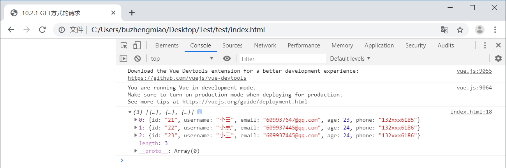
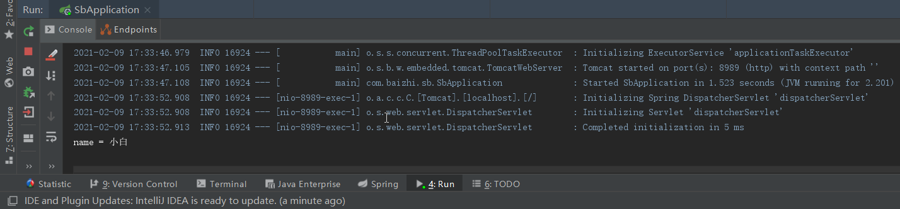
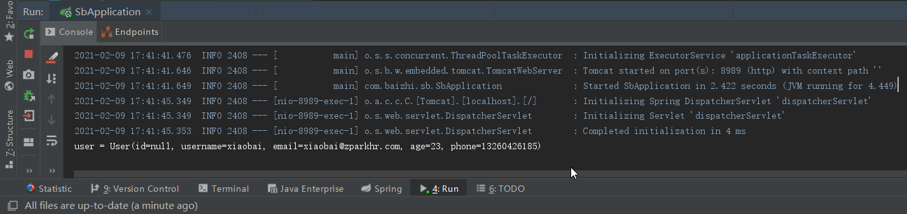
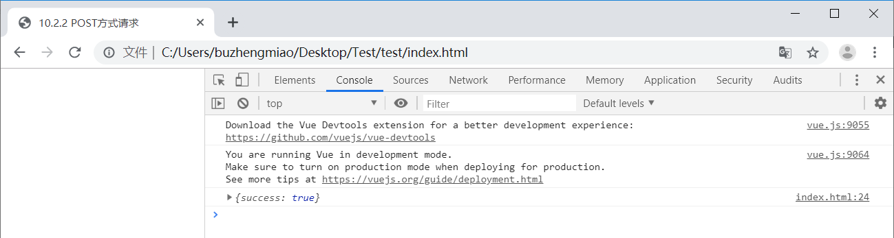
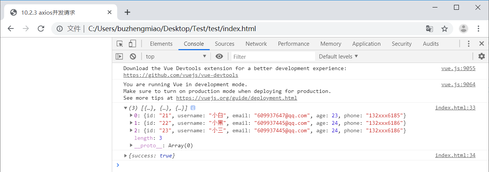
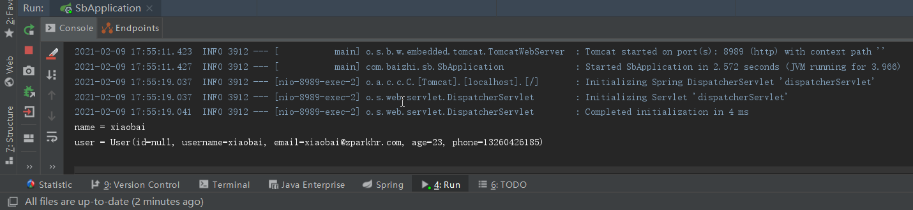

# Axios入门

## 引言

!>`Axios` 是一个异步请求技术，核心作用就是用来在页面中发送异步请求，并获取对应数据在页面中渲染。页面局部更新技术

[Axios 中文说明](https://www.kancloud.cn/yunye/axios/234845)

## Axios 第一个程序

先建一个简单的后端程序，用来**接收和发送请求**


**安装**

```html
<!--引入Axios-->
<script src="https://unpkg.com/axios/dist/axios.min.js"></script>
```

###  GET方式的请求

```js
    //发送Get方式请求
      axios
        .get("http://localhost:8989/user/findAll?name=小白")
        .then(function (response) {
          console.log(response.data);
        })
        .catch(function (err) {
          console.log(err);
        });
```

前端拿到响应



后端拿到请求



### POST方式请求

```js
    //发送POST方式请求
      axios
        .post("http://localhost:8989/user/save", {
          username: "xiaobai",
          age: 23,
          email: "xiaobai@zparkhr.com",
          phone: 13260426185,
        })
        .then(function (response) {
          console.log(response.data);
        })
        .catch(function (err) {
          console.log(err);
        });
```

后端拿到了数据



前端得了返回结果



###  axios并发请求

> `并发请求`:  将多个请求在同一时刻发送到后端服务接口，最后在集中处理每个请求的响应结果

```js
	 //1.创建一个查询所有请求
      function findAll() {
        return axios.get("http://localhost:8989/user/findAll?name=xiaobai");
      }

      //2.创建一个保存的请求
      function save() {
        return axios.post("http://localhost:8989/user/save", {
          username: "xiaobai",
          age: 23,
          email: "xiaobai@zparkhr.com",
          phone: 13260426185,
        });
      }

      axios.all([findAll(), save()]).then(
        axios.spread(function (res1, res2) {
          //一组函数的响应
          console.log(res1.data);
          console.log(res2.data);
        })
      );
```

**前端**



**后端**




---

