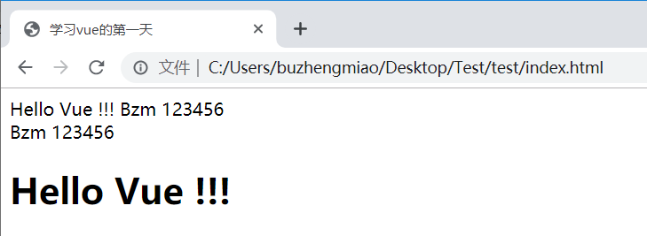
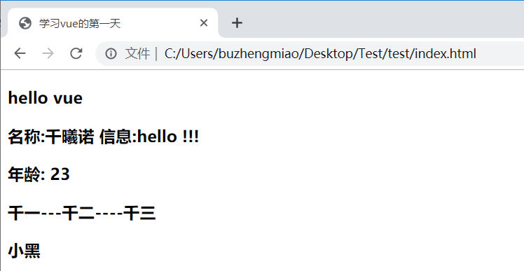
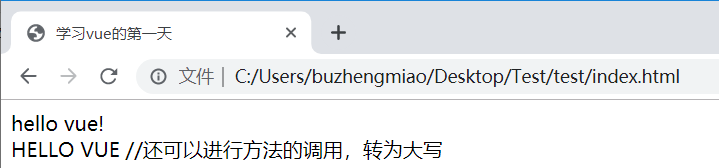

# Vue 入门

## 1. Vue 引言

!> `渐进式` JavaScript 框架 --摘自[官网](https://cn.vuejs.org/)

1.  易用 html css javascript
2.  高效 开发前端页面 非常高效
3.  灵活 开发灵活 多样性

> `Vue `渐进式`javascript`框架: 让我们通过操作很少的`DOM`,甚至不需要操作页面中任何`DOM`元素,就很容易的完成数据和视图绑定 双向绑定 `MVVM `

> [!warn]
>
> 日后在使用 Vue 过程中页面中不要在引入 Jquery 框架

---

## 2. Vue 第一个入门应用

> [!tip]
>
> [官网教程](https://cn.vuejs.org/v2/guide/)也是非常的详细，下面基于 2.x 版本

### 2.1. 下载 Vuejs

```js
//开发版本:
	<!-- 开发环境版本，包含了有帮助的命令行警告 -->
	<script src="https://cdn.jsdelivr.net/npm/vue/dist/vue.js"></script>

//生产版本:
	<!-- 生产环境版本，优化了尺寸和速度 -->
	<script src="https://cdn.jsdelivr.net/npm/vue"></script>
```

### 2.2. vue_helloworld

```html
<!DOCTYPE html>
<html lang="en">
  <head>
    <meta charset="UTF-8" />
    <title>学习vue的第一天</title>
  </head>
  <body>
    <div id="app">
      {{ msg }} {{username}} {{pwd}}

      <br />
      <span>
        {{username}} {{pwd}}
        <h1>{{ msg }}</h1>
      </span>
    </div>
    <!-- 开发环境版本，包含了有帮助的命令行警告 -->
    <script src="https://cdn.jsdelivr.net/npm/vue/dist/vue.js"></script>
    <script>
      const app = new Vue({
        el: "#app", //element 用来给Vue实例定义一个作用范围
        data: {
          //用来给Vue实例定义一些相关数据
          msg: "Hello Vue !!!",
          username: "Bzm",
          pwd: "123456",
        },
      });
    </script>
  </body>
</html>
```

> [!warn]
>
> `script`一般在`body`渲染之后，**界面加载顺序从上至下**



### 2.3. vue_data 定义对象 数组 其他数据类型

```html
<!DOCTYPE html>
<html lang="en">
  <head>
    <meta charset="UTF-8" />
    <title>学习vue的第一天</title>
  </head>
  <body>
    <div id="app">
      <h3>{{ msg }}</h3>
      <h3>名称:{{ user.name }} 信息:{{user.msg}}</h3>
      <h3>年龄: {{ age }}</h3>

      <h3>{{ lists[0] }}---{{ lists[1] }}----{{ lists[2] }}</h3>

      <h3>{{ users[0].name }}</h3>
    </div>
    <!-- 开发环境版本，包含了有帮助的命令行警告 -->
    <script src="https://cdn.jsdelivr.net/npm/vue/dist/vue.js"></script>
    <script>
      const app = new Vue({
        el: "#app",
        data: {
          msg: "hello vue",
          user: { name: "千曦诺", msg: "hello !!!" },
          age: 23,
          lists: ["千一", "千二", "千三"],
          users: [
            { name: "小黑", age: 18 },
            { name: "小白", age: 20 },
          ],
        },
      });
    </script>
  </body>
</html>
```



### 2.4. vue 中使用{{}}取值时书写表达式

```html
<!DOCTYPE html>
<html lang="en">
  <head>
    <meta charset="UTF-8" />
    <title>学习vue的第一天</title>
  </head>
  <body>
    <div id="app" class="aa">
      <span>
        {{msg + '!'}}
        <br />
        {{ msg.toUpperCase()}} //还可以进行方法的调用，转为大写
      </span>
    </div>

    <!--引入vue.js-->
    <script src="https://cdn.jsdelivr.net/npm/vue/dist/vue.js"></script>
    <script>
      const app = new Vue({
        el: ".aa",
        data: {
          msg: "hello vue",
        },
      });
    </script>
  </body>
</html>
```



## 3. 总结

1. `Vue`实例(对象)中`el`属性: 代表`Vue`的作用范围 日后在`Vue`的作用范围内都可以使用`Vue`的语法
2. `Vue`实例(对象)中`data`属性: 用来给`Vue`实例绑定一些相关数据， 绑定的数据可以通过{{**变量名**}}在`Vue`作用范围内取出
3. 在使用`{{}}`进行获取`data`中数据时，可以在{{}}中书写表达式，运算符，调用相关方法，以及逻辑运算等
4. `el`属性中可以书写任意的`CSS`选择器[**jquery 选择器**]，但是在使用 Vue 开发是推荐使用 `id`选择器
