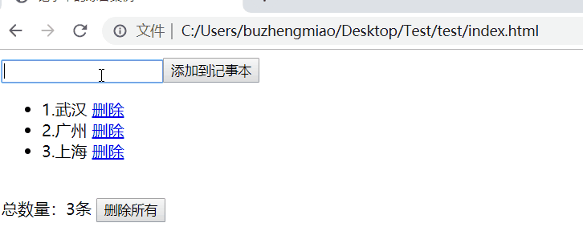

# Vue小案例

## 记事本的综合案例

**查询:**

- 将所有数据绑定为`vue`实例 
- 遍历`vue`实例中数据到页面

**添加**

- 添加按钮绑定事件中
- 在事件中获取输入框中数据
- 将获取的数据放入到lists里面

**删除**  

- 删除

- 删除所有

```html
    <div id="app">
      <input type="text" v-model="msg" /><input
        type="button"
        value="添加到记事本"
        @click="add"
      />
      <br />
      <ul>
        <li v-for="item,index in lists">
          {{index+1}}.{{item}}
          <a href="javascript:;" @click="delRow(index)">删除</a>
        </li>
      </ul>
      <br />
      <span>总数量：{{lists.length}}条 </span>
      <input
        type="button"
        v-show="lists.length!=0"
        value="删除所有"
        @click="delAll"
      />
    </div>

    <!-- 开发环境版本，包含了有帮助的命令行警告 -->
    <script src="https://cdn.jsdelivr.net/npm/vue/dist/vue.js"></script>
    <script>
      const app = new Vue({
        el: "#app",
        data: {
          lists: ["武汉", "广州", "上海"],
          msg: "",
        },
        methods: {
          add() {
            /*添加*/
            this.lists.push(this.msg);
            this.msg = "";
          },
          delRow(index) {
            /*删除*/
            this.lists.splice(
              index,
              1
            ); /*参数1:从那个下标开始删除  参数2:删除几个元素*/
          },
          delAll() {
            this.lists = [];
          },
        },
      });
    </script>
```




---

