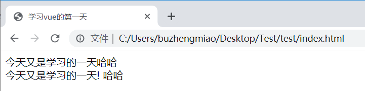
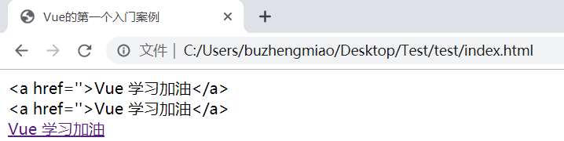
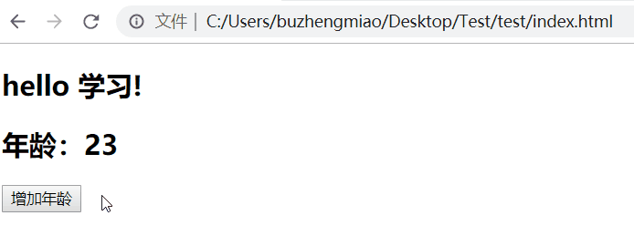
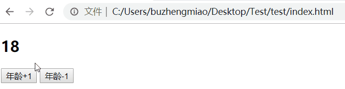
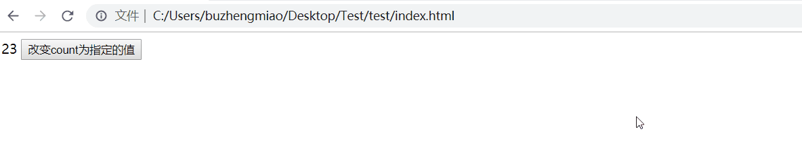
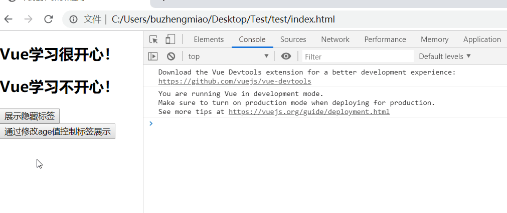
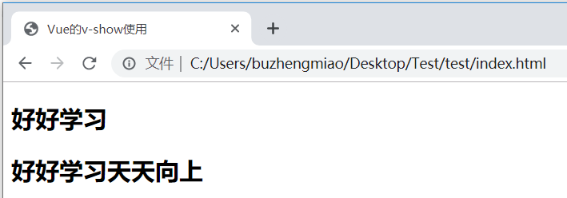
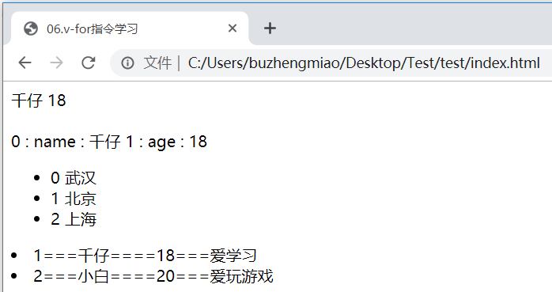
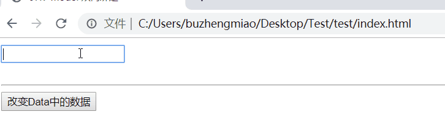

# Vue 指令

!>[官方文档地址](https://cn.vuejs.org/v2/api/#%E6%8C%87%E4%BB%A4)

## 1. v-text

!>`v-text`:用来获取`data`中数据将数据以文本的形式渲染到指定标签内部，类似于`javascript `中 `innerText`

```html
<div id="app">
  <span>{{msg}}</span>哈哈
  <br />
  <span v-text="msg+'!'"></span> 哈哈
  <!--会覆盖原有的标签-->
</div>

<!--引入vue.js-->
<script src="https://cdn.jsdelivr.net/npm/vue/dist/vue.js"></script>
<script>
  const app = new Vue({
    el: "#app",
    data: {
      msg: "今天又是学习的一天",
    },
  });
</script>
```



> [!tip]
>
> `{{}}`(插值表达式)和`v-text`获取数据的区别在于
>
> - 使用 v-text 取值会将标签中原有的数据覆盖 使用插值表达式的形式不会覆盖标签原有的数据
> - 使用 v-text 可以**避免在网络环境较差的情况下出现插值闪烁**

## 2. v-html

!>`v-html`:用来获取`data`中数据将数据中含有的`html`标签先解析在渲染到指定标签的内部，类似于`javascript`中 `innerHTML`

```html
<div id="app">
  <span>{{msg}}</span>
  <br />
  <span v-text="msg"></span>

  <br />
  <span v-html="msg">xxxxxx</span>
</div>

<!--引入vue.js-->
<script src="https://cdn.jsdelivr.net/npm/vue/dist/vue.js"></script>
<script>
  const app = new Vue({
    el: "#app",
    data: {
      msg: "<a href=''>Vue 学习加油</a>",
    },
  });
</script>
```



> [!tip]
>
> - 使用 v-html 取值会将标签中原有的数据覆盖

## 3. v-on

### 3.1. v-on:click

#### 3.1.1. 基础语法

> 页面中提供按钮，在单击事件中修改年龄的值 同时渲染页面

```html
<div id="app">
  <h2>{{msg}}</h2>
  <h2>年龄：{{age}}</h2>

  <input type="button" value="增加年龄" v-on:click="changeage" />
</div>

<!--引入vue.js-->
<script src="https://cdn.jsdelivr.net/npm/vue/dist/vue.js"></script>
<script>
  const app = new Vue({
    el: "#app",
    data: {
      msg: "hello 学习!",
      age: 23,
    },
    methods: {
      //methods 用来定义vue中时间
      changeage: function () {
        this.age++;
      },
    },
  });
</script>
```



> [!tip]
>
> - 在`vue`中绑定事件是通过`v-on`指令来完成的 `v-on`:事件名 如 ` v-on:click`
> - 在`v-on:`事件名的赋值语句中是当前时间触发调用的函数名
> - 在`vue`中事件的函数统一定义在`Vue`实例的`methods`属性中
> - 在`vue`定义的事件中`this`指的就是当前的`Vue`实例,日后可以在事件中通过使用`this`获取`Vue`实例中相关数据

#### 3.1.2. 缩写

```html
<button v-on:click="doThis"></button>
等同于

<!-- 缩写 -->
<button @click="doThis"></button>
```

**示例**：

```html
<div id="app">
  <h2>{{ age }}</h2>
  <input type="button" value="年龄+1" v-on:click="changeage" />
  <input type="button" value="年龄-1" @click="editage" />
  <!--可以@符号形式 简化-->
</div>

<!--引入vue.js-->
<script src="https://cdn.jsdelivr.net/npm/vue/dist/vue.js"></script>
<script>
  const app = new Vue({
    el: "#app", //element: 用来指定vue作用范围
    data: {
      age: 18,
    }, //data : 用来定义vue实例中相关数据
    methods: {
      changeage: function () {
        this.age++;
      },
      editage: function () {
        this.age--;
      },
    }, //methods: 用来定义事件的处理函数
  });
</script>
```



> [!tip]
>
> 日后在`vue`中绑定事件时可以通过`@`符号形式 简化 ` v-on` 的事件绑定

#### 3.1.3. 传递参数

```html
<div id="app">
  <span>{{count}}</span>
  <input
    type="button"
    value="改变count为指定的值"
    @click="changecount(23,'bzm')"
  />
</div>

<!--引入vue.js-->
<script src="https://cdn.jsdelivr.net/npm/vue/dist/vue.js"></script>
<script>
  const app = new Vue({
    el: "#app",
    data: {
      count: 1,
    },
    methods: {
      changecount(count, name) {
        this.count = count;
        alert(name);
      },
    },
  });
</script>
```



> 在使用事件时,可以直接在事件调用出给事件进行参数传递,在事件定义出通过定义对应变量接收传递的参数

## 4. v-show

!>`v-show`:用来控制页面中某个标签元素是否展示，底层使用控制是 `display `属性

```html
<div id="app">
  <h2 v-show="true">Vue学习很开心！</h2>
  <h2 v-show="show">Vue学习不开心！</h2>
  <input type="button" value="展示隐藏标签" @click="showmsg" />
  <h1 v-show="age>=30">Bzm博客</h1>
  <input type="button" @click="changeAge" value="通过修改age值控制标签展示" />
</div>
<!--引入vue.js-->
<script src="https://cdn.jsdelivr.net/npm/vue/dist/vue.js"></script>
<script>
  const app = new Vue({
    el: "#app",
    data: {
      show: true,
      age: 23,
    },
    methods: {
      //定义时间
      showmsg() {
        this.show = !this.show;
      },
      changeAge() {
        this.age++;
        console.log(this.age);
      },
    },
  });
</script>
```



---

> [!tip]
>
> - `v-show`时可以直接书写`boolean`值控制元素展示,也可以通过变量控制标签展示和隐藏
> - `v-show`中可以通过`boolean`表达式控制标签的展示课隐藏

## 5. v-if

!>`v-if`: 用来控制页面元素是否展示，底层控制是 DOM 元素

```html
<div id="app">
  <h2 v-if="true">好好学习</h2>
  <h2 v-if="show">好好学习天天向上</h2>
</div>
<!--引入vue.js-->
<script src="https://cdn.jsdelivr.net/npm/vue/dist/vue.js"></script>
<script>
  const app = new Vue({
    el: "#app",
    data: {
      show: true,
    },
    methods: {},
  });
</script>
```



## 6. v-bind

!>`v-bind`: 用来绑定标签的属性从而通过 vue 动态修改标签的属性

```html
    <style>
      .aa {
        border: 2px red solid;
      }
    </style>
  </head>
  <body>
    <div id="app">
      <!--  -->
      

      <input type="button" value="动态控制加入样式" @click="addCss" />

      <input type="button" value="改变图片" @click="changeSrc" />
    </div>
    <!--引入vue.js-->
    <script src="https://cdn.jsdelivr.net/npm/vue/dist/vue.js"></script>
    <script>
      const app = new Vue({
        el: "#app",
        data: {
          msg: "随机图片!!!!",
          showCss: true,
          src: "https://api.mz-moe.cn/img.php",
        },
        methods: {
          addCss() {
            this.showCss = !this.showCss;
          },
          changeSrc() {
            this.src =
              "https://bzm.ink/upload/2021/02/d5-0a0d5ba5f0e84f4db4650b58c2f086d8.png";
          },
        },
      });
    </script>
```

`v-bind`缩写

```html
<!-- 完整语法 -->
<a v-bind:href="url">...</a>

<!-- 缩写 -->
<a :href="url">...</a>
```

## 7. v-for

!>`v-for`: 作用就是用来对对象进行遍历的(数组也是对象的一种)

```html
<div id="app">
  <span>{{ user.name }} {{ user.age }}</span>
  <br />
  <!-- 通过v-for遍历对象-->
  <span v-for="u in user">{{u}}</span>
  <br />
  <span v-for="(value,key,index) in user">
    {{index}} : {{key}} : {{value}}
  </span>
  <!-- 通过v-for遍历数组-->
  <ul>
    <li v-for="a,index in arr">{{index}} {{a}}</li>
  </ul>
  <!--通过v-for遍历数组中对象
    :key 便于vue内部做重用和排序
    -->
  <u1>
    <li v-for="user,index in users" :key="user.id">
      {{index+1}}==={{user.name}}===={{user.age}}==={{user.msg}}
    </li>
  </u1>
</div>

<!-- 开发环境版本，包含了有帮助的命令行警告 -->
<script src="https://cdn.jsdelivr.net/npm/vue/dist/vue.js"></script>
<script>
  const app = new Vue({
    el: "#app",
    data: {
      user: { name: "千仔", age: "18" },
      arr: ["武汉", "北京", "上海"],
      users: [
        { id: 1, name: "千仔", age: 18, msg: "爱学习" },
        { id: 2, name: "小白", age: 20, msg: "爱玩游戏" },
      ],
    },
    methods: {},
  });
</script>
```



> [!tip]
>
> 在使用`v-for`的时候一定要注意加入:`key `用来给`vue`内部提供重用和排序的唯一`key `

## 8. v-model

!>`v-model`: 作用用来绑定标签元素的值与`vue`实例对象中`data`数据保持一致,从而实现双向的数据绑定机制

```html
<div id="app">
  <input type="text" v-model="msg" />
  <br />
  <br />
  <span>{{msg}}</span>
  <hr />
  <input type="button" value="改变Data中的数据" @click="changeValue" />
</div>

<!-- 开发环境版本，包含了有帮助的命令行警告 -->
<script src="https://cdn.jsdelivr.net/npm/vue/dist/vue.js"></script>
<script>
  const app = new Vue({
    el: "#app",
    data: {
      msg: "",
    },
    methods: {
      changeValue() {
        this.msg = "Vue的双向绑定！！";
      },
    },
  });
</script>
```



> [!tip]
>
> - 所谓**双向绑定** ，表单中数据变化导致`vue`实例`data`数据变化
> - `vue`实例中`data`数据的变化导致表单中数据变化 称之为**双向绑定**
