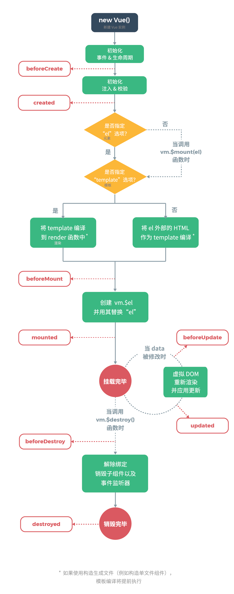
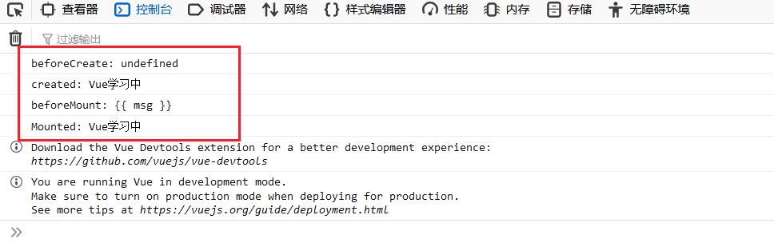

# Vue 生命周期

## 1. 引言

!>`生命周期钩子` ====> `生命周期函数`

[生命周期图示——来着官网](https://cn.vuejs.org/v2/guide/instance.html#%E7%94%9F%E5%91%BD%E5%91%A8%E6%9C%9F%E5%9B%BE%E7%A4%BA)



## 2. 初始化阶段

1. **new Vue()：**新建 Vue 实例
2. **初始化、事件&生命周期：**Vue 自身内部事件的初始化和内部生命周期相关的函数初始化
3. **beforeCreate：**生命周期中的第一个函数，Vue 实例中还没有 Data el methods 相关属性
4. **初始化、注入&校验：**Vue 实例初始化了 data 属性和 methods 中相关方法
5. **created：**生命周期中第二个函数
6. 判断“el”，“template”选项，然后再编译好模板
7. **beforeMount：**生命周期中第三个函数
8. **创建 vm.$el 并用其替换 el”：**将创建好的模板，进行解析
9. **mounted：**生命周期中第四个函数,该函数在执行过程中,已经将数据渲染到界面中并且已经更新页面

```js
		beforeCreate() {
          console.log("beforeCreate: " + this.msg);
        },
        created() {
          console.log("created: " + this.msg);
        },
        beforeMount() {
          console.log(
            "beforeMount: " + document.getElementById("sp").innerText
          );
        },
        mounted() {
          console.log("Mounted: " + document.getElementById("sp").innerText);
        },
```



## 3. 运行阶段

1. **beforeUpdate：**生命周期中第五个函数,该函数是 data 中数据发生变化时执行 这个事件执行时仅仅是 Vue 实例中 data 数据变化页面显示的依然是原始数据
2. **updated：**生命周期中第六个函数,该函数执行时 data 中数据发生变化,页面中数据也发生了变化 页面中数据已经和 data 中数据一致

```js
  		beforeUpdate() {
          console.log("beforeUpdate:" + this.msg);
          console.log(
            "beforeUpdate:" + document.getElementById("sp").innerText
          );
        },
        updated() {
          console.log("updated:" + this.msg);
          console.log("updated:" + document.getElementById("sp").innerText);
        },
```


## 4. 销毁阶段

1. **beforeDestory：**生命周期第七个函数,该函数执行时,Vue 中所有数据 methods componet 都没销毁
2. **destoryed：**生命周期的第八个函数,该函数执行时,Vue 实例彻底销毁

```js
  	  beforeDestory() {
        },
        destoryed() {
        },
```

---
