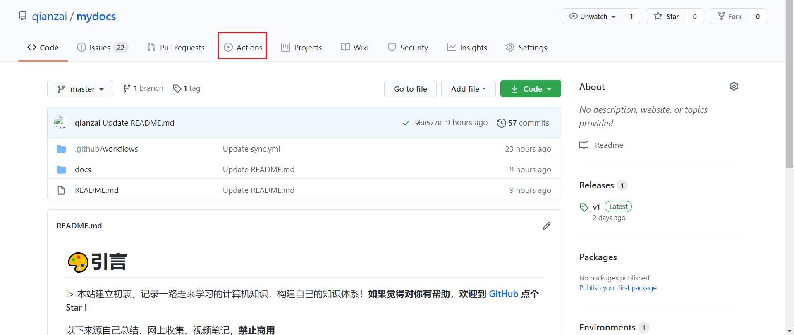
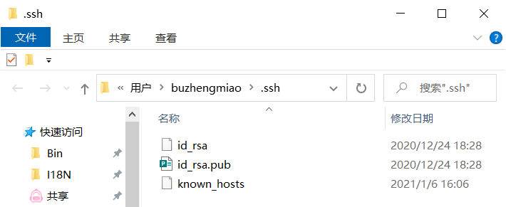
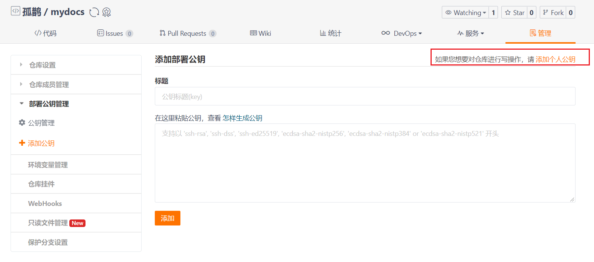
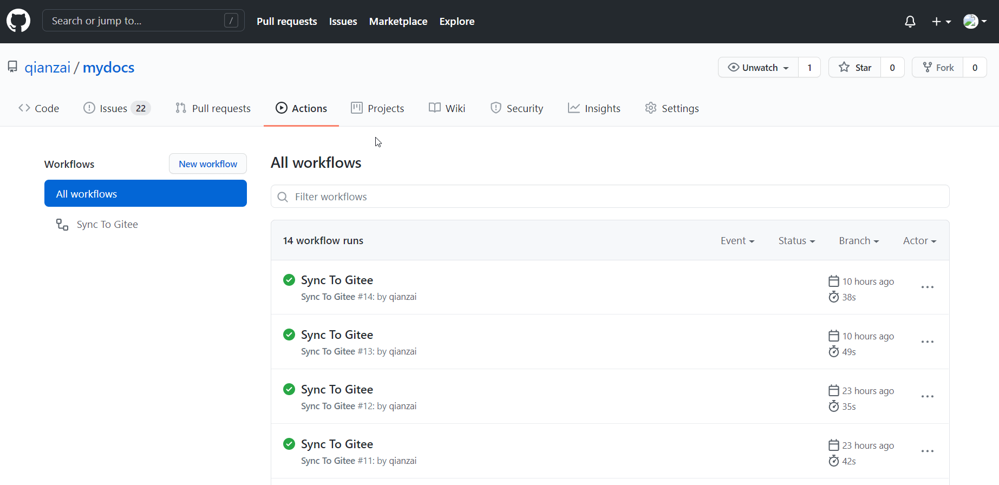

# Gitee自动同步GitHub仓库

## 为什么要同步

!>`github`是国际通用的代码托管平台，但是在国内的访问速度堪忧~如使用` GitHub pages`，将**个人博客**，**项目主页**托管在`github`上的话，体验不会很好。


?>在国内的代码托管平台主要是`gitee`和`coding`，故他们的`pages`服务成了首选

## 同步方案

### 同步上传

通过`remote` 设定不同的别名，上传两遍，在`\.git\config`中同时设置`GitHub `和`Gitee `的地址

### GitHub的Actions

借助[wearerequired/git-mirror-action](wearerequired/git-mirror-action)这个项目，通过`GitHub`的`Actions `实现任意仓库自动同步



### 怎么做呢？

1、在仓库根目录下创建`.github/workflows/sync.yml`文件

```yaml
name: Sync To Gitee
on: page_build
jobs:
  sync:
    runs-on: ubuntu-latest
    steps:
      - uses: wearerequired/git-mirror-action@master
        env:
          SSH_PRIVATE_KEY: ${{ secrets.GITEE_PRIVATE_KEY }}
        with:
          source-repo: "git@github.com:qianzai/mydocs.git"
          destination-repo: "git@gitee.com:BuZM/mydocs.git"
```

- 记得修改 **source-repo** 和 **destination-repo**为对应的两个仓库
- 因为有`page`的关系，所以触发条件改为了`page_build`，如果只是普通的同步的话，可以把`on`换成对应的触发条件

2、添加钥匙

使用 `ssh-keygen` 命令生成一对**公钥**和**私钥**



在Gitee添加公钥



在GitHub添加私钥，添加**GITEE_PRIVATE_KEY**,内容为之前的**私匙**


!>这样子，每次部署之后，`github` 会自动推送到 `gitee`上


## pages 同步

`gitee`的`pages`服务不能自动更新，每次还要去手动更新，除非花钱购买开启`gitee pages pro`服务

### 模拟登录调用

其实抓取以下接口就能发现 直接通过`POST: https://gitee.com/${repository}/pages/rebuild` 这个接口进行的，那么我们只要模拟登录就可以了

```js
axios.post(
  url + "/rebuild",
  qs.stringify({
    branch: core.getInput("branch"),
    build_directory: core.getInput("directory"),
    force_https: core.getInput("https")
  }),
  {
    headers: {
      "Content-Type": "application/x-www-form-urlencoded; charset=UTF-8",
      Cookie: cookie,
      Referer: url,
      "X-Requested-With": "XMLHttpRequest",
      "X-CSRF-Token": csrfToken
    }
  }
);
```

主要是`headers`里的 `Content-Type`, `X-CSRF-Token`, `Cookie`特别重要，页面的参数对应这页面的几个按钮

其中，`Cookie` 可以`devtools`中直接拿到，`X-CSRF-TOKEN`经过调查，被写在了`<meta content="" name="csrf-token"></meta>`上，通过获取任意一个页面然后拿到即可

> 这个大佬已经将其封装好了，我们直接使用即可

[gitee-pages-action](https://github.com/mizuka-wu/gitee-pages-action)：https://github.com/mizuka-wu/gitee-pages-action

只要在之前**actions**上`steps`上追加一个`step`即可

```yaml
 - name: reload
        uses: mizuka-wu/gitee-pages-action@v1.0.0
        with:
            repository: BuZM/mydocs
            cookie: ${{ secrets.GITEE_COOKIE }} 
            directory: docs
            https: true
```


### 添加 cookie

和之前添加私钥一样，在`setting`中点击`secrets`，新建`GITEE_COOKIE`，将上面获取到的cookie值存入其中即可

## 上传同步

Actions运行成功

