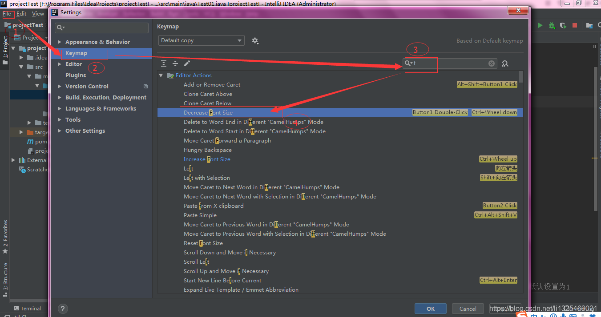
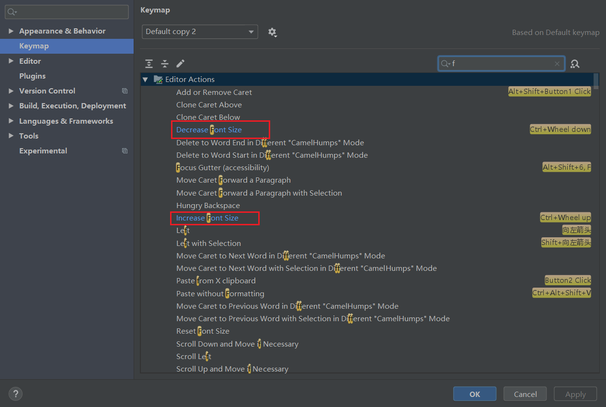

# IDEA使用

## IDEA使用教程

### 快捷键

#### Ctrl

| 快捷键           | 介绍                                                         |
| ---------------- | ------------------------------------------------------------ |
| Ctrl + F         | 在当前文件进行文本查找 `（必备）`                            |
| Ctrl + R         | 在当前文件进行文本替换 `（必备）`                            |
| Ctrl + Z         | 撤销 `（必备）`                                              |
| Ctrl + Y         | 删除光标所在行 或 删除选中的行 `（必备）`                    |
| Ctrl + X         | 剪切光标所在行 或 剪切选择内容                               |
| Ctrl + C         | 复制光标所在行 或 复制选择内容                               |
| Ctrl + D         | 复制光标所在行 或 复制选择内容，并把复制内容插入光标位置下面 `（必备）` |
| Ctrl + W         | 递进式选择代码块。可选中光标所在的单词或段落，连续按会在原有选中的基础上再扩展选中范围 `（必备）` |
| Ctrl + E         | 显示最近打开的文件记录列表                                   |
| Ctrl + N         | 根据输入的 **类名** 查找类文件                               |
| Ctrl + G         | 在当前文件跳转到指定行处                                     |
| Ctrl + J         | 插入自定义动态代码模板                                       |
| Ctrl + P         | 方法参数提示显示                                             |
| Ctrl + Q         | 光标所在的变量 / 类名 / 方法名等上面（也可以在提示补充的时候按），显示文档内容 |
| Ctrl + U         | 前往当前光标所在的方法的父类的方法 / 接口定义                |
| Ctrl + H         | 显示当前类的层次结构                                         |
| Ctrl + B         | 进入光标所在的方法/变量的接口或是定义出，等效于 `Ctrl + 左键单击` |
| Ctrl + O         | 选择可重写的方法                                             |
| Ctrl + I         | 选择可继承的方法                                             |
| Ctrl + +         | 展开代码                                                     |
| Ctrl + -         | 折叠代码                                                     |
| Ctrl + /         | 注释光标所在行代码，会根据当前不同文件类型使用不同的注释符号 `（必备）` |
| Ctrl + [         | 移动光标到当前所在代码的花括号开始位置                       |
| Ctrl + ]         | 移动光标到当前所在代码的花括号结束位置                       |
| Ctrl + F1        | 在光标所在的错误代码出显示错误信息                           |
| Ctrl + F3        | 调转到所选中的词的下一个引用位置                             |
| Ctrl + F4        | 关闭当前编辑文件                                             |
| Ctrl + F8        | 在 Debug 模式下，设置光标当前行为断点，如果当前已经是断点则去掉断点 |
| Ctrl + F9        | 执行 Make Project 操作                                       |
| Ctrl + F11       | 选中文件 / 文件夹，使用助记符设定 / 取消书签                 |
| Ctrl + 1,2,3...9 | 定位到对应数值的书签位置                                     |
| Ctrl + F12       | 弹出当前文件结构层，可以在弹出的层上直接输入，进行筛选       |
| Ctrl + Tab       | 编辑窗口切换，如果在切换的过程又加按上delete，则是关闭对应选中的窗口 |
| Ctrl + Enter     | 智能分隔行                                                   |
| Ctrl + End       | 跳到文件尾                                                   |
| Ctrl + Home      | 跳到文件头                                                   |
| Ctrl + Space     | 基础代码补全`（必备）`                                       |
| Ctrl + Delete    | 删除光标后面的单词或是中文句                                 |
| Ctrl + BackSpace | 删除光标前面的单词或是中文句                                 |
|                  |                                                              |

#### Alt

| 快捷键          | 介绍                                                         |
| --------------- | ------------------------------------------------------------ |
| Alt + F3        | 选中文本，逐个往下查找相同文本，并高亮显示                   |
| Alt + F7        | 查找光标所在的方法 / 变量 / 类被调用的地方                   |
| Alt + Enter     | IntelliJ IDEA 根据光标所在问题，提供快速智能修复选择，光标放在的位置不同提示的结果也不同 `（必备）` |
| Alt + Insert    | 代码自动生成，如生成对象的 set / get 方法，构造函数，toString() 等 |
| Alt + 左方向键  | 按左方向切换当前已打开的文件视图                             |
| Alt + 右方向键  | 按右方向切换当前已打开的文件视图                             |
| Alt + 前方向键  | 当前光标跳转到当前文件的前一个方法名位置                     |
| Alt + 后方向键  | 当前光标跳转到当前文件的后一个方法名位置                     |
| Alt + 1,2,3...9 | 显示对应数值的选项卡，其中 1 是 Project 用得最多             |
|                 |                                                              |

#### Shift

| 快捷键        | 方法                                                 |
| ------------- | ---------------------------------------------------- |
| Shift + F2    | 跳转到上一个高亮错误 或 警告位置                     |
| Shift + F4    | 对当前打开的文件，使用新Windows窗口打开，旧窗口保留  |
| Shift + F6    | 对文件 / 文件夹 重命名                               |
| Shift + F10   | 等效于点击工具栏的 `Run` 按钮                        |
| Shift + F11   | 弹出书签显示层                                       |
| Shift + Tab   | 取消缩进                                             |
| Shift + End   | 选中光标到当前行尾位置                               |
| Shift + Home  | 选中光标到当前行头位置                               |
| Shift + Enter | 开始新一行。光标所在行下空出一行，光标定位到新行位置 |

#### Ctrl + Alt

| 快捷键                | 介绍                                                     |
| --------------------- | -------------------------------------------------------- |
| Ctrl + Alt + L        | 格式化代码，可以对当前文件和整个包目录使用 `（必备）`    |
| Ctrl + Alt + O        | 优化导入的类，可以对当前文件和整个包目录使用 `（必备）`  |
| Ctrl + Alt + I        | 光标所在行 或 选中部分进行自动代码缩进，有点类似格式化   |
| Ctrl + Alt + T        | 对选中的代码弹出环绕选项弹出层i`f`,`while`,`for`,``try`  |
| Ctrl + Alt + J        | 弹出模板选择窗口，讲选定的代码加入动态模板中             |
| Ctrl + Alt + B        | 在某个调用的方法名上使用会跳到具体的实现处，可以跳过接口 |
| Ctrl + Alt + F11      | 切换全屏模式                                             |
| Ctrl + Alt + Enter    | 光标所在行上空出一行，光标定位到新行                     |
| Ctrl + Alt + Space    | 类名自动完成                                             |
| Ctrl + Alt + 左方向键 | 退回到上一个操作的地方 `（必备）`                        |
| Ctrl + Alt + 右方向键 | 前进到上一个操作的地方 `（必备）`                        |
| Ctrl + Alt + 前方向键 | 在查找模式下，跳到上个查找的文件                         |
| Ctrl + Alt + 后方向键 | 在查找模式下，跳到下个查找的文件                         |
|                       |                                                          |

#### Ctrl + Shift

| 快捷键                   | 方法                                                         |
| ------------------------ | ------------------------------------------------------------ |
| Ctrl + Shift + F         | 根据输入内容查找整个项目 或 指定目录内文件 `（必备）`        |
| Ctrl + Shift + R         | 根据输入内容替换对应内容，范围为整个项目 或 指定目录内文件 `（必备）` |
| Ctrl + Shift + J         | 自动将下一行合并到当前行末尾 `（必备）`                      |
| Ctrl + Shift + Z         | 取消撤销 `（必备）`                                          |
| Ctrl + Shift + W         | 递进式`取消`选择代码块。可选中光标所在的单词或段落，连续按会在原有选中的基础上再扩展取消选中范围 `（必备）` |
| Ctrl + Shift + N         | 通过文件名定位 / 打开文件 / 目录，打开目录需要在输入的内容后面多加一个正斜杠 `（必备）` |
| Ctrl + Shift + U         | 对选中的代码进行大 / 小写轮流转换 `（必备）`                 |
| Ctrl + Shift + E         | 显示最近修改的文件列表的弹出层                               |
| Ctrl + Shift + H         | 显示方法层次结构                                             |
| Ctrl + Shift + I         | 快速查看光标所在的方法 或 类的定义                           |
| Ctrl + Shift + /         | 代码块注释 `（必备）`                                        |
| Ctrl + Shift + [         | 选中从光标所在位置到它的顶部中括号位置                       |
| Ctrl + Shift + ]         | 选中从光标所在位置到它的底部中括号位置                       |
| Ctrl + Shift + +         | 展开所有代码                                                 |
| Ctrl + Shift + -         | 折叠所有代码                                                 |
| Ctrl + Shift + F7        | 高亮显示所有该选中文本，按Esc高亮消失                        |
| Ctrl + Shift + F12       | 编辑器最大化                                                 |
| Ctrl + Shift + Space     | 智能代码提示                                                 |
| Ctrl + Shift + Enter     | 自动结束代码，行末自动添加分号 `（必备）`                    |
| Ctrl + Shift + Backspace | 退回到上次修改的地方                                         |
| Ctrl + Shift + 1,2,3...9 | 快速添加指定数值的书签                                       |
| Ctrl + Shift + 前方向键  | 光标放在方法名上，将方法移动到上一个方法前面，调整方法排序   |
| Ctrl + Shift + 后方向键  | 光标放在方法名上，将方法移动到下一个方法前面，调整方法排序   |
|                          |                                                              |

#### Alt + Shift

| 快捷键                 | 介绍                           |
| ---------------------- | ------------------------------ |
| Alt + Shift + N        | 选择 / 添加 task               |
| Alt + Shift + F        | 显示添加到收藏夹弹出层         |
| Alt + Shift + C        | 查看最近操作项目的变化情况列表 |
| Alt + Shift + 前方向键 | 移动光标所在行向上移动         |
| Alt + Shift + 后方向键 | 移动光标所在行向下移动         |

#### Ctrl + Shift + Alt

| 快捷键                 | 介绍                  |
| ---------------------- | --------------------- |
| Ctrl + Shift + Alt + V | 无格式黏贴            |
| Ctrl + Shift + Alt + N | 前往指定的变量 / 方法 |
| Ctrl + Shift + Alt + S | 打开当前项目设置      |
| Ctrl + Shift + Alt + C | 复制参考信息          |
|                        |                       |

#### 其他

| 快捷键        | 介绍                                        |
| ------------- | ------------------------------------------- |
| F2            | 跳转到下一个高亮错误 或 警告位置 `（必备）` |
| F3            | 在查找模式下，定位到下一个匹配处            |
| F11           | 添加书签                                    |
| F12           | 回到前一个工具窗口                          |
| ESC           | 从工具窗口进入代码文件窗口                  |
| 连按两次Shift | 弹出 `Search Everywhere` 弹出层             |
| 数字键盘*     | 展开包所有目录                              |

### Debug

### 设置

#### 设置字体大小快捷键

1. `File`---->`Settings`---->`KeyMap`,在右侧输入框中输入f

2. 配置Decrease Font Size  字体缩小：找到【Decrease Font Size】右键，点击【Add Mouse Shortcut】，在弹出框中按住【Ctrl+鼠标向下滚动】
3. 配置Increase Font Size  字体放大：找到【Increase Font Size】右键，点击【Add Mouse Shortcut】，在弹出框中按住【Ctrl+鼠标向上滚动】

#### 设置同窗口显示多项目

#### 导入jar包

[导入jar包](https://blog.csdn.net/hwt1070359898/article/details/90517291)

#### 注释模板

**File--> settings--> Editor--> File and Code Templates--> Files**

[注释模板](https://blog.csdn.net/weixin_33851177/article/details/92652175)

####  [idea怎么创建properties文件](https://www.cnblogs.com/blackflower/p/10719038.html)

#### [修改为被使用的变量颜色](https://blog.csdn.net/Lovincc/article/details/80464782)

#### [IDEA 统计插件Statistic：查看你的代码数据](https://www.cnblogs.com/mithrandirw/p/8744216.html)

#### [导出javadoc文档](https://blog.csdn.net/lovequanquqn/article/details/82258940)

#### [IntelliJ IDEA中创建xml模板](https://blog.csdn.net/qq_42863682/article/details/86635528)

### 插件

##### Grep Console 

由于Intellij idea不支持显示ascii颜色，grep-console插件能很好的解决这个问题， 可以设置不同级别log的字体颜色和背景色.

[Grep Console](https://www.jianshu.com/p/1be14f8d16f2)

##### Translation

[Translation使用](https://jingyan.baidu.com/article/597a0643111cf8312b524307.html)

##### Auto filling Java call arguments

[自动填充Java调用参数](https://blog.csdn.net/w605283073/article/details/81211140)

##### [IDEA 添加对 yaml 文件的语法自动补全](https://blog.csdn.net/YLD10/article/details/80870982)

##### [Free Mybatis plugin跳转插件](https://www.jianshu.com/p/125ba00acb9b)

##### [Rainbow Brackets（彩虹括号）](https://www.cnblogs.com/cchao1024/p/11971030.html)

##### [十分钟搞懂Lombok使用与原理](https://juejin.im/post/5a6eceb8f265da3e467555fe)

##### [maven helper](https://segmentfault.com/a/1190000017542396)

###  操作

##### [创建一个web项目](https://www.cnblogs.com/wfhking/p/9395774.html)

[创建一个web项目](https://www.cnblogs.com/yangyquin/p/5285272.html)

##### [IDEA 查看项目编码](https://www.cnblogs.com/zhao-shan/p/12105680.html)

##### [IDEA创建Mapper.xml文件](https://blog.csdn.net/qq_41135254/article/details/96102670)

##### [Maven创建Java Web项目](https://blog.csdn.net/MyArrow/article/details/50824793)

##### [Idea设置Vue.js自动提示](https://blog.csdn.net/li1325169021/article/details/99710057)

##### [RestfulToolkit（接口自测工具）](https://blog.csdn.net/qq_22741461/article/details/81625079)

##### [数据库问题DataBase](https://blog.csdn.net/weixin_43889841/article/details/97247333)

##### [IDEA JRebel插件热部署 ](https://juejin.im/post/6844903974575800334)

