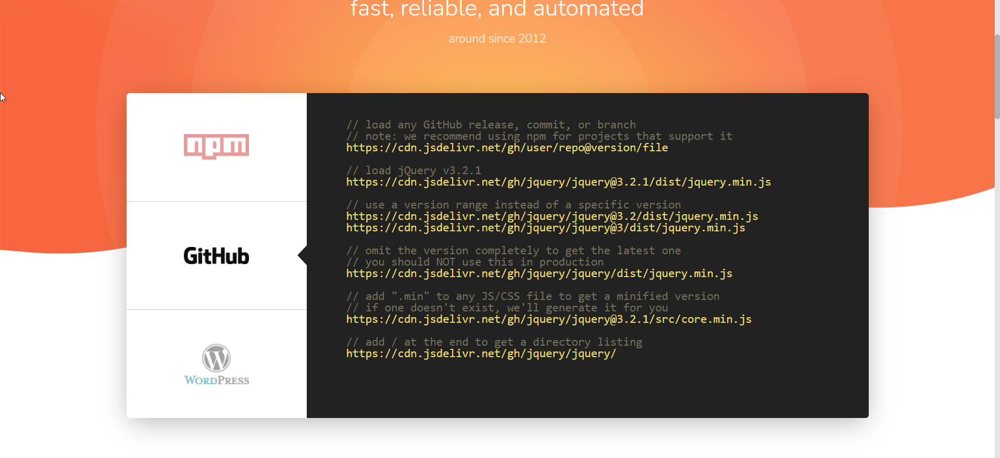

# Jsdelivr免费CDN

## 引言

!>**A free CDN for Open Source：**`fast`, `reliable`, and `automated`	——[官方地址](https://www.jsdelivr.com/)

## 使用

?>能加载任何**GitHub**的`release`、`commit`或`branch`

那么，我们在`GitHub `创建 一个仓库，访问`https://cdn.jsdelivr.net/gh/user/repo@version/file`即可，如下

`https://cdn.jsdelivr.net/gh/qianzai/mydocs@master/docs/document/`

