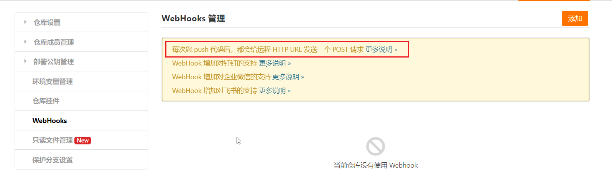
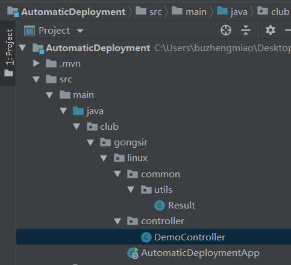
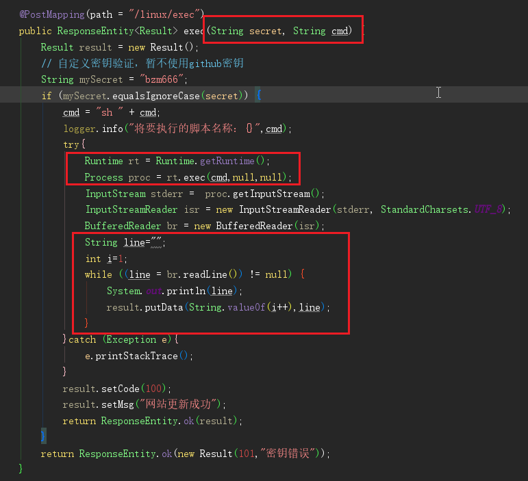
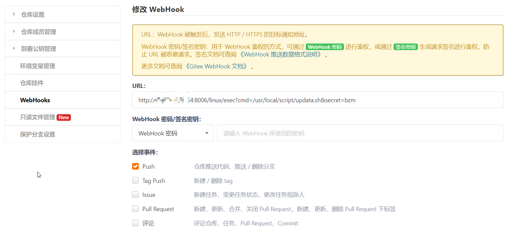
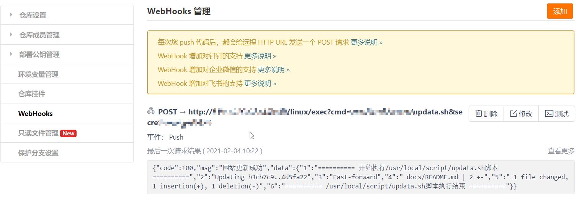

# 使用WebHooks进行自动化部署

## 需求场景

!>最近腾讯云搞活动，本人就弄了一台机器，想把[我的文档网站](https://qianzai.github.io/mydocs/#/)搬到个人服务器上，部署完成后，问题来了！

- 当我写完文档后，通过git 工具 同步到GitHub 上面后，**GitHub pages会自动触发更新**
- 但是**个人服务器上的Git 仓库如何感知到呢？？**从而触发更新呢
- 同时，由于项目比较简单，没有必要去使用**CI/CD工具**

## 使用WebHooks

最终发现`WebHooks`这个功能，`Gitee`和`GitHub`都提供了相应的功能



?>那么思路来了，`WebHooks`可以在每次收到push之后向一个指定的url发送一个post请求，通过post 请求触发服务器执行一个脚本


## AutoMaticDeployment

项目工具来着于[gongsir0630](https://github.com/gongsir0630)的：[AutomaticDeployment](https://github.com/gongsir0630/AutomaticDeployment)

### 项目说明

项目非常简单

1. 返回信息封装的`Result`类
2. 通过web请求执行指定的shell脚本的`DemoController`类



`DemoController`类说明

- 通过@PostMapping，往`/linux/exec`传入两个两个值secret和cmd
- 判断secret是否相同，通过执行cmd脚本，否则抛出信息，“密钥错误”
- 通IO流打印出日志信息



### 使用说明

使用非常简单，将项目打包成一个`Jar `包后运行即可

```bash
nohup java -jar AutomaticDeployment.jar --server.port=8080> AutomaticDeployment.out 2>&1 &
```

- --server.port：指定端口

添加`WebHooks`



```bash
http://{your_website}:{port}/linux/exec?cmd={cmd}&secret={secret}
```

- cmd：你的脚本地址
- secret：密钥

> [!TIP] 

> 脚本地址要有执行权限，secret是项目中自定义的（默认bzm666）

**一切配置完成后，网站自动更新成功**



---

