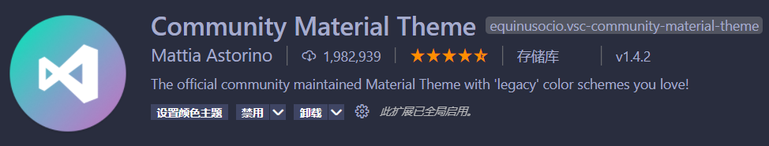
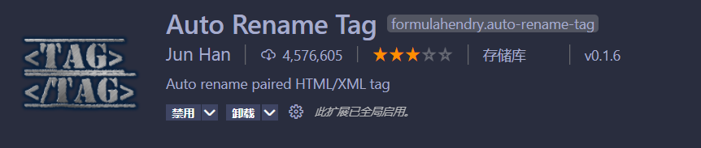
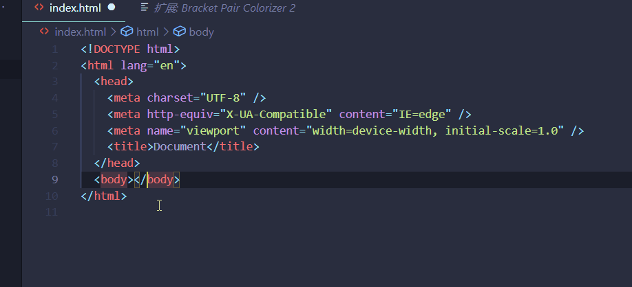
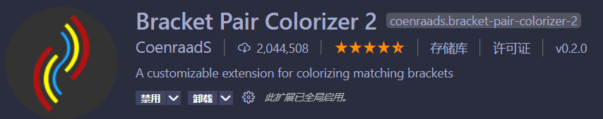
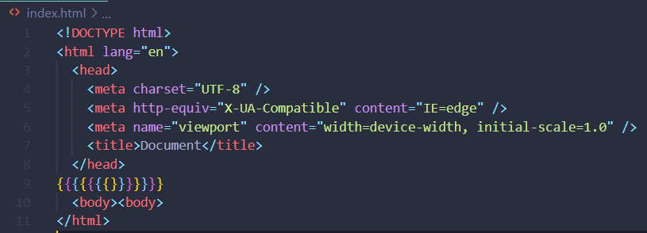

# Visual Studio Code

## 1. 常用插件

### 1.1. Chinese (Simplified) Language Pack

VS Code 的中文（简体）语言包

### 1.2. Community Material Theme

主题美化

### 1.3. Auto Rename Tag

看名字就知道重命名标签的插件

### 1.4. Bracket Pair Colorizer 2

彩虹括号，匹配括号的括号的颜色

---
