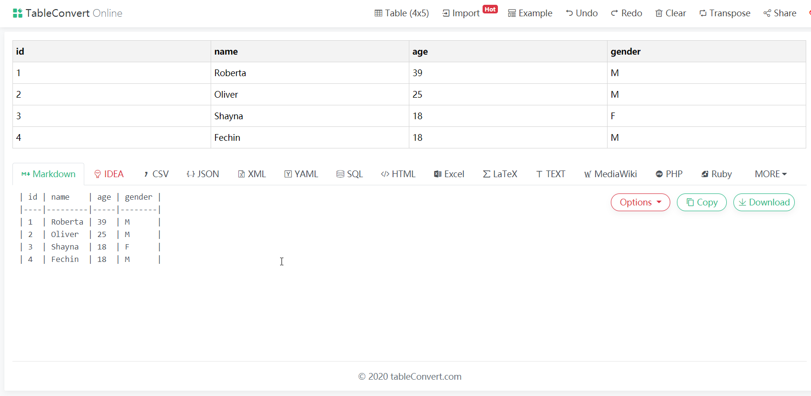
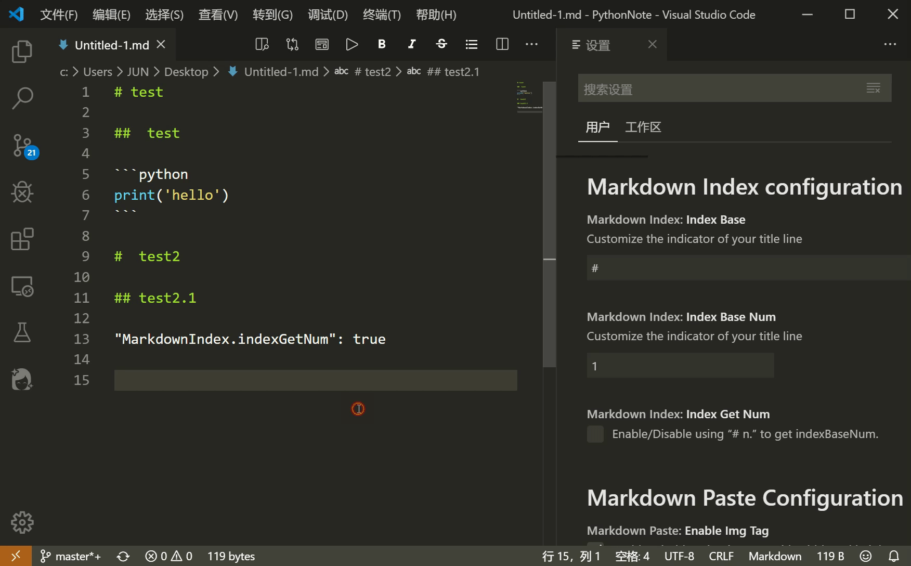

# 文档工具

## Typora

`Typora `是一款**支持实时预览的 Markdown 文本编辑器**。

[地址](https://www.typora.io/)：https://www.typora.io/

## Tableconvert

`TableConvert `是一个可以在线转换表格的工具，支持 Markdown 表格、CSV、JSON、XML、YAML、SQL、HTML 表格、Excel 和 LaTeX 表格，并且还内嵌了一个表格编辑器，像微软的 Excel 一样编辑，使用非常方便。

[地址](https://tableconvert.com/)：https://tableconvert.com/

## Markdown-index pro

`Markdown_index`是一个可以为你的markdown标题添加序号的`VS Code`插件。

[地址](https://marketplace.visualstudio.com/items?itemName=ChenJun.markdown-index-pro)：https://marketplace.visualstudio.com/items?itemName=ChenJun.markdown-index-pro

